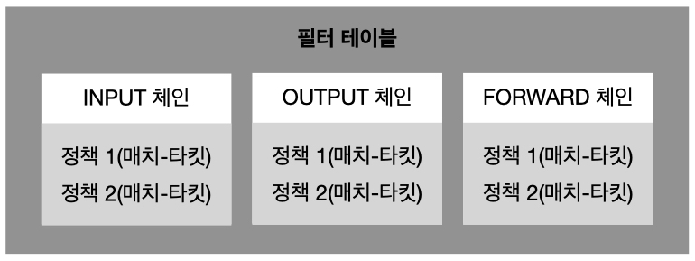
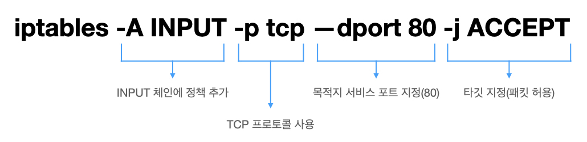
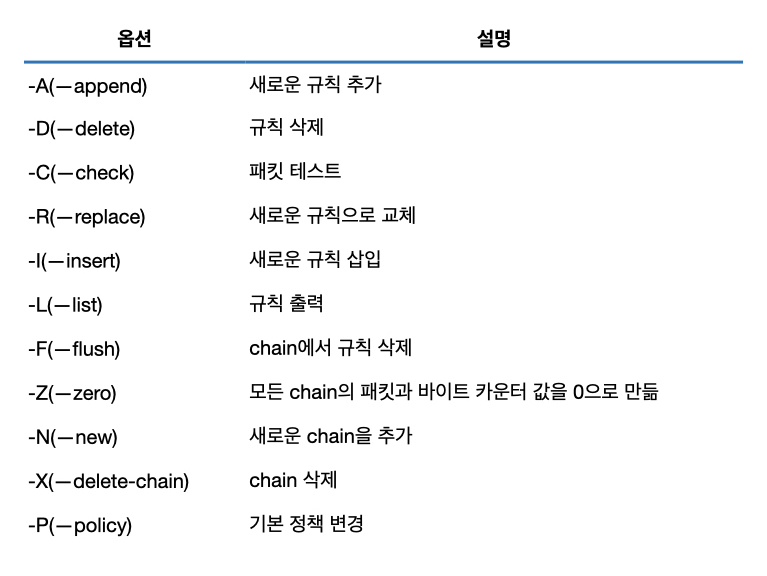
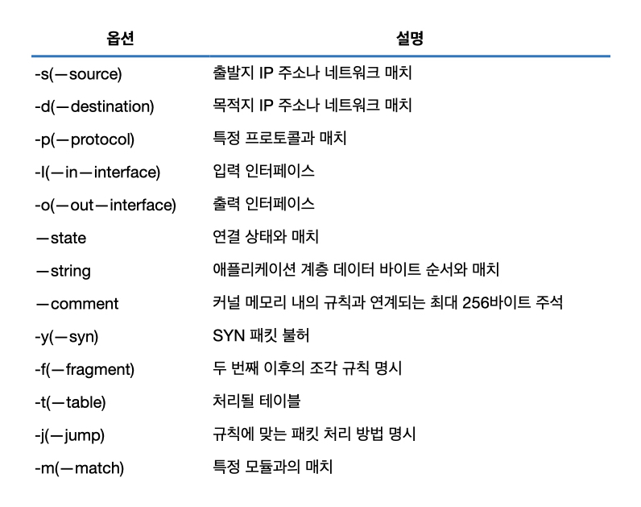

# 방화벽
## 리눅스 서버의 방화벽 확인 및 관리
* CentOS - firewalld를 사용하도록 되어 있음(ver.7 이상)
* Ubuntu - UFW(Ubuntu FireWall)를 사용함 
-> 여전히 리눅스에서는 iptables를 사용한다. 
(iptables는 사용자 공간 응용 프로그램으로 직접 패킷을 차단, 허용하는 필터링 기능을 수행하지 않고 netfilter라는 리눅스 커널 모듈에서 실제로 필터링이 이루어진다.)

### iptables 이해하기
* 시스템 관리자는 iptables를 통해 서버에서 허용하거나 차단할 IP나 서비스 포트에 대한 정책을 수립하고, 정책 그룹으로 관리한다.
* 정책 그룹은 서버의 트래픽 구견별로 만든다.
* 트래픽 구간이란 서버로 유입되는 구간(INPUT), 서버에서 나가는 구간(OUTPUT), 서버를 통과하는 구간(FORWARD) 등을 말한다.
* iptables - 필터 테이블, NAT 테이블, 맹글 테이블, 로 테이블, 시큐리티 테이블로 구분됨 
(리눅스의 호트스 방화벽은 필터 테이블을 통해 트래픽을 제어하는 것을 의미한다.)

#### 방화벽의 역할
* Filter 테이블 : iptables에서 패킷을 허용하거나 차단하는 역할을 선언하는 영역
* INPUT, OUTPUT, FORWARD 체인 : 호스트 기준으로 호스트로 들어오거나(INPUT) 호스트에서 나가거나(OUTPUT) 호스트를 통과할(FORWARD) 때 사용되는 정책들의 그룹, 패킷의 방향성에 따라 각 체인에 정의된 정책이 적용됨
* Match : 제어하려는 패킷의 상태 또는 정보 값의 정의, 정책에 대한 조건
* Target : Match(조건)와 일치하는 패킷을 허용할지 차단할지에 대한 패킷 처리 방식
  
 

### 리눅스 방화벽 정책 확인
 
1. INPUT 체인 1번 정책
>ACCEPT all-- anywhere anywhere state RELATED, ESTABLISHED

* 이미 세션이 맺어져 있거나(ESTABLISHED) 연계된 세션이 있을 때, 어떤 출발지나 목적지인 패킷이더라도 허용하는 정책이다.
* FTP는 원시적인 프로토콜로 컨트롤 프로토콜과 데이터 프로토콜이 별도로 동작한다. 이 두 개의 연결을 연계시키지 못하면 제대로 통신할 수 없기 때문에 RELATE state를 이용해 이 두 개의 연결을 하나로 간주한다.

2. INPUT 체인 2번 정책
>ACCEPT icmp-- anywhere anywhere

* 이 정책을 통해 pint과 같은 서비스를 사용할 수 있다.

3. INPUT 체인 4번 정책
>ACCEPT tcp-- anywhere anywhere state NEW tcp dpt:ssh

* 외부에서 서버로 SSH(22) 접속을 허용하는 정책이다.

4. INPUT 체인 5번 정책
>ACCEPT all-- anywhere anywhere reject-with icmp-host-prohibited

* 위의 첫 번째부터 네 번째 정책에 매치되지 않은 패킷들을 차단하는 정책이다.
* INPUT 체인 자체는 기본 정책이 ACCEPT로 선언되어 있지만 이 정책 때문에 화이트리스트 기반 방화벽처럼 동작하게 된다.
* REJECT는 곧바로 폐기하는 DROP과 달리 ICMP 프로토콜을 이용해 패킷 차단 이유를 출발지에 전달한다. 
(icmp-host-prohibited 메시지를 이용해 해당 패킷이 차단되었음을 알려준다.)

5. INPUT 체인 3번 정책
>ACCEPT all-- anywhere anywhere

* iptables -L을 보면 Any Open 정책처럼 보이지만 실제로 외부에서 들어오는 패킷은 해당 정책을 거치지 않고 최하단의 DROP 정책에서 대부분 걸러진다.
* iptables -S로 보면 해당 정책이 루프백 인터페이스(lo)에 대한 정책을 모두 허용하는 것이므로 일반 서비스 인터페이스의 패킷에는 적용되지 않는다.
* 루프백 인터페이스란? 라우터나 스위치에 설정하는 가상의 인터페이스이다.

### 리눅스 방화벽 정책 관리
 

* iptables에 정책을 추가하려면 -A나 --append 옵션을 사용하고 그 뒤에 어떤 체인을 적용할 것인지 지정한다.(-A INPUT)
* 체인명 뒤에는 추가할 정책을 정의하는데 어떤 프로토콜의 어떤 서비스 포트를 적용할 것인지, 또는 어떤 IP 주소나 인터페이스일지에 대해 전반적으로 정의한다.(-p tcp)
* 출발지 포트를 제어하기 위해서는 --sport 옵션, 목적지 포트를 제어하기 위해서는 --dport 옵션을 사용한다.(--dport 80)
* 정책에 일치하는 패킷을 어떻게 처리할 것인지를 정하는 타깃 지정은 -j 옵션을 사용한다.(-j ACCEPT)

참고) iptables는 상단의 정책이 하단의 정책보다 먼저 적용되는 탑다운(Top Down) 방식으로 적용된다. 
iptables를 구성할 때 정책을 어떻게 설정하는지도 중요하지만 어떤 위치에 설정할 것인지도 매우 중요하다.

#### iptables 파일
* iptables에 정책을 설정하면 서버를 재부팅하거나 iptables 서비스를 재시작하면 정책이 초기화된다.
* 영구적으로 정책을 적용하려면 iptables 파일에 직접 설정해야 한다.

### 리눅스 방화벽 로그 확인
>iptables -I INPUT -j LOG --log-level 4 --log-prefix '## ZIGI-Log ##'

* log-level 4 : warning 수준의 로그
* '## ZIGI-Log ##' : 로그를 구분하는 식별자
* --log-prefix : 지정한 메시지를 로그에 남김

#### iptables 더 알아보기
* iptables는 테이블(Table), 체인(Chain), 타킷(Target) 3가지로 구성되어 있다.

1. 테이블
* 테이블은 filter, nat, mangle, raw, security 테이블로 구분된다.
* filter 테이블 : 방화벽의 기본 기능인 패킷을 차단하거나 허용할 목적으로 사용된다.
* nat 테이블 : 출발지와 목적지의 IP를 변환하는 NAT 기능을 위한 테이블이다.
* mangle 테이블 : 주로 패킷 헤더의 TOS, TTL 값을 변경하는 역할을 한다.
    * TOS란? 서비스 유형(Type Of Service)으로 라우터에서 패킷을 처리할 때 QOS(Quality Of Service)에 대한 정보를 제공하기 위해 사용한다.
* raw 테이블 : 연결 추적 시스템(Connection Tracking System)에서 처리하면 안 되는 패킷을 표시하는 용도로 사용된다.
* security 테이블 : 필수 접근 제어(Mandatory Access Control, MAC) 네트워크 규칙에 사용된다.

2. 체인
* 체인은 특정 패킷에 대해 적용할 정책을 정의한 것이라고 볼 수 있다.
* 허용(Accept), 차단(Reject), 폐기(Drop)를 결정하는 정책의 집합(A Set of Rules)이라고 할 수 있다.

3. 타깃
* 타깃은 패킷이 iptables에 정의한 정책과 같을 때 취하는 행동이다.
* ACCEPT : 패킷을 정상적으로 처리
* REJECT : 패킷을 폐기하면서 패킷이 차단되었다는 응답 메시지를 전송
* DROP : 패킷을 그대로 폐기
* LOG : 패킷을 syslog에 기록

4. iptables 실행 옵션
 

5. 정책 옵션
 

## 윈도 서버의 방화벽 확인 및 관리