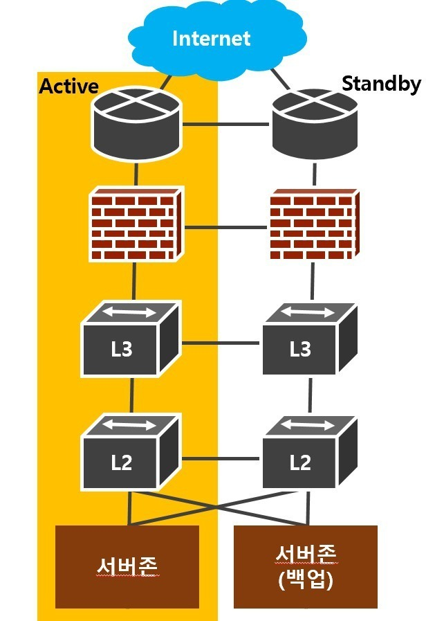
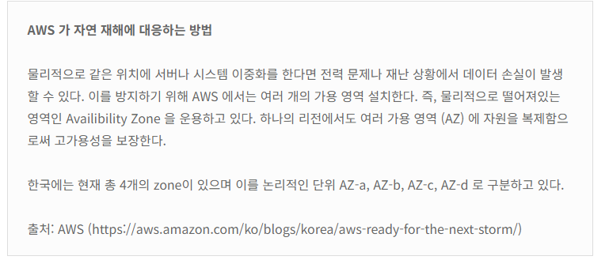
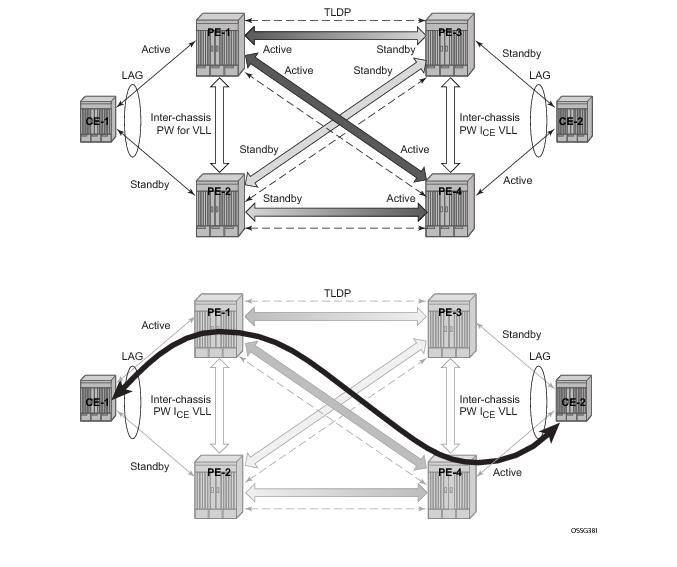

# 이중화 기술

> 일단 집고 넘어가야 할건 
> 서버 이중화와 네트워크 이중화는 다르다  
>
> #### 네트워크 이중화 (Network Redundancy)
> 네트워크 이중화는 네트워크 연결의 안정성과 지속성을 보장하기 위해 설계된다. 
> 이는 주로 네트워크 장비나 연결 경로에 문제가 발생했을 때,  
> 다른 경로나 장비를 통해 데이터 전송이 계속될 수 있도록 하는 것을 목표로 한다. 
> 예를 들어, 두 개의 라우터나 스위치를 사용하여 한쪽이 고장 나더라도 다른 쪽을 통해 네트워크 연결이 유지될 수 있게 하는 것이다. 
> </img>
> #### 서버 이중화 (Server Redundancy)
> 서버 이중화는 서버의 가용성을 높이기 위해 사용된다. 
> 주 서버에 문제가 발생했을 때, 백업 서버가 그 역할을 대신 수행할 수 있도록 하는 것이다. 
> 이를 통해 서비스 중단 시간을 최소화하고, 서비스의 연속성을 보장한다. 
> 일반적으로 로드 밸런서를 사용하여 여러 서버에 트래픽을 분산시키는 방식으로 구현될 수 있다. 

이전 챕터에서 SPoF에 대해 언급된적 있는데. 특정 포인트에서 문제가 발생 시에 전체 시스템이 중단되는 현상을 말한다. 
인프라 설계시 이런 문제를 최소화가 아닌 절대적으로 발생하지 않게 설계 해야하는데 
이러한 해결 방법으로 제시되는 것이 이중화 기술이다. 

- 하나의 파이프 라인에서 SPoF가 발생하더라도 , 다른 파이프라인을 활용해 이를 해결하는 것이다.
- Active/Active, Active/Passive 방식이 있다.
    - Active/Active : 모든 서버가 동시에 일을 할 수 있도록 설계된 방식
    - Active/Passive : Active 서버가 문제가 발생하면 Passive 서버가 대신 일을 하는 방식

> 두 방식 모두 장단점이 존재하는데. Active/Active 방식은 모든 서버가 동시에 일을 할 수 있기 때문에 
> 서버의 가용성이 높아지지만, 서버간의 데이터 동기화가 필요하다. 또한 하나의 서버가  
> 반면에 Active/Passive 방식은 서버간의 데이터 동기화가 필요없기 때문에 구현이 간단하지만, 
> Passive 서버가 Active 서버의 역할을 대신 수행하기 때문에 서버의 가용성이 떨어진다. 
> </img>

------

## LACP (Link Aggregation Control Protocol)

> 1990년대 중반까지는 프로토콜이 없었지만 , 다른 장비와 호환성을 위해 상호호환 가능한 연결 계층 표준화를 시작했다.  
> 이 표준화가 LACP.  

LACP는 두 장비 사이의 링크를 하나의 링크로 묶어서 대역폭을 확장하는 기술이다. 

주 목적

- 대역폭 확장
- 링크 사용률 향상
- 장애 대응 능력, 회복

이러한 작업을 통해

- 두개 이상의 물리적 인터페이스로 구성된 논리 인터페이스를 이용해 모든 인터페이스를 활용할 수 있다
- 스위치 TO 스위치 , 스위치 TO 서버 간 네트워크 대열폭이 물리 인터페이스의 수만큼 확장된다.

하지만 각 물리 인터페이스 마다 트래픽을 수용할 수 있어야 한다  (다른 인터페이스가 고장나면 트래픽을 수용할 수 있어야 한다) 
각각의 물리 인터페이스의 속도가 동일 해야 한다

### 동작 방식

- LACPDU라는 프레임을 사용한다
- LACP 구성 시 두개 이상의 물리 인터페이스가 다른 장비에 연결되어있으면 안된다.
- LACPDU에서는 LACP를 위한 출발지/목적지 주소 , 타입 , 서브 타입 , 버전 정보를 초마다 서로 주고 받는다.
- LACP에는 두가지 모드가 있는데
    - 액티브 : LACPDU를 먼저 전송하고 수신자가 LACP로 구성된 경우 , LACP를 구성
    - 패시브 : 액티브의 반대 먼저 받고 LACP를 구성
- 만약 모든 인터페이스가 패시브 상태라면 아무도 LACPDU를 전송하지 않아 , LACP를 구성하지 않는다.

------

## MC-LAG (Multi-Chassis Link Aggregation Group)

> LACP는 장비들이 상호간 1:1이여야한 다는 문제점이 있다.
> MC-LAG는 이러한 문제점을 해결하기 위해 등장했다.

- MC-LAG은 서로 다른 스위치 간 실제 MAC주소가 아닌 가상 MAC주소를 사용한다. 이를 통해 논리적으로 LACP를 구성할 수 있다

### 구성 요소

- 피어
    - MC-LAG를 구성하는 장비
- MC-LAG 도메인
    - 두 pear 장비를 하나의 논리장비로 구성하기 위한 영역 ID
- 피어 링크
    - MC-LAG를 구성하는 두 pear 장비 간의 물리적 링크

### MC-LAG이 설정 된 스위치가 LACP 를 통한 이중화 구성 하는 방법

- 두 장비 간 LACP 를 구성할 때 각 장비의 MAC 주소가 출발지 MAC 주소가 된다.
- 하지만 MC-LAG 를 이용해 LACP 를 구성할 때는 각 장비 개별 MAC 주소가 아닌 가상 MAC 주소를 사용해 LACPDU 를 전송한다.
- 이를 통해서 서로 다른 MAC 주소에서 통신을 하지만 MC-LAG 와 연결된 장비는 MC-LAG 피어들이 동일한 MAC 주소로 보이게 되고 서로 다른 장비로도 LACP 를 통한 이중화 구성을 할 수 있다.

</img>

------

## 게이트웨이 이중화

- 특정 호스트가 동일한 서브넷에 있는 내부 네트워크와 통신할 때 ARP 를 직접 브로드캐스트 해 출발지와 목적지가 직접 통신한다.
    - 목적지가 동일한 서브넷에 있는 내부 네트워크일때는 L2 통신을 하고 같은 네트워크가 아닌 경우에는 L3 통신을 한다.
    - 3계층 장비(라우터)를 활용하냐 안하냐의 차이
- 따라서 호스트에 게이트웨이 설정이 되어 있지 않거나, 장비에 장애가 생긴다면 외부와 통신할 수 없다.
    - 만약, 물리적으로는 외부 네트워크와 통신할 수 있는 다른 경로가 이중화 되어 있다 하더라도, 하단 호스트는 하나의 게이트웨이만 바라보므로 외부와 통신이 단절된다.
- 이런 경우를 위한 게이트웨이 이중화 프로토콜이 FHRP(First Hop Redundancy Protocol) 이다.
    - 이를 통해 두 라우터(게이트웨이)는 실제 IP 이외 추가로 가상 IP, 가상 IP 에 대한 MAC 주소를 동일하게 가지게 된다.
    - 가상 IP 는 그룹 내에서 우선순위가 높은 장비가 Active 상태를 유지하고, ARP 요청에 응답한다.

### FHRP(First Hop Redundancy Protocol)

- 각각의 게이트 웨이 장비를 그룹으로 묶어 그룹 id를 가지게 한다.
- 그룹화된 가상 IP로 브로드캐스트 요청을 날리면 FHRP 장비 중 Active 상태를 유지하는 장비가 응답한다.
- Active 장비가 장애가 발생하면 Standby 상태를 유지하던 장비가 Active 상태로 변경되어 응답한다.

#### 장애 발생 시

1. 액티브 장비가 비정상인지 체크
2. 가상 IP주소에 액티브 역할을 확보
3. 가상 IP , 가상 MAC 주소 테이블을 갱신에 Standby 장비에게 Active 역할을 넘김

### 올 액티브 게이트웨이 이중화

- 액티브 - 스탠바이 방식은 하나의 게이트웨이만 Active 상태를 유지하고, 나머지는 Standby 상태를 유지한다.
- 이러한 방식은 Active 상태를 유지하는 게이트웨이가 트래픽을 처리하므로, 트래픽이 집중되는 문제가 발생한다.
- MC-LAG를 사용 시에는 모든 게이트웨이가 Active 상태를 유지하고, 트래픽을 분산시키는 올 액티브 방식을 사용한다.

 </img>

------
