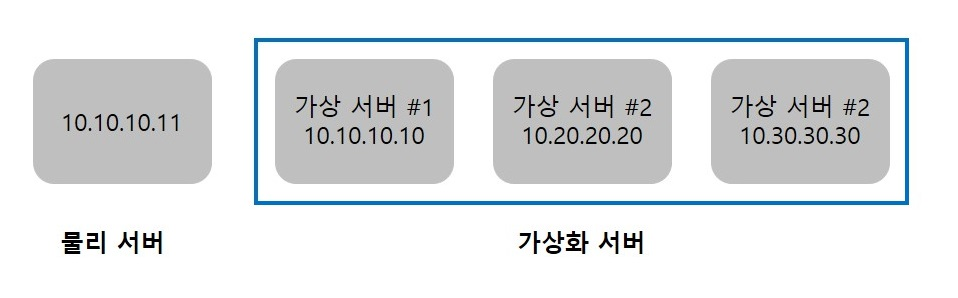
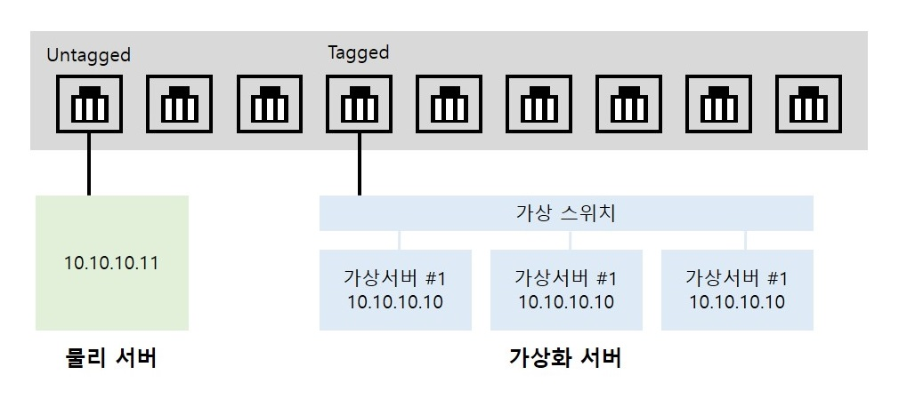
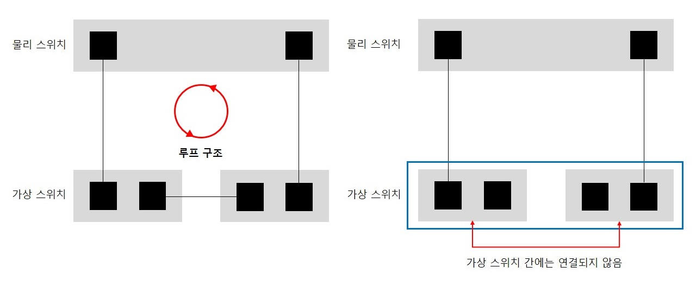
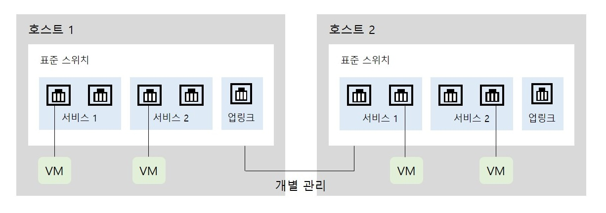
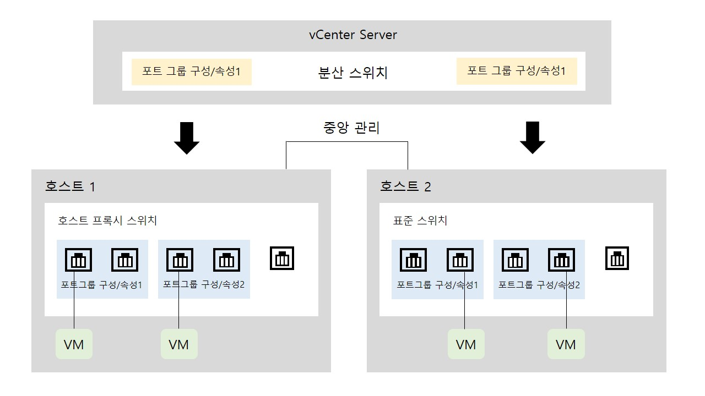

# 가상화 서버를 위한 네트워크
## 가상화 서버 구성 시의 네트워크 설정
### 가상화 네트워크 설정
 

* 하나의 물리 호스트 안에서 VMware와 같은 하이퍼바이저가 설치되어 있는 여러 개의 가상 서버가 구동되는데, 모두 동일한 네트워크 안에서 동작할 수 도 있지만 다양한 네트워크와 서비스를 가상화 서버에 수용하기 위해 두 개 이상의 네트워크를 연결한다.
* 하이퍼바이저란? 호스트 컴퓨터에서 다수의 운영 체제(operating system)를 동시에 실행하기 위한 논리적 플랫폼(platform)을 말한다.

### VLAN Tagged Port
 

* 하나의 스위치에 여러 개의 VLAN이 있을 때 Tagged 포트 기능을 이용한다. (스위치 간에 모든 VLAN을 연결하려면 VLAN 갯수 만큼 케이블과 포트가 필요하다)

## VMware vSphere
### VMware 가상 스위치
* 가상 스위치는 하이퍼바이저 내에서 동작하는 논리적인 소프트웨어 스위치로 서버 내부의 네트워크를 구성하기 위해 제공된다.
* 가상 스위치는 기존 물리 스위치에서 제공하는 모든 기능을 제공하지는 않지만 2계층 스위치의 기본적인 기능을 제공한다.

 

* 가상 스위치를 통해 ESXi 호스트 내의 가상 머신들이 외부와 통신하려면 ESXi 호스트의 물리 네트워크 카드를 물리 스위치에 연결해야 한다.
* 물리 스위치에 연결된 ESXi 호스트의 포트를 가상 스위치의 업링크로 지정하면 해당 가상 스위치에 연결된 가상 머신은 외부 네트워크와 통신하게 된다.
* 가상 스위치 업링크란?

 

* ESXi 호스트에는 한 개 이상의 가상 스위치를 만들 수 있다.
* 물리 네트워크 스위치에서는 스위치 간 경로를 두 개 이상 연결할 때, 루프 구조가 만들어져 문제가 발생할 수 있다.
* 가상 스위치는 두 개 이상 만들어 사용하더라도 가상 스위치 간에 연결이 되지 않아 루프 문제가 발생하지 않는다.
* 가상 머신에 할당되는 가상 네트워크 어댑터를 ESXi 하이퍼바이저가 할당하며, 해당 가상 네트워크 어댑터의 물리 주소(MAC Address)를 알고 있기 때문에 가상 스위치는 MAC 학습작업이 필요하지 않다.
* ESXi의 가상 스위치는 정적(Static)으로 물리 주소 테이블을 모두 가진 2계층 스위치로 정의할 수 있다.

### 표준 스위치/분산 스위치
#### 표준 스위치
 

* VMware의 가상 호스트인 ESXi의 네트워크 구성을 위해 기본적으로 제공되는 가상 스위치를 표준 스위치(Standard Switch)라고 한다.
* 표준 스위치는 ESXi 호스트마다 개별적으로 있으므로 호스트의 가상 스위치를 각각 관리해야 한다.
* 하나의 표준 스위치 내에서는 포트 그룹을 통해 가상 네트워크를 분리할 수 있는데 VLAN 분리와 유사한 개념이다.

#### 분산 스위치
 

* 분산 스위치(Distributed Switch)는 VMware 가상 호스트들을 중앙에서 관리하는 vCenter가 제공하는 기능으로 가상 스위치들을 중앙에서 일괄적으로 관리하게 해준다.
* 분산 스위치를 이용하면 각 ESXi 호스트에 대한 네트워크 구성을 중앙에서 관리하고 전체 ESXi 호스트 간에 일괄적인 네트워크 구성을 유지할 수 있다.
* 분산 스위치는 각 호스트에 동일한 호스트 스위치를 만들기 위한 템플릿 형태이고 실제 내부 구동은 숨겨진 호스트 프록시 스위치에서 동작한다.

### VMKernel 포트와 가상 시스템 포트 그룹
### 포트 그룹 관리
### 가상 스위치의 다양한 기능