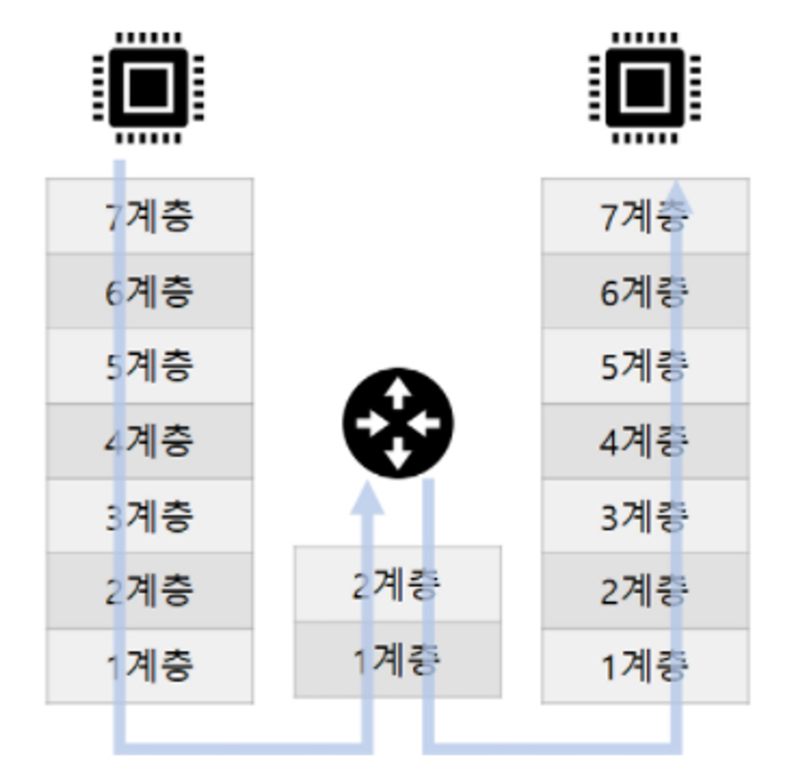

# 스위치와 2계층 장비

## 개요

> 스위치는 로컬 네트워크에서 통신을 가능하게 해주는 장비로,  
> OSI 모델의 2계층(Data Link Layer)에서 동작합니다. 
> 이 글에서는 스위치의 기본 동작 원리, 
> VLAN(Virtual Local Area Network), 
> 그리고 STP(Spanning Tree Protocol)에 대해 간략히 알아보겠습니다.

## 4.1 스위치 장비 동작

### 스위치란?

스위치는 정보를 주고받을 수 있게 도와주는 장비입니다.

스위치는 네트워크의 '2계층'에서 동작하는데,
이는 스위치가 특정한 '주소'를 보고 어떤 정보를 어디로 보낼지 결정한다는 뜻입니다.
여기서 말하는 주소는 MAC 주소라고 부르는 것으로,
컴퓨터나 프린터, 서버 같은 기기마다 다르게 할당된 번호입니다.

#### 정보를 어떻게 보내는가?

스위치는 **프레임** 을 받습니다. 프레임은 정보의 집합이라고 생각하면 됩니다. 스위치는 이 프레임을 열어보고,

'이 정보는 어디로 가야 하는가?'를 **프레임** 안에 있는 MAC 주소를 통해 판단합니다.

그리고 해당 정보를 정확한 위치로만 보내줍니다. 이렇게 하면 정보가 불필요한 곳으로 퍼져나가는 것을 막아 네트워크의 효율성을 높일 수 있습니다.

> #### 프레임이란?
> 프레임은 정보를 보낼 때 이를 PDU(Protocol Data Unit) 으로 만든 것입니다. 이 PDU 에는 두 가지 부분이 있습니다.
> - **헤더**: 여기에는 정보를 어디로 보낼지 알려주는 MAC 주소가 담겨 있습니다.
> - **데이터**: 이 부분에는 실제로 보내려는 정보가 들어 있습니다.
>
> 각 계층마다 이 'PDU'을 부르는 이름이 다르고, 스위치가 다루는 'PDU'을 '프레임'이라고 부릅니다.

</img>

이런 식으로 스위치는 네트워크 내에서 정보를 빠르고 정확하게 전달해주는 역할을 합니다.

#### 스위치의 동작

- 스위치는 동시에 여러 장비들이 서로 간섭없이 통신할 수 있도록 도와준다.
- 스위치는 프레임을 받으면, 프레임 안에 있는 MAC 주소를 보고 MAC 주소 테이블에 어느 포트에 있는지 확인 후 그 포트로만 **프레임**을 전송한다.
- MAC 주소 테이블에 기록되어 있지 않은 프레임이 들어오면 전체 포트로 **프레임**을 전송한다.

#### MAC 주소 테이블

- MAC 주소와 포트를 매핑한 K:V 형태의 테이블이 존재한다.

| MAC 주소            |    포트    |
|-------------------|:--------:|
| 00:00:00:00:00:01 | Port : 1 |
| 00:00:00:00:00:02 | Port : 2 |
| 00:00:00:00:00:03 | Port : 3 |

> #### Flooding
> 스위치 전원 재시작 , 명령어 초기화 , 시간 만료 , 구성 변경등의 경우에는 매핑 테이블이 초기화된다
> 이 시점에는 아무런 매핑 데이터가 없기 때문에 모든 포트로 프레임을 전송한다.
> 이걸 Flooding 이라고 한다. 
> 스위치가 허브 처럼 모든 포트로 프레임을 전송하는 것

> #### Address Learning
>초반은 허브 형태로 동작하다가 점점 매핑 테이블이 채워지면서 스위치처럼 동작한다. 
> 이 과정을 Address Learning 이라고 한다. 
> 출발지의 MAC 주소를 이용하는데 프레임이 특정 포트로 요청이 들어오면 
> 스위치는 들어온 프레임의 출발지 MAC 주소와 포트를 매핑 테이블에 기록한다. 
>
> 이때 Mac주소로 매핑하며 학습하기 때문에 .  
> 목적지 MAC 주소에 별도의 방식을 사용하기 떄문에 브로드캐스트나 멀티캐스트에 대한 MAC 주소를 학습할 순 없다 

> #### 포워딩/필터링(Forwarding/Filtering)
> 포워딩은 매핑 테이블에 기록된 포트로 프레임을 전송하는 것을 말한다. 
> 필터링은 포워딩 중 다른 포트로 프레임을 전송하지 않는 것을 의미한다. 
> 이러한 방식은 유니캐스트에서만 수행한다, 별도의 캐스트들은 플러딩한다.

------

## 4.2 VLAN

### VLAN이란?

VLAN은 Virtual Local Area Network의 약자로, 물리적으로 하나의 네트워크에 연결된 장비들을 여러 개의 가상 네트워크로 나누는 기술입니다.

### 왜 필요한가?

1. **보안**: 서로 다른 VLAN에 속한 장비들은 직접 통신할 수 없어 보안이 향상됩니다.
2. **효율성**: 네트워크 트래픽을 적절히 구분하여 전체 네트워크 성능을 향상시킵니다.

----------

## 4.3 STP

### STP란?

Spanning Tree Protocol은 네트워크 내에서 루프를 방지하기 위한 프로토콜입니다.

### 동작 원리

1. **루트 브리지 선정**: 네트워크 내의 스위치 중 하나를 루트 브리지로 선정합니다.
2. **루프 방지**: 루트 브리지를 중심으로 스패닝 트리를 생성하고, 불필요한 경로는 차단합니다.

## 웹 개발자가 알면 좋은 부분

1. **효율적인 리소스 배분**: 웹 서버와 데이터베이스 서버가 여러 대일 경우, 스위치와 VLAN을 통해 효율적으로 트래픽을 관리할 수 있습니다.
2. **보안 강화**: 서비스의 다양한 구성 요소(예: 사용자 데이터, 결제 시스템 등)를 서로 다른 VLAN에 구성하여 보안을 높일 수 있습니다.
3. **트러블슈팅**: 네트워크 문제가 발생했을 때, 스위치와 관련된 기초 지식이 있으면 문제의 원인을 빠르게 파악하고 해결할 수 있습니다.
