# 스위치와 2계층 장비

## 개요

> 스위치는 로컬 네트워크에서 통신을 가능하게 해주는 장비로,  
> OSI 모델의 2계층(Data Link Layer)에서 동작합니다. 
> 이 글에서는 스위치의 기본 동작 원리, 
> VLAN(Virtual Local Area Network), 
> 그리고 STP(Spanning Tree Protocol)에 대해 간략히 알아보겠습니다.

## 4.1 스위치 장비 동작

### 스위치란?

스위치는 정보를 주고받을 수 있게 도와주는 장비입니다.

스위치는 네트워크의 '2계층'에서 동작하는데,
이는 스위치가 특정한 '주소'를 보고 어떤 정보를 어디로 보낼지 결정한다는 뜻입니다.
여기서 말하는 주소는 MAC 주소라고 부르는 것으로,
컴퓨터나 프린터, 서버 같은 기기마다 다르게 할당된 번호입니다.

#### 정보를 어떻게 보내는가?

스위치는 **프레임** 을 받습니다. 프레임은 정보의 집합이라고 생각하면 됩니다. 스위치는 이 프레임을 열어보고,

'이 정보는 어디로 가야 하는가?'를 **프레임** 안에 있는 MAC 주소를 통해 판단합니다.

그리고 해당 정보를 정확한 위치로만 보내줍니다. 이렇게 하면 정보가 불필요한 곳으로 퍼져나가는 것을 막아 네트워크의 효율성을 높일 수 있습니다.

> #### 프레임이란?
> 프레임은 정보를 보낼 때 이를 PDU(Protocol Data Unit) 으로 만든 것입니다. 이 PDU 에는 두 가지 부분이 있습니다.
> - **헤더**: 여기에는 정보를 어디로 보낼지 알려주는 MAC 주소가 담겨 있습니다.
> - **데이터**: 이 부분에는 실제로 보내려는 정보가 들어 있습니다.
>
> 각 계층마다 이 'PDU'을 부르는 이름이 다르고, 스위치가 다루는 'PDU'을 '프레임'이라고 부릅니다.

</img>

이런 식으로 스위치는 네트워크 내에서 정보를 빠르고 정확하게 전달해주는 역할을 합니다.

#### 스위치의 동작

- 스위치는 동시에 여러 장비들이 서로 간섭없이 통신할 수 있도록 도와준다.
- 스위치는 프레임을 받으면, 프레임 안에 있는 MAC 주소를 보고 MAC 주소 테이블에 어느 포트에 있는지 확인 후 그 포트로만 **프레임**을 전송한다.
- MAC 주소 테이블에 기록되어 있지 않은 프레임이 들어오면 전체 포트로 **프레임**을 전송한다.

#### MAC 주소 테이블

- MAC 주소와 포트를 매핑한 K:V 형태의 테이블이 존재한다.

| MAC 주소            |    포트    |
|-------------------|:--------:|
| 00:00:00:00:00:01 | Port : 1 |
| 00:00:00:00:00:02 | Port : 2 |
| 00:00:00:00:00:03 | Port : 3 |

> #### Flooding
> 스위치 전원 재시작 , 명령어 초기화 , 시간 만료 , 구성 변경등의 경우에는 매핑 테이블이 초기화된다
> 이 시점에는 아무런 매핑 데이터가 없기 때문에 모든 포트로 프레임을 전송한다.
> 이걸 Flooding 이라고 한다. 
> 스위치가 허브 처럼 모든 포트로 프레임을 전송하는 것

> #### Address Learning
>초반은 허브 형태로 동작하다가 점점 매핑 테이블이 채워지면서 스위치처럼 동작한다. 
> 이 과정을 Address Learning 이라고 한다. 
> 출발지의 MAC 주소를 이용하는데 프레임이 특정 포트로 요청이 들어오면 
> 스위치는 들어온 프레임의 출발지 MAC 주소와 포트를 매핑 테이블에 기록한다. 
>
> 이때 Mac주소로 매핑하며 학습하기 때문에 .  
> 목적지 MAC 주소에 별도의 방식을 사용하기 떄문에 브로드캐스트나 멀티캐스트에 대한 MAC 주소를 학습할 순 없다 

> #### 포워딩/필터링(Forwarding/Filtering)
> 포워딩은 매핑 테이블에 기록된 포트로 프레임을 전송하는 것을 말한다. 
> 필터링은 포워딩 중 다른 포트로 프레임을 전송하지 않는 것을 의미한다. 
> 이러한 방식은 유니캐스트에서만 수행한다, 별도의 캐스트들은 플러딩한다.

IP 프로토콜에서 요청 시 (ex.TCP/IP) 3계층에서 2계층 전송 시에는 ARP 프로토콜을 사용한다. 
ARP 프로토콜은 IP 주소를 MAC 주소로 변환하는 프로토콜이다. 
ARP를 통해 MAC주소를 학습한 후 실제로 통신이 시작되면 이 MAC 주소로 패킷을 포워딩/필터링한다.

------

## 4.2 VLAN

### VLAN이란?

VLAN은 Virtual Local Area Network의 약자로,
물리적으로 하나의 네트워크에 연결된 장비들을 여러 개의 가상 네트워크로 나누는 기술.
물리적으로 하나의 네트워크에 연결만 되어 있다면 배치와 관계없이 네트워크를 구성할 수 있다.

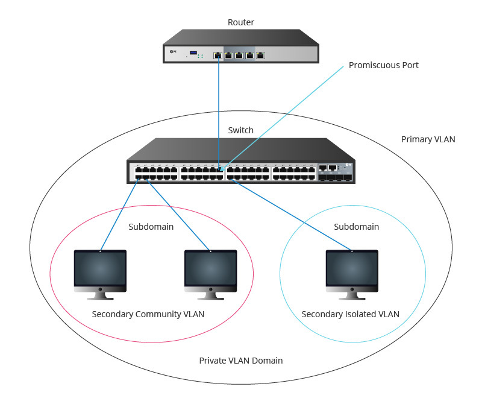</img>

> VLAN은 이더넷의 브로드캐스팅 문제와 보안을 해결하기 위해 제안된 프로토콜이다. 
> 브로드캐스팅 문제 : 네트워크 내의 모든 장비에게 정보를 전달한다
> - CPU 사용률이 높다
> - 보안 문제가 발생할 수 있다.
> - 트래픽이 증가한다.

### 왜 필요한가?

> 큰 규모의 회사에서 여러 부서별로 네트워크를 구성할 때 

1. **보안**: 서로 다른 VLAN에 속한 장비들은 직접 통신할 수 없어 보안이 향상된다.
2. **효율성**: 네트워크 트래픽을 적절히 구분하여 전체 네트워크 성능을 향상시킨다.

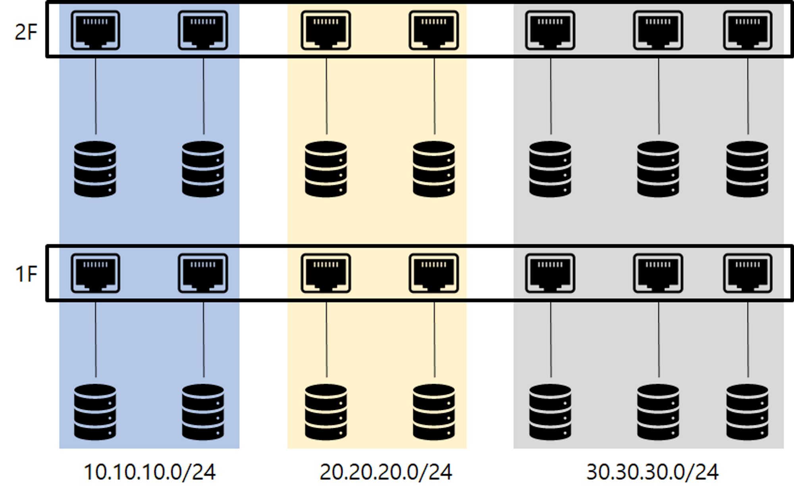</img>

### VLAN의 종류

할당 방식에 따라 포트기반 VLAN과 MAC주소 기반 VLAN으로 나뉜다.

#### 포트 기반

> VLAN 도입 초기시점에는 스위치가 고가의 장비였기에 하나의 스위치를 분할해 여러 네트워크에서 사용하는게 VLAN을 적용하는 목적이였다. 그리고 이처럼 위치를 논리적으로 분할해 사용하는 목적을 가진 VLAN을
> 포트 기반 VLAN(Port Based VLAN)이라 한다.
> 현재 대부분의 VLAN이 이 포트 기반 VLAN을 말하며 어떤 단말이 접속하던 스위치의 특정 포트에 VLAN을 할당하면 할당된 VLAN에 속하게 된다.

#### MAC 주소 기반

> 사용자들의 자리 이동이 많아지면서 나온 VLAN(Mac Based VLAN)
> 스위치의 고정 포트에 VLAN을 할당하는게 아니라 스위치에 연결되는 단말의 MAC주소를 기반으로 VLAN을 할당한다.
> 단말에 따라 VLAN정보가 바뀔수 있기에 다이나믹 VLAN(Dynamic VLAN)이라고도 한다.

데이터 센터같은 VLAN은 포트 기반이 일반적이지만 요즘은 MAC 주소 기반 VLAN이 계속 증가하고 있다.

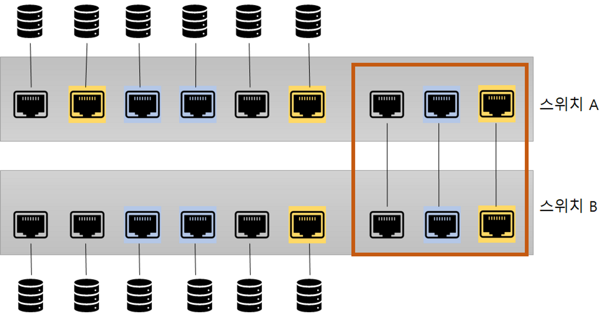</img>
> 여러 포트들을 그룹핑해 VLAN을 만들 경우에는 물리적으로 같은 장비여도 별도의 스위치인것이기에 
> 3계층 장비(L3 스위치, 라우터)가 필요하다. 
> 이미지에서는 3 종류의 VLAN이 존재하기 때문에 3개의 포트가 소모된다. 
>
> 근대 이런 포트가 소모되는 문제를 해결하기 위해 태그 기능을 사용한다. 
> 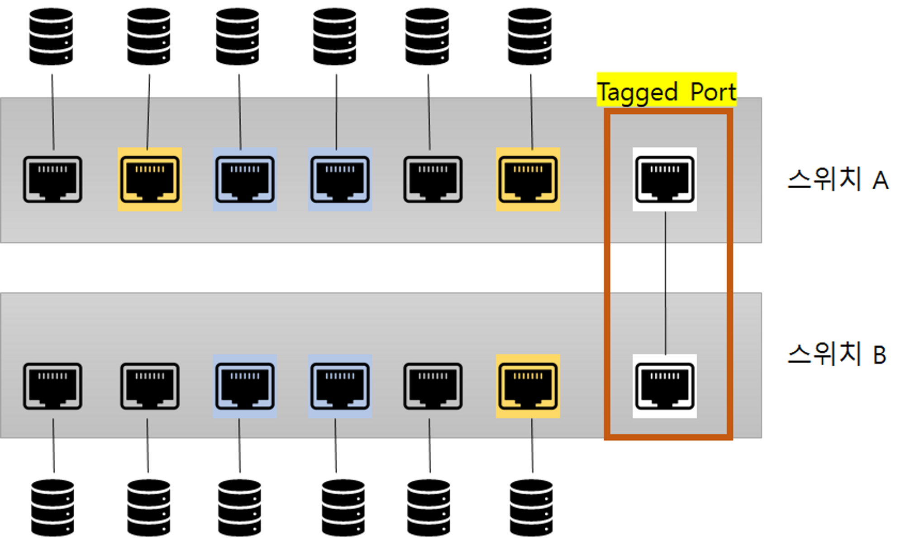</img>  
> VLAN ID를 이더넷 프레임에 추가해 전송하는 방식이다.  
> 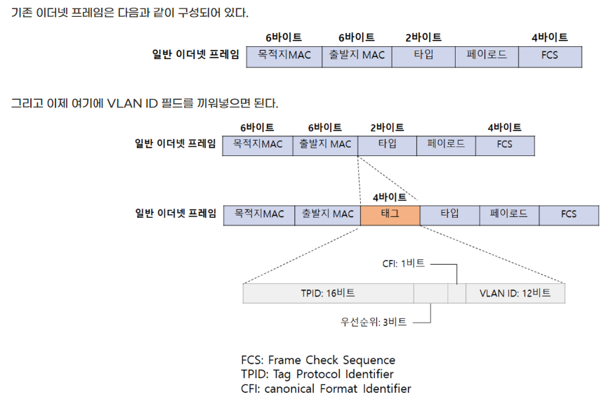</img> 

### 요약

- VLAN간의 통신은 별도의 스위치로 취급하기에 L3 라우터 장비가 있어야 한다.
- VLAN을 이용해 다른 층에 있는 장비들을 하나의 VLAN으로 묶을 수 있다(유사 AOP)
- VLAN 의 종류는 포트 기반, MAC 주소 기반 두가지이며 포트 기반이 많이 쓰인다.
- VLAN 태그 기능을 이용해 하나의 태그 포트(Tagged Port)로 여러 VLAN으로 전송이 가능하다.
- VLAN 태그 기능을 사용하기 위해 일반 이더넷 프레임 중간에 VLAN ID를 끼워넣어 전송한다.
    - 태그포트로 패킷이 들어오면 태그를 벗겨내며 태그된 VLAN으로 패킷을 전송한다.
- MAC 테이블에 VLAN을 지정하는 필드가 추가된다.

----------

## 4.3 STP

### STP란?

Spanning Tree Protocol은 네트워크 내에서 루프를 방지하기 위한 프로토콜.

### SPoF(Single Point of Failure : 단일 장애 지점)

> 하나의 시스템이나 구성요소에서 고장이 발생했을때, 전체 시스템이 정지되는 것을 말한다. 
> 발생 포인트는 다양하다
> 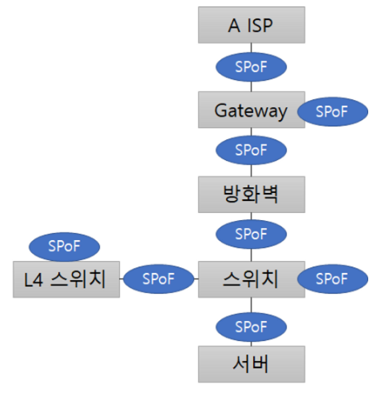</img> 

### 루프란?

> 단어 그대로 네트워크 내에서 정보가 무한히 순환하는 것을 의미. 
> 특정 포인트에 도착 후 사라지는게 아니라 여러 스위치를 계속 순회하면서 
> 네트워크의 트래픽을 높이고, 스위치의 CPU를 과도하게 사용하게 만들며, 
> 결국 네트워크가 다운되는 원인이 됩니다. 

### 발생 이유는?

#### 브로드캐스트 스톰(Broadcast Storm)

> 네트워크 내의 모든 장비에게 정보를 전달하는 것을 브로드캐스트라고 한다. 
> 루프 구조로 된 네트워크에서 서로 다른 스위치간에 계속해서 플러딩(모든 포트로 프레임을 전송)이 발생하면서 네트워크가 다운되는 현상을 말한다. 
> 이 때 3계층에서는 TTL(Time To Live)를 이용해 브로드캐스트 스톰을 방지한다. 
> 하지만 2계층에서는 TTL이 없기 때문에 브로드캐스트 스톰을 방지할 수 없다.  
> 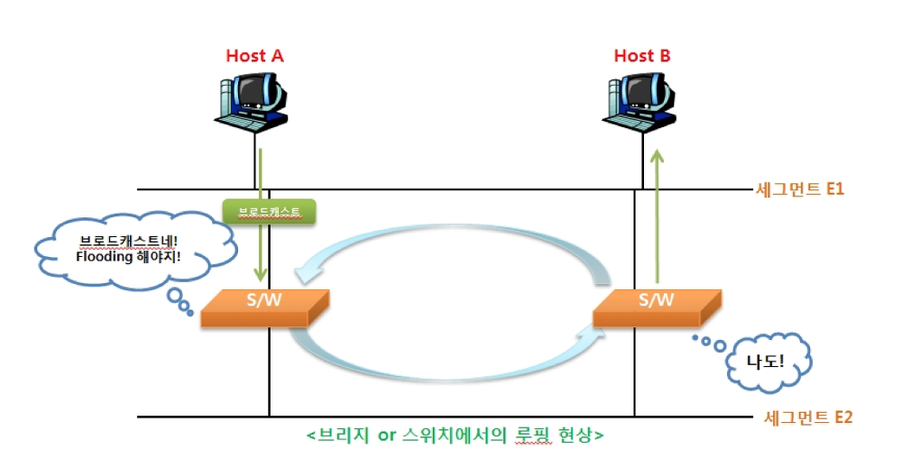</img> 

#### MAC 어드레스 플래핑(MAC Address Flapping)

> 스위치는 MAC 주소를 통해 학습하는데 
> 이때 하나의 MAC 주소에 대해 하나의 포트만 학습해야한다. 
> 하지만 루프가 발생하면서 하나의 MAC 주소에 대해 여러 포트를 학습하게 되고 
> 이는 MAC 어드레스 플래핑(MAC Address Flapping) 발생시킨다. 
> 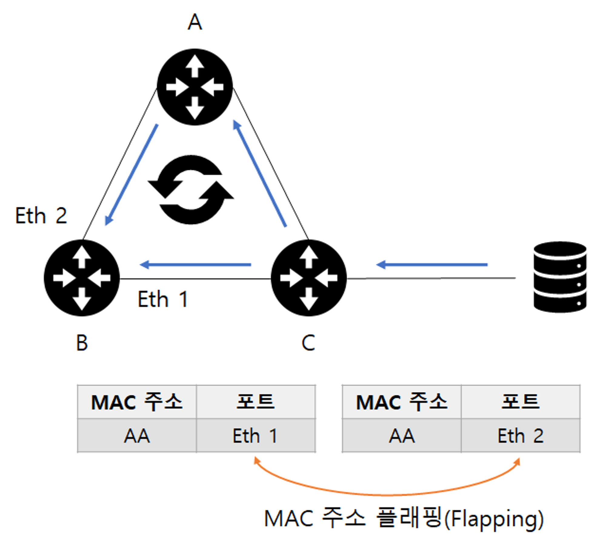</img> 

### 동작 원리

스위치는 BPDU(Bridge Protocol Data Unit)라는 프로토콜을 사용해 스위치간 정보를 교환한다. 
수집된 정보를 기반으로 전체 네트워크 내에서 루프가 발생하지 않도록 스위치를 제어한다. 
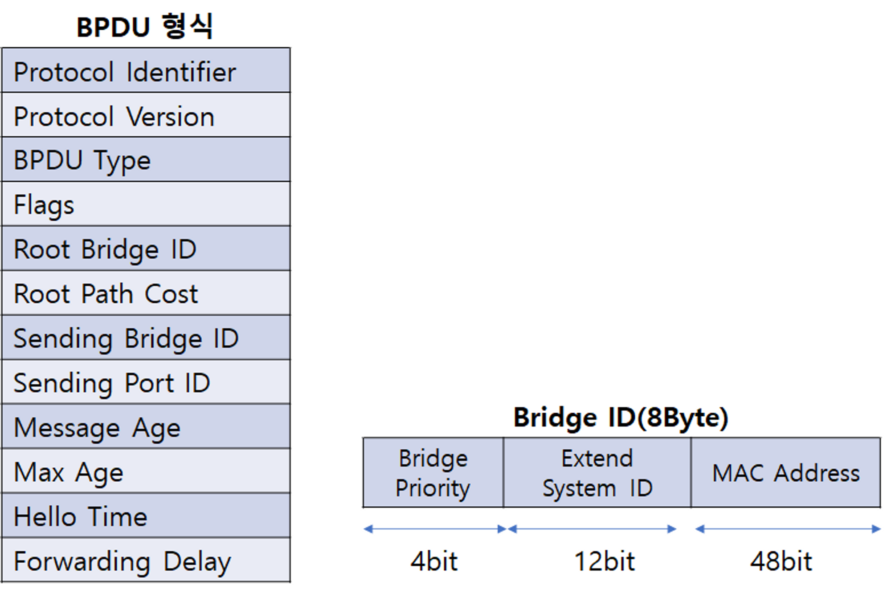</img> 
이 정보를 스위치간에 교환하면서 루프를 파악할 수 있게된다.
확인된 루프 지점의 트래픽을 차단해서 루프를 예방한다.
> 스위치 1번과 2번 사이에 루프가 발생했다고 가정하자.  
> 스위치 1번은 스위치 2번에게 루프가 발생했다고 알려주고 
> 스위치 2번은 스위치 1번에게 루프가 발생했다고 알려준다. 
> 이렇게 루프가 발생한 지점을 파악하고 루프를 차단한다. 

1. 하나의 루트 스위치를 지정
    2. 모든 네트워크 중에 하나의 루트 스위치를 선정하고
    3. 자신을 전체 네트워크의 대표 스위치로 적은 BPDU를 옆 스위치로 전달
2. 루트가 아닌 스위치 중 하나의 루트 포트를 선정
    3. 루트 브릿지로 가는 경로가 가장 짧은 포트를 루트 포트라 한다.
    4. 루트 브릿지에서 보낸 BPDU를 받는 포트다.
3. 하나의 세그먼트에 하나의 지정포트를 지정
    4. 스위치와 스위치가 연결되는 포트는 하나의 지정 포트(Designated Port)를 선정한다.
    5. 스위치 간 연결에서 이미 루트 포트로 선정된 경우 반대쪽이 지정포트로 선정되어 양쪽 모두 포워딩 상태가 된다.
    6. 스위치 간 연결에서 루트 포트가 없을 경우 한 쪽은 지정포트 한쪽은 대체 포트(Alternate, Non-designated)가 되어 차단 상태가 된다.

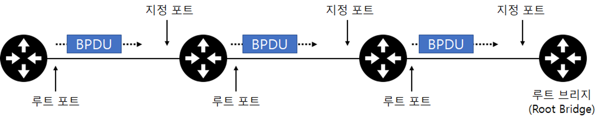</img> 

--------------

### 향상된 STP (RSTP,MST)

STP에서는 4단계(선정,대체,지정,차단)를 거쳐야 해 느리다는 단점이 있다. 
TCP기반 통신에서 느린 응답속도로 인해 통신이 끊킬 수 있다. 

### RSTP(Rapid Spanning Tree Protocol)

Rapid : 빠른, 급한, 신속한

기존 20~60초 걸리던 STP의 수행시간을 6초 이내로 단축시킨 프로토콜이다. 
RSTP는 STP의 기능을 모두 포함하고 있으며, 더 빠른 수행시간을 가지고 있다. 
BPDU의 Flag 필드는 8비트인데 기존에는 모든 비트를 활용하지 않았지만 RSTP는 모든 비트를 활용해 더 빠른 수행시간을 가지고 있다. 

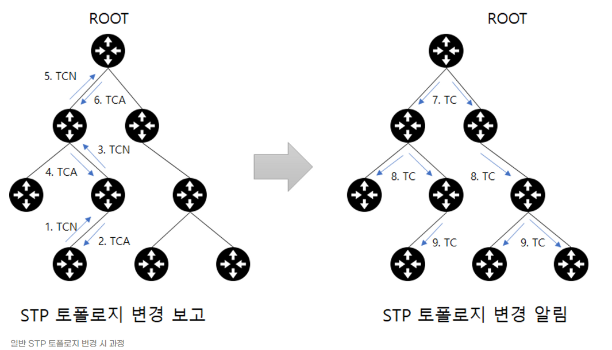
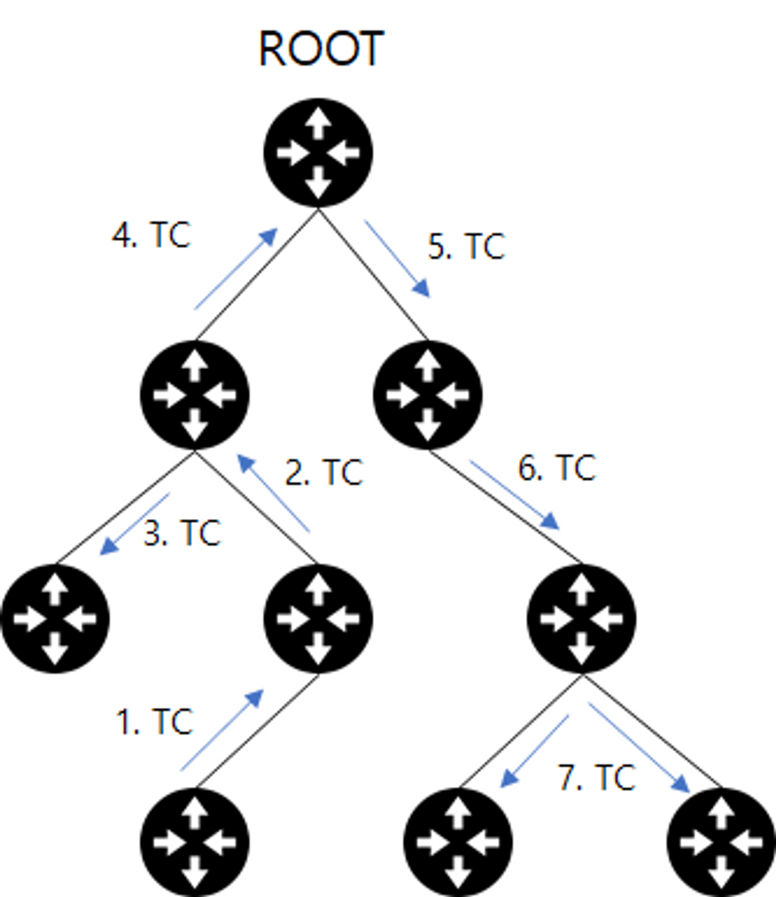

### MST(Multiple Spanning Tree)

#### 기본 개념

MST는 "Multiple Spanning Tree"의 약자로, 여러 개의 스패닝 트리를 동시에 관리할 수 있는 프로토콜.
간단히 말해, 하나의 물리적 네트워크 내에서 여러 개의 논리적 스패닝 트리를 만들어 관리하는 것.

#### 필요한 이유

- 효율성: 하나의 스패닝 트리만 사용하면, 일부 링크가 사용되지 않을 수 있다. MST를 사용하면, 여러 스패닝 트리를 만들어 네트워크 자원을 더 효율적으로 사용할 수 있다.
- 유연성: 다양한 VLAN(가상 로컬 영역 네트워크) 환경에서 각 VLAN에 맞는 스패닝 트리를 구성할 수 있다.
- 고장 복구: 하나의 스패닝 트리에서 문제가 발생하더라도, 다른 스패닝 트리는 정상적으로 작동할 수 있다.

#### 작동원리

- MST 인스턴스 생성: 네트워크 관리자는 여러 MST 인스턴스를 생성한다. 각 인스턴스는 하나의 스패닝 트리를 관리한다.
- VLAN 할당: 각 MST 인스턴스에는 특정 VLAN이 할당된다. 이렇게 하면, 각 VLAN은 별도의 스패닝 트리를 통해 통신할 수 있다.
- 루트 브릿지 선정: 각 MST 인스턴스는 자체적으로 루트 브릿지를 선정한다.
- 트리 구성: 각 MST 인스턴스는 스패닝 트리 알고리즘을 실행하여 트리를 구성한다.
