# 라우터/L3 스위치: 3계층 장비
## 라우터의 동작 방식과 역할
**라우터란?** 
3계층에서 동작하는 경로를 지정해주는 장비

**라우터? L3 스위치?** 
3계층에서 동작하는 라우터와 동일한 기능을 하는 장비

**라우터의 동작 방식** 
다양한 경로를 수집하여 최적의 경로를 라우팅 테이블에 저장한 후 패킷이 라우터로 들어오면 도착지 IP 주소와 라우팅 테이블을 비교해 최선의 경로로 패킷을 전송한다.

### 1. 경로 지정
---
- 가장 중요한 역할 1) 경로 정보를 모아 라우팅 테이블 생성 2) IP 주소를 확인해 원격지에 있는 적절한 경로로 패킷을 포워딩 

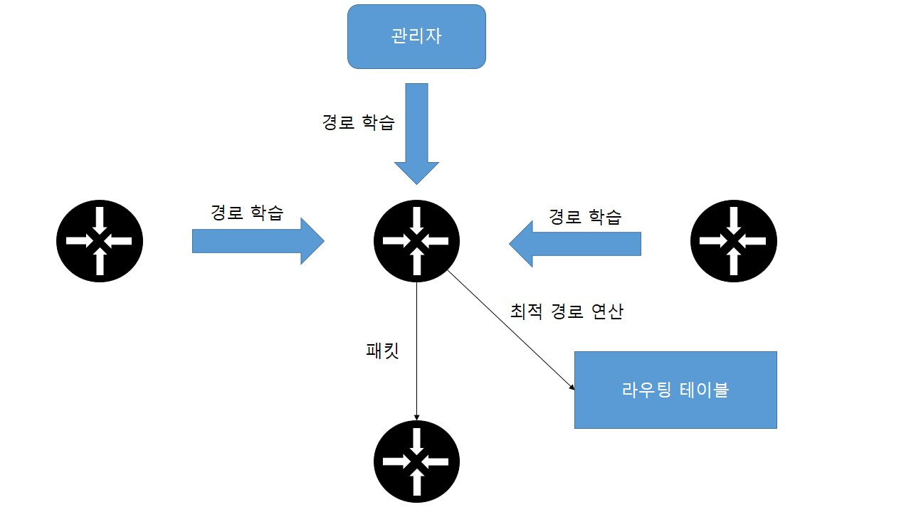 

### 2. 브로드캐스트 컨트롤(Broadcast Control)
---
* 라우터의 기본 동작 
&nbsp;-&nbsp;멀티캐스트 정보를 습득하지 않고 브로드캐스트 패킷을 전달하지 않는다. 
* 브로드캐스트 컨트롤/멀티캐스트 컨트롤은 라우터의 기본 동작을 이용해 브로드캐스트가 다른 네트워크로 전파되는 것을 막는 기능을 말한다.
* 예) 인터넷은 지정된 대역폭만 빌려 사용하므로 목적지가 없거나 명확하지 않은 패킷이 플러딩되면 인터넷이 쓸모없는 패킷으로 가득 차 통신불능 상태가 된다.

### 3. 프로토콜 변환
---
* 라우터의 역할 
&nbsp;-&nbsp;서로 다른 프로토콜로 구성된 네트워크 연결 
* 과거 
&nbsp;-&nbsp;원격지 네트워크와의 통신 : LAN 기술 > WAN 기술로 변환 
* 현재 
&nbsp;-&nbsp;현대 네트워크는 대부분 이더넷을 사용하여 네트워크별 프로토콜을 변환하는 역할이 필요치 않음 
* 라우터에 패킷이 들어오면 2계층 헤더 정보를 삭제한 후 새로운 헤더 정보를 생성하여 패킷을 전송한다. 
&nbsp;-&nbsp;예) LAN 구간(이더넷 프로토콜) > WAN 구간(PPP 프로토콜)으로 헤더 정보가 변경됨 

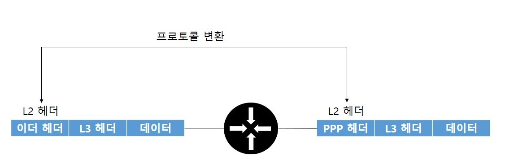 

## 경로 지정 - 라우팅/스위칭
**라우터의 패킷 처리 작업** 
* 경로 정보를 얻어 경로 정보를 정리하는 역할 
&nbsp;-&nbsp;라우터는 자신이 알지 못하는 목적지를 가진 패킷은 버리므로 경로 정보를 충분히 수집하고 있어야 라우터가 정상 작동함
* 정리된 경로 정보를 기반으로 패킷을 포워딩하는 역할 
&nbsp;-&nbsp;라우터는 서브넷 단위로 라우팅 정보를 습득하고 여러 개의 서브넷 정보를 뭉쳐 전달함 
&nbsp;-&nbsp;라우터에 들어온 패킷의 목적지 주소와 라우팅 테이블 정보가 정확히 일치하지 않더라도 목적지에 가장 근접한 정보를 찾아 패킷을 포워딩해야 함

### 1. 라우팅 동작과 라우팅 테이블
---
**홉-바이-홉(Hop-by-Hop) 라우팅** 
&nbsp;-&nbsp;단말부터 목적지까지의 경로를 모두 책임지는 것이 아니라 인접한 라우터까지만 경로를 지정하면 인접 라우터에서 최적의 경로를 다시 파악한 후 라우터로 패킷을 포워딩한다. (네트워크를 한 단계씩 뛰어넘는다는 의미) 
&nbsp;-&nbsp;넥스트 홉(Next Hop) : 인접한 라우터 

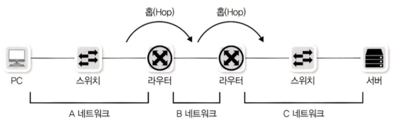 

**넥스트 홉을 지정하는 방법** 
1. 다음 라우터의 IP를 지정하는 방법(넥스트 홉 IP 주소) 
&nbsp;-&nbsp;일반적으로 상대방 라우터의 인터페이스 IP 주소를 지정하는 방법을 사용
2. 라우터의 나가는 인터페이스를 지정하는 방법 
&nbsp;-&nbsp;상대방 넥스트 홉 라우터의 IP를 몰라도 MAC 주소 정보를 알아낼 수 있을 때에만 사용 가능
3. 라우터의 나가는 인터페이스와 다음 라우터의 IP를 동시에 지정하는 방법 
&nbsp;-&nbsp;인터페이스를 설정할 때는 라우터의 나가는 물리 인터페이스를 지정하는 것이 일반적이지만 IP주소와 인터페이스를 동시에 사용할때는 VLAN 인터페이스와 같은 논리적인 인터페이스를 사용할 수 있음

**참고)** 라우터의 인터페이스 
- Ethernet Interface: LAN 구간 연결 
- Serial Interface: WAN 구간 연결 
- Loopback Interface: 가상의 Interface 

**라우팅 테이블에 저장하는 데이터** 
* 목적지 주소
* 넥스트 홉 IP 주소, 나가는 로컬 인터페이스(선택 가능)

PBR(Policy-Bsed Routing) 
Route Map을 이용하여 특정 조건에 해당하는 패킷을 라우팅 테이블과 관계없이 관리자가 원하는 곳으로 전송시키는 기능을 말한다. 
스태틱 라우팅이나 다이나믹 라우팅은 패킷의 목적지 주소만을 참조하여 라우팅 경로를 결정하지만, PBR을 사용할 경우 패킷의 출발지 또는 출발지 및 목적지 주소에 따라 원하는 경로를 선택할 수 있기 대문에 경우에 따라 유용하게 사용 가능하다. 
-> 이 기능을 소스 라우팅 또는 정책 라우팅이라고 한다. 

**참고)** 루프가 없는(Loop Free) 3계층: TTL(Time To Live) 
3계층의 IP 헤더에는 TTL이라는 필드가 있는데, 이는 패킷이 네트워크에 살아 있을 수 있는 시간(홉)을 제한한다. 
TTL 값이 0이 되면 네트워크 장비에서 버려지는데, 실제 초와 같은 시간이 아니라 홉을 지칭하며 하나의 홉을 지날 때마다 TTL 값은 1씩 줄어든다. 

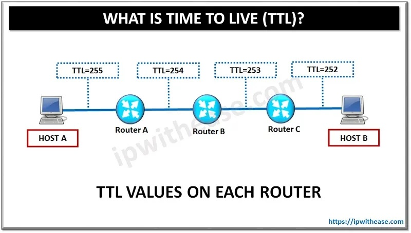 

### 2. 라우팅(라우터가 경로 정보를 얻는 방법)
---
#### 1. 다이렉트 커넥티드
IP 주소를 통해 해당 IP 주소가 속한 네트워크 주소 정보를 알 수 있고 이 정보를 라우팅 테이블에 자동으로 등록하는데 이 경로 정보를 다이렉트 커넥티드라고 한다. 
이 경로 정보는 강제로 지울 수 없고 해당 네트워크 설정을 삭제하거나 해당 네트워크 인터페이스가 비활성화되어야만 자동으로 사라진다. 

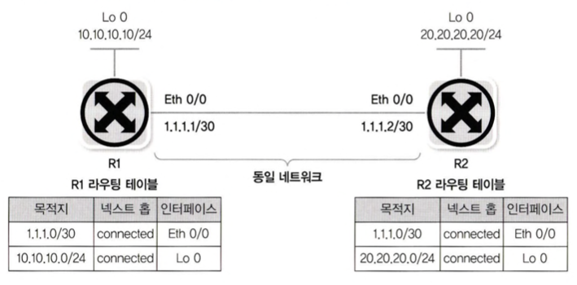 

#### 2. 스태틱 라우팅
관리자가 목적지 네트워크와 넥스트 홉을 라우터에 직접 지정해 경로 정보를 입력하는 것을 말한다. 
스태틱 라우팅은 다이렉트 커넥티드처럼 연결된 인터페이스 정보가 삭제되거나 비활성화되면 연관된 스태틱 라우팅 정보가 자동 삭제된다. 

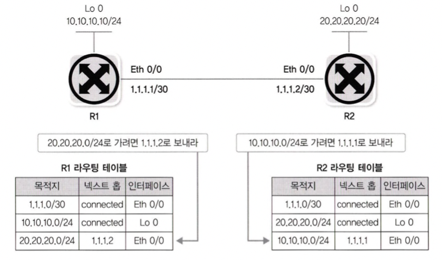 

#### 3. 다이나믹 라우팅
라우터끼리 자신이 알고 있는 경로 정보나 링크 상태 정보를 교환해 전체 네트워크 정보를 학습한다. 
주기적으로 또는 상태 정보가 변경될 때 라우터끼리 경로 정보가 교환되므로 라우터를 연결하는 회선이나 라우터 자체에 장애가 발생하면 이 상황을 인지해 대체 경로로 패킷을 포워딩할 수 있다. 

 

**토폴로지 테이블** 
라우터가 수집한 경로 정보, 원시 데이터(Raw Data)를 저장하는 테이블을 말한다.

**라우팅 테이블** 
토폴로지 테이블에 있는 경로 정보 중 최적의 경로를 저장하는 테이블을 말한다. 
많은 패킷을 실시간으로 포워딩해야 하는 라우터는 라우팅 테이블을 참고해 패킷 경로를 지정하고 포워딩한다.

>중요한 개념은 패킷을 보낼 때는 전체 경로를 고려하는 것이 아니라 다음 라우터까지만 패킷을 포워딩한다는 것이고, 이런 기법을 홉-바이-홉 라우팅이라고 한다.

### 스위칭(라우터가 경로를 지정하는 방법)
---
**스위칭이란?** 
&nbsp;-&nbsp;패킷이 들어와 라우팅 테이블을 참조하고 최적의 경로를 찾아 라우터 외부로 포워딩하는 작업을 말한다.

**참고)** 롱기스트 프리픽스 매치 
라우터가 패킷을 포워딩할 때 자신이 갖고 있는 라우팅 테이블에서 가장 좋은 항목을 찾는 알고리즘을 말한다. 
&nbsp;-&nbsp;LPM 테이블 : 라우터나 스위치가 관리할 수 있는 라우팅 테이블을 말하며, 도입해야 할 장비가 관리할 수 있는 테이블 양으로 대략적인 성능 확인 

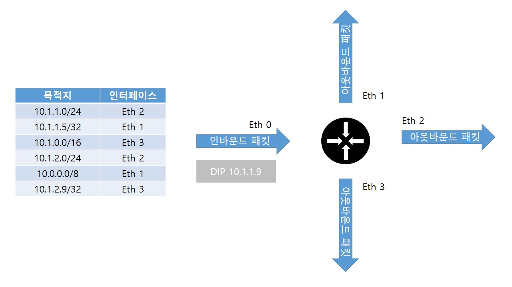 

정확한 정보를 매치하는 이그젝트 매치(Exact Match)는 단순한 서치 작업으로 찾고 패킷을 처리할 수 있지만 롱기스트 매치처럼 부정확한 정보 중 가장 비슷한 경로를 찾는 작업은 더 많은 리소스를 소모하여 많은 부하가 걸린다.

한번 스위칭 작업을 수행한 정보는 캐시에 저장하고 뒤에 들어오는 패킷은 라우팅 테이블을 확인하는 것이 아니라 캐시를 먼저 확인한다. 
이런 기술이 유용한 것은 패킷 네트워크에서 데이터를 보내기 위해 동일한 출발지 IP, 동일한 목적지 IP, 포트 번호로 여러 개의 패킷이 연속적으로 보내지기 때문이다.

캐시 기술
* 단순히 목적지 IP만 캐시하는 경우
* 출발지와 목적지 IP 모두 캐시하는 경우
* 포트 번호 정보까지 포함해 플로를 모두 저장하는 경우
* 넥스트 홉 L2 정보까지 저장하는 경우

### 라우팅, 스위칭 우선순위
---
**경로 정보에 따른 가중치**
* 내가 갖고 있는 네트워크(다이렉트 커넥티드)
* 내가 경로를 직접 지정한 네트워크(스태틱 라우팅)
* 경로를 전달받은 네트워크(다이나믹 라우팅)

**가중치 우선순위**
* 다이렉트 커넥티드 > 스태틱 라우팅 > 다이나믹 라우팅 
-> 다이나믹 라우팅의 경우 어떤 라우팅 프로토콜을 통해 경로 정보를 얻었는가에 따라 우선순위가 달라짐

**AD(Administrative Distance, 관리 거리)** 
&nbsp;-&nbsp;기본적인 우선순위는 미리 정해져 있지만 필요에 따라 관리자가 우선순위를 조정해 라우팅 경로를 조정할 수 있다. 
생산업체마다 AD값이 조금씩 다르다.

**코스트(Cost) 우선순위** 
&nbsp;-&nbsp;가중치 값이 동일한 경우에는 코스트 값으로 우선순위를 정하는데, 코스트 값까지 동일한 경우에는 ECMP(Equal-Cost Multi-Path) 기능으로 동일한 코스트 값을 가진 경로 값 정보를 모두 활용해 트래픽을 분산한다. 
&nbsp;-&nbsp;코스트 값은 일종의 거리를 나타내는 값으로 라우팅 프로토콜마다 기준이 다르다. 
&nbsp;-&nbsp;RIP은 홉수, OSPF는 대역폭, EIGRP는 다양한 값들을 연산해 나온 값으로 코스트를 지정한다. 

패킷을 스위칭할 때는 롱기스트 프리픽스 매치 기법으로 우선순위를 정한다. 

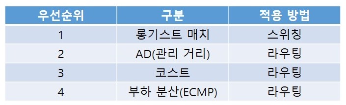 

## 라우팅 설정 방법
### 다이렉트 커넥티드
---
* 라우터나 PC에 IP 주소, 서브넷 마스크를 입력하면 다이렉트 커넥티드 라우팅 테이블이 생성된다.
* 목적지가 다이렉트 커넥티드라면 L2통신(ARP 요청을 직접 보내는)으로 목적지에 도달한다.
* 목적지가 외부 네트워크라면 스태틱 라우팅이나 다이나믹 라우팅에서 얻은 원격지 네트워크에 대한 적절한 라우팅 정보가 있어야 한다.
* 외부 네트워크로 나가는 첫번째 길목이 다이렉트 커넥티드이기 때문에 IP 주소를 잘못 설정하거나 서브넷 마스크 범위를 잘못 설정하면 외부 네트워크와 통신할 수 없다.

### 스태틱 라우팅
---
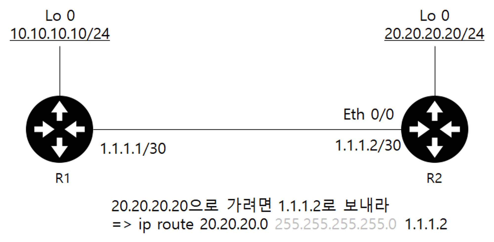

* R1 라우팅 테이블 
&nbsp;-&nbsp;10.10.10.0/24 
&nbsp;-&nbsp;1.1.1.0/30 
&nbsp;-&nbsp;20.20.20.0/24 (1.1.1.2/30) <- 추가 

* R2 라우팅 테이블 
&nbsp;-&nbsp;20.20.20.0/24 
&nbsp;-&nbsp;1.1.1.0/30 

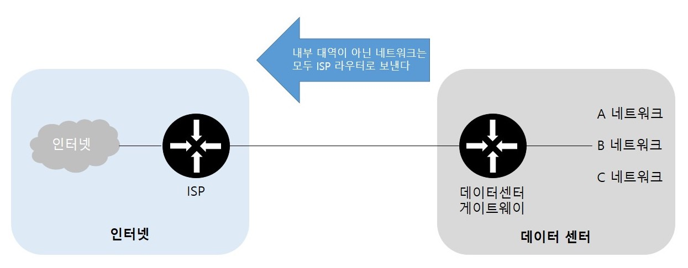 

* 네트워크 규모가 크거나 인터넷 연결 시 대용량의 인터넷 라우팅 전용 라우터가 필요하다. 
* 인터넷 정보를 모두 가질 수 있는 전용 라우터는 KT, SK Broadband, LGU+ 같은 인터넷 사업자가 운영한다. 
* 인터넷 사업자 라우터 쪽으로 패킷을 보내면 인터넷 통신이 가능해진다. 

**디폴트 라우팅** 
&nbsp;-&nbsp;경로를 찾지 못한 모든 네트워크들의 경로를 미리 정해놓는 것을 말한다. 
&nbsp;-&nbsp;인터넷을 사용하는 라우터나 경로가 하나 뿐인 경우 주로 사용하는 방식이다. 
&nbsp;-&nbsp;스태틱 라우팅의 경우는 특정 목적지로 가기 위한 수동 구성이었다면 디폴트 라우팅의 경우는 특정 목적지를 지정하지 않고 모든 목적지가 지정한 곳으로 간다는 차이가 있다. 
>ip route 0.0.0.0 0.0.0.0 1.1.1.1 
* 목적지 주소의 서브넷 마스크가 모두 0인 스태틱 라우팅을 디폴트 라우팅이라고 한다.
* 서브넷 마스크 1은 체크, 0은 IP 주소와 상관없이 연산 결과가 모두 0이므로 체크하지 않는다는 의미로 "모든 네트워크"라는 의미가 된다.
* 인터넷이나 자신에게 경로 정보가 없는 경우, 마지막 대체 경로로 디폴트 라우팅을 사용한다.
* 디폴트 라우팅과 디폴트 게이트웨이는 같은 의미로 서버에서 디폴트 게이트웨이를 설정하면 서버의 라우팅 테이블에 디폴트 라우팅이 생성된다.

### 다이나믹 라우팅
---
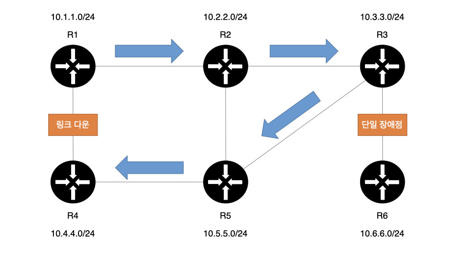 

&nbsp;-&nbsp;R3와 R6 네트워크는 연결되는 경로가 한 개만 있는 SPoF 상태이다. R3와 R6 사이의 링크가 다운되면 대체할 수 없는 경로가 없다. 
&nbsp;-&nbsp;반면, R1과 R4의 연결은 그 사이의 네트워크가 다운되더라도 R4로 갈 수 있는 대체 경로가 있다.(R2-R3-R5)

SPoF(Single Point of Failure: 단일 장애점) 
&nbsp;-&nbsp;요소 하나 때문에 장애가 발생한 경우, 전체 시스템에 장애가 발생하는 지점을 의미한다.

**스태틱 라우팅의 단점**
* SPoF 상태에서 장애가 발생하면 신속한 대응이 어렵다.
* 네트워크 회선이 끊기거나 라우터에 장애가 발생하면 관리자가 이를 파악해 경로 정보를 수동으로 수정해야 한다.
* 대체 경로를 추가로 설정해야 하므로 네트워크가 커지면 고려해야 할 경로가 많아진다.

**다이나믹 라우팅의 특징**
* 관리자의 직접적인 개입 없이 라우터끼리 정보를 교환해 경로 정보를 최신으로 유지한다.
* 관리자가 라우팅 정보를 직접 입력해줄 필요가 없다.
* 다이나믹 라우팅 뒤에 프로토콜이 붙는 것은 라우터끼리 자신들만의 프로토콜로 정보를 교환하기 때문이다.
* 주기적으로 또는 특별한 변화가 있으면 경로 정보를 교환하므로 중간 경로에 문제가 발생하더라도 대체 경로를 찾는 작업이 자동으로 수행된다.

**다이나믹 라우팅 프로토콜**
1. 유니캐스트 라우팅 프로토콜 
&nbsp;-&nbsp;RIP, IGRP, OSPF, IS-IS, EIGRP, BGP
2. 멀티캐스트 라우팅 프로토콜 
&nbsp;-&nbsp;DVMRP, MOSPF, PIM

#### 역할에 따른 분류
---

일반적으로 라우팅 프로토콜은 유니캐스트 라우팅 프로토콜을 말한다.
인터넷에는 AS(Autonomous System)이라는 자율 시스템이 존재하는데 SKT, KT, LGU+인 인터넷 사업자가 한 개 이상의 AS를 운영한다.

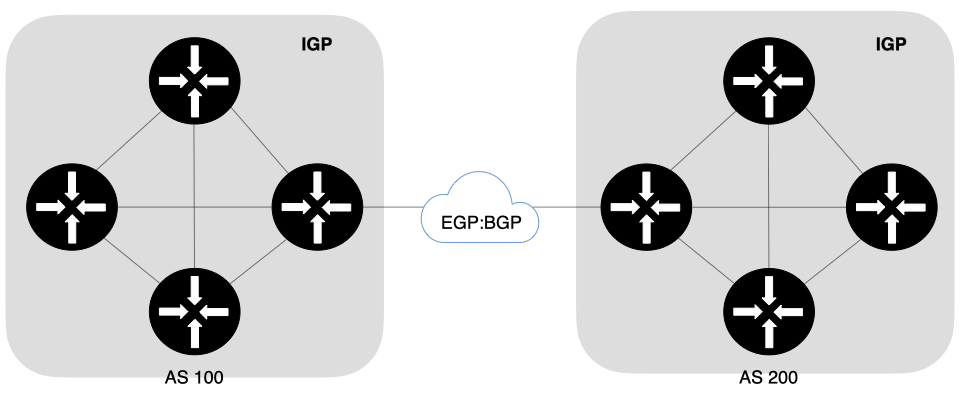 

**AS 내부** 
&nbsp;-&nbsp;자체적으로 규칙을 세워 운영 
&nbsp;-&nbsp;효율성이 중요함 
&nbsp;-&nbsp;IGP(Interior Gateway Protocol) : AS 내에서 사용하는 라우팅 프로토콜 

**AS 간** 
&nbsp;-&nbsp;다른 AS와 연결하기 위해서는 내부와 다른 방법으로 정보 전달 
&nbsp;-&nbsp;조직 간 정책이 중요함 
&nbsp;-&nbsp;EGP(Exterior Gateway Protocol) : AS 간 통신에 사용하는 라우팅 프로토콜 

인터넷 사업자 간의 통신에도 비용을 지불해야 하고 AS200, AS300에서 이런 통신을 쉽게 파악할 수 있어야 하며 EGP는 이런 통신을 정책으로 조정할 수 있는 기능이 있어야 한다.
이런 정책 때문에 AS를 건너 연결하는 것이 제한되고 AS 간 직접 연결을 주로 사용하게 된다.

#### 동작 원리에 따른 분류
---
**IGP 라우팅 프로토콜**
* 디스턴스 벡터
    + 인접한 라우터에서 경로 정보를 습득하는 라우팅 프로토콜
    + RIP, BGP
    + 장점 : 인접 라우터가 이미 계산한 결과물인 라우팅 테이블을 전달받고 계산하므로 라우팅 정보 처리에 많은 리소스가 필요하지 않음
    + 단점 : 멀리 떨어진 라우터의 경로 정보를 얻는 데 많은 라우터를 거쳐야 하므로 모든 라우터 정보가 동기화되는 데 많은 시간이 필요함  
* 링크 스테이트
    + 라우터에 연결된 링크 상태를 서로 교환하고 각 네트워크 맵을 그리는 라우팅 프로토콜
    + 링크 상태를 교환하므로 라우팅 테이블과 달리 직접적인 상태 정보를 받아볼 수 있음
    + 토폴로지 데이터베이스를 만들고 이 정보를 다시 SPF(Shortest Path First) 알고리즘을 이용해 최단 경로 트리를 만들어 최적의 경로를 선정한 후 라우팅 테이블에 추가
    + 장점 : 전체 네트워크의 링크 상태 정보를 받아 각자 처리하므로 전체 네트워크 맵을 그리고 경로 변화를 파악하는데 유리함
    + 단점 : 네트워크 규모가 커지면 네트워크 경로를 파악하는데 CPU와 메모리 자원을 많이 소모  

**OSPF 에어리어(Area)** 
네트워크 변화를 더 빨리 감지하고 리소스를 최적화하기 위해 네트워크를 에어리어 단위로 분리하고 분리된 에어리어 내에서만 링크 상태 정보 교환을 한다.

에어리어 내부 
&nbsp;-&nbsp;전체 링크 정보 공유

에어리어 외부 
&nbsp;-&nbsp;가공된 라우팅 테이블 형태로 정보 전달

ABR(Area Border Router) 
&nbsp;-&nbsp;Backbone AREA와 다른 AREA를 연결시켜 주는 경계 라우터  
ASBR(Autonomous System Border Router) 
&nbsp;-&nbsp;OSPF가 아닌 다른 외부의 정보를 OSPF와 연결시켜주는 외곽 라우터 

내용 출처 
https://m.blog.naver.com/PostView.naver?isHttpsRedirect=true&blogId=gmqgufrn&logNo=220767691343
https://netdream.tistory.com/23
https://catsbi.oopy.io/225439bd-ec84-4e16-aeca-0dfcb9954ea6
https://facelight.tistory.com/34

이미지 출처 
https://ipwithease.com/what-is-time-to-live-ttl-in-networking/
https://velog.io/@indongcha/IT-%EC%97%94%EC%A7%80%EB%8B%88%EC%96%B4%EB%A5%BC-%EC%9C%84%ED%95%9C-%EB%84%A4%ED%8A%B8%EC%9B%8C%ED%81%AC-%EC%9E%85%EB%AC%B8-5%EC%9E%A5-3%EA%B3%84%EC%B8%B5-%EC%9E%A5%EB%B9%84
