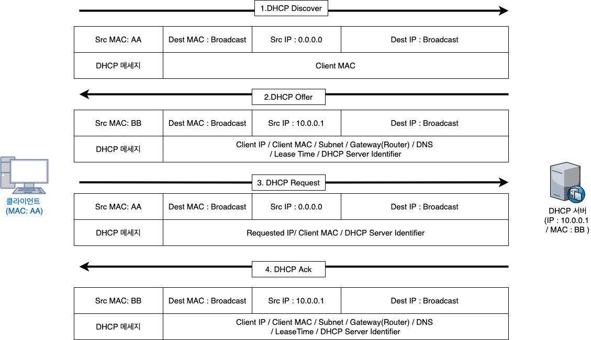
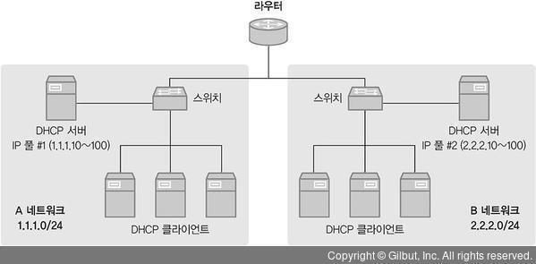
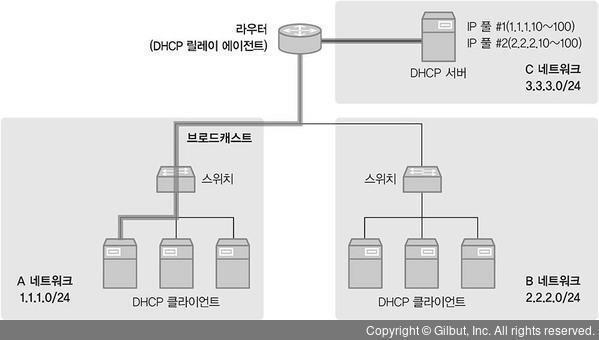

# DHCP
* 네트워크 설정
	* 정적 할당 : 수동으로 IP와 네트워크 정보를 직접 설정하는 것
	* 동적 할당 : 자동으로 IP와 네트워크 정보를 설정하는 것 
	-> 보안을 강화하고 쉽게 관리하도록 도와주는 서비스와 장비가 대중화되어 동적 할당 방식이 많이 사용되고 있음
* DHCP(Dynamic Host Configuration Protocol) : IP를 동적으로 할당하는데 사용되는 프로토콜 
-> DHCP를 사용하면 사용자가 직접 입력해야 하는 IP 주소, 서브넷 마스크, 게이트웨이, DNS 정보를 자동으로 할당받아 사용할 수 있다.

## DHCP 프로토콜
* DHCP는 BOOTP(Bootstrap Protocol)라는 프로토콜을 기반으로 BOOTP에서 지원되지 않는 몇 가지 기능이 추가된 확정 프로토콜이다. (두 프로토콜을 혼용해서 사용할 수도 있다.)
* DHCP는 서버와 클라이언트로 동작하며 클라이언트의 서비스 포트는 65(bootpc), 서버의 서비스 포트는 67(bootpc)이다.

## DHCP 동작 방식
 

1. DHCP Discover 
&nbsp;-&nbsp; 클라이언트 -> 서버 
&nbsp;-&nbsp; DHCP 클라이언트는 DHCP 서버를 찾기 위한 메시지를 전송하는데 이 메시지를 DHCP Discover 메시지라고 한다. (DHCP Discover Message Broadcast 방식) 
&nbsp;-&nbsp; IP를 할당받는 과정이므로 패킷을 정상적으로 주고받을 수 없어 TCP가 아닌 UDP를 사용한다. (UDP 68번, UDP 67번)  
2. DHCP Offer 
&nbsp;-&nbsp; 서버 -> 클라이언트 
&nbsp;-&nbsp; 별도의 설정이 없으면 IP Pool에서 임의로 할당하지만 특정 클라이언트의 MAC 주소와 IP 주소를 사전에 정의해두면 설정된 IP를 할당한다. (IP 주소, 서브넷, 게이트웨이, DNS 정보, Lease Time 정보)  
3. DHCP Request 
&nbsp;-&nbsp; 클라이언트 -> 서버 
&nbsp;-&nbsp; 서버에서 받은 DHCP Offer 메시지 안에 IP 설정 정보가 있어 유니캐스트로 패킷을 전달해도 되지만 DHCP 서버 여러 대가 동작하는 환경을 위해 브로드캐스트를 사용한다. (IP 주소(Requested IP), DHCP 서버 정보(DHCP Server Identifier) Broadcast 방식)  
4. DHCP Acknowledgement 
&nbsp;-&nbsp; 서버 -> 클라이언트 
&nbsp;-&nbsp; DHCP Request를 보낸 클라이언트에 최종 확인을 위한 응답 메시지 패킷을 보내며, 내용은 DHCP Offer의 내용과 동일하다. (DHCP Request 응답 메시지 Broadcast 방식) 
&nbsp;-&nbsp; DHCP 서버에 해당 IP에 어떤 클라이언트가 언제부터 사용하기 시작했는지에 대한 정보를 기록한다. 

### DHCP 갱신 절차
* IP 임대 시간 : DHCP 서버는 클라이언트에 할당할 IP 정보와 함께 임대 시간을 지정해 전달한다. 임대시간이 만료되면 클라이언트에 할당된 IP를 다시 IP Pool로 회수한다.
* DHCP에서 IP를 할당받은 후 임대 시간의 50%가 지나면 DHCP 갱신 과정을 수행한다.
* 갱신은 DHCP Request를 DHCP로 곧바로 전송하고 DHCP 서버에서는 DHCP ACK를 보내면서 갱신 과정을 진행한다. (유니캐스트 방식)
* 임대 시간이 50% 지난 시점에서 갱신에 실패하면 초기 임대 시간의 75%가 지난 시점에 갱신을 다시 시도하고, 이때도 갱신을 실패하면 IP를 반납하고 처음부터 다시 IP를 할당받게 된다.

## DHCP 서버 구성
* DHCP 서버는 윈도 서버의 DHCP 서비스를 사용하거나 리눅스의 DHCP 데몬을 사용해 구성할 수 있다.
* 스위치, 라우터, 방화벽, VPN과 같은 네트웤, 보안 장비에서도 DHCP 서비스가 가능하다.

### DHCP 서버 설정 항목
* IP 주소 풀(IP 범위) : 클라이언트에 할당할 IP 주소 범위
* 예외 IP 주소 풀(예외 IP 범위) : 클라이언트에 할당할 IP 주소로 선언된 범위 중 예외적으로 할당하지 않을 대역
* 임대 시간 : 클라이언트에 할당할 IP 주소의 기본 임대 시간
* 서브넷 마스크 : 클라이언트에 할당할 IP 주소에 대한 서브넷 마스크 정보
* 게이트웨이 : 클라이언트에 할당할 게이트웨이 정보
* DNS : 클라이언트에 할당할 DNS 주소

## DHCP 릴레이
 

* DHCP 클라이언트와 DHCP 간에 전송되는 패킷은 모두 브로드캐스트로 DHCP를 사용하려면 각 네트워크마다 DHCP 서버가 있어야 한다.

 

* DHCP 릴레이 에이전트는 DHCP 서버 한 대로 여러 네트워크 대역에서 IP 풀을 관리할 수 있게 해준다. (중계 역할)

### DHCP 릴레이 에이전트 동작 흐름
1. DHCP Discover(클라이언트 -> 릴레이 에이전트) 
&nbsp;-&nbsp; DHCP 클라이언트는 DHCP 서버를 찾기 위해 브로드캐스트로 패킷을 전송한다.  
2. DHCP Discover(릴레이 에이전트 -> DHCP 서버) 
&nbsp;-&nbsp; DHCP 릴레이 에이전트는 클라이언트가 보낸 DHCP Discover 메시지를 다른 네트워크에 있는 DHCP 서버로 전달하기 위해 출발지와 목적지를 릴레이 에이전트 IP 주소와 DHCP 서버 IP 주소로 재작성한다. (유니캐스트 방식) 
&nbsp;-&nbsp; 출발지 주소와 DHCP 메시지에 사용되는 릴레이 에이전트 IP 주소가 같지 않은데, 출발지 주소는 DHCP 서버로 가기 위한 방향의 인터페이스 IP 주소이며 DHCP 메시지에 사용되는 릴레이 에이전트 IP 주소는 DHCP 클라이언트가 속한 내부 인터페이스의 IP 주소이다.  
3. DHCP Offer(DHCP 서버 -> 릴레이 에이전트) 
&nbsp;-&nbsp; DHCP 서버는 IP 할당 정보를 포함한 DHCP 메시지를 DHCP 릴레이 에이전트로 다시 전송한다. (유니캐스트 방식)  
4. DHCP Offer(릴레이 에이전트 -> 클라이언트) 
&nbsp;-&nbsp; DHCP 릴레이 에이전트는 DHCP Offer 메시지를 DHCP 클라이언트에 다시 전송하는데 메시지 내 다른 값은 동일하나 DHCP Server Identifier는 실제 DHCP 서버의 IP 주소에서 릴레이 에이전트의 외부 인터페이스 IP 주소로 변경되어 전송한다. (브로드캐스트 방식)  
5. DHCP Request(클라이언트 -> 릴레이 에이전트) 
&nbsp;-&nbsp; DHCP 클라이언트는 제안받은 IP 주소와 DHCP 서버 정보를 포함한 메시지를 전송한다. (브로드캐스트 방식)  
6. DHCP Request(릴레이 에이전트 -> DHCP 서버) 
&nbsp;-&nbsp; DHCP 클라이언트에서 보낸 DHCP 요청 메시지를 DHCP 서버로 전달한다. (유니캐스트 방식)  
7. DHCP ACK(DHCP 서버 -> 릴레이 에이전트) 
&nbsp;-&nbsp; DHCP 서버는 클라이언트에 할당한 IP에 대한 정보를 기록하고 DHCP Request 메시지를 정상적으로 수신했다는 응답을 전송한다. (유니캐스트 방식)  
8. DHCP ACK(릴레이 에이전트 -> 클라이언트) 
&nbsp;-&nbsp; DHCP 서버에서 받은 ACK 메시지를 클라이언트로 다시 전달한다.(브로드캐스트 방식) 

* DHCP 릴레이 에이전트는 DHCP 클라이언트와 같은 L2 네트워크 내에 존재해야 하며 DHCP 서버에는 유니캐스트로 전달하기 위해 DHCP 서버의 IP 주소가 등록되어 있어야 한다. 

이미지 출처 : https://watermelon-sugar.tistory.com/47
