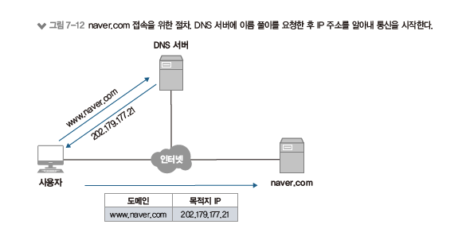
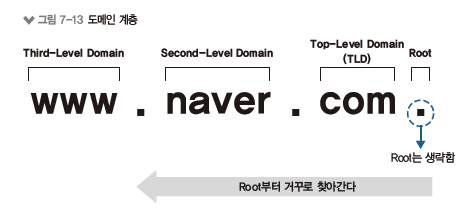
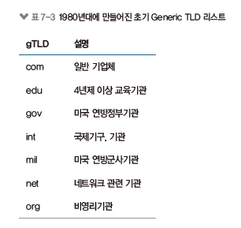
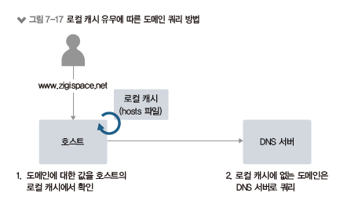
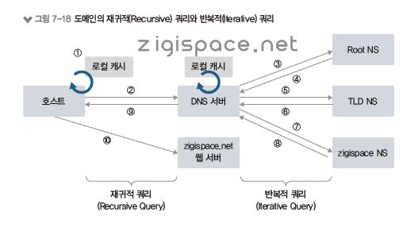
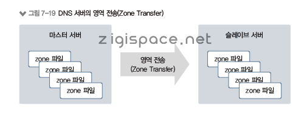
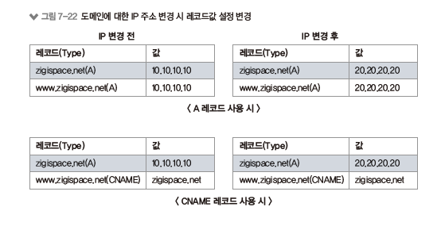
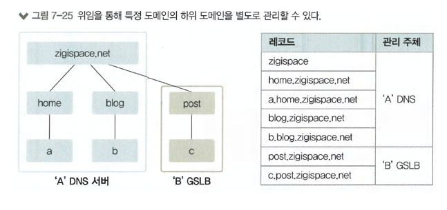

# DNS
#### 네트워크 프로토콜
1. 데이터 프로토콜 
&nbsp;-&nbsp;실제로 데이터를 실어나르는 프로토콜
2. 컨트롤 프로토콜 
&nbsp;-&nbsp;통신에 직접 관여하지 않지만 처음 통신 관계를 맺거나 유지하는 역할을 하는 프로토콜 
&nbsp;-&nbsp;ARP, ICMP, DNS 등 

## DNS 소개
 
1. 사용자가 웹 브라우저에 naver.com을 입력하면 DNS 서버에 naver.com의 주소가 무엇인지 질의한다.
2. DNS 서버는 naver.com의 IP 주소가 202.179.177.21이라고 사용자에게 알려준다.
3. 사용자는 DNS로 응답받은 202.179.177.21 이라는 IP 주소를 이용해 실제 naver.com에 접속한다.

## DNS 구조와 명명 규칙
 

* 도메인은 역트리 구조로 최상위 루트부터 Top-Level 도메인, Second-Level 도메인, Third-Level 도메인으로 원하는 주소를 단계적으로 찾아간다.
* Third.second.top.과 같은 형태이고, 맨 뒤에 루트는 생략된다.
* 도메인 계층은 최대 128계층까지 구성 가능하고, 계층별 길이는 최대 63byte, 전체 도메인 네임의 길이는 최대 255byte까지 사용할 수 있다.
* 알파벳, 숫자, "-"만 사용 가능(대소문자 구분 없음)

### 루트 도메인
* 루트 도메인은 도메인을 구성하는 최상위 영역이다.
* DNS 서버는 도메인에 대한 값을 직접 갖고 있거나 캐시에 저장된 정보를 이용해 응답한다.
    * DNS 서버에 해당 도메인에 대한 정보가 없으면 루트 DNS에 쿼리한다.
* 루트 DNS는 전 세계에 13개가 있고 DNS 서버를 설치하면 루트 DNS의 IP 주소를 기록한 힌트(Hint) 파일을 가지고 있어 별도 설정이 필요하지 않다.

#### Top-Level Domain(TLD)
최상위 도메인 TLD는 IANA에서 구분한 6가지 유형으로 구분된다.

* Generic(gTLD)
* country-code(ccTLD)
* sponsored(sTLD)
* infrastructure
* generic-restricted(grTLD)
* test(tTLD)

##### Generic TLD(gTLD)
gTLD는 특별한 제한 없이 일반적으로 사용되는 최상위 도메인이며 세 글자 이상으로 구성된다.

 

##### Country Code TLD(ccTLD)
* ccTLD는 국가 최상위 도메인으로 ISO 3166 표준에 의해 규정된 두 글자의 국가 코드를 사용한다.
    * ex) 우리나라 'kr'
* 일반적으로 ccTLD를 사용하는 경우, Second Level TLD에는 사이트 용도에 따른 코드를 사용한다.
    * ex) 일반 회사 'co.kr', 정부기관 'go.kr'

##### Sponsored(sTLD)
* sTLD는 특정 목적을 위한 스폰서를 두고 있는 최상위 도메인이다.
* 스폰서는 특정 민족공동체, 전문가 집단, 지리적 위치 등이 속할 수 있다.
* sTLD 종류는 '.aero', '.asia', '.edu', '.museum' 등이 있다.

##### Infrastructure
* 운용상 중요한 인프라 식별자 공간을 지원하기 위해 전용으로 사용되는 최상위 도메인이다.
* Infrastructure에 속하는 '.arpa'는 인터넷 안정성을 유지하기 위해 새로운 모든 인프라 하위 도메인이 배치될 도메인 공간 역할을 한다.
* IPv4 주소를 도메인 이름에 매핑하는 역방향 도메인에서 사용한다.

##### Generic-restricted(grTLD)
* grTLD는 특정 기준을 충족하는 사람이나 단체가 사용할 수 있는 최상위 도메인이다.
* grTLD의 종류에는 '.biz', '.name', '.pro'가 있다.

##### Test(tTLD)
* tTLD는 IDN(Internationalized Domain Names) 개발 프로세스에서 테스트 목적으로 사용하는 최상위 도메인이다.
* tTLD의 종류에는 '.test'가 있다.

## DNS 동작 방식
* 도메인을 IP 주소로 변환하려면 DNS 서버에 도메인 쿼리하는 과정이 필요하다.
* hosts 파일 - 로컬에서 도메인과 IP 주소를 관리하는 파일을 말한다.
	* hosts 파일에 도메인과 IP 주소를 설정해두면 해당 도메인 리스트는 항상 DNS 캐시에 저장된다.
	
### 동작 흐름 (클라이언트 관점)
1. 도메인을 쿼리하면 DNS 서버에 쿼리를 하기 전 로컬에 있는 DNS 캐시 정보를 먼저 확인한다.
-> 동일한 도메인을 매번 질의하지 않고 캐시를 통해 성능을 향상시키기 위함이다.
-> DNS 캐시 정보
&nbsp;-&nbsp;기존 DNS 조회를 통해 확인한 동적 DNS 캐시
&nbsp;-&nbsp;hosts 파일에 저장되어 있는 정적 DNS 캐시
2. DNS 캐시 정보에 필요한 도메인 정보가 없으면 DNS 서버로 쿼리를 수행한다.
3. DNS 서버로부터 응답을 받으면 그 결과를 캐시에 먼저 저장한다.

 

### 동작 흐름 (DNS 시스템 관점)
* DNS는 분산된 데이터베이스로 DNS 서버는 기본적으로 루트 DNS 관련 정보를 가지고 있다.
* 클라이언트의 쿼리가 자신에게 없는 정보라면 루트 DNS에 쿼리하고 루트 DNS에서는 쿼리한 도메인의 TLD 값을 확인해 해당 TLD 값을 관리하는 DNS가 어디인지 응답한다.

1. 'zigispace.net' 이라는 도메인을 클라이언트가 DNS 서버에 쿼리한다.
2. DNS 서버는 루트 DNS에 쿼리한다.
3. 루트 DNS는 .net에 대한 정보를 관리하는 DNS 주소 정보를 DNS 서버에 응답한다.
4. 응답 받은 DNS 서버는 .net을 관리하는 DNS 서버에 'zigispace.net'에 대해 쿼리한다.
5. .net을 관리하는 DNS 서버는 다시 'zigispace.net'을 관리하는 DNS 관련 정보를 처음 DNS 서버에 응답한다.
6. DNS 서버는 마지막으로 'zigispace.net'을 관리하는 DNS에 쿼리하고 'zigispace.net'에 대한 최종 결과값을 받는다.
7. 처음 쿼리를 받은 DNS 서버는 이 정보를 클라이언트에 응답한다.  

* 재귀적 쿼리(Recursive Query)
&nbsp;-&nbsp;호스트가 DNS 서버에 질의했던 방식 
&nbsp;-&nbsp;재귀적 쿼리는 쿼리를 보낸 클라이언트에 서버가 최종 결괏값을 반환하는 서버 중심 쿼리 
&nbsp;-&nbsp;클라이언트와 로컬 DNS 간에서 사용 
* 반복적 쿼리(Iterative Query)
&nbsp;-&nbsp;DNS 서버가 루트 NS와 TLS NS, zigispace NS에 질의한 방식 
&nbsp;-&nbsp;반복적 쿼리는 최종값을 받을 때까지 클라이언트에서 쿼리를 계속 진행하는 방식 
&nbsp;-&nbsp;로컬 DNS와 서버와 상위 DNS 구간에서 사용하며, 이때 로컬 DNS는 클라이언트로 동작해 상위 DNS에 반복적으로 쿼리 

 

## 마스터와 슬레이브
* DNS 서버는 도메인에 대한 존(Zone) 파일을 직접 관리 여부를 기준으로 존 파일을 직접 생성해 도메인 관련 정보를 관리하면 마스터 서버, 그렇지 않으면 슬레이브 서버라고 한다.
* 슬레이브 서버는 마스터에 만들어진 존 파일을 복제하는데 이 과정을 '영역 전송(Zone Transfer)' 라고 한다.
* 마스터 서버는 도메인 영역을 생성하고 레코드를 직접 관리하지만 슬레이브 서버는 마스터 서버에 설정된 도메인이 가진 레코드값을 정기적으로 복제한다.

 

* DNS 서버의 이중화 방식
	* 액티브-스탠바이(Active-Standby)나 액티브-액티브(Active-Active) 형태로 구성되어 있지 않다.
	* 만료 시간 : 마스터 서버에 문제가 발생한 후 슬레이브 서버까지도 정상적인 응답이 불가능한 상태로 전환되는 시간을 말한다. (SOA 레코드에 설정)
		* 만료 시간 안에 슬레이브 서버가 마스터 서버에서 존 정보를 받아오지 못하면 슬레이브의 존 정보를 사용할 수 없다.
		* 만료 시간 안에 마스터 서버를 복구하거나 슬레이브 서버를 마스터러 전환해야만 서비스 장애를 막을 수 있다.

## DNS 주요 레코드
### A(Ipv4) 레코드
* A 레코드는 기본 레코드로 도메인 주소를 IP 주소로 변환하는 레코드이다.
* 한 개의 도메인 주소와 한 개의 IP 주소가 1:1로 매핑되어 있다.
* 동일한 도메인을 가진 A 레코드를 여러 개 만들어 서로 다른 IP 주소와 매핑할 수 있다.
	* 반대로 다수의 도메인에 동일한 IP를 매핑할 수 있다.

### AAAA(IPv6) 레코드
* A 레코드와 동일한 역할을 하며, IPv6 주소 체계에서 사용된다.

### CNAME(Canonical Name) 레코드
* CNAME 레코드는 별칭 이름을 사용하게 해주는 레코드이다.
* 레코드값에 도메인 주소를 매핑한다.
* CNAME 레코드에 설정된 도메인 정보를 확인하고 그 도메인 정보를 내부적으로 다시 질의한 결과 IP 값을 응답한다.
* ex. www

 

### SOA(Start Of Authority) 레코드
* 도메인 영역에 대한 권한을 나타내는 레코드이다. (필수 항목)
* 현재 네임 서버가 이 도메인 영역에 대한 관리 주체임을 의미하므로 해당 도메인에 대해서는 다른 네임 서버에 질의하지 않고 직접 응답한다.
* 도메인 동기화에 필요한 타이머 값이나 TTL 값과 함께 도메인의 네임 서버나 관리자 정보도 SOA 레코드에서 설정한다.

### NS(Name Server) 레코드
* 도메인에 대한 권한이 있는 네임 서버 정보를 설정하는 레코드이다.
* 하위 도메인에 대한 권한을 다른 네임 서버로 위임하는 역할로도 많이 사용된다.

### MX(Mail eXchange) 레코드
* 메일 서버를 구성할 때 사용되는 레코드이다.
* 우선순위 값을 이용해 다수의 MX 레코드를 선언할 수 있다.
* 우선순위가 높은 서버로 메일을 보내고 실패하면 다음 순서의 MX 레코드의 메일 서버에서 처리한다.

### PTR(Pointer) 레코드
* IP 주소에 대한 질의를 도메인 주소로 응답하기 위한 레코드이다.
* 하나의 IP 주소에 대해 하나의 도메인 주소만 가질 수 있다.
* PTR 레코드는 주로 화이트 도메인 구성용으로 사용된다.

### TXT(TeXT) 레코드
* 도메인에 대한 설명과 같이 간단한 텍스트를 입력할 수 있는 레코드이다.
* 화이트 도메인을 위한 SPF 레코드로 사용할 수도 있다.
* 공백을 포함할 수 있으며 대소문자를 구분하고 최대 255자까지 사용할 수 있다.

## DNS에서 알아두면 좋은 내용
### 도메인 위임(DNS Delegation)
* 자신이 가진 도메인 관리 권한을 다른 곳으로 일부 위임해 위임한 곳에서 세부 레코드를 관리하도록 하는 것이다.
* CDN을 이용하거나 GSLB를 사용하는 것이 대표적인 경우이다.
* 특정 계층의 레코드를 위임하면 해당 레코드의 하위 계층도 함께 위임된다.

 
* 위의 그림에서 post 영역을 'B' GSLB로 위암하려면 해당 영역을 위임하겠다는 레코드 설정이 'A' DNS 서버에 들어가야 한다.

### TTL
* TTL(Time To Live)은 DNS에 질의해 응답받은 결괏값을 캐시에서 유지하는 시간을 뜻한다.
* 장점 : DNS 재귀적 쿼리로 인한 응답 시간을 많이 줄일 수 있고 네트워크 응답 시간이 단축된다.
* 단점 : DNS에서 해당 도메인 관련 정보가 변경되었을 때, TTL 값이 크면 DNS 정보 갱신이 지연된다.
반대로 TTL 값이 너무 작으면 DNS 정보 갱신이 빨라져 DNS 서버 부하가 증가한다.

### 화이트 도메인
* 한국인터넷진흥원(KISA)에서 불법적인 방법으로 발송되는 스팸메일 차단활동을 위해 정상적인 도메인을 인증, 관리하는 제도
* RBL(Realtime Blackhole List) : 불법적인 스팸메일을 발송하는 사이트를 실시간으로 관리하는 블랙리스트
* 화이트 도메인을 등록하려면 사전에 해당 도메인에 SPF 레코드가 설정되어야 한다.
    * SPF 레코드를 통해 수신 측 메일서버에서 발송된 메일이 실제 메일 서버에 등록된 정보와 일치하는지 확인할 수 있다.

### 한글 도메인
* 사용자가 도메인을 한글로 등록하고 사용하기 위해 DNS에서는 해당 한글을 "퓨니코드"로 변경하고 이 퓨니코드를 DNS에 도메인을 생성해야 한다.
    * 퓨니코드(Punycode) : 한글 뿐만 아니라 영어가 아닌 자국어 도메인을 사용할 수 있도록 해주는 표준 코드이다. 유니코드 문자열을 인코딩하는 것이므로 유니코드가 지원하는 모든 언어를 사용할 수 있다.

이미지 출처 : https://zigispace.net/1123
