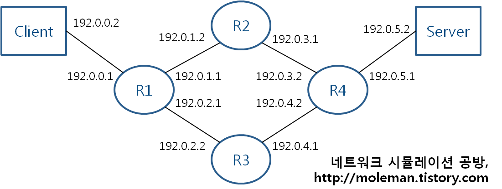
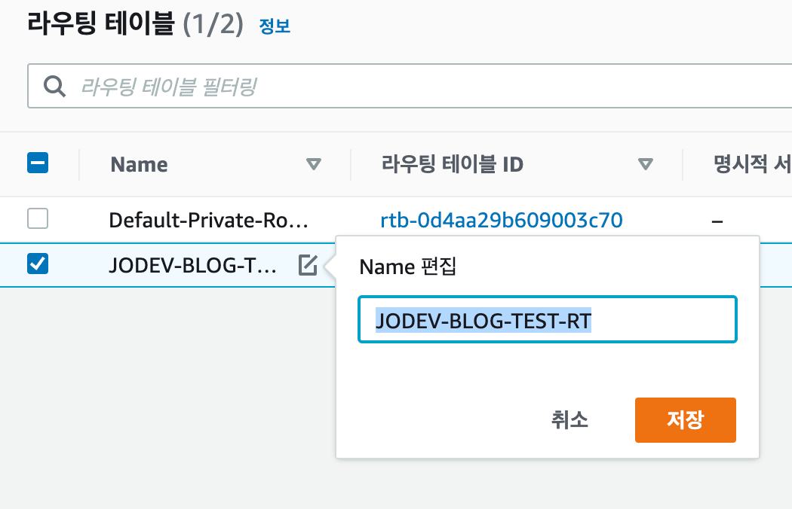

# Server network

이번 챕터에서는 약간 네트워크 엔지니어와 서버 엔지니어가 이해하는 입장이 많이 다르다.<br>
서로의 역할이 겹치는 부분이 있어서 서버 네트워크에 대해 알아보려고 한다.<br>

우리(서버개발자)는 Spring,Next.JS, Django 등을 활용해 서비스를 만든다.<br>
이렇게 만들어진 서비스를 사용자에게 제공하려면 네트워크와 연결하고 이를 통해 서비스를 제공한다.<br>

사용자가 사용하는 인터넷은 와이파이 라우터 같은 ISP(Internet Service Provider)를 통해 인터넷에 연결된다.<br>
이 ISP 서버와 우리 서버를 연결해야 사용자가 우리 서비스를 사용할 수 있다.<br>

이때 서버 개발자가 네트워크와 연결하기 위해 알아햐 할건.<br>

- 서버 네트워크 구성:
    - 서버의 IP 주소, 서브넷 마스크, 게이트웨이, DNS 설정 등의 기본 네트워크 설정 방법을 이해한다.
- 서버의 라우팅 테이블:
    - 패킷의 경로를 결정하는 라우팅 테이블의 구성과 관리 방법을 학습한다.
- 네트워크 명령어:
    - 서버의 네트워크 상태를 확인하거나 문제를 진단하기 위한 기본적인 명령어들을 알아본다.
- 서버의 방화벽:
    - 외부로부터의 접근을 제어하는 방화벽 설정과 관리 방법을 이해한다.
- 서버의 포트 포워딩:
    - 특정 포트로 들어오는 트래픽을 다른 IP나 포트로 전달하는 방법을 학습한다.

등등이 있다.


----

## 서버 네트워크 구성

#### 서버의 IP 주소

- IP 주소는 서버의 고유한 주소로, 다른 장비들이 이 주소를 통해 서버에 접근할 수 있다.

#### 서브넷 마스크

- 서브넷 마스크는 IP 주소의 네트워크 부분과 호스트 부분을 구분한다.

#### 게이트웨이

- 게이트웨이는 서버가 외부 네트워크와 통신할 때 사용하는 라우터의 IP 주소.

#### DNS 설정

- DNS(Domain Name System)는 도메인 이름을 IP 주소로 변환해주는 시스템.

#### 기본 네트워크 설정

- MAC 주소, MTU 설정, 네트워크 인터페이스 설정 등의 기본 네트워크 설정이 있다.

#### 리눅스 서버 네트워크

- 리눅스는 CLI 기반의 서버이다.<br>
- CentOs , Ubuntu , Debian 등등이 있다.<br>
- 각각의 설정 파일을 통해 인터페이스 설정을 관리할 수 있다.

----

## 네트워크 설정 파일

예를 들면, `/etc/sysconfig/network-scripts`
경로에는 리눅스 서버의 네트워크 인터페이스 설정 파일들이 위치해 있다. 이 설정 파일들은 각 네트워크 인터페이스의 동작 방식을 정의하며, 여러
가지 설정을 통해 네트워크 연결을 구성하고 관리할 수 있다.

주요 설정 항목은 다음과 같다:

```
TYPE: 
  → 인터페이스의 타입을 지정한다. 예: Ethernet, Bridge, Bond 등.
BOOTPROTO: 
  → 부팅 시 사용할 프로토콜을 지정한다. 주로 `dhcp` (동적 IP 할당) 또는 `static` (정적 IP 할당)을 사용한다.
ONBOOT: 
  → 부팅 시 해당 네트워크 인터페이스를 자동으로 활성화할지 여부를 지정한다. `yes` 또는 `no` 값을 가진다.
IPADDR: 
  → 인터페이스에 할당할 IP 주소를 지정한다.
NETMASK: 
  → 서브넷 마스크를 지정한다.
GATEWAY: 
  → 기본 게이트웨이의 IP 주소를 지정한다.
DNS1 및 
  → **DNS2**: DNS 서버의 IP 주소를 지정한다. `DNS1`은 주 DNS 서버, `DNS2`는 보조 DNS 서버를 의미한다.
HWADDR: 
  → 네트워크 카드의 MAC 주소를 지정한다.
USERCTL: 
  → 일반 사용자가 이 네트워크 인터페이스를 제어할 수 있게 할지의 여부를 지정한다.
MTU: 
  → Maximum Transmission Unit의 값을 지정한다. 패킷의 최대 크기를 의미한다.
```

이 외에도 다양한 설정 항목이 있으며, <br>
사용하는 리눅스 배포판이나 네트워크 환경에 따라 추가적인 설정이 필요할 수 있다.<br>
설정 파일을 수정한 후에는 네트워크 서비스를 재시작하거나 인터페이스를 다시 활성화해야 변경 사항이 적용된다.<br>

> ONBOOT 의 경우 네트워크 인터페이스의 활성화 여부인데. <br>
> 이를 `no` 로 설정하면 서버가 재부팅되어도 해당 인터페이스는 활성화되지 않는다.<br>
> 활성화 되지 않으면 인터넷에 연결되지 않는다.<br>


> 예를 들어 서버에 2개의 네트워크 인터페이스가 있고,<br>
> 하나는 외부 네트워크와 연결하고, 다른 하나는 내부 네트워크와 연결한다고 가정하자.<br>
> 이때 외부 네트워크와 연결된 인터페이스는 `ONBOOT`을 `yes`로 설정하고,<br>
> 내부 네트워크와 연결된 인터페이스는 `ONBOOT`을 `no`로 설정한다.<br>
> 이렇게 하면 서버가 재부팅되어도 내부 네트워크와 연결된 인터페이스는 활성화되지 않으므로,<br>
> 외부 네트워크와 연결된 인터페이스만 활성화된다.<br>

----

```이 사이에 각 설정 부 소개가 있지만 생략한다. ```

----

## 서버의 라우팅 테이블

> 라우팅 테이블은 서버나 라우터가 패킷을 어디로 전송할지 결정하는 정보를 담은 테이블이다. <br>
> 서버에서도 IP , 서브넷 마스크 , 기본 게이트웨이의 IP등을 입력하면 디폴트 라우팅 테이블이 생성된다.<br>

</img>

이렇게 어뎁터가 2개 이상 있을때에는 디폴트 라우팅은 사용할 수 없다.<br>

디폴트 라우팅은 하나의 네트워크 인터페이스에만 적용되기 때문이다.<br>

프론트 서버의 경우 외부 네트워크와 연결된 인터페이스에만 디폴트 라우팅을 적용하고,<br>
내부 네트워크와 연결된 인터페이스에는 디폴트 라우팅을 적용하지 않는다.<br>
> 프론트 서버는 디폴트를 써도 되는 이유는 <br>

백엔드 서버의 경우 위에서도 한번 말했지만 여러 NIC가 있을 수도 있기 때문에<br>
디폴트 라우팅을 쓸 수 없다.<br>

#### 물리적인 여러 NIC:

- 서버에 두 개 이상의 물리적인 네트워크 카드가 설치되어 있을 수 있다. 각각의 카드는 다른 네트워크에 연결될 수 있다.

#### 가상 네트워크 인터페이스:

- 가상화 기술을 사용하는 서버에서는 하나의 물리적 NIC를 여러 개의 가상 네트워크 인터페이스로 분할하여 사용할 수 있다.

</img>

#### 라우팅 테이블 항목

- 목적지 네트워크 : 10.10.20.0
- 서브넷 : 24
- 게이트웨이 : 10.10.10.1
- 인터페이스 : eth1
- 우선순위 : 10

> 예를 들어 목적지가 10.10.20.10 일때 목적지 네트워크는 10.10.20.0 이고 서브넷은 24 일때.<br>
> 라우팅 테이블이 커버하는 목적지 범위는 10.10.20.0 ~ 255 사이의 값들이 된다.<br>
> 10.10.20.10는 10.10.20.0 ~ 255 범위에 포함되어 라우팅을 적용한다.

인터페이스는 서버의 NIC 카드를 의미한다.<br>
어느 물리적인 경로로 패킷을 전송할지를 결정하는 항목이다.<br>

우선순위는 라우팅 테이블의 우선순위를 의미한다.<br>
라우팅 테이블이 여러개 존재 할때 우선순위가 높은 테이블을 먼저 적용한다.<br>

이건 클라우드 , 운영체제별로 관리할 수 있다.
이때 영구적, 일시적으로 관리할 수 있다.<br>

-----

## 네트워크 명령어

#### ifconfig

> 네트워크 인터페이스의 상태를 확인하거나 인터페이스를 활성화/비활성화하는 명령어이다.<br>

#### ping

> 네트워크 상태를 확인하는 명령어이다. 대상 호스트가 네트워크에 연결되어 있는지 확인할 수 있다.<br>

#### netstat

> 네트워크 연결, 라우팅 테이블, 인터페이스 상태 등의 정보를 출력하는 명령어이다.<br>

#### traceroute

> 패킷이 목적지까지 도달하는 데 거치는 경로를 표시하는 명령어이다.<br>

#### nslookup

> 도메인 이름을 IP 주소로 변환하거나 그 반대의 작업을 수행하는 명령어이다.<br>

#### route

> 라우팅 테이블을 확인하거나 수정하는 명령어이다.<br>

#### arp

> ARP(Address Resolution Protocol) 테이블을 확인하는 명령어로, IP 주소와 MAC 주소 간의 매핑 정보를 보여준다.<br>
