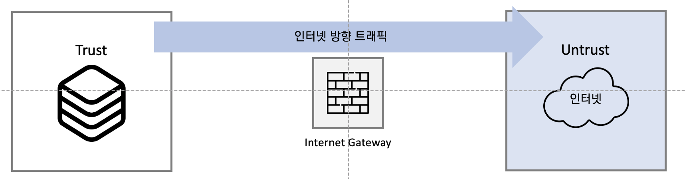

## 9장 보안
-----------------------------------
-----------------------------------
### 1. 보안의 개념과 정의
#### &nbsp; 1) 정보 보안의 정의
##### &nbsp; &nbsp;  - 외부에서 정보가 저장된 시스템을 사용하지 못하게 하는 것
##### &nbsp; &nbsp; - 유출 시도에 맞서 적절히 보호, 운영하기 위한 작업과 정보가 내부에서 유출되거나 남용되는 것을 막는 것
 

#### &nbsp; 2) 보안의 필수 3요소
##### &nbsp; &nbsp;  - 기밀성
##### &nbsp; &nbsp;  &nbsp; : 인가되지 않은 사용자가 정보를 보지 못하게 하는 모든 작업
##### &nbsp; &nbsp; &nbsp; : 암호화 작업
##### &nbsp; &nbsp; - 무결성
##### &nbsp; &nbsp;  &nbsp; : 정확하고 완전한 정보 유지에 필요한 모든 작업
##### &nbsp; &nbsp; &nbsp; : 정보에 변경이 가해졌을 때, 그것을 파악해 잘못된 정보가 전달되거나 유지되지 못하게 하는 것
##### &nbsp; &nbsp; &nbsp; : 해시 함수를 이용해 변경 여부를 파악하는 것 ex) MD5
##### &nbsp; &nbsp; - 가용성
##### &nbsp; &nbsp; &nbsp; : 정보가 필요할 때, 접근을 허락하는 일련의 작업
 

> ##### 필수 3요소 이외의 정보 보안 활동
> ##### 진정성, 책임성, 부인 방지, 신뢰성 유지
 

#### &nbsp; 3) 네트워크의 정보 보안
> ##### 1차 목표 : 정보 서비스를 정상적으로 구동할 수 없게 만드는 행위를 막는 것
> ##### 2차 목표 : 정보의 유출 (복제, 이동)을 막는 것
##### &nbsp; &nbsp; - 네트워크 보안의 발전
##### &nbsp; &nbsp; &nbsp; : BOTTOM-UP 형식으로 발전
 

#### &nbsp; 4) 네트워크 보안의 주요 개념
 &nbsp; &nbsp; &nbsp; 
##### &nbsp; &nbsp; - 트러스트(Trust) 네트워크
##### &nbsp; &nbsp; &nbsp; : 외부로부터 보호받아야 할 네트워크
##### &nbsp; &nbsp; - 언트러스트(Untrust) 네트워크
##### &nbsp; &nbsp; &nbsp; : 신뢰할 수 없는 외부 네트워크
##### &nbsp; &nbsp; - DMZ 네트워크
##### &nbsp; &nbsp; &nbsp; : 운영하는 내부 네트워크이지만 신뢰할 수 없는 외부 사용자에게 개방해야 하는 서비스 네트워크
 

##### &nbsp; [트래픽 방향과 용도에 따른 네트워크 보안 분류]
##### &nbsp; &nbsp; - 인터넷 시큐어 게이트 웨이(Internet Secure Gateway)

##### &nbsp; &nbsp; &nbsp; : 트러스트(또는 DMZ) 네트워크에서 언트러스트 네트워크로의 통신을 통제
 

##### &nbsp; &nbsp; - 데이터 센터 시큐어 게이트 웨이(Data Center Secure Gateway)

##### &nbsp; &nbsp; &nbsp; : 언트러스트 네트워크에서 트러스트(또는 DMZ)로의 통신
 

#### &nbsp; 5) 네트워크 보안 정책 수립에 따른 분류
##### &nbsp; &nbsp; - 화이트리스트(White List)
##### &nbsp; &nbsp; &nbsp; : 방어에 문제가 없다고 명확히 판단되는 통신만 허용하는 방식
##### &nbsp; &nbsp; - 블랙리스트(Black List)
##### &nbsp; &nbsp; &nbsp; : 공격이라고 명확히 판단되거나 문제가 있었던 IP 리스트나 패킷 리스트를 기반으로 데이터베이스를 만들고 그 정보를 이용해 방어하는 방식
 

#### &nbsp; 6) 정탐, 오탐, 미탐(탐지 에러 타임)
##### &nbsp; &nbsp; - 공격 데이터베이스에 따른 공격과 악성 탐지 기법
|  | 공격 상황 | 정상 상황 |
|:---:|:---:|:---:|
| 공격 인지 (공격 알람) | True Positive   (정상 탐지)| False Positive   (오 탐지) | 
| 정상 인지 (공격 알람 없음) | False Negative   (미 탐지)| True Negative   (정상 탐지) | 
 

### 2. VPN
#### &nbsp; 1) VPN 이란?
##### &nbsp; &nbsp; - Virtual Private Network 약자
##### &nbsp; &nbsp; - 물리적으로 전용선이 아닌 공중망을 이용해 논리적으로 직접 연결한 것처럼 망을 구성하는 기술
##### &nbsp; &nbsp; - 터널 (Tunnel)
##### &nbsp; &nbsp; &nbsp; : 논리적으로 직접 연결된 것 처럼 만들어주는 통로
 

#### &nbsp; 2) IPSEC VPN 과 SSLVPN
##### &nbsp; &nbsp; - IPSEC VPN
 &nbsp; &nbsp; &nbsp; 
##### &nbsp; &nbsp; &nbsp; : 본사-지사처럼 네트워크 대 네트워크 연결에 사용
##### &nbsp; &nbsp; - SSLVPN
 &nbsp; &nbsp; &nbsp; 
##### &nbsp; &nbsp; &nbsp; : 개인 사용자가 본사 네트워크로 접속하는 경우 사용
##### &nbsp; &nbsp; &nbsp; : 네트워크 대 단말기, 네트워크 대 PC
 

#### &nbsp; 3) VPN 동작 방식
##### &nbsp; &nbsp; - 터널링 기법
##### &nbsp; &nbsp; &nbsp; : 가상 네트워크를 만들어주는 장비로 패킷을 터널링 프로토콜로 감싸 통신하는 기법
##### &nbsp; &nbsp; - VPN 3가지 형태
##### &nbsp; &nbsp; &nbsp; : Host to Host 통신 보호
##### &nbsp; &nbsp; &nbsp; : Network to Network 통신 보호
##### &nbsp; &nbsp; &nbsp; : Host to Network 통신 보호
##### &nbsp; &nbsp; - Host to Host 통신
 &nbsp; &nbsp; &nbsp; 
##### &nbsp; &nbsp; &nbsp; : 두 호스트 간에 직접 VPN 터널을 연동하는 기법
##### &nbsp; &nbsp; - Network to Network 통신
 &nbsp; &nbsp; &nbsp; 
##### &nbsp; &nbsp; &nbsp; : 본사-지사 같은 특정 네트워크를 가진 두 종단을 연결하는 경우
##### &nbsp; &nbsp; &nbsp; : IPSEC 프로토콜 스택이 가장 많이 사용
##### &nbsp; &nbsp; - Host to Network 통신
 &nbsp; &nbsp; &nbsp; 
##### &nbsp; &nbsp; &nbsp; : 모바일 사용자가 일반 인터넷망을 통해 사내망으로 연결하는 경우
##### &nbsp; &nbsp; &nbsp; : SSL 프로토콜이 범용적으로 사용