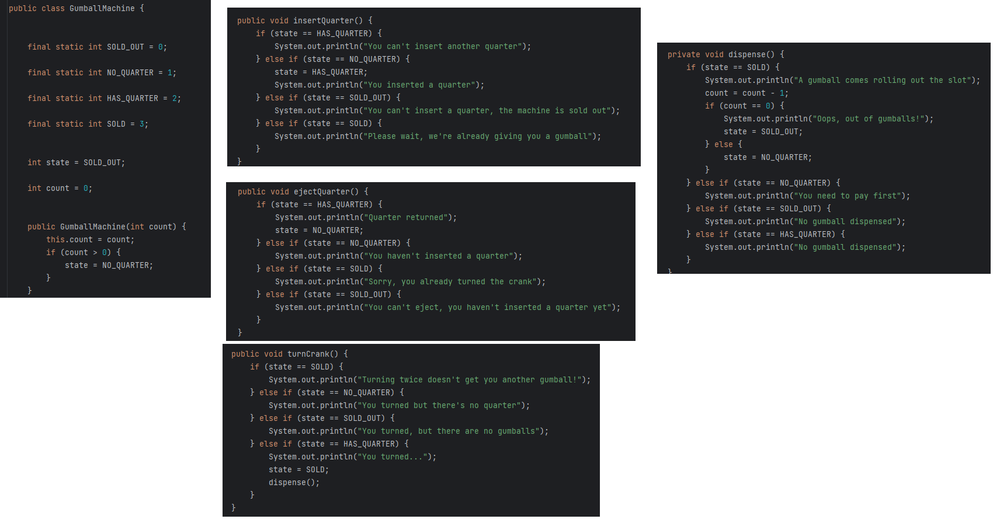
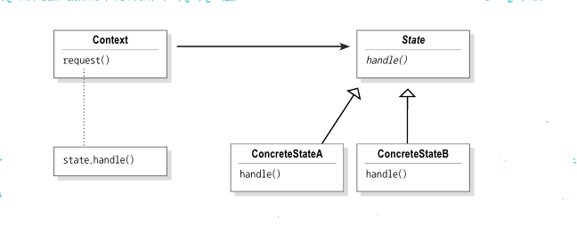
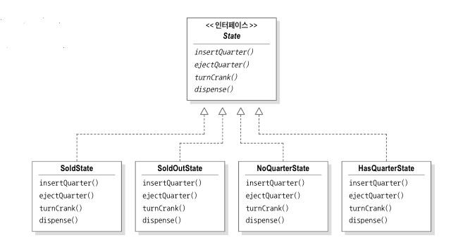
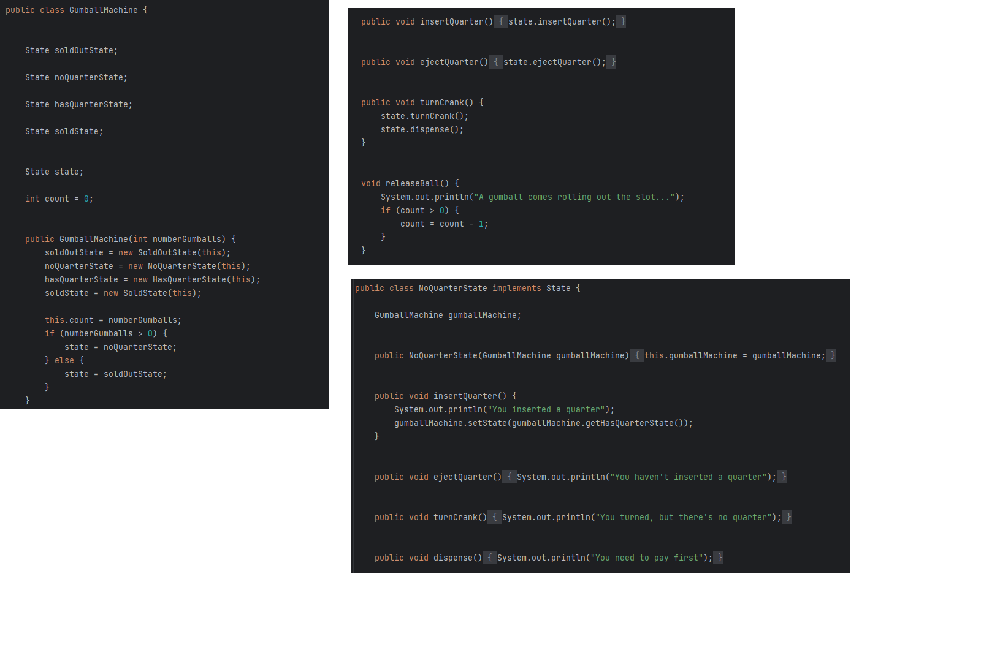
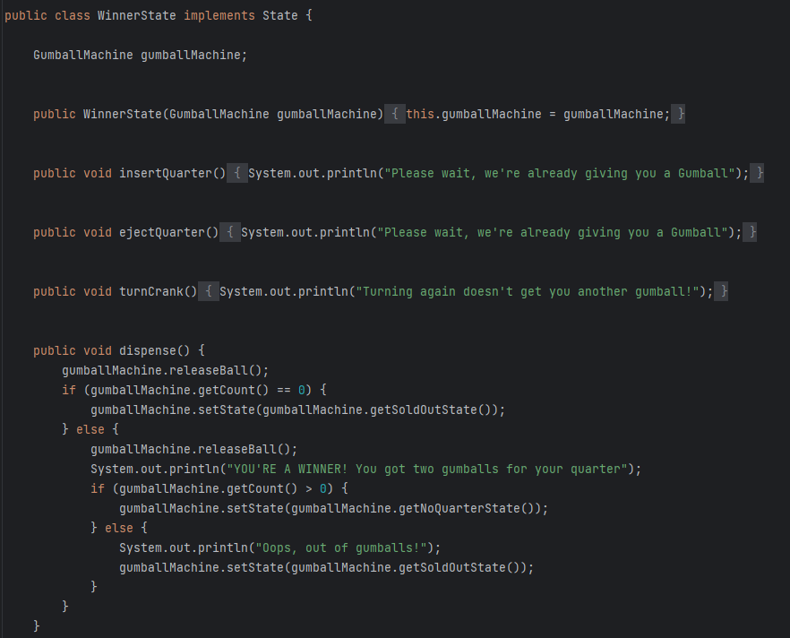

## State Pattern *feat.뽑기기계*

### 1-1. 뽑기 기계 구조

뽑기 기계는 총 4가지 상태가 있습니다. 그리고 각 상태에서 적절히 수행되어야 할 행동이 있습니다.
 
---

### 1-2. 다음주 퇴사 예정자가 작성한 뽑기 기계 코드

이렇게 개발된 뽑기 기계가 우리의 어린시절 뽑기 기계처럼 영원히 변할 일이 없다면
위와 같이 작성한 코드는 문제가 되지 않습니다.
하지만 10% 확률로 당첨 되어 상품을 2개 내어줘야 할 경우 위의 코드를 변경하는 행위는 상당히 귀찮은 일이며 많은 버그 상황을 발생 시킬 수 있습니다. 

---

### 2-1. 변화에 유연한 뽑기 기계 개발하기

State Pattern을 활용하면 우리는 앞에서 발견한 문제점을 해결하고
변화에 유연한 뽑기 기계를 만들 수 있습니다.
우리는 상태를 int형 변수가 아닌 객체를 통해 관리하고 각 상태에서 일어날 수 있는 행동을 해당 객체들에게 위임할 예정입니다.

---

### 2-2. 당첨상태 추가하기 + 비교

앞서 언급한 당첨 이벤트를 새로 개발한 뽑기 기계 코드에 적용해 봅시다.

우리는 State 인터페이스를 구현한 WinnerState 클래스를 추가만 하면 됩니다.
처음의 코드와 비교해 보았을때 변화에 훨씬 유연한 구조가 된것을 알 수 있습니다.

### 3. 토의
>1. dispense메소드가 호출되는 문제점을 어떻게 해결할 수 있을까요?
>2. State 클래스 : 인터페이스 VS 추상 클래스
>3. 전략 패턴과 상태 패턴의 비슷한 점과 명확히 구분되는 차이점은 무엇일까요?
