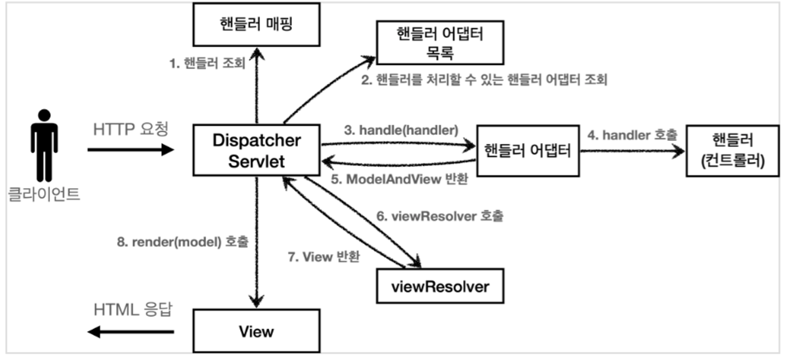
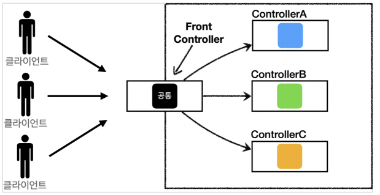

## 복합 패턴

> 복합 패턴이란<br>
반복적으로 생길 수 있는 일반적인 문제를 해결하는 용도로 2개 이상의 패턴을 결합해서 사용하는 것을 뜻한다.

## MVC 패턴

> MVC란<br>
MVC(모델-뷰-컨트롤러)는 사용자 인터페이스, 데이터 및 논리 제어를 구현하는데 널리 사용되는 소프트웨어 디자인 패턴이다. 소프트웨어의 비즈니스 로직과 화면을 구분하는데 중점을 두고 있다.

<br>
<div style="text-align:center">
    
</div>
<br>

구성
1. Model<br>
&nbsp;-&nbsp; 모든 데이터, 상태와 애플리케이션 로직이 들어 있다. 뷰와 컨트롤러에서 모델의 상태를 조작하거나 가져올 때 필요한 인터페이스를 제공한다.
2. View<br>
&nbsp;-&nbsp; 모델을 표현하는 방법을 제공한다. 일반적으로 화면에 표시할 때 필요한 상태와 데이터는 모델에서 직접 가져온다.
3. Controller<br>
&nbsp;-&nbsp; Model과 View 사이에서 데이터 흐름을 제어하는 역할로 사용자로부터 입력을 받으며 입력받은 내용이 모델에게 어떤 의미가 있는지 파악한다.
<br><br>

복합 패턴 - MVC
1. Model<br>
&nbsp;-&nbsp; Observer Pattern : Model의 상태가 변경 되었을 때 Controller 혹은 View에게 이 사실을 알리는데 사용된다.

2. View<br>
&nbsp;-&nbsp; Composite Pattern : View를 구성하는 컴포넌트들은 계층 구조(ex. HTML의 DOM)를 이룬다. 복합객체(Composite)와 단일객체(Leaf)를 동일한 컴포넌트로 취급하여 구현을 단순화 하는 것이 목적이다.

3. Controller<br>
&nbsp;-&nbsp; Strategy Pattern : Controller의 핵심 기능을 인터페이스로 분리하여 View가 이 인터페이스를 통해 Controller를 구성(Composition) 한다. 그렇기 때문에 View는 Controller를 갈아 끼우며 기능을 변경할 수 있다.

<div style="padding-left:25px;">*&nbsp; 필요에 따라 Adapter Pattern을 사용할 수 있다.</div>
<br>

헤드 퍼스트 디자인 패턴 코드 예제
```java
public interface BeatModelInterface {
	// Controller가 Model에게 사용자 입력을 전달할 때 사용하는 메소드
	void initialize();
	void on();
	void off();
	void setBPM(int bpm);

	// View와 Controller가 상태를 알아내거나 Observer로 등록할 때 사용하는 메소드
	int getBPM();
	void registerObserver(BeatObserver o);
	void removeObserver(BeatObserver o);
	void registerObserver(BPMObserver o);
	void removeObserver(BPMObserver o);
}
```
1. Model

```java
public class BeatModel implements BeatModelInterface, Runnable {
	// 2가지 유형의 Observer를 저장한다.
	List<BeatObserver> beatObservers = new ArrayList<BeatObserver>();
	List<BPMObserver> bpmObservers = new ArrayList<BPMObserver>();
	int bpm = 90;
	Thread thread;
	boolean stop = false;
	Clip clip;

	// 비트 트랙을 설정하는 메소드
	public void initialize() {
		try {
			File resource = new File(“clap.wav”);
			clip = (Clip) AudioSystem.getLine(new Line.Info(Clip.class));
			clip.open(AudioSystem.getAudioInputStream(resource));
		}
		catch(Exception ex) {}
	}

	// BPM을 기본값으로 설정하고 비트를 재생하는 스레드를 시작
	public void on() {
		bpm = 90;
		notifyBPMObservers();
		thread = new Thread(this);
		stop = false;
		thread.start();
	}

	// BPM을 0으로 설정하고 비트를 재생하는 스레드를 중지
	public void off() {
		stopBeat();
		stop = true;
	}

	// BPM 값에 맞춰 음악을 시작하고, Observers에게 비트가 시작됐다고 알림
	public void run() {
		while (!stop) {
			playBeat();
			notifyBeatObservers();
			try {
				Thread.sleep(60000/getBPM());
			}
			catch(Exception e) {}
		}
	}

	// BPM 값을 조작하고 Observers에게 BPM이 바뀌었다고 알림
	public void setBPM(int bpm) {
		this.bpm = bpm;
		notifyBPMObserver();
	}
	public int getBPM() {
		return bpm;
	}
}
```

2. View
```java
// DJView는 비트마다 돌리는 연락과 BPM이 바뀌었을 때 돌리는 연락 모두 받을 수 있는 Observer
public class DJView implements ActionListener,  BeatObserver, BPMObserver {
	BeatModelInterface model;
    // Controller는 제어용 인터페이스에서만 쓰임
	ControllerInterface controller;
    // 화면 표시용 구성 요소
    JFrame viewFrame;
    JPanel viewPanel;
	BeatBar beatBar;
	JLabel bpmOutputLabel;

    public DJView(ControllerInterface controller, BeatModelInterface model) {	
		this.controller = controller;
		this.model = model;
		model.registerObserver((BeatObserver)this);
		model.registerObserver((BPMObserver)this);
    }

    // Model의 상태가 변경되면 updateBPM 메소드가 호출됨
	public void updateBPM() {
		if (model != null) {
			int bpm = model.getBPM();
			if (bpm == 0) {
				if (bpmOutputLabel != null) {
        			bpmOutputLabel.setText("offline");
				}
			} else {
				if (bpmOutputLabel != null) {
        			bpmOutputLabel.setText("Current BPM: " + model.getBPM());
				}
			}
		}
	}

    // Model에서 새로운 비트가 연주될 때마다 updateBeat() 메소드가 호출됨
	public void updateBeat() {
		if (beatBar != null) {
			 beatBar.setValue(100);
		}
	}
}
```

```java
// Controller에게 할 일을 알려줌으로써 모델을 제어하는 역할
public class DJView implements ActionListener,  BeatObserver, BPMObserver {
	BeatModelInterface model;
	ControllerInterface controller;
    JLabel bpmLabel;
    JTextField bpmTextField;
    JButton setBPMButton;
    JButton increaseBPMButton;
    JButton decreaseBPMButton;
    JMenuBar menuBar;
    JMenu menu;
    JMenuItem startMenuItem;
    JMenuItem stopMenuItem;

    // 메뉴에 있는 Start나 Stop을 활성화하거나 비활성화하는 메소드
	public void enableStopMenuItem() {
    	stopMenuItem.setEnabled(true);
	}

	public void disableStopMenuItem() {
    	stopMenuItem.setEnabled(false);
	}

	public void enableStartMenuItem() {
    	startMenuItem.setEnabled(true);
	}

	public void disableStartMenuItem() {
    	startMenuItem.setEnabled(false);
	}

    // 사용자가 버튼을 클릭했을 때 호출되는 메소드
    public void actionPerformed(ActionEvent event) {
		if (event.getSource() == setBPMButton) {
			int bpm = 90;
			String bpmText = bpmTextField.getText();
			if (bpmText == null || bpmText.contentEquals("")) {
				bpm = 90;
			} else {
				bpm = Integer.parseInt(bpmTextField.getText());
			}
        	controller.setBPM(bpm);
		} else if (event.getSource() == increaseBPMButton) {
			controller.increaseBPM();
		} else if (event.getSource() == decreaseBPMButton) {
			controller.decreaseBPM();
		}
    }
}
```

3. Controller
```java
public interface ControllerInterface {
	void start();
	void stop();
	void increaseBPM();
	void decreaseBPM();
 	void setBPM(int bpm);
}
```

```java
public class BeatController implements ControllerInterface {
    // Controller는 Model과 View 사이에서 둘을 연결시켜줌
	BeatModelInterface model;
	DJView view;
   
	public BeatController(BeatModelInterface model) {
		this.model = model;
		view = new DJView(this, model);
        view.createView();
        view.createControls();
		view.disableStopMenuItem();
		view.enableStartMenuItem();
		model.initialize();
	}
  
    // 뷰는 메뉴 항목을 활성 또는 비활성 상태로 바꾸는 방법만 알 뿐, 어떤 상황에서 상태를 바꿀지 결정을 내리는 기능은 없다.
	public void start() {
		model.on();
		view.disableStartMenuItem();
		view.enableStopMenuItem();
	}
  
	public void stop() {
		model.off();
		view.disableStopMenuItem();
		view.enableStartMenuItem();
	}
    
	public void increaseBPM() {
        int bpm = model.getBPM();
        model.setBPM(bpm + 1);
	}
    
	public void decreaseBPM() {
        int bpm = model.getBPM();
        model.setBPM(bpm - 1);
  	}
  
    // 사용자가 임의의 BPM을 설정할 때 모델에 바로 연락해서 새로운 BPM을 설정
 	public void setBPM(int bpm) {
		model.setBPM(bpm);
	}
}
```
<br>

MVC를 지키면서 코딩하는 방법
1. Model은 Controller와 View에 의존하지 않아야 한다.<br>
(Model 내부에 Controller와 View에 관련된 코드가 있으면 안된다.)
2. View는 Model에만 의존해야 하고, Controller에는 의존하면 안된다.<br>
(View 내부에 Model의 코드만 있을 수 있고 Controller의 코드가 있으면 안된다.)
3. View가 Model로부터 데이터를 받을 때는 사용자마다 다르게 보여주어야 하는 데이터에 대해서만 받아야 한다.
4. Controller는 Model과 View에 의존해도 된다.<br>
(Controller 내부에는 Model과 View의 코드가 있을 수 있다.)
5. View가 Model로부터 데이터를 받을 때 반드시 Controller에서 받아야 한다.
<br>

MVC의 장점
- 코드의 재사용성 향상
- 유지보수의 용이성
- 유연성과 확장성
- 사용자 인터페이스와 비즈니스 로직의 분리
- 코드의 가독성 및 이해도 향상

MVC의 단점
- 불필요한 코드 복잡성 초래
- 필요 이상의 파일 수 증가
- Massive View Controller 현상 발생 가능성
- Model과 View 간의 의존성 증가
- 작은 규모에는 비호율적인 패턴

<br>

Spring MVC


<br><br>

1. DispatcherServlet (FrontController)<br>
&nbsp;-&nbsp; Client로부터 요청이 들어오면 먼저 DispatcherServlet 호출된다.
2. HandlerMapping<br>
&nbsp;-&nbsp; DispatcherServlet는 요청 URL과 매칭되는 Controller를 찾는 역할을 HandlerMapping에게 요청한다.
3. HandlerAdapter<br>
&nbsp;-&nbsp; URL과 매칭되는 Controller의 비즈니스 로직을 실행할 HandlerAdapter를 찾아 실행한다.<br>
&nbsp;-&nbsp; 비즈니스 로직 실행 결과를 ModelAndView 객체에 담아서 DispatcherServlet에게 리턴한다.
4. ViewResolver<br>
&nbsp;-&nbsp; DispatcherServlet은 ViewResolver를 통해 실행 결과를 보여줄 view를 렌더링한다.

<br>

FrontController Pattern<br>

&nbsp;-&nbsp; 요청이 들어올 때마다 처리해야 하는 필수적인 작업이 있을 경우 코드의 중복이 생기고 이 작업이 누락되었을 경우에는 장애가 발생할 수도 있다.<br>
이를 방지하기 위해 공통으로 처리해야 하는 부분을 FrontController에서 처리하고 그 이후에 요청에 맞는 Controller에게 역할을 전달하는 패턴을 말한다.<br>



<br>

출처
- https://velog.io/@langoustine/%EC%97%AC%EA%B8%B0%EB%8F%84-MVC-%EC%A0%80%EA%B8%B0%EB%8F%84-MVC-MVC-%ED%8C%A8%ED%84%B4%EC%9D%B4-%EB%AD%90%EC%95%BC
- https://youtu.be/ogaXW6KPc8I?si=w2iKxKyc2qnCYhlf
- https://sgc109.github.io/2020/07/18/compound-pattern-feat-mvc/
- https://catsbi.oopy.io/f52511f3-1455-4a01-b8b7-f10875895d5b
- https://velog.io/@hsw0194/Spring-MVC-HandlerMapping의-동작방식-이해하기-1편
- https://jwdeveloper.tistory.com/291