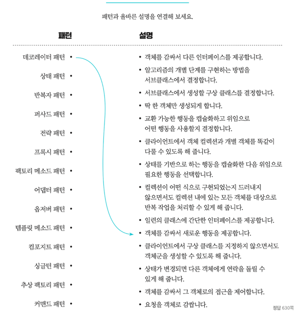
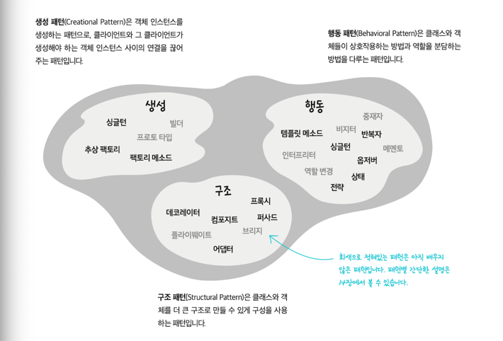
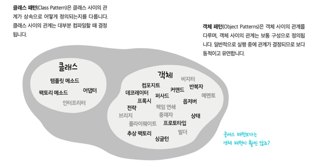
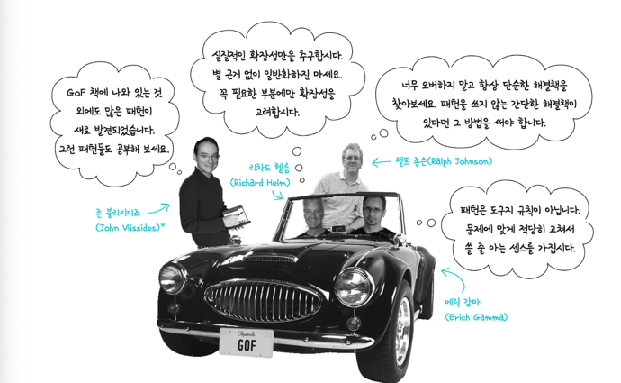
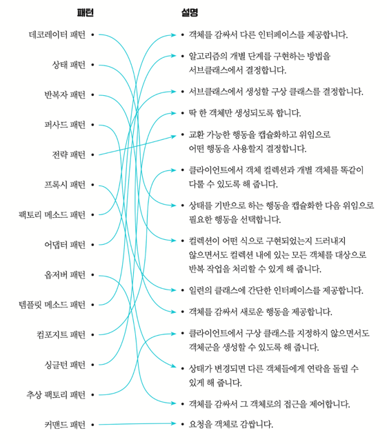

## Chapter 13

## 패턴과 행복하게 살아가기

### 개요

지금까지 매우 많은 패턴들을 정리하고 학습했다. 
한번 정리하는 시간이 필요한데 이번 챕터가 그런 챕터이다.

**패턴**은 특전 컨텍스트 내에서 주어진 문제의 해결책이다. 

- 컨텍스트 : 반복적으로 문제가 발생하는 상황
    - ex) 요청이 두개 이상 발생
- 문제 : 컨텍스트에서 해야하는 하는 상황
    - ex) 중복 요청으로인해 동시성 문제 발생
- 해결책 : 문제를 해결하기 위한 방법
    - ex) 락등을 활용해 요청을 순차적으로 처리

이때 패턴은 동일한 컨텍스트에서 매번 동일하게 발생하는 문제에 대한 해결책이다. 

**컨텍스트** : 늦잠을 자버리는 컨텍스트 발생 
**문제** : 회사에 늦는 문제 발생  
**해결책** 1 -1 : 반차를 써버림 ( X ) 
**해결책** 1 -2 : 회사에서 잠 ( O ) 

이런 각종 컨텍스트별 상황별 적합한 패턴을 카탈로그화 되어 모은 가장 대표적인 책 **"GoF의 디자인 패턴"**이다

----

### Step 0

- 디자인패턴은 만들어 내는 것이 아닌 발견하는 것이다.
- 발견 하기 위해서는 컨텍스트와 도메인 , 문제에 대해 잘 알고 있어야 한다.
- 발견한것 같은 디자인 패턴도 3자의 관점으로 판단 해야한다 == Rule of Three(3의 규칙)

----

#### Step 1 디자인 패턴의 분류

기사 시험에서도 자주 나오는 디자인패턴의 분류

##### Creatinal Patterns (생성)

> 객체를 생성하는 방법과 객체를 합성하는 방법을 제공하는 패턴

##### Structural Patterns (구조)

> 클래스나 객체를 조합해 더 큰 구조를 만드는 패턴

##### Behavioral Patterns (행위,행동)

> 클래스나 객체 사이의 알고리즘이나 책임 분배에 관련된 패턴

> #### 클래스 혹은 객체를 다루는 패턴인지에 따라서 클래스,객체 패턴으로 분리 할 수 도 있다.

            

##### Q 데코레이터 패턴은 어디에 속할까?

-----

#### Step 2 do Think about Pattern

#### 최대한 단순하게

- Kiss,Keep it Simple(최대한 단순하게) 하게 문제를 해결하기
- 디자인패턴은 만능해결책이 아니다
- 패턴이 필요한 순간은 사실 잘 없다
- 디자인 패턴을 적용하게 되면 코드의 영향 범위를 고려해야한다.

**리팩토링**

- 코드가 오래되고 커지면서 리팩토링의 과정이 반드시 필요해진다.
- 이 과정은 코드의 동작 변경이 아닌 구조 , 형식의 개선이 주가 된다.
- 이 시점이 디자인 패턴을 적용하기 좋은 상황

------

#### 디자인 패턴을 과감하게 제거하자.

- 필요하지 않은 기능을 빼는 것은 당연한 일
- 과도한 구조적 효율은 코드의 복잡도를 높이고 유지보수를 어렵게 만든다.
- 역으로 초보자는 패턴을 강제적으로라도 사용하는 것을 추천한다.
- 패턴을 사용하다보면 패턴의 장단점을 알게되고 패턴을 사용하지 않는 것도 패턴이다.
- 안티패턴을 염두하자.

-----

#### GoF (GanG of Four) 4인방

------

