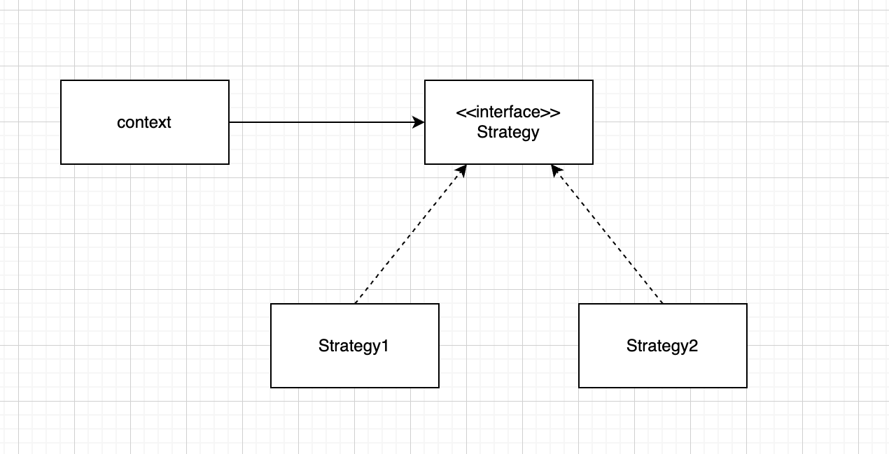
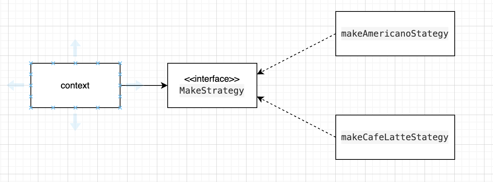

**전략 패턴**
----

>알고리즘군을 정의하고 캡슐화해서 각각의 알고리즘군을 수정해서 쓸 수 있게 해주는 디자인 패턴으로 클라이언트로부터 알고리즘을 분리해서 독립적으로 변경할 수 있도록 해줌

<br>

**전략 패턴 다이어그램**



<br>
1. Strategy(Compositor) : 제공하는 모든 알고리즘에 대한 공통의 연산들을 인터페이스화, Context는 인터페이스화된 Strategy를 통해서 구체화된 실제 알고리즘을 사용한다.<br>
2. ImplA,ImplB : Strategy 인터페이스의 공통으로 묶어놓은 알고리즘을 실제로 구현한다.<br>
3. Context : Strategy에 있는 참조자(ImplA,ImplB)를 관리한다. 즉, Strategy의 서브클래스 인스턴스를 가지고 있음으로써 구체화한다.

<br>

**전략 패턴 특징**
<br>

1. 코드 문맥이 특정한 구현체가 아닌 인터페이스에만 의존한다.
2. 문맥이 특정 컴포넌트에 직접 의존하지 않고, 역으로 컴포넌트가 인터페이스에 의존하는 형태가 되어 SOLID 원칙 중 의존성 역전의 원칙 (DIP: Dependency Inversion Principle) 또한 따르게 됨을 알 수 있다.

<br>

**전략 패턴 장단점**
1. 장점 
   * 알고리즘을 정의하고 캡슐화하여 런타임 시에 알고리즘을 선택하는 데 사용된다.
   * 알고리즘을 쉽게 변경 및 대체할 수 있으므로 유연하다.
   * 알고리즘 추가 및 수정을 할 때 코드 수정이 최소화되므로 확장성이 높아진다.
   * 알고리즘을 캡슐화했기에 코드 재사용성이 좋다.
   * 각각 알고리즘을 독립적으로 테스트할 수 있으므로 용이하다.
2. 단점
   * 추가적인 클래스 및 인터페이스가 필요하기에 코드 복잡성이 증가될 수 있음
   * 런타임 시에 알고리즘을 선택하는 데 추가적인 오버헤드 발생 가능
   * 전략패턴을 구현하는 것이 어려울 수 있으므로, 적절한 분석과 설계가 필요함

<br>

**전략 패턴 예시**
> 아메리카노가 커피머신기

```
interface MakeStrategy {
    String makeCoffeeMessage();
}
```
```
class makeAmericanoStategy implements MakeStrategy {
    public String makeCoffeeMessage() {
        return "아메리카노가나온다!";
    }
}

```

```
class Coffee {
    private final MakeStrategy makeStrategy;

    Coffee(MakeStrategy makeStrategy) {
        this.makeStrategy = makeStrategy;
    }

    void make() {
        System.out.println(MakeStrategy.makeCoffeeMessage());
    }
}
```

```
public class Client {
    public static void main(String[] args){
        Coffee coffee = new Coffee(new makeAmericanoStategy());
        coffee.make();
    }
}
```


> 카페라떼로 변경하기

```
class makeAmericanoStategy implements MakeStrategy {
    public String makeCoffeeMessage() {
        return "아메리카노가나온다!";
    }
}

class makeCafeLatteStategy implements MakeStrategy {
    public String makeCoffeeMessage() {
        return "카페라떼가나온다!";
    }
}

```

```
public class Client {
    public static void main(String[] args){
        Coffee coffee = new Coffee(new makeCafeLatteStategy());
        coffee.make();
    }
}
```

> 예제 다이어그램



