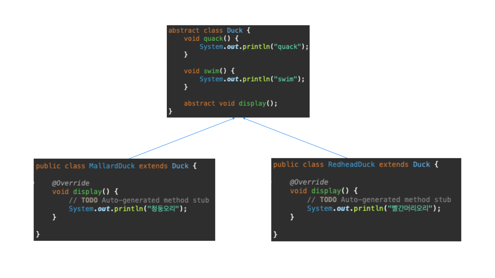
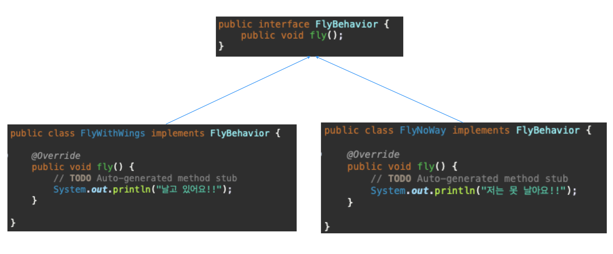
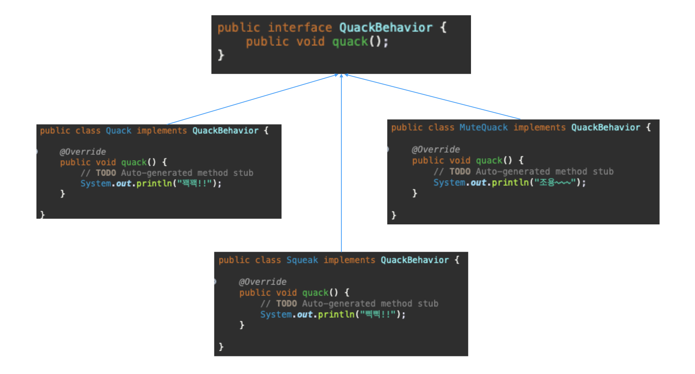
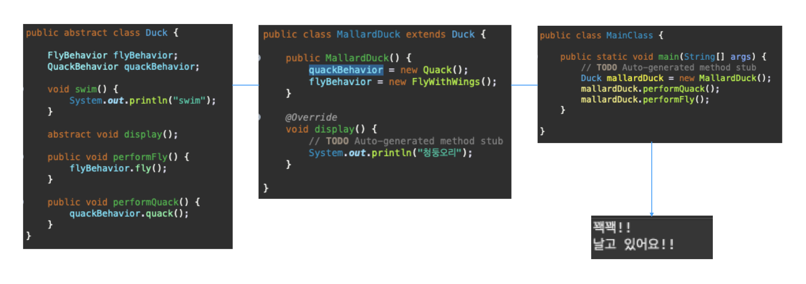
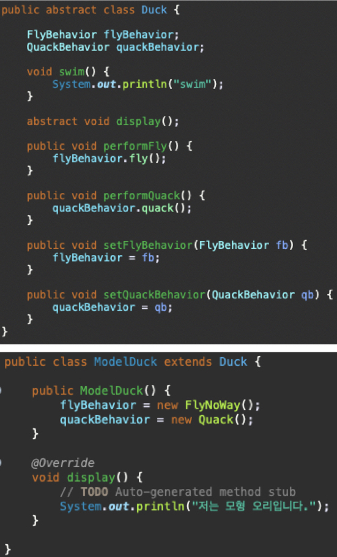
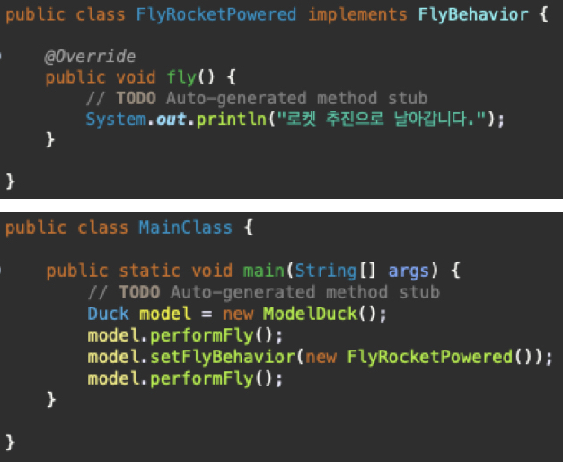
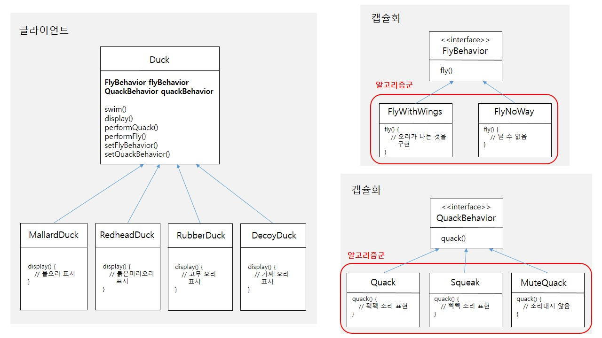

# 디자인 패턴의 세계로 떠나기

### 상속

* 문제 
&nbsp;-&nbsp;fly()라는 메서드 추가하기

1. Duck이라는 슈퍼 클래스에 fly() 메서드를 추가한다.
2. 모든 오리가 fly() 메서드를 상속받는다. 
-> RubberDuck이 fly() 메서드를 상속받게 된다.

> 코드를 재사용할 수는 있으나 유지보수 측면에서는 좋지 않은 방식이다. 
규격이 바뀔때마다 Duck의 서브 클래스의 fly() 메서드를 일일이 살펴보고 상황에 따라 오버라이드해야 하는 문제가 발생한다.

### 문제를 명확하게 파악하기 
&nbsp;-&nbsp;상속은 좋은 해결책이 아니다 
&nbsp;-&nbsp;Flyable과 Quackable 인터페이스는 구현된 코드가 없으므로 코드를 재사용할 수 없다
 

> **디자인 원칙** 
애플리케이션에서 달라지는 부분을 찾아내고, 달라지지 않는 부분과 분리한다. 
바뀌는 부분을 따로 뽑아서 캡슐화하면 바뀌지 않는 부분에는 영향을 미치지 않고 그 부분만 고치거나 확장할 수 있다.

### 바뀌는 부분과 그렇지 않은 부분 분리하기 
&nbsp;-&nbsp;바뀌는 부분 : fly()와 quack() 

> **디자인 원칙** 
구현보다는 인터페이스에 맞춰서 프로그래밍한다. 
Duck의 행동은 특정 행동 인터페이스를 구현한 별도의 클래스 안에 들어 있으므로 Duck 클래승서는 그 행동을 구체적으로 구현할 필요가 없다.

### 오리의 행동을 구현하는 방법
#### FlyBehavior

#### QuackBehavior

 

* 각 행동을 인터페이스로 표현하고 이런 인터페이스를 사용하여 행동을 구현한다.
* 다른 형식의 객체에서도 나는 행동과 꽥꽥거리는 행동을 재사용할 수 있다.
* 기존의 행동 클래스를 수정하거나 날아다니는 행동을 사용하는 Duck 클래스를 전혀 건드리지 않고도 새로운 행동을 추가할 수 있다.

### 오리 행동 통합하기
&nbsp;-&nbsp;가장 중요한 점은 fly()와 quack()를 Duck 클래스에 정의하지 않고 다른 클래스에 위임한다는 것이다.

 

1. Duck 클래스에 flyBehavior와 quackBehavior라는 인터페이스 형식의 인스턴스 변수를 추가한다.
2. Duck 클래스에 fly()와 quack() 대신 performFly()와 performQuack() 메서드를 추가한다.
3. performFly()와 performQuack()에서 행동을 직접 처리하는 대신 flyBehavior와 quackBehavior로 참조되는 객체로 행동을 위임한다.
4. MallardDuck 클래스에서 Duck 클래스로부터 상속받은 behavior 인스턴스 변수에 Quack 객체와 FlyWithWings 객체를 생성하여 performFly()와 performQuack()를 실행한다.

### 동적으로 행동 지정하기
 

 

1. Duck 클래스에 메소드 2개를 추가한다.
2. Duck의 서브클래스(ModelDuck)를 새로 만들어 생성자 안에 flyBehavior는 FlyNoWay 객체를 quackBehavior에는 Quack 객체를 생성한다.
3. FlyBehavior 형식의 클래스(FlyRocketPowered)를 새로 만든다.
4. ModelDuck 클래스의 참조변수로 performFly()를 호출하면 ModelDuck의 생성자 안에서 생성한 FlyNoWay 객체의 fly()가 실행된다.
5. setter 메서드에 새로 생성한 FlyBehavior 형식의 클래스를 대입하면 FlyRocketPowered 객체의 fly()가 실행된다.
6. 위와 같은 방법으로 오리의 행동을 동적으로 변경할 수 있다.

### 캡슐화된 행동 살펴보기

### 두 클래스를 합치는 방법
&nbsp;-&nbsp;각 오리에는 FlyBehavior와 QuackBehavior가 있으며, 각각 나는 행동과 꽥꽥거리는 행동을 위임받는다. 
&nbsp;-&nbsp;이런 식으로 두 클래스를 합치는 것을 '구성(composition)'을 이용한다라고 한다. 
&nbsp;-&nbsp;오리 클래스에서는 행동을 상속받는 대신, 올바른 행동 객체로 구성되어 행동을 부여받는다. 

> 디자인 원칙 
상속보다는 구성을 활용한다.

> 전략 패턴(Strategy Pattern) 
알고리즘군을 정의하고 캡슐화해서 각각의 알고리즘군을 수정해서 쓸 수 있게 해준다. 전략 패턴을 사용하면 클라이언트로부터 알고리즘을 분리해서 독립적으로 변경할 수 있다.