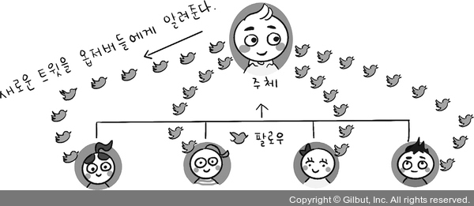
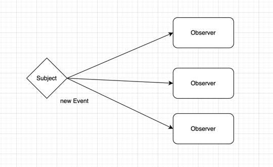
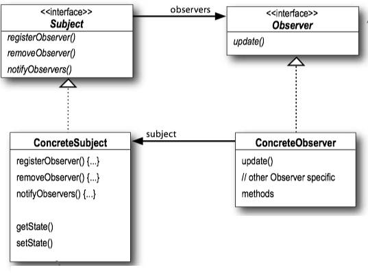

## Observer_Pattern

옵저버 패턴은 마치 신문 구독 서비스와 비슷하다.

</img>


---

> Subject 라는 주체가 있고 여러개의 Observer가 있다.<br>
> Subject는 Observer를 등록하고, Observer는 Subject를 구독한다.
>
> Subject의 변화는 Observer들에게 전달된다.<br>
> Push혹은 Pull 형태의 전달을 통해 Observer들은 갱신을 할 수 있다.
> </img>


<br><br>

----

### Observer Pattern의 구조



#### Subject interface

- **registerObserver()** : Observer를 등록한다. subject의 변화를 전달받는다.
- **removeObserver()**  : Observer를 제거한다. 더 이상 subject의 변화를 전달받지 않는다.
- **notifyObserver()** : Observer에게 변화를 알린다. Observer는 이를 통해 갱신한다.

#### Observer interface

- **update()** : Subject의 변화를 전달받아 갱신한다.

> 간략하면서도 정확하게 표현한 이 방식은 옵저버 패턴의 모든것을 보여준다.<br>
>
> 주제가 되는 Object는 Subject interface를 구현해야하는 책임과 의무를 가진다<br>
>
> Subject의 변화를 감지하고 갱신하는 Object는 Observer interface를 구현해야하는 책임과 의무를 가진다.<br>


------

#### 이를 통해 알게되는 점 ⇥

- Subject와 Observer는 1:N의 관계를 가진다.
- Observer는 Subject에 변화에 반응해야 함으로 의존성을 가지게 된다.
- 출판-구독(publish-subscribe)이라는 패턴도 존재한다. -> 옵저버패턴과는 좀 다른 관점의 패턴이다

-----

### 느슨한 결합 (Loose Coupling)

> 객체간 상호작용하지만 서로에 대해 잘 모르는 상태를 느슨한 결합이라고 한다.<br>
> 이전에 말했던 서로가 그 기능을 할거라는건 알지만 구현에 대해서는 몰라도 된다라고 했던것 <br>
>
> ```java
> List<T> list = new ArrayList<T>();
> list.add(T);
> ```
> 컬렉션을 많이 사용하고 자바의 여러 기능이 있지만 이를 사용하는 객체는 컬렉션의 구현에 대해서는 몰라도 된다.<br>
> 이는 느슨한 결합이라고 할 수 있다.<br>

#### 옵저버패턴에서의 느슨한 결합

1. Subject와 Observer는 서로 독립적으로 재사용할 수 있다.
2. Subject는 Observer의 구체적인 클래스를 알지 못한다. Observer는 Subject의 구체적인 클래스를 알지 못한다.
3. Observer 인터페이스만 알면된다. 구현중인 클래스들에는 관심없다.
4. Observer들은 계속 추가될 수 있다.
5. Subject는 Observer에 개수에 상관없이 동작한다.

---------

### Observer Pattern의 구현 예시

#### Subject interface

```java
public interface Subject {
    public void 옵저버_등록(Observer o);

    public void 옵저버_삭제(Observer o);

    public void 변경_전달();
}
```

#### Subject 구현

```java
public class News implements Subject {
    private ArrayList<Observer> observers;
    private String text;

    @Override
    public void 옵저버_등록(Observer o) {
        observers.add(o);
    }

    @Override
    public void 옵저버_삭제(Observer o) {
        int i = observers.indexOf(o);
        if (i >= 0) {
            observers.remove(i);
        }
    }

    @Override
    public void 변경_전달() {
        for (Observer o : observers) {
            o.update();
        }
    }

}
```

#### Observer interface

```java
public interface Observer {
    public void update();
}
```

#### Observer 구현

```java
public class NewsPaper implements Observer {
    private String text;
    private Subject news;

    public NewsPaper(Subject news) {
        this.news = news;
        news.옵저버_등록(this);
    }

    @Override
    public void update() {
        this.text = news.getNews();
        display();
    }

    public void display() {
        System.out.println(text);
    }
}
```

-----

### 실제 사용 라이브러리

- swing
- javaBean
- JavaScript의 이벤트 핸들러
- MVC 패턴
- 주식 시장 알림:
  > 주식 시장 데이터를 관찰하는 주식 앱에서는 주식 가격의 변동을 실시간으로 사용자에게 알려주는 데<br>
  > 주식 데이터가 변경될 때마다 관련된 모든 사용자에게 알림을 전송.

- 이벤트 핸들링:
  > GUI의 버튼 클릭, 키 입력 등의 이벤트를 관찰하고 처리하는 데 옵저버 패턴을 활용.<br>
  > 버튼 클릭과 같은 이벤트가 발생하면 관련된 옵저버(이벤트 핸들러)에게 알림을 전달하여 <br>
  > 적절한 동작을 수행.

- 뉴스 발행:
  > 뉴스 발행사에서는 새로운 뉴스 기사가 작성될 때마다 구독자에게 알림을 보내는 데<br>
  > 옵저버 패턴을 활용. 이를 통해 다양한 구독자에게 뉴스 업데이트를 쉽게 전달할 수 있다.

- 주제와 구독자 간의 커뮤니케이션:
  > 온라인 포럼이나 블로그의 댓글 시스템에서는 주제(포스트)를 작성한 사용자와<br>
  > 그 주제에 댓글을 단 사용자 간의 상호작용을 관리하는 데 옵저버 패턴을 사용할 수 있다.<br>
  > 새로운 댓글이 작성되면 해당 주제를 관찰하는 사용자에게 알림이 전송된다.


