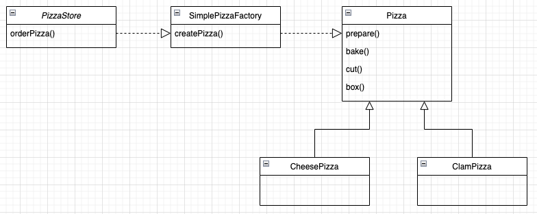
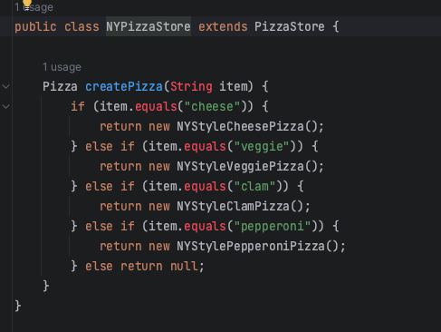
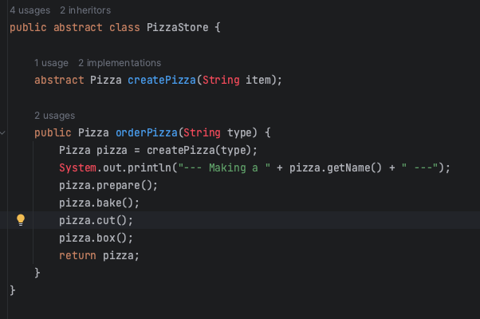
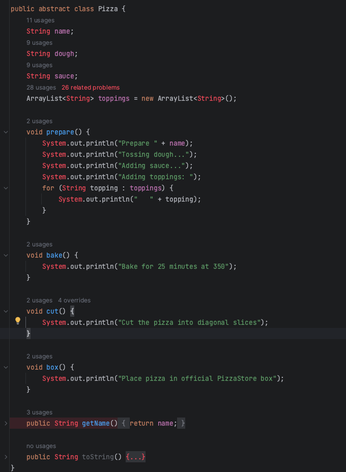
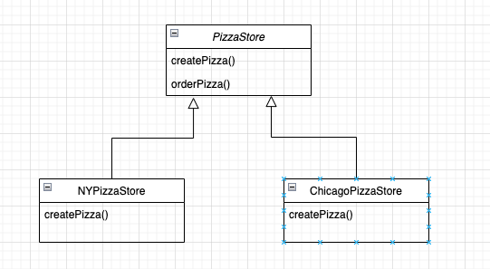
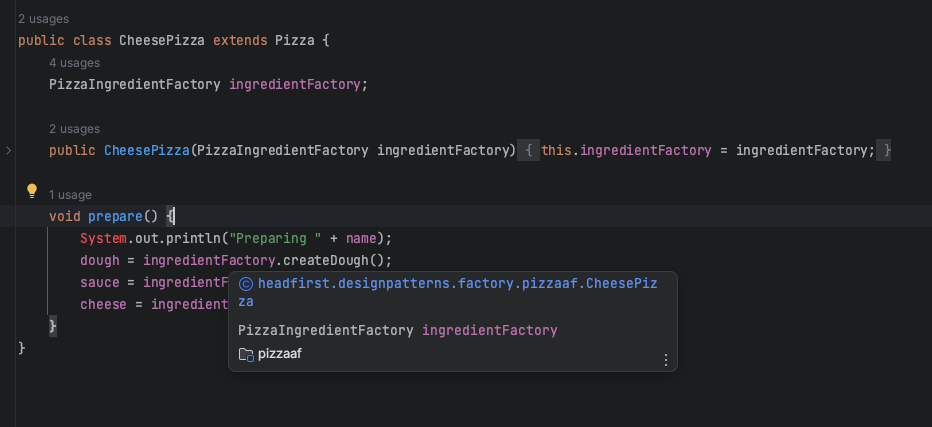

# 팩토리 패턴 

### 심플 팩토리 패턴 (간단한 팩토리 패턴)
##### 1. 심플 팩토리 패턴이란?
###### 객체를 생성하는 클래스(팩토리)를 따로 만드는 패턴 

##### 2. 심플 팩토리 패턴 적용 전 후 코드 비교
###### [심플 팩토리 패턴 전]
###### 인스턴스를 만드는 구상클래스를 선택하는 부분에서 문제 발생 -> 피자 메뉴 변경이 발생할 때마다 코드를 직접 수정해야한다.

###### [심플 팩토리 패턴 후]
###### 객체 생성 팩토리를 따로 구성 -> 더 이상 구상 클래스의 인스턴스를 만들 필요가 없다.

 

##### 3. 심플 팩토리를 왜 쓰는가?

###### 팩토리에서 생산하는 제품에 해당하는 구상 클래스 피자는 Pizza 인터페이스를 구현해야하며 구상 클래스여야한다. 
 

> ##### 정적 팩토리 (static fatory)  
> ###### - 심플 팩토리를 정적 메소드로 정의하는 기법이다.  
> ###### - 정적 메소드를 쓰면 객체 생성 메소드를 실행하려고 객체의 인스턴스를 만들지 않아도 되기 떼문에 사용하지만 서브클래스를 만들어서 객체 생성 메소드의 행동을 변경할 수 없다는 단점이 있다.
  

### 팩토리 메소드 패턴 
##### 1. 팩토리 메소드 패턴이란?
###### 클래스의 인스턴스를 만드는 일을 서브클래스에 맡기는 패턴
###### &nbsp;- &nbsp;객체를 생성하기 위한 인터페이스를 정의하는 과정에서 어떤 클래스의 인스턴스를 만들지는 서브클래스에서 결정한다. 

##### 2. 팩토리 메소드 패턴 UML

###### 1) Product 
###### &nbsp;- &nbsp; 생성된 객체의 인터페이스
###### 2) ConcreateProduct 
###### &nbsp;- &nbsp; Product 인터페이스를 구현한 구상 클래스
###### 3) Creator 
###### &nbsp;- &nbsp; 객체를 생성하는 팩토리 메서드를 가진 인터페이스
###### 4) ConcreateCreator 
###### &nbsp;- &nbsp; Creator 인터페이스를 구현한 구상 클래스

 

##### 3. 팩토리 메소드 패턴 코드 (피자 가게 예시)
###### 1) 피자 만들기 시작

###### 2) 피자 가게 만들기

###### 3) 주문자의 피자 만들기

 

##### 4. 팩토리 메소드 패턴 클래스 다이어그램 (피자 가게 예시)
>###### 제품 클래스와 생성자 클래스는 병렬 클래스 계층 구조이다.
>###### &nbsp; - 둘 다 추상 클래스로 시작하고, 그 클래스를 확장하는 구상 클래스를 가지고 있다.
>###### &nbsp; - 지점별 클래스의 구체적인 구현은 구상 클래스들이 책임진다.
###### 1) 생산자 클래스

###### &nbsp;- &nbsp; 구상 생산자 (concrete creator)
###### &nbsp;&nbsp;&nbsp; : 제품을 생산하는 클래스 
###### &nbsp;- &nbsp; 각 분점 마다 pizzaStore의 서브클래스가 따로 있으므로 createPizza() 메소드 구현을 활용하여 그 가게의 고유의 피자를 만들 수 있다.
###### &nbsp;&nbsp;&nbsp; : createPizza() 메소드가 팩토리 메소드이다.
###### 2) 제품 클래스 

 

##### 5. 팩토리 메소드 패턴 장/단점
###### 1) 장점
###### &nbsp;- &nbsp; 생성자와 구현 객체의 강한 결합을 피할 수 있다.
###### &nbsp;- &nbsp; 객체의 생성 후 공통으로 할 일을 수행하도록 지정해줄 수 있다.
###### &nbsp;- &nbsp; 캡슐화, 추상화를 통해 생성되는 객체의 구체적인 타입을 감출 수 있다.
###### &nbsp;- &nbsp; 단일 책임 원칙 준수
###### &nbsp;&nbsp;&nbsp; : 객체 생성 코드를 한 곳 (패키지, 클래스 등)으로 이동하여 코드를 유지보수하기 쉽게 할 수 있으므로 원칙을 만족한다. 
###### &nbsp;- &nbsp; 개방/폐쇠 원칙 준수
###### &nbsp;&nbsp;&nbsp; : 기존 코드를 수정하지 않고 새로운 유형의 제품 인스턴스 프로그램에 도입할 수 있어 원칙을 만족 (확장성 있는 전체 프로젝트 구성이 가능)
###### &nbsp;- &nbsp; 생성에 대한 인터페이스 부분과 생성에 대한 구현 부분을 따루 나누었기 대문에 패키지 분맇여 개별로 여러 개발자가 협업을 통해 개발
###### 2) 단점
###### &nbsp;- &nbsp; 형식 안전성에 지장이 있다. 
###### &nbsp;&nbsp;&nbsp; : 런타임 오류가 발생한다.
###### &nbsp;- &nbsp; 구현체가 늘어날때 마다 팩토리 클래스가 증가하여 서브 클래스 수가 증가한다.
###### &nbsp;- &nbsp; 코드의 복잡성이 증가한다.
 

##### 6. 실무에서 패턴이 사용되는 경우
###### 1) Spring Framework : BeanFactory
###### &nbsp;- &nbsp; Object 타입의 Product를 만드는 BeanFactory 라는 Creator 
###### &nbsp;- &nbsp; BeanFactory가 Creator 인터페이스이고 이를 구현한 ClassPathXmlApplicationContext, AnnotationConfigApplicationContext가 ConcreteCreator이다.
###### &nbsp;- &nbsp; 여기서 넘겨주는 Product는 Object 타입이고 이를 넘겨 받는 인스턴스가 ConcreateProduct가 된다.
###### &nbsp;- &nbsp; 컴포넌트 스캔, bean 설정 어노테이션, xml 파일 등의 bean 들이 결국 ConcreateProduct에 해당되는 것이다.
###### &nbsp;- &nbsp; ioc 컨테이너에 해당되는 클래스가 bean 팩토리인데 이 부분에 녹아져 있는 패턴이 팩토리 메서드 패턴이다.
###### 2) JAVA : NumberFormat의 getInstance()
###### &nbsp;- &nbsp; 국가 또는 화폐에 따라 다른 표현 방식을 커버하기 위해 팩토리 메서드 패턴으로 디자인 되었다.
###### &nbsp;- &nbsp; NumberFormat을 구현하는 클래스는 Decimal Format, ExponentialFormat 등이 있다.
###### 2) JAVA : Calendar의 getInstance()
###### &nbsp;- &nbsp; getInstance()를 호출할 떄마다 새로운 Calendar 객체가 생성
###### &nbsp;- &nbsp; Calendar는 Gregorian 형식 Julian 형식이 있는데, 이 두가지 경우를 모두 커버하기 위해 팩토리 메서드 패턴으로 디자인 되었다.

  

### 객체 의존성 뒤집기 원칙 
##### 1. 객체 의존성 뒤집기 원칙이란?
###### 1) 고수준 모듈은 저수준 모듈의 구현에 의존해서는 안 되고, 저수준 모듈이 고수준 모듈에서 정의한 추상 타입에 의존해야 한다는 원칙이다. 
###### 2) 구상 클래스처럼 구체적인 것이 아닌 추상화 클래스나 인터페이스와 같이 추상적인 것에 의존하는 코드를 만들어야한다.
###### 3) 고수준 모듈과 저수준 모듈에 모두 적용 될 수 있다.  
 

##### 2. 의존성 뒤집기 원칙을 지키는 방법
###### 1) 변수에 구상 클래스의 레퍼런스를 저장하지 말아야한다.
###### &nbsp;- &nbsp; new 연산자를 사용하면 구상 클래스의 레퍼런스를 사용하게되므로 팩토리를 써서 구상 클래스의 레퍼런스를 변수에 저장하는 일을 미리 방지한다.
###### 2) 구상 클래스에서 유도된 클래스를 만들지 말아야한다.
###### &nbsp;- &nbsp; 구상 클래스에서 유도된 클래스를 만들면 특정 구상 클래스에 의존하게되므로 인터페이스나 추상 클래스처럼 추상화된 것으로부터 클래스를 만들어야한다.
###### 3) 베이스 클래스에 이미 구현되어 있는 메소드를 오버라이드 하지 말아야한다.
###### &nbsp;- &nbsp; 이미 구현되어 있는 메소드를 오버라이드한다면 베이스 클래스가 제대로 추상화 되지 않으므로 베이스 클래스에서 메소드를 정의할 때는 모든 서브클래스에서 공유할 수 있는 것만 정의해야한다.
  

### 추상 팩토리 패턴
##### 1. 추상 팩토리 패턴이란?
##### 인터페이스를 이용하여 서로 연관된, 또는 의존하는 객체를 구상 클래스를 지정하지 않고도 생성하는 패턴 

##### 2. 추상 팩토리 패턴 장/단점
###### 1) 장점
###### &nbsp;- &nbsp; 구체적인 클래스를 사용자로부터 분리할 수 있다.
###### &nbsp;- &nbsp; 제품군 대체가 쉽다.
###### 2) 단점
###### &nbsp;- &nbsp; 새로운 종류의 제품을 제공하기 어렵다.

##### 3. 추상 팩토리 패턴 코드 (피자 가게 예시)
###### 1) 피자 가게에 피자 주문 시작

###### 2) 원재료 팩토리를 사용하는 pizza 인스턴스 생성(원재료 팩토리는 각 피자의 생성자에 전달)

###### 3) 피자 준비

###### 4) orderPizza 메소드는 피자를 굽고, 자르고, 포장한다.
 

##### 4. 추상화 팩토리 패턴 클래스 다이어그램(피자가게 예시)

###### 1) PiaazIngredientFactory
###### &nbsp;- &nbsp; 서로 관련된 제품군을 만드는 방법을 정의하는 추상 인터페이스이다.
###### 2) NYPizzaIngredientFactory, ChicagoPizzaIngredientFactory
###### &nbsp;- &nbsp; 구성 피자 팩토리는 피자의 원재료를 만드는 일을 한다.
  

### 펙토리 메소드 패턴과 추상화 팩토리 패턴 비교
###### 1) 공통점
###### &nbsp;- &nbsp; 객체 생성을 캡슐화함으로써 구체적인 타입을 감추고 느슨한 결합 구조를 표방한다.
###### 2) 차이점
###### &nbsp;(1) &nbsp; 팩토리 메소드 패턴
###### &nbsp;&nbsp;- &nbsp; 구체적인 객체 생성과정을 하위 또는 구체적인 클래스로 옮기는 것이 목적
###### &nbsp;&nbsp;- &nbsp; 한 Factory당 한 종류의 객체 생성을 지원한다.
###### &nbsp;&nbsp;- &nbsp; 인자에 따라 생성되는 객체의 종류가 결정된다.
###### &nbsp;&nbsp;- &nbsp; 메서드 레벨에서 포커스를 맞춤으로써, 클라이언트의 ConcreteProduct 인스턴스의 생성 및 구성에 대한 의존을 감소시킨다.
###### &nbsp;(2) &nbsp; 추상화 팩토리 패턴
###### &nbsp;&nbsp;- &nbsp; 관련 있는 여러 객체를 구체적인 클래스에 의존하지 않고 만들 수 있게 해주는 것이 목적이다.
###### &nbsp;&nbsp;- &nbsp; 한 Factory에서 서로 연관된 여러 종류의 객체 생성을 지원한다. (제품군 생성 지원)
###### &nbsp;&nbsp;- &nbsp; 인자에 따라 객체들을 생성하는 Factory의 종류가 결정된다.(다수의 Factory 존재)
###### &nbsp;&nbsp;- &nbsp; 클래스(Factory) 레벨에서 포커스를 맞춤으로써, 클라이언트의 ConcreteProduct 인스턴스 군의 생성 및 구성에 대한 의존을 감소시킨다.

