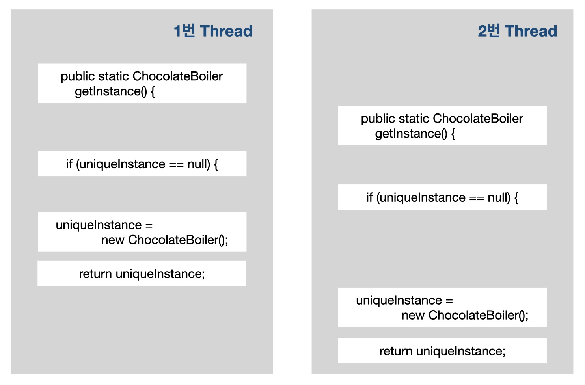
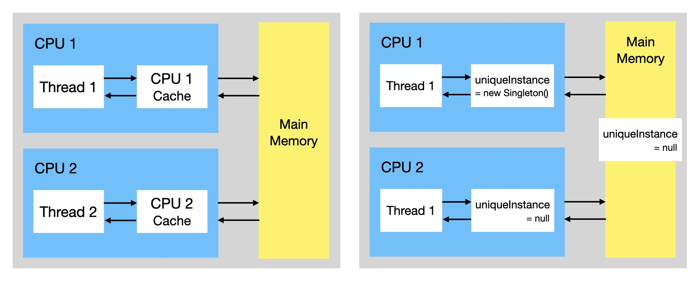
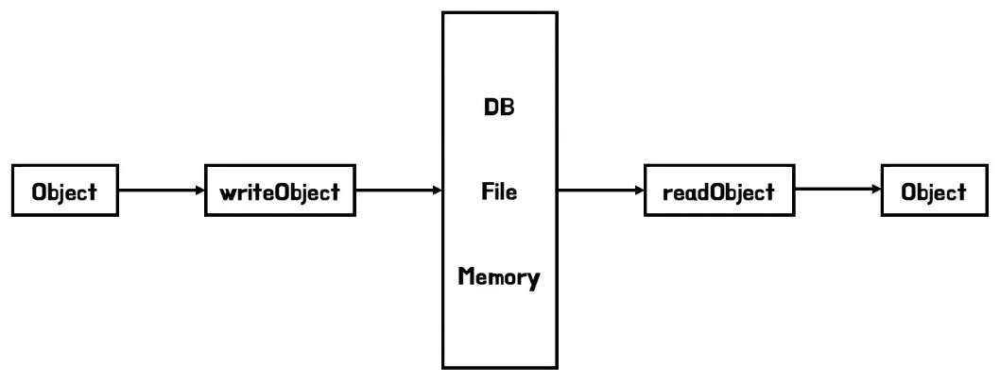
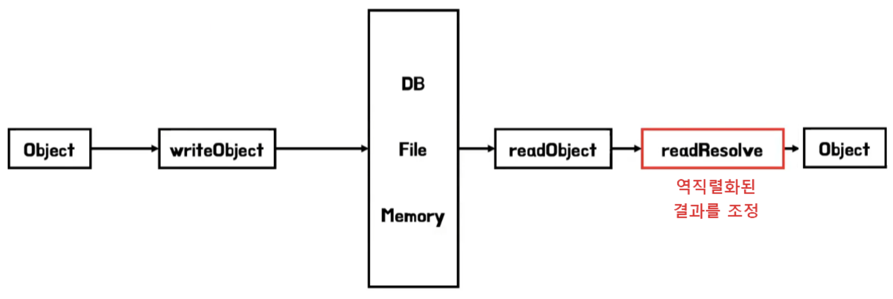

## 하나뿐인 특별한 객체 만들기 - Singleton Pattern

Singleton Pattern의 정의<br>
&nbsp;-&nbsp; 클래스 인스턴스를 하나만 만들고, 그 인스턴스로의 전역 접근을 제공한다.

Singleton Pattern의 특징
- 특정 클래스에 객체 인스턴스가 하나만 만들어지도록 해 주는 패턴이다.
- 다른 어떤 클래스에서도 자신의 인스턴스를 추가로 만들지 못하게 해야 한다.
- 전역 변수처럼 객체 인스턴스를 어디서든지 액세스 할 수 있다.<br>
(전역 변수와는 다르게 Singleton Pattern은 필요할 때만 객체를 생성한다.)
- DBCP, 디스크 연결, 네트워크 통신, Thread Pool, 캐시, 로그 기록 객체 등

<br>

> 핵심<br>
&nbsp;-&nbsp;어떻게 하면 한 클래스의 인스턴스를 2개 이상 만들지 않게 하지?

<br>

고전적인 Singleton Pattern 구현법

```java
public class Singleton {
    private static Singleton uniqueInstance;

    private Singleton() {}

    public static Singleton getInstance() {
        if (uniqueInstance  == null) {
            // 게으른 인스턴스 생성(lazyinstantiation)
            // 필요할 때만 인스턴스 생성
            uniqueInstance = new Singleton();
        }

        return uniqueInstance;
    }
}
```

<u>public 생성자가 없다</u><br>
<u>-> 정적 메소드인 getInstance()가 역할을 대신한다.</u>

초콜릿 보일러 코드 살펴보기

```java
public class ChocolateBoiler {
    private boolean empty;
    private boolean boiled;

    private ChocolateBoiler() {
        empty = true;
        boiled = false;
    }

    public void fill() {
        if (isEmpty()) {
            emtpy = false;
            boiled = false;
        }
    }

    public void drain() {
        if (!isEmpty() && isBoiled()) {
            empty = true;
        }
    }

    public void boil() {
        if (!isEmpty() && !isBoiled()) {
            boiled = true;
        }
    }

    public boolean isEmpty() {
        return empty;
    }

    public boolean isBoiled() {
        return boiled;
    }
}
```

<br>

Singleton Pattern 구현 기법 종류
1. Eager Initialization
2. Static block initialization
3. Lazy initialization
4. Thread safe initialization
5. Double-Checked Locking
6. Bill Pugh Solution(LazyHolder)
7. Enum 

<br>

> 만약 한 애플리케이션에서 ChocolateBoiler 인스턴스가 2개 이상 만들어지면 어떤 문제가 생길 수 있을까?

<br>

멀티스레딩 문제 해결하기<br>
&nbsp;-&nbsp; 2개의 스레드에서 동시에 인스턴스를 생성하게 되면 2개의 인스턴스가 생성되는 문제가 발생한다.

<br>

해결방법 1. synchronized 키워드를 사용한다.

```java
public class Singleton {
    private static Singleton uniqueInstance;

    private Singleton() {}

    // synchronized 키워드 사용
    // 한 스레드가 메소드 사용을 끝내기 전까지 다른 스레드는 기다려야 한다.
    public static synchronized Singleton getInstance() {
        if (uniqueInstance == null) {
            uniqueInstance = new Singleton();
        }
        return uniqueInstance;
    }
}
```
<u>동기화가 필요한 시점은 getInstance()의 시작 시점이므로 불필요한 오버헤드만 증가시킨다.</u>

해결방법 2. 인스턴스가 필요할 때는 생성하지 말고 처음부터 만든다.

```java
public class Singleton {
    private static Singleton uniqueInstance = new Singleton();

    private Singleton() {}

    public static Singleton getInstance() {
        return uniqueInstance;
    }
}
```

해결방법 3. DCL(Double-Checked Locking)을 써서 getInstance()에서 동기화되는 부분을 줄인다.<br>
&nbsp;-&nbsp; DCL을 사용하면 인스턴스가 생성되어 있는지 확인한 다음 생성되어 있지 않았을 때만 동기화한다.

```java
public class Singleton {
    // volatile 키워드를 사용
    private volatile static Singleton uniqueInstance;

    private Singleton() {}

    public static Singleton getInstance() {
        if (uniqueInstance == null) {
            synchronzied (Singleton.class) {
                if (uniqueInstance == null) {
                    uniqueInstance = new Singleton();
                }
            }
        }
        return uniqueInstance;
    }
}
```

<br>

<br>

**Bill Pugh Solution (LazyHolder)** <br>
&nbsp;-&nbsp; 클래스 내부에 내부 클래스를 두어 JVM 클래스 로더 매커니즘과 클래스가 로드되는 시점을 이용한 방법<br>
&nbsp;-&nbsp; Reflection API, 직렬화/역직렬화를 통해 싱글톤이 파괴될 수 있다는 단점이 있다.

클래스 로더<br>
&nbsp;-&nbsp; 컴파일 된 자바의 클래스 파일을 JVM 메모리 영역에 로드한다.<br>
&nbsp;-&nbsp; class 파일을 로딩하는 순서는 Loading > Linking > Initialization 3단계로 구성된다.
1. Loading : 클래스 파일을 가져와서 JVM의 메모리에 로드 (한번에 메모리에 올리지 않고 애플리케이션에서 필요한 경우 동적으로 메모리에 적재)
2. Linking : 클래스 파일을 사용하기 위해 검증하는 과정
3. Initialization : 클래스 변수들을 적절한 값으로 초기화

<br>

```java
class Singleton {

    private Singleton() {}

    // static 내부 클래스를 이용
    // Holder로 만들어, 클래스가 메모리에 로드되지 않고 getInstance 메서드가 호출되어야 로드됨
    private static class SingleInstanceHolder {
        private static final Singleton INSTANCE = new Singleton();
    }

    public static Singleton getInstance() {
        return SingleInstanceHolder.INSTANCE;
    }
}
```

1. 우선 내부클래스를 static으로 선언하였기 때문에, 싱글톤 클래스가 초기화되어도 SingleInstanceHolder 내부 클래스는 메모리에 로드되지 않음
2. 어떠한 모듈에서 getInstance() 메서드를 호출할 때, SingleInstanceHolder 내부 클래스의 static 멤버를 가져와 리턴하게 되는데, 이때 내부 클래스가 한번만 초기화되면서 싱글톤 객체를 최초로 생성 및 리턴하게 된다.
3. 마지막으로 final 로 지정함으로서 다시 값이 할당되지 않도록 방지한다.

<br>

**enum** <br>
&nbsp;-&nbsp; enum은 멤버를 만들때 private으로 만들고 한번만 초기화한다.<br>
&nbsp;-&nbsp; 상수 뿐만 아니라 변수나 메서드를 선언해 사용이 가능하다.<br>
&nbsp;-&nbsp; Bill Pugh Solution 기법과 달리 Reflection을 통한 공격에도 안전하다.<br>

```java
public enum Singleton {
    UNIQUE_INSTANCE;
}

public class SingletonClient {
    public static void main(String[] args) {
        Singleton singleton = Singleton.UNIQUE_INSTANCE;
    }
}
```

<br>

직렬화(Serialization) / 역직렬화(Deserialization)
- 직렬화(Serialization) : 자바에서 사용되는 Object 또는 Data를 다른 컴퓨터의 자바 시스템에서도 사용할 수 있도록 바이트 스트림(stream of bytes) 형태로 연속적인(serial) 데이터로 변환하는 포맷 변환 기술
- 역직렬화(Deserialization) : 바이트 스트림 혀앹로 변환된 데이터를 자바 시스템의 Object 또는 Data로 변환하는 기술

싱글톤 + 직렬화
```java
// Bill Pugh Solution
class Singleton implements Serializable {
    private Singleton() {}

    private static class SettingsHolder {
        private static final Singleton INSTANCE = new Singleton();
    }

    public static Singleton getInstance() {
        return SettingsHolder.INSTANCE;
    }
}

public static void main(String[] args) throws IOException, ClassNotFoundException {
    Singleton singleton1 = Singleton.getInstance();

    String fileName = "singleton.obj";

    // 직렬화
    ObjectOutputStream out = new ObjectOutputStream(new BufferedOutputStream(new FileOutputStream(fileName)));
    out.writeObject(singleton1);
    out.close();

    // 역직렬화
    ObjectInputStream in = new ObjectInputStream(new BufferedInputStream(new FileInputStream(fileName)));
    Singleton singleton2 = (Singleton) in.readObject();
    in.close();

    System.out.println("singleton1 == singleton2 : " + (singleton1 == singleton2));
    System.out.println(singleton1);
    System.out.println(singleton2);
}
```
<br>

&nbsp;-&nbsp; singleton1과 singleton2를 비교하면 결과는 false가 나온다.
&nbsp;-&nbsp; 역직렬화 시 새로운 인스턴스를 생성하게 되어, 직렬화에서 사용한 인스턴스와 역직렬화 시 생성한 인스턴스가 다르기 때문이다.

싱글톤 역직렬화 대응 방안 ( readResolve() )<br>
&nbsp;-&nbsp; readResolve 메서드를 정의하게 되면, 역직렬화 과정에서 readObject를 통해 만들어진 인스턴스 대신 readResolve에서 반환되는 인스턴스를 내가 원하는 것으로 바꿀 수 있다.<br>
&nbsp;-&nbsp; 기존 역직렬화를 통해 새로 생성된 객체는 알아서 Garbage Collector의 대상이 된다.<br>
&nbsp;-&nbsp; 싱글톤 클래스에 필드 변수들이 있을 경우 모든 인스턴스 필드를 transient로 선언한다.<br>
(아무리 readResolve 메서드라도 역직렬화 과정 중간에 역직렬화된 인스턴스의 참조를 훔쳐오는 공격을 행할경우 다른 객체로 바뀔 위험이 있기 때문이다.)

```java
class Singleton implements Serializable {

    // 싱글톤 객체의 필드들을 transient 설정하여 직렬화 제외
    transient String str = "";
    transient ArrayList lists = new ArrayList();
    transient Integer[] integers;

    private Singleton() {}

    private static class SettingsHolder {
        private static final Singleton INSTANCE = new Singleton();
    }

    public static Singleton getInstance() {
        return SettingsHolder.INSTANCE;
    }

    // 역직렬화한 객체는 무시하고 클래스 초기화 때 만들어진 인스턴스를 반환
    private Object readResolve() {
        return SettingsHolder.INSTANCE;
    }
}
```

<br>

Reflection<br>
&nbsp;-&nbsp; 객체를 통해 클래스의 정보를 분석하여 런타임에 클래스의 동작을 조작하는 프로그램 기법이다.<br>
&nbsp;-&nbsp; 클래스 파일의 위치나 이름만 있다면 해당 클래스의 정보를 얻어내고 객체를 생성하는 것 또한 가능하게 해준다.<br>

```java
public static void main(String[] args) throws NoSuchMethodException, InstantiationException, IllegalAccessException, InvocationTargetException {
    /* Reflection API */
    
    // 1. Singleton의 Class에서 생성자를 가져온다
    Constructor<Singleton> constructor = Singleton.class.getDeclaredConstructor();

    // 2. 생성자가 private 이기 때문에 외부에서 access 할 수 있도록 true 설정
    constructor.setAccessible(true);

    // 3. 가져온 생성자를 이용해 인스턴스화 한다
    Singleton singleton1 = constructor.newInstance();
    Singleton singleton2 = constructor.newInstance();

    System.out.println("singleton1 == singleton2 : " + (singleton1 == singleton2));
    System.out.println(singleton1);
    System.out.println(singleton2);
}
```

Reflection 대응 방안 ( enum )<br>
```java
enum Singleton {
    INSTANCE; // 싱글톤 인스턴스

    private int value = 3;

    public int getValue() {
        return value;
    }
}

public static void main(String[] args) {
    Singleton singleton1 = Singleton.INSTANCE;
    Singleton singleton2 = Singleton.INSTANCE;

    System.out.println("singleton1 == singleton2 : " + (singleton1 == singleton2));
    System.out.println(singleton1.hashCode());
    System.out.println(singleton2.hashCode());

    System.out.println(singleton1.getValue());
}
```

<br>

Singleton Pattern의 문제점
1. 모듈간 의존성이 높아진다.<br>
&nbsp;-&nbsp; 하나의 싱글톤 클래스를 여러 모듈이 공유하여 싱글톤의 인스턴스가 변경되면 이를 참조하는 모듈들도 수정이 필요하게 된다.
2. S.O.L.I.D 원칙에 위배되는 사례가 많다.<br>
&nbsp;-&nbsp; 단일 책임 원칙(SRP) 위반 : 인스턴스를 하나만 생성하기 때문에 여러 가지의 책임을 지니게 되는 경우가 많다.<br>
&nbsp;-&nbsp; 개방-폐쇄 원칙(OCP) 위반 : 많은 곳에서 사용하게 되면 클래스들 간의 결합도가 높아지게 된다.<br>
&nbsp;-&nbsp; 의존 역전 원칙(DIP) 위반 : 인터페이스와 같은 추상화가 아닌, 구체 클래스에 의존하게 된다.<br>
3. TDD 단위 테스트를 하기 어렵다.<br>
&nbsp;-&nbsp; 단위 테스트는 서로 독립적이고 어떤 순서로든 실행되어야 하는데, 싱글톤 인스턴스는 자원을 공유하고 있기 때문에 테스트 시 매번 인스턴스의 상태를 초기화시켜주어야 한다.

<br>

출처
- https://inpa.tistory.com/entry/GOF-💠-싱글톤Singleton-패턴-꼼꼼하게-알아보자
- https://inpa.tistory.com/entry/JAVA-☕-싱글톤-객체-깨뜨리는-방법-역직렬화-리플렉션
- https://junghyungil.tistory.com/99
