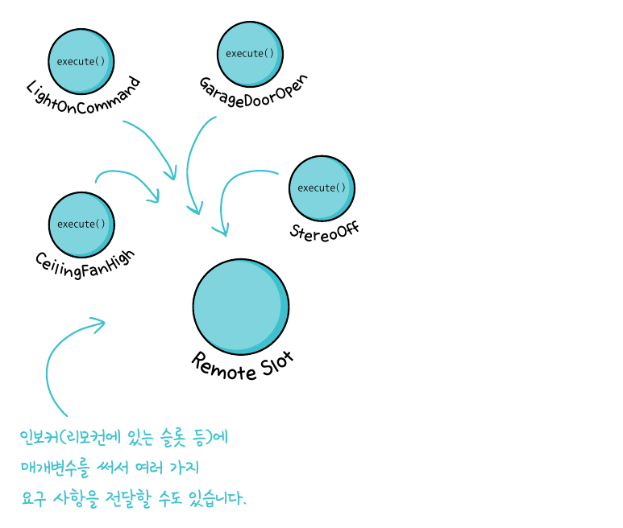
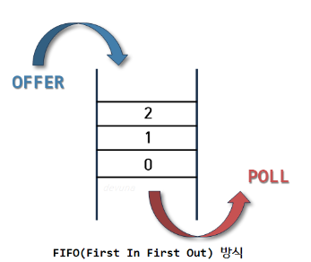
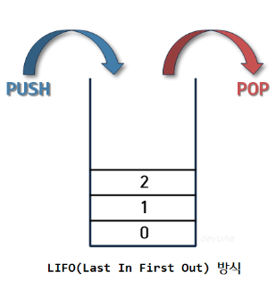

# Command pattern(커맨드 패턴)

## OverView

> 커맨드 패턴은 요청을 객체의 형태로 캡슐화하여 사용자가 보낸 요청을 나중에 이용할 수 있도록<br>
> 매서드 이름, 매개변수 등 요청에 필요한 정보를 저장 또는 로깅, 취소할 수 있게 하는 패턴이다.

### 구성요소

</img>

> <b>Command (커맨드)</b><br>
> Command는 모든 구체적인 커맨드 클래스가 구현해야 하는 인터페이스다.<br>
> 이를 통해 클라이언트, 인보커, 리시버 간의 의존성을 최소화하며 새로운 커맨드를 손쉽게 추가할 수 있다.<br>
>```java 
>public interface Command {
>   public void execute();
>}
>```

> <b>Concrete Command (구체적인 커맨드)</b><br>
> Concrete Command는 Command 인터페이스를 구현하며, 리시버 객체와 액션을 연결한다.<br>
> 이 객체는 커맨드의 실행에 필요한 파라미터를 저장하고, 리시버의 메소드를 호출하여 연산을 실행한다.<br>
>```java 
>public class LightOnCommand implements Command {
>   Light light;
>   public void execute(){
>       light.on();
>   }  
>}
>```


> <b>Invoker (인보커)</b><br>
> Invoker는 사용자의 요청을 받아 해당 요청에 맞는 커맨드 객체를 실행한다.<br>
> 사용자와 커맨드 객체의 결합도를 낮추며, 여러 커맨드의 조합이나 로깅, 취소 등의 기능을 추가하는 데 유리하다.<br>
>```java 
>public class RemoteController {
>  Comman slot;
>
>  public void setCommand(Command command){
>    slot = command;
>   }
>
>  public void buttonPush(){
>    slot.execute();
>  }
>}
>```

> <b>Receiver (리시버)</b><br>
> Receiver는 실제로 액션을 수행하는 객체다.<br>
> 커맨드 객체에 의해 호출되어 작업을 수행한다.<br>
> 이 과정에서 커맨드 객체는 필요한 경우 리시버에게 파라미터를 전달한다.<br>
> 예제에서는 Light 클래스가 리시버의 역할을 한다.<br>
> ```java 
> public class Client {
>  public static void main(String[] args){
>    RemoteController remoteController = new RemoteController();        // 컨트롤러 생성 ( 인보커의 역할 )
>    LightOnCommand lightOnCommand = new LightOnCommand(new Light());   // 조명을 켜는 커맨드 객체 생성
> 
>    remoteController.setCommand(lightOnCommand);                       // 컨트롤러에 커맨드 객체를 등록
>    remoteController.buttonPush();                    // 컨트롤러의 버튼이 눌리면 커맨드 객체의 execute()가 호출된다.
>  }
> }
> ```

-----

## 정리

> 클라이언트(Client)
> - 인보커에게 어떤 작업을 수행하라고 요청.<br>
>
> 인보커(Invoker):
> - 클라이언트로부터 요청을 받고, 그 요청을 처리할 커맨드 객체를 호출.<br>
>
> 커맨드(Command):
> - 리시버와 연결되어 있으며, 리시버가 어떤 작업을 수행할지를 알고 있다.<br>
> - 인보커가 커맨드를 실행하면, 커맨드는 연결된 리시버에게 실제 작업을 수행하라고 명령한다.<br>
>
> 리시버(Receiver):
> - 실제로 작업을 수행하는 객체.<br>
>
> 클라이언트는 인보커야 , 컨트롤러 역할을 한다 .<br>
> 이때 어느 리시버 ( 거실전구,TV,에어컨 등등 ) 이 들어오냐에 따라서<br>
> 인보커의 동작이 달라진다 이러한 인보커와 리시버에 따라서 커맨드는 분기처리되어 동작하게 된다<br>
>
> 예를 들어, 리모컨(인보커)을 통해 TV를 켜거나 끄는 경우, 리모컨은 어떻게 TV를 켜고 끄는지를 알지 못한다.<br>
> 리모컨은 오로지 '전원 버튼이 눌렸다'는 정보만을 알고 있고, <br>
> 이 정보를 토대로 연결된 커맨드 객체를 호출한다.<br>
> 커맨드 객체는 TV(리시버)와 연결되어 있으며, TV를 켜고 끄는 방법을 알고 있다.<br>
> 따라서 커맨드 객체는 TV에게 전원을 켜거나 끄라고 명령하게 된다.
> <br><br>
> 이 패턴의 경우 새로운 커맨드를 추가하면서 확장하는 방식임으로 OCP에 위반되지 않으면서 코드를 개선할 수 있다


-----

## 참조

### Queue

> 리모컨에 명령이 들어오면 버튼을 누른 순서대로 동작해야하는데.<br>
> 이런 먼저 들어온 요청을 먼저 해결하기 위해 Queue 형태의 자료 구조를 사용하면 된다.<br>
> </img><br><br>
> ex  ) 우선순위 , 콜센터 대기시간 , 프로세스 관리등에서 사용의 여지가 있다

### Stack

> 반대 형태의 자료구조 또한 있는데 이를 Stack이라고 한다.<br>
> 이는 요청 히스토리를 저장할 때 사용할 수 있다.<br>
> </img><br><br>
> ex) 취소(undo) , 최근 명령어 , 웹 브라우저 방문 기록(뒤로가기) 등등


----------

## 사용 사례

> 이 패턴은 GUI 패턴에서 주로 사용되고<br>
> 웹 개발에서 이 방식을 사용하기에는 어려움이 있을 것 같다.<br>
> 왜냐하면 더 좋은 대안책들이 많기 때문에 구지 이 방식을 사용할 필요가 없기 때문이다.<br>
> 하지만 실제 사용 사례를 살펴보자면

### 스프링 MVC의 Form 커맨드 객체

커맨드 객체 (Command Object)
VO 혹은 DTO와 유사하게 사용되는 객체로, 사용자의 입력을 전달받아<br>
객체에 바인딩하는 역할을 한다.<br>

<b>컨트롤러에서 View 로 바인딩 :</b>

> View 단에서 form:form 태그를 사용하는 경우

<b>View 에서 컨트롤러로 바인딩 :</b>

> View 단에서 input type="text" 혹은 input type="hidden" 으로 값을 컨트롤러로 전송하는 경우

<b>컨트롤러에서 Mapper.xml 로 바인딩 :</b>

> Mapper.xml 에서 title = #{title}, contents = #{contents}처럼 사용하는 경우,<br>
> 커맨드 객체를 통해 #{변수명}과 커맨드 객체의 필드명을 통해 바인딩 해주는 경우

```java
@PostMapping("/register")
public String register(@ModelAttribute Parameters form,Model model){
        // 폼 데이터가 RegistrationForm 객체에 바인딩.
        }
```

여기서 각각의 역할은

- 클라이언트  : 실 사용자 또는 사용자 인터페이스(UI)<br>
- 커맨드 객체 : 사용자의 입력 데이터를 캡슐화하고 전달하는 역할을 합니다. Parameters 클래스가 해당<br>
- 인보커  : 컨트롤러<br>
- 리시버  : 서비스 레이어, DAO, 리포지토리 등등 실제 로직 <br>

> 이때 스프링의 리플렉션과 자바 빈즈의 규약을 통해 커맨드 인터페이스가 없어도 동적 바인딩을 지원해준다.

### Runnable 인터페이스

> Runnable 의 경우 자바에서 제공하는 쓰레드 컨트롤 인터페이스로<br>
> 이 인터페이스를 구현한 객체를 Thread에게 전달하면<br>
> Thread는 해당 객체의 run() 메소드를 실행한다.<br>
>
> 멀티 쓰레딩 작업에서 주로 사용되지만 매우 주의해서 써야한다.

