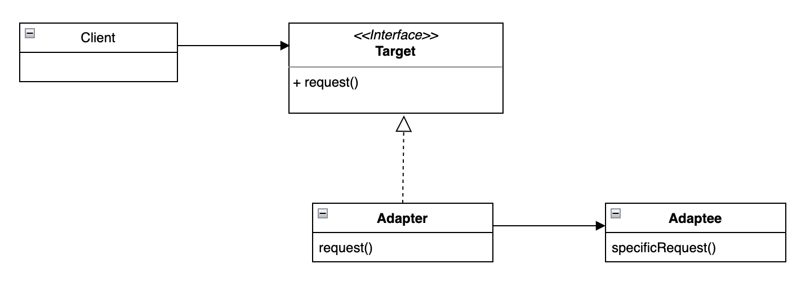
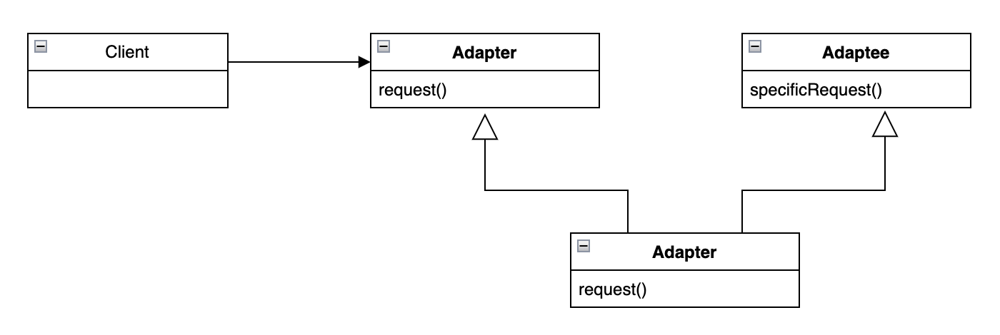
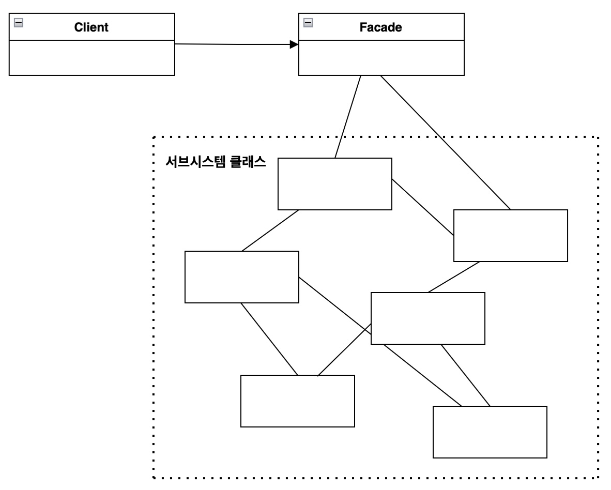

## Adapter Pattern

Adapter Pattern의 정의
> 어댑터 패턴(Adapter Pattern)은 특정 클래스 인터페이스를 클라이언트에서 요구하는 다른 인터페이스로 변환한다. 인터페이스가 호환되지 않아 같이 쓸 수 없었던 클래스를 사용할 수 있게 도와준다.

&nbsp;-&nbsp; 기존 시스템과 호환되지 않는 인터페이스를 변환해주는 어댑터를 만들어 기존 시스템과 새로운 시스템을 함께 작동할 수 있도록 해주는 패턴이다.<br>
&nbsp;-&nbsp; 클라이언트와 구현된 인터페이스를 분리할 수 있으며, 변경 내역이 어댑터에 캡슐화되기 때문에 나중에 인터페이스가 바뀌더라도 클라이언트를 바꿀 필요가 없다.<br>

Adapter Pattern의 구조
- Adaptee(Service) : 어댑터 대상 객체, 기존 시스템 / 외부 시스템 / 서드파티 라이브러리
- Target(Client Interface) : Adapter가 구현하는 인터페이스
- Adapter : Target(Client Interface)을 구현하여 호환되지 않는 Adaptee(Service) 객체를 Client에서 사용할 수 있도록 변환해주는 역할
- Client : Target(Client Interface)를 통해 실제 Service를 이용할 수 있게 된다.(Adapter에 요청)

1. 객체 어댑터(Object Adapter)<br>
&nbsp;-&nbsp; 객체 구성(Composition)을을 사용한다.<br>
&nbsp;-&nbsp; Client에서 Adapter의 method를 호출하면 Adaptee 변수의 메소드에게 할일을 위임한다.<br>
&nbsp;-&nbsp; Adaptee의 모든 서브클래스에 Adapter를 쓸 수 있다는 장점이 있다.<br>
&nbsp;-&nbsp; Client를 특정 구현이 아닌 인터페이스에 연결한다.<br>

<br>

```java
public class TurkeyAdapter implements Duck {
    Turkey turkey;

    public TurkeyAdapter(Turkey turkey) {
        this.turkey = turkey;
    }

    public void quack() {
        turkey.gobble();
    }

    public void fly() {
        for(int i=0; i<5; i++) {
            turkey.fly();
        }
    }
}
```

```java
public class DuckTestDrive {
    public static void main(String[] args) {
        Duck duck = new MallardDuck();

        Turkey turkey = new WildTurkey();
        // Turkey 객체를 TurkeyAdapter로 감싸서 Duck 객체처럼 보이게 한다.
        Duck TurkeyAdapter turkeyAdapter = new TurkeyAdapter(turkey);

        testDrive(duck);
        /*
            결과
            꽥
            날고 있어요!
        */
        testDrive(turkeyAdapter);
        /*
            결과
            골골
            짧은 거리를 날고 있어요!
            짧은 거리를 날고 있어요!
            짧은 거리를 날고 있어요!
            짧은 거리를 날고 있어요!
            짧은 거리를 날고 있어요!
        */
    }

    public void testDrive(Duck duck) {
        duck.quack();
        duck.fly();
    }
}
```

2. 클래스 어댑터(Class Adapter)<br>
&nbsp;-&nbsp; 클래스 상속을 사용한다.<br>
&nbsp;-&nbsp; Adaptee(Service)를 상속하여 객체 구현 없이 바로 코드 재사용이 가능하다.<br>
&nbsp;-&nbsp; 다중 상속이 필요한 경우에는 자바에서 사용할 수 없다.<br>

<br>

상속(Inheritance) vs 구성(Composition)<br>
| 상속(Inheritance) | 구성(Composition) |
|--|--|
| 부모 클래스와 자식 클래스 사이의 의존성은 컴파일 타임에 해결 | 두 객체 사이의 의존성은 런타임에 해결 |
| is-a 관계 | has-a 관계 |
| 부모 클래스의 구현에 의존 결합도가 높음 | 구현에 의존하지 않음<br>내부에 포함되는 객체의 구현이 아닌 인터페이스에 의존 |
| 클래스 사이의 정적인 관계 | 객체 사이의 동적인 관계 |
| 부모 클래스 안에 구현된 코드 자체를 물려 받아 재사용 | 포함되는 객체의 퍼블릭 인터페이스를 재사용 |

&ast; Public Interface : 책임을 나타내는 일종의 설명서<br>

Adapter Pattern의 특징
1. 적용 가능성<br>
&nbsp;-&nbsp; 레거시 코드를 사용하고 싶지만 새로운 인터페이스가 레거시 코드와 호환되지 않을 때<br>
&nbsp;-&nbsp; 이미 만든 것을 재사용하고자 하나 이 라이브러리를 수정할 수 없을 때<br>
&nbsp;-&nbsp; 이미 만들어진 클래스를 새로운 인터페이스(API)에 맞게 개조할 때<br>
&nbsp;-&nbsp; 소프트웨어 구 버전과 신 버전을 공존시키고 싶을 때<br>

2. Adapter Pattern의 장점<br>
&nbsp;-&nbsp; Client와 Adaptee(Service)가 분리되어 있기 때문에 단일 책임 원칙(SRP)을 만족한다.<br>
&nbsp;-&nbsp; 기존 클래스 코드를 수정하지 않고 Adapter와 함께 동작하기 때문에 개방 폐쇄 원칙(OCP)을 만족한다.<br>
&nbsp;-&nbsp; 기존 클래스와 새로운 클래스 간의 결합도를 낮출 수 있으므로 코드의 유연성과 확장성이 향상된다.<br>

3. Adapter Pattern의 단점<br>
&nbsp;-&nbsp; 추가적인 클래스와 인터페이스를 도입하고 어댑터 클래스를 작성해야 하므로 코드의 복잡성이 증가한다.<br>
&nbsp;-&nbsp; 때로는 다른 디자인 패턴이나 구조적 개선이 더 나은 선택일 수 있다.<br>
&nbsp;-&nbsp; 기존 클래스나 라이브러리의 인터페이스를 새로운 인터페이스로 감쌀 뿐이며, 두 인터페이스 간의 기능 차이가 큰 경우 제한적일 수 있다.<br>

Adapter Pattern의 적용 예제<br>
&nbsp;-&nbsp; Enumeration을 Iterator에 적응시키기<br>

```java
public class EnumerationIterator implements Iterator<Object> {
	Enumeration<?> enumeration;

	public EnumerationIterator(Enumeration<?> enumeration) {
		this.enumeration = enumeration;
	}

	public boolean hasNext() {
		return enumeration.hasMoreElements();
	}
	
	public Object next() {
		return enumeration.nextElement();
	}

    // Enumeration에서 remove() 메소드를 지원하지 않으므로 예외를 던진다.
	public void remove() {
		throw new UnsupportedOperationException();
	}
}
```

&nbsp;-&nbsp; 메소드가 일대일로 대응되지 않는 상황에서는 어댑터를 완벽하게 적용할 수 없다.<br>
&nbsp;-&nbsp; 대응되지 않는 메소드가 있는 경우, 가장 좋은 방법은 런타임 예외를 던지는 것이다.<br>

실제 사용 사례
1. java.io.inputStreamReader

```java
BufferedReader br = new BufferedReader(new InputStreamReader(System.in));
```

&nbsp;-&nbsp; System.in을 BufferedReader 객체에 사용하고 싶은데 이 중간을 InputStreamReader가 어댑터 역할을 하고 있는 것이다.<br>
&nbsp;-&nbsp; BufferedReader 클래스의 생성자는 Reader 타입을 매개변수로 받는데, System 클래스의 in은 InputStream 타입으로 되어 있다.<br>
(BufferedReader(System.in)과 같이 사용할 수 없다.)<br>

2. java.util.Arrays 의 asList()
3. java.util.Collections 의 enumeration()

Decorator Pattern vs Adapter Pattern<br>
&nbsp;-&nbsp; Decorator Pattern은 객체를 동적으로 새로운 기능을 추가하는 패턴으로, 객체를 확장하는 용도로 쓰이고 Adapter Pattern은 인터페이스를 변환하는 용도로 사용한다는 차이점이 있다.

## Facade Pattern

Facade Pattern의 정의
> 서브시스템에 있는 일련의 인터페이스를 통합 인터페이스로 묶어 준다. 또한 고수준 인터페이스도 정의하므로 서브시스템을 더 편리하게 사용할 수 있다.

&nbsp;-&nbsp; 우리가 교재를 보고 필기 노트를 하면서 재정리 하듯이 클래스를 재정리하는 행위라고 볼 수 있다.<br>
&nbsp;-&nbsp; 가장 중요한 점은 패턴의 용도로, 복잡한 시스템을 정리하여 사용자에게 단순한 인터페이스를 제공하는 것이다.<br>

Facade Pattern의 구조<br>
- Facade : 서브시스템의 기능을 편리하게 사용할 수 있도록 복잡한 로직을 재정리해 놓은 인터페이스를 말한다. Client가 이용할 수 있는 일종의 '창구'역할을 한다.
- Additional Facade : Facade 클래스는 반드시 1개만 존재할 필요가 없으므로 연관되지 않은 기능이 있다면 분리할 수 있다. 다른 Facade 클래스에서도 사용할 수 있다.
- Sub System(하위 시스템) : 복잡한 라이브러리 혹은 클래스들
- Client : Facade 클래스를 이용하여 서브 시스템의 기능을 사용한다.

<br>

Facade Pattern의 특징<br>
&nbsp;-&nbsp; 다른 디자인 패턴과 다르게 클래스 구조가 정형화 되지 않은 패턴이다.<br>
-> Facade 클래스를 만들어 서브 시스템에 해당하는 기능들을 집약시켜주면 그것이 바로 Facade Pattern이 된다.<br>
&nbsp;-&nbsp; 서브 시스템 클래스들을 캡슐화 하는 것이 아니라 서브 시스템들을 사용할 간단한 인터페이스를 제공하는 것이다.<br>
&nbsp;-&nbsp; Client가 서브 시스템 내부의 클래스에 직접 접근할 수 있다.<br>

1. 적용<br>
&nbsp;-&nbsp; 간단한 인터페이스를 통해 복잡한 시스템에 접근하고 싶을 경우<br>
&nbsp;-&nbsp; 시스템을 사용하고 있는 외부와의 결합도가 너무 높을 경우<br>

2. Facade Pattern의 장점<br>
&nbsp;-&nbsp; 복잡한 서브 시스템의 코드를 분리하여 외부에서 시스템을 사용하기 편해진다.<br>
&nbsp;-&nbsp; 서브 시스템 간의 의존 관계가 많을 경우 이를 감소시키고 의존성을 한 곳으로 모을 수 있다.<br>
-> 실제 서브 시스템의 내부 로직이 변경되더라도 매개체 역할을 하는 Facade 객체로 인해 의존송이 감소한다.<br>
&nbsp;-&nbsp; Client가 서브 시스템의 코드를 모르더라도 Facade 클래스만 이해하고 사용할 수 있다.<br>

3. Facade Pattern의 단점<br>
&nbsp;-&nbsp; Facade 객체가 모든 클래스에 결합된 전지전능한 객체가 될 수 있다.<br>
&nbsp;-&nbsp; Facade 객체 자체가 서브 시스템에 대한 의존성을 가지게 된다.<br>
&nbsp;-&nbsp; 추가적인 코드가 늘어나 유지보수 측면에서 공수가 더 많이 들게 된다.<br>

최소 지식 원칙(Principle of Least Knowledge)

> 모듈 간의 결합도를 최소화하여 설계한다는 원칙이다.

최소 지식 원칙의 가이드라인
1. 객체 자체
2. 메소드에 매개변수로 전달된 객체
3. 메소드를 생성하거나 인스턴스를 만든 객체
4. 객체에 속하는 구성 요소

```java
// 원칙을 따르지 않은 경우
public float getTemp() {
    Thermometer thermometer = station.getThermometer();
    return thermometer.getTemperature();
    // station으로부터 thermometer 객체를 받은 다음, 그 객체의 getTemperature() 메소드를 직접 호출
}

// 원칙을 따르는 경우
public float getTemp() {
    return station.getTemperature();
    // 최소 지식 원칙을 적용해서 thermometer에게 요청을 전달하는 메소드를 station 클래스에 추가한다.
}
```

최소 지식 원칙의 장점<br>
&nbsp;-&nbsp; 객체 사이의 의존성을 줄일 수 있어 소프트웨어 관리가 더 편해진다.<br>

최소 지식 원칙의 단점<br>
&nbsp;-&nbsp; 메소드 호출을 처리하는 래퍼 클래스를 더 만들어야 할 수도 있기 때문에 시스템이 복잡해지고 성능이 떨어지게 된다.<br>

출처<br>
&nbsp;-&nbsp; https://inpa.tistory.com/entry/GOF-%F0%9F%92%A0-%EC%96%B4%EB%8C%91%ED%84%B0Adaptor-%ED%8C%A8%ED%84%B4-%EC%A0%9C%EB%8C%80%EB%A1%9C-%EB%B0%B0%EC%9B%8C%EB%B3%B4%EC%9E%90 <br>
&nbsp;-&nbsp; https://refactoring.guru/design-patterns/adapter <br>
&nbsp;-&nbsp; https://inpa.tistory.com/entry/GOF-💠-퍼사드Facade-패턴-제대로-배워보자 <br>
&nbsp;-&nbsp; https://refactoring.guru/ko/design-patterns/facade