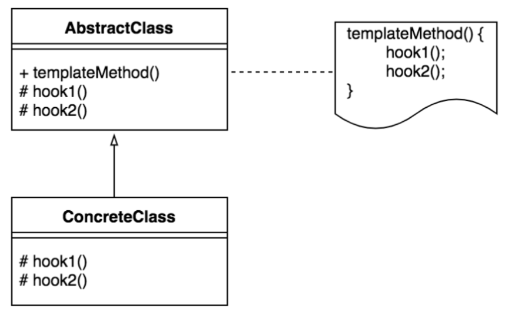
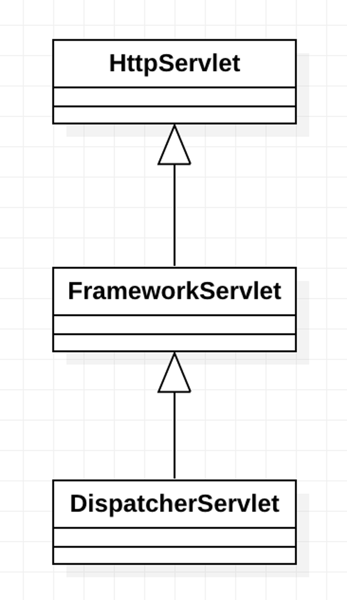

# Template Method Pattern (템플릿 메소드 패턴)

## OverView

> 클래스와 메소드등 다양한 요소들을 캡슐화 하며 패턴화를 했다.<br>
> 탬플릿 메소드 패턴은 기능의 프레임(템플릿)와 실제 구현을 분리하는 패턴이다.
>
> </img>

전체적인 알고리즘은 유사하지만 몇몇부분이 다른 경우에 사용한다.<br>
책에서 예시로 하듯이 동인한 음료 제작 과정이지만 커피와 차의 경우에는 다른 부분이 있다.<br>
이런 경우에는 템플릿 메소드 패턴을 사용하여 공통된 부분을 추상화 하고 다른 부분은 서브클래스에서 구현하도록 한다.<br>

## 구조

```java
public abstract class CaffeineBeverage {
    // 상위에서 제어하는 메소드
    final void prepareRecipe() {
        boilWater();
        brew();
        pourInCup();
        addCondiments();
    }

    abstract void brew(); // 탬플릿화된 메소드

    abstract void addCondiments();// 탬플릿화된 메소드

    void boilWater() {
        System.out.println("물 끓이는 중");
    }

    void pourInCup() {
        System.out.println("컵에 따르는 중");
    }
}
```

```java
public class Coffee extends CaffeineBeverage {
    @Override
    void brew() {
        System.out.println("필터를 통해서 커피를 우려내는 중");
    }

    @Override
    void addCondiments() {
        System.out.println("설탕과 우유를 추가하는 중");
    }
}
```

-----

> 설명만 봐도 뭔가 느껴지듯이 실제로 현재도 자바에서도 자주 사용되고
> 우리도 직접 만들 경우가 있을법한 알고리즘이다.
>
> 두 가지의 하위클래스에서 사용되지만 변하지 않는 기능, 공통된 기능을 저장하고 확장 기능만 하위클래스에서 구현하면 된다는.
> 굉장히 직관적이고 쉬운 패턴이다.
> Simple is Best 라고 쉬운대신 강력한 기능을 가진 패턴이라고 생각한다.


-----

## Spring 에서 적용된 대표적인 사례

### DispatcherServlet

<div style="display: flex;width: 100%; border: 1px solid wheat">
<div style="width: 50%; padding: 20px; text-align: center">
스플링을 배울때 가장 앞부분에서<br> 
배우는 DispatcherServlet이다.<br>
Spring 에서 DispatcherServlet은<br>
Http 요청에 대해 처리한다<br>
DispatcherServlet은 Servlet을 상속받는다.<br><br>

processRequest() 는 템플릿 메소드로 정의되어 있어 doService()를 호출한다.<br>
이 메소드는 추상 메소드로 정의되어 있어<br>
DispatcherServlet에서 구현해야 한다.<br>
이렇게하면 Http 프로토콜의 공통 부분을 공통 처리할 수 있다
</div>

</div>

```java
public abstract class FrameworkServlet extends HttpServletBean implements ApplicationContextAware {
    protected final void processRequest(HttpServletRequest request, HttpServletResponse response) throws ServletException, IOException {
        initContextHolders(request, localeContext, requestAttributes);

        try {
            doService(request, response); // template method pattern 이용
        } finally {

        }
    }

    protected abstract void doService(HttpServletRequest request, HttpServletResponse response) throws Exception; // subClass에게 위임
}

public class DispatcherServlet extends FrameworkServlet {
    @Override
    protected void doService(HttpServletRequest request, HttpServletResponse response) throws Exception {
        logRequest(request);
    }
}
```

------

### 단점

- 상속을 사용해야한다. == 상속의 단점을 모두 가진다.
- 상위 클래스와 하위 클래스간의 강한 결합이 발생한다.
- 상위 클래스의 변경이 하위 클래스에 영향을 미친다.
    - 알고리즘의 크기가 커질 경우 하위 클래스의 부담이 늘어간다.

