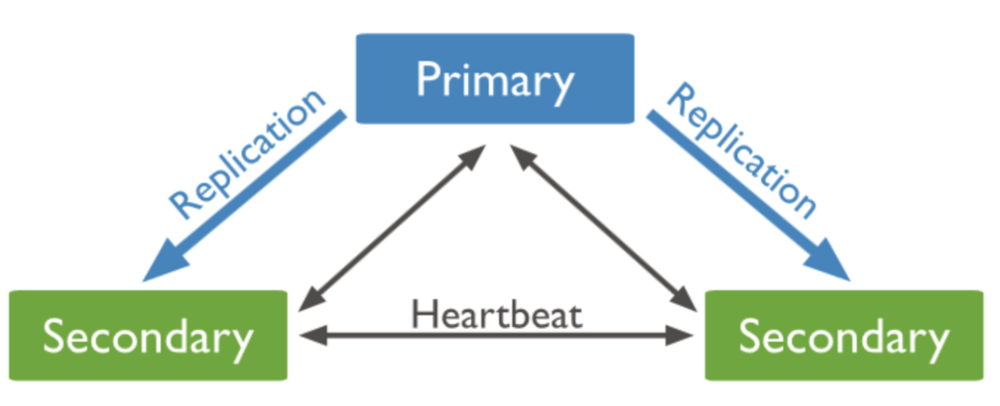
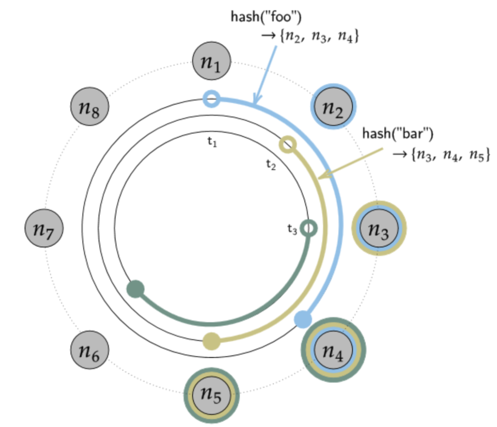
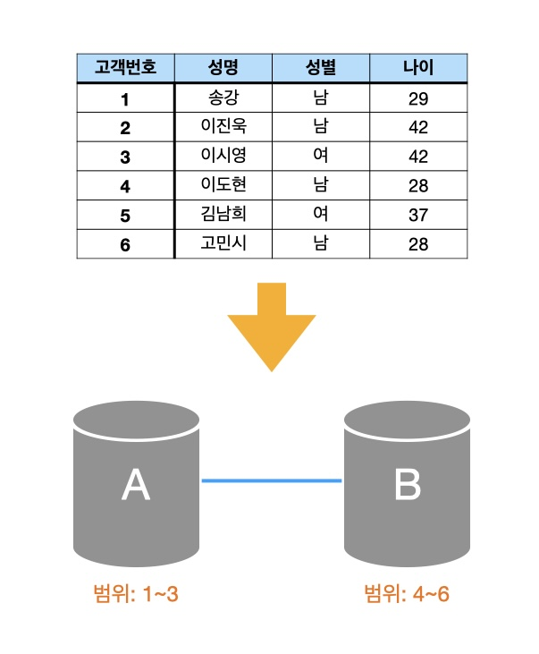
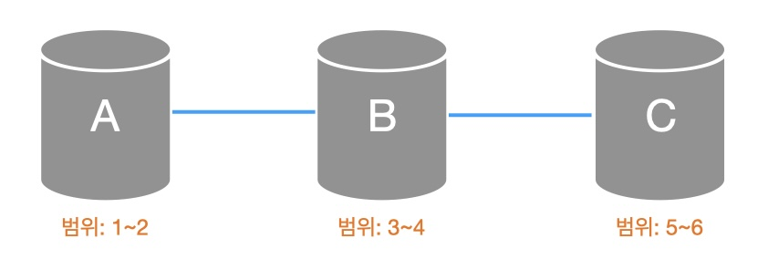
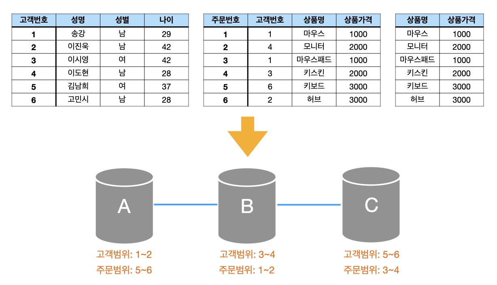
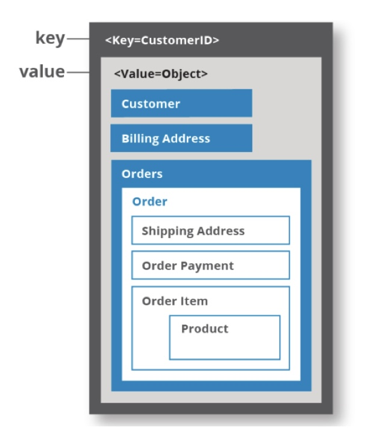
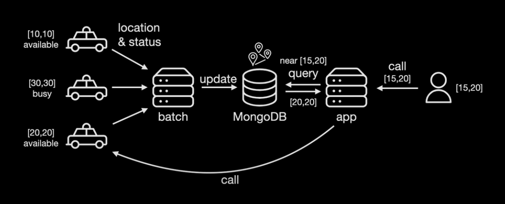
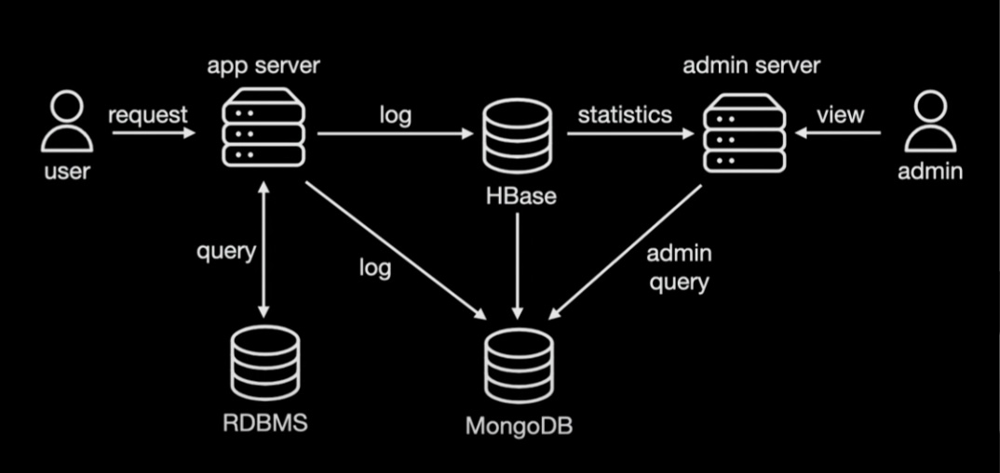

## NoSQL

1. NoSQL의 등장 
- 관계 데이터베이스 
&nbsp;-&nbsp; 정형 데이터 관리 
&nbsp;-&nbsp; 데이터의 형태와 크기 미리 지정 
&nbsp;-&nbsp; 테이블 단위로 구분하여 데이터 저장 
&nbsp;-&nbsp; 트랜잭션을 통한 ACID(원자성, 일관성, 격리성, 지속성) 보장 
&nbsp;-&nbsp; JOIN 등 복잡한 조건을 포함하는 데이터 검색 가능 
 
- NoSQL 
&nbsp;-&nbsp; 비정형 데이터 관리 
&nbsp;-&nbsp; 클러스터 환경에서의 확장성 
&nbsp;-&nbsp; 빅데이터 저장과 처리 
 
&xrarr; 대량의 데이터 처리를 위해 관계 데이터베이스를 대신할 새로운 대안으로 NoSQL이 제시되었다. 
&xrarr; NoSQL은 Not Only SQL의 약자로 관계 데이터베이스만 고집하지 말고 필요에 따라 다른 특성을 제공하는 데이터베이스를 사용하는 것이 좋다는 의미로 이해하는 것이 적절하다. 
 

※ 관계 데이터베이스와 NoSQL의 비교 

|구분|관계 데이터베이스|NoSQL|
|------|---|---|
|처리 데이터|정형 데이터|정형 데이터, 비정형(반정형 포함) 데이터|
|대용량 데이터|대용량 처리 시 성능 저하|대용량 데이터 처리 지원|
|스키마|미리 정해진 스키마가 존재|스키마가 없거나 변경이 자유로움|
|트랜잭션|트랜잭션을 통해 일관성 유지를 보장함|트랜잭션을 지원하지 않아 일관성 유지를 보장하기 어려움|
|검색 기능|조인 등의 복잡한 검색 기능 제공|단순한 데이터 검색 기능 제공|
|확장성|클러스터 환경에 적합하지 않음|클러스터 환경에 적합함|
|라이선스|고가의 라이선스 비용|오픈 소스|
|대표적 사례|Oracle, MySQL, MS SQL 서버 등|카산드라, 몽고DB, H베이스 등|
 

2. NoSQL의 특징 
&nbsp;-&nbsp; 저럼한 비용으로 여러 대의 컴퓨터에 데이터를 분산&bull;저장&bull;처리한다. 
&nbsp;-&nbsp; 관계 데이터 모델보다 융통성 있는 데이터 모델을 사용한다. 
&nbsp;-&nbsp; 스키마 없이 동작하기 때문에 데이터 구조를 미리 정의할 필요가 없다. 
&nbsp;-&nbsp; 데이터 구조를 수시로 변경할 수 있다. 
 
&xrarr; 관계 데이터베이스와 NoSQL의 사용 목적이 다르기 때문에 NoSQL을 관계 데이터베이스의 경쟁자로 볼 필요는 없다. 
 
1&rpar; 장점 
&nbsp;-&nbsp; RDBMS에 비해 저렴한 비용으로 분산처리와 병렬 처리 가능하다. 
&nbsp;-&nbsp; 비정형 데이터 구조 설계로 설계 비용이 감소한다. 
&nbsp;-&nbsp; Big Data 처리에 효과적 
&nbsp;-&nbsp; 가변적인 구조로 데이터 저장이 가능 
&nbsp;-&nbsp; 데이터 모델의 유연한 변화가 가능 
 
2&rpar; 단점 
&nbsp;-&nbsp; 데이터 업데이트 중 장애가 발생하면 데이터 손실 발생 가능 
&nbsp;-&nbsp; 많은 인덱스를 사용하려면 충분한 메모리가 필요. 인덱스 구조가 메모리에 저장 
&nbsp;-&nbsp; 데이터 일관성이 항상 보장되지 않음 
 

CAP 이른 
&nbsp;-&nbsp; '적절한 응답 시간 내 세 가지 속성을 모두 만족시키는 분산 시스템을 구성할 수 없다' 는 이론이다. 

1. 일관성(Consistency) : 사용자가 분산 데이터베이스 상에서 어떤 노드와 통신하는지와는 상관없이 같은 데이터를 조회할 수 있는 것을 의미한다. 그러나 시스템이 모든 인스턴스에 변경 내용을 즉각 반영하는 것은 사실상 불가능에 가깝다. 따라서 일관성의 목표는 데이터의 동기화가 충분히 빨라 사용상의 문제가 없게끔 하는 것이다.
2. 가용성(Availability) : 모든 요청이 응답을 받을 수 있어야 한다는 것을 의미힌다. 즉, 시스템이 중단되는 일 없이 언제든지 사용 가능한 상태여야 한다는 것이다.
3. 분할 허용성(Partitioning tolerance) : 분할이란 노드 간 통신이 끊어지는 것을 말하며, 분할 허용성이란 시스템 내 분할이 생기더라도 시스템이 여전히 동작하는 것을 의미한다. 즉, 한 노드가 다른 노드와 통신할 수 없을 때 다른 복제 노드가 사용자 요청에 응답할 수 있어야 한다. 분할 허용성은 분산 데이터베이스 시스템에서 필수적이다.
 

 
CP 시스템 VS AP 시스템 
&nbsp;-&nbsp; 시스템은 네트워크 장애나 여러 가지 원인들로 인해 장애가 발생할 수 밖에 없다. 그러므로 분산 데이터베이스 시스템은 반드시 분할 허용성을 가지고 있어야 하며, 일관성과 가용성 중 하나를 선택해야만 한다. 
 
1&rpar; CP 시스템 - MongoDB 
 
 
MongoDB는 데이터를 하나 혹은 여러 개의 Primary Node에 이진 JSON 형태로 저장한다. 각 Primary Node는 여러 개의 Secondary Node(복제본)를 가진다. Primary Node가 중단될 경우 Secondary Node 중 하나가 Primary Node로 올라가야 하는데 그 전까지 시스템은 모든 쓰기 작업이 불가능한 상태가 된다. 
 
2&rpar; AP 시스템 - Cassandra 
 
 
Cassandra는 Primary Node 없이 모든 Node가 읽기와 쓰기 작업을 수행할 수 있고, 복제본을 분리된 다른 노드에 저장한다. 한 Node가 다른 Node와 통신할 수 없는 상황에서 해당 Node는 여전히 읽기 작업과 쓰기 작업을 수행할 수는 있으나 데이터가 다른 Node와 일치하지 않는 상태, 즉 일관성이 깨진 상태가 된다. 이를 최종적 일관성(Eventual Consistency)을 통해 추후에 복구한다. 
 
최종적 일관성(Eventual Consistency)란 
데이터가 변경될 경우 모든 Node에 즉각적으로 반영할 수 없기 때문에 지금은 일치하지 않더라도 최종적으로는 데이터가 동기화되어 일관성이 유지되는 것을 말한다. 
 

수평적 확장(RDB vs NoSQL) 
1&rpar; RDB 
&nbsp;-&nbsp; 수평적 확장을 통해 서버 2대를 사용할 경우, 하나의 테이블 데이터를 2개로 분리하여 저장한다.  

  
&nbsp;-&nbsp; 새로운 서버를 추가할 경우
  

  
&nbsp;-&nbsp; 관계 테이블이 존재할 경우
  

  
&xrarr; 고객과 상품 사이에 주문이라는 관계가 있을 경우, 어떤 기준으로 나누어 따로 저장할 것인가? 
&xrarr; 관계가 복잡하고 데이터가 많으면 많을수록 RDB에서의 수평적 확장은 관리가 매우 복잡해진다. 

> 샤딩(Sharding)이란 
같은 테이블 스키마를 가진 데이터를 다수의 데이터베이스에 분산하여 저장하는 방법을 의미한다. (Horizontal Partitioning)

2&rpar; NoSQL 
 

  
&nbsp;-&nbsp; NoSQL은 특정 컬렉션에 모든 데이터가 저장되는 형태로 데이터 중복을 허용한다. 
&nbsp;-&nbsp; 단순히 구간만 정해서 데이터를 분산하면 된다. 

3. NoSQL의 종류 
NoSQL은 어떤 데이터 모델로 데이터를 저장하느냐에 따라 종류를 분류할 수 있다.
  
1&rpar; 키-값(key-value) 데이터베이스 
NoSQL의 가장 단순한 형태로, 키와 값의 쌍으로 데이터가 저장된다. 어떠한 형태의 값도 저장할 수 있고 질의 처리 속도도 빠르다. 다만, 키를 통해 특정 값을 지정하기 때문에 키를 이용해 값 전체를 검색할 수는 있지만 값의 일부를 검색하거나 값의 내용을 이용한 질의는 할 수 없고 별도의 처리가 필요하다. 
예&rpar; 아마존의 다이나모DB(DynamoDB)와 트위터의 레디스(Redis)등이 대표적이다.  
2&rpar; 문서 기반(document-based) 데이터베이스 
키-값 데이터 모델이 확장된 형태로, 키와 문서의 쌍으로 데이터를 저장한다. 트리 형태의 계층적 구조가 존재하는 JSON, XML 등과 같은 반정형 형태의 문서로 데이터를 저장한다. 문서는 객체지향에서 객체의 개념과 유사하다. 키를 통해 문서 전체를 검색하는 것도 가능하지만 XQuery와 같은 특별한 문서 대상 질의 언어를 이용하면 문서 내의 일부를 검색하거나 질의에 활용할 수 있다.
예&rpar; 몽고DB(Mongo DB)와 카우치DB(CouchDB)등이 대표적이다.  
3&rpar; 컬럼 기반(column-based) 데이터베이스 
관계 데이터 모델의 테이블과 비슷한 컬럼 패밀리와 키의 쌍으로 데이터를 저장한다. 컬럼 패밀리는 관련 있는 컬럼 값들이 모여서 구성되는데, 컬럼의 이름과 값이 모여 있는 모습이 마치 테이블에서 속성의 이름과 값이 모여 있는 모습과 유사해 보인다. 컬럼 패밀리는 테이블에서 1개의 튜플을 구성하는 속성들의 모임으로 생각할 수 있고 각 행을 구분하는 키로 각 컬럼 패밀리를 식별한다. 다양한 형태의 데이터를 값으로 저장할 수 있고 컬럼 패밀리, 즉 행마다 컬럼의 구성을 다르게 할 수 있다.
예&rpar; 구글의 빅테이블(BigTable), H베이스(HBase), 카산드라(Cassandra)등이 대표적이다.  
4&rpar; 그래프 기반(graph-based) 데이터베이스 
그래프 데이터 모델은 관계 데이터 모델과 비슷하게 데이터는 물론 데이터 간의 관계를 표현하는 데 적합하다. 노드에 데이터를 저장하고 간선으로 데이터 간의 관게를 표현하는 그래프의 형태로, 질의는 그래프 순회 과정을 통해 처리한다. 다른 NoSQL 데이터 모델과 달리 트랜잭션을 통해 ACID를 지원하며 클러스터 환경에는 적합하지 않다. 연관 데이터를 추천해주거나 소셜 네트워크에서 친구 찾기 질의를 효율적으로 수행하는 데 적합한 데이터베이스이다.
에&rpar; 네오포제이(Neo4J), 오리엔트DB(OrientDB), 아젠스크래프(AgensGraph)등이 대표적이다.

4. NoSQL 사용 사례 - 카카오 
&nbsp;-&nbsp; 2020 기준 카카오 MongoDB 사용 비율 
&xrarr; MongoDB 20% / RDBS 80% 
 
1&rpar; 카카오모빌리티 - 공간 인덱스 
 
 
&lpar;1&rpar; 전국 택시들은 위치 정보, 승차 가능 여부 등 여러가지 정보를 주기적으로 batch server로 데이터를 전송한다. 
&lpar;2&rpar; batch server에서 택시 정보를 MongoDB에 지속적으로 업데이트한다. 
&lpar;3&rpar; 카카오택시 사용자가 택시를 호출하면 사용자의 위치 정보가 같이 전송된다. 
&lpar;4&rpar; 사용자의 요청을 받은 app server는 사용자의 위치를 기준으로 일정 범위 내의 탑승 가능한 택시 정보를 MongoDB에서 조회한다. 
&lpar;5&rpar; MongoDB는 공간 인덱스를 활용하여 요청받은 쿼리를 빠르게 처리하여 호출 가능한 택시 정보를 리턴한다. 
&lpar;6&rpar; app server는 리턴된 결과를 보고 호출 대상이 된 택시들에게 승객 콜을 전달한다. 
 
*&nbsp;특정 좌표를 기준으로 일정 범위 내의 데이터를 찾아야 하므로 공간 인덱스가 활용된다. 
*&nbsp;공간 좌표 정보와 일반 정보를 함께 모아서 복합 인덱스로 구성할 수 있다. 
 
2&rpar; 대용량 로그 저장 및 조회 
 
 
&lpar;1&rpar; 사용자가 서비스를 요청하면 app server는 요청 받은 데이터를 DB에서 읽어오거나 저장한다. 
(이런 형태의 데이터는 빠르고 정확하게 제공되어야 하므로 RDBMS를 사용한다.) 
&lpar;2&rpar; 사용자의 요청은 로그로 저장되며, 저장된 로그는 통계로 분석하여 서비스 개선에 활용한다. 
&lpar;3&rpar; 로그의 통계를 내는 작업은 특정 기간에 대한 전체 데이터를 읽어야 한다. 전체 데이터를 읽어야 하는 목적으로 HBase가 많이 사용된다. 
&lpar;4&rpar; 원하는 데이터를 빠르게 찾아내려면 데이터와 관련된 인덱스가 있어야 하고, 이러한 문제를 해결하기 위해 MongoDB를 도입하고 있다. 
&lpar;5&rpar; MongoDB는 필요한 필드에 필요한만큼 인덱스를 생성할 수 있어 대용량 데이터에서도 원하는 데이터를 빠르게 찾을 수 있다. 
&lpar;6&rpar; HBase에 있는 데이터를 주기적으로 MongoDB에 적재해둔 뒤에 관리자 특정 조건으로 데이터를 찾아야할 때 MongoDB를 이용하여 빠르게 데이터를 찾고 있다. 
 
*&nbsp;카카오모빌리티, 카카오페이지, 카카오커머스, 카카오톡 등 사용 
 

출처 :  
&nbsp;-&nbsp; 김연희 지음, 데이터베이스 개론, 한빛아카데미(2022)  
&nbsp;-&nbsp; https://shuu.tistory.com/135  
&nbsp;-&nbsp; https://onduway.tistory.com/106  
&nbsp;-&nbsp; https://pinopino.tistory.com/entry/5-SQL-vs-NoSQL-비교-리플리케이션-클러스터링-샤딩  
&nbsp;-&nbsp; https://broccoli45.tistory.com/46  
&nbsp;-&nbsp; https://elseif.kakao.com/2020/session/126