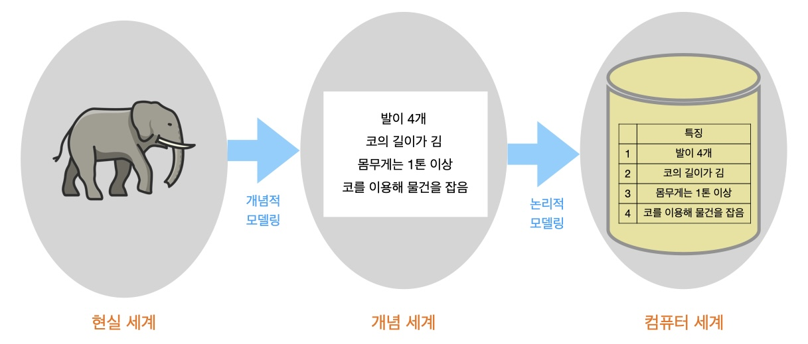
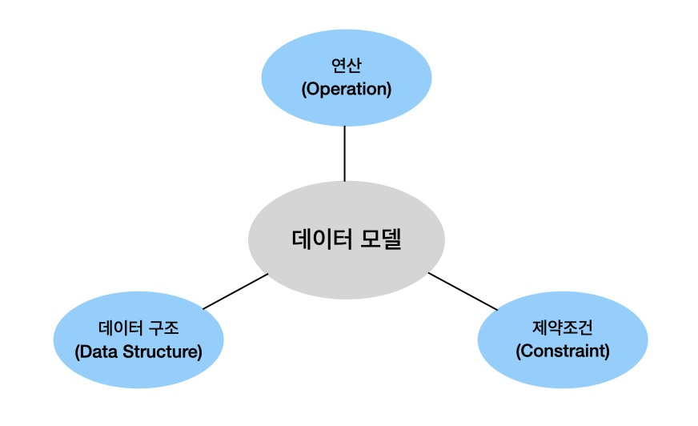
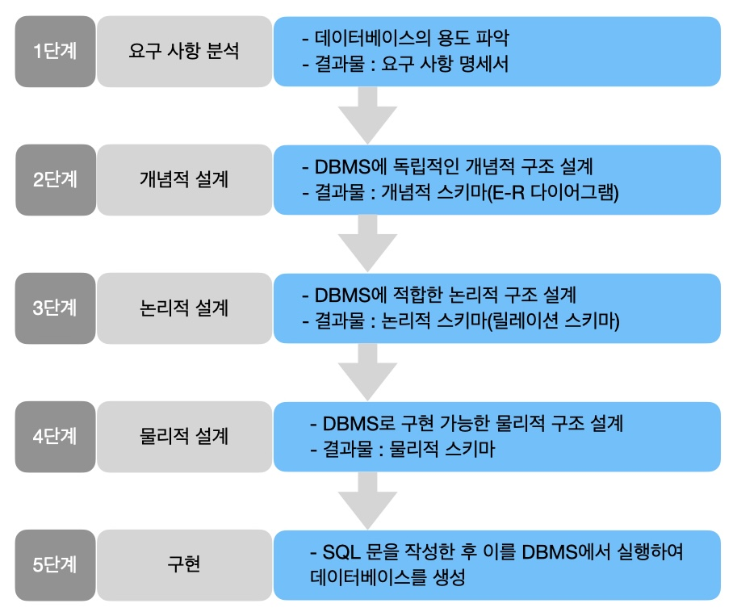
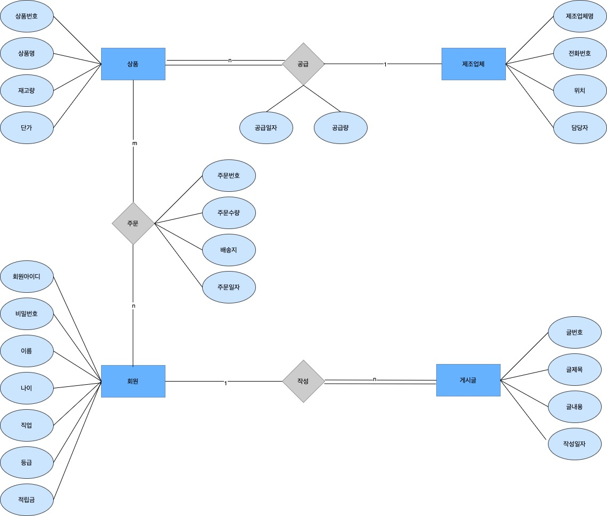
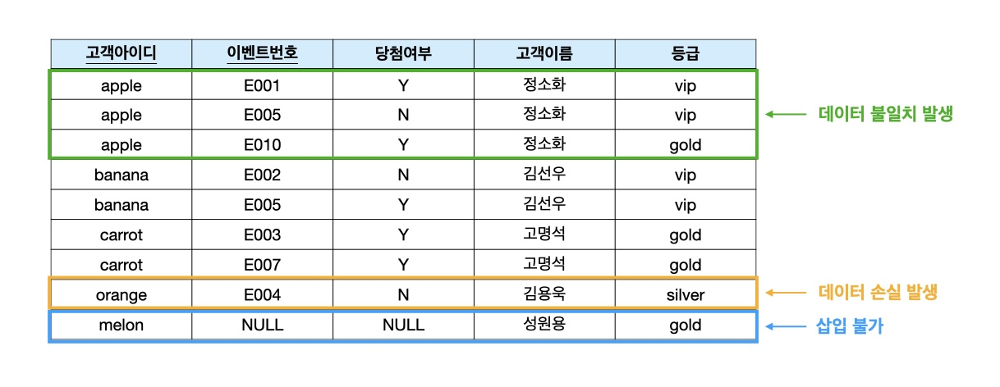
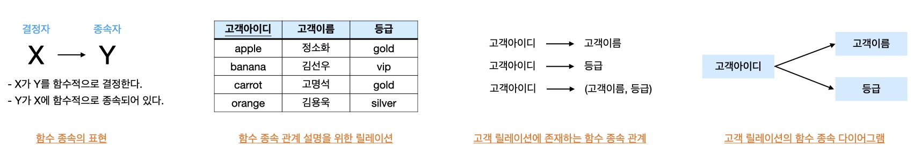
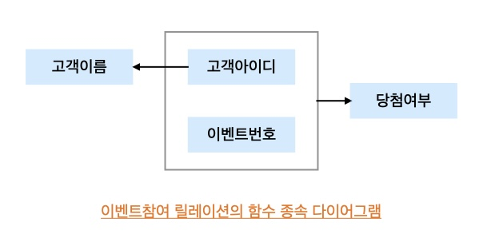
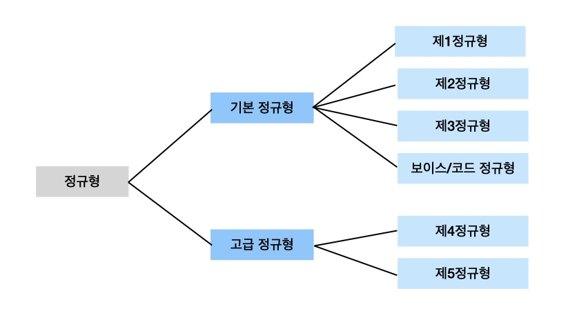

## 데이터 모델링

> 데이터 모델링은 현실 세계에 존재하는 데이터를 컴퓨터 세계의 데이터베이스로 옮기는 변환 과정이다.

 

 

데이터 모델링의 종류
- 개념적 데이터 모델링 : 현실 세계의 중요 데이터를 추출하여 개념 세계로 옮긴다.
- 논리적 데이터 모델링 : 개념 세계의 데이터를 데이터베이스에 저장하는 구조로 표현한다.

 

데이터 모델 
&nbsp;-&nbsp;데이터 모델링의 결과물을 표현하는 도구이다.
- 개념적 데이터 모델 : 현실 세계를 사람의 머리로 이해할 수 있도록 개념적 모델링의 결과물인 개념적 구조로 표현하는 도구다.
- 논리적 데이터 모델 : 개념적 구조를 논리적으로 모델링하여 논리적 구조로 표현하는 도구다.

    

 

개체-관계 모델 
&nbsp;-&nbsp;개체와 개체 간의 관계를 이용해 현실 세계를 개념적 구조로 표현하는 개념적 데이터 모델이다.
- 개체 : 현실 세계에서 조직을 운영하는데 꼭 필요한 사람이나 사물과 같이 구별되는 모든 것을 의미한다.
- 속성 : 개체나 관계가 가지고 있는 고유한 특성이다.
- 관계 : 개체와 개체가 맺고 있는 의미 있는 연관성이다.

 

개체-관계 다이어그램 
&nbsp;-&nbsp;개체-관계 모델을 이용해 현실 세계를 개념적으로 모델링한 결과물을 그림으로 표현한 것이다. E-R 다이어그램이라고도 한다. 
&nbsp;-&nbsp;기본적으로 개체를 표현하는 사각형, 개체 간의 관계를 표현하는 마름모, 개체나 관계의 속성을 표현하는 타원과 각 요소들을 연결하는 선으로 구성된다. 

논리적 데이터 모델 
&nbsp;-&nbsp;사용자 입장에서 선택한 데이터베이스 관리 시스템에 따라 E-R 다이어그램으로 표현된 개념적 구조를 다음과 같이 데이터베이스에 저장할 형태로 표현한 데이터베이스의 논리적인 구조다.
- 관계 데이터 모델 : 데이터베이스의 논리적 구조가 2차원 테이블 형태다.
- 계층 데이터 모델 : 데이터베이스의 논리적 구조가 트리 형태다.
- 네트워크 데이터 모델 : 데이터베이스의 논리적 구조가 그래프 형태다.

## 데이터베이스 설계
> 데이터베이스 설계는 사용자들의 요구 사항을 고려하여 데이터베이스를 생성하는 과정이다. - 데이터베이스를 실제로 사용하는 구성원들의 요구 사항을 만족하는지 - 데이터의 일관성과 무결성을 유지하면서 사용자가 이해하기 쉽고 접근하지 편한지

데이터베이스 설계 방법
1. E-R 모델과 릴레이션 변환 규칙을 이용한 데이터베이스 설계
2. 정규화를 이용한 데이터베이스 설계

 

데이터베이스 설계 과정 

    

 
&ast; 설계 과정 중에 오류를 발견하여 변경이 필요하면 이전 단계로 되돌아가 설계 내용을 변경할 수도 있다.

 

1. 1단계 : 요구 사항 분석 
&nbsp;-&nbsp;데이터베이스를 사용해 실제 업무를 처리하는 사용자에게서 다양한 요구사항을 수집한다. 
&nbsp;-&nbsp;수집한 요구 사항을 분석하여 그 결과를 요구 사항 명세서로 작성한다. 
2. 2단계 : 개념적 설계 
&nbsp;-&nbsp;일반적으로 개념적 데이터 모델은 E-R 모델을 많이 이용한다. 
&nbsp;-&nbsp;요구 사항 분석 결과를 기반으로 현실 세계에서 중요한 데이터 요소인 개체를 추출한 후 개체 간의 관계를 결정하여 이를 E-R 다이어그램으로 표현한다. 
&nbsp;-&nbsp;개념적 설계 단계에서 요구 사항 명세서를 개념적 데이터 모델로 변환하는 일을 개념적 모델링이라고 한다. 
&nbsp;-&nbsp;E-R 다이어그램과 같이 개념적 데이터 모델로 표현한 결과물을 개념적 구조 또는 개념적 스키마라고 한다. 
3. 3단계 : 논리적 설계 
&nbsp;-&nbsp;논리적 데이터 모델을 이용해 표현한다. 
&nbsp;-&nbsp;네트워크 데이터 모델, 계층 데이터 모델, 관계 데이터 모델, 객체지향 데이터 모델 중 관계 데이터 모델을 많이 사용한다. 
&nbsp;-&nbsp;논리적 설계 단계에서 E-R 다이어그램을 릴레이션 스키마로 변환하는 작업을 논리적 모델링 또는 단순히 데이터 모델링이라고 한다. 
&nbsp;-&nbsp;릴레이션 스키마와 같이 논리적 데이터 모델로 표현된 결과물을 논리적 구조 또는 논리적 스키마라고 한다. 
4. 4단계 : 물리적 설계 
&nbsp;-&nbsp;데이터베이스의 물리적 구조는 데이터베이스를 저장 장치에 실제로 저장하기 위한 내부 저장 구조와 접근 경로 등을 의미한다. 
&nbsp;-&nbsp;물리적 설계 단계에서는 저장 장치에 적합한 저장 레코드와 인덱스의 구조 등을 설계하고, 저장된 데이터와 인덱스에 빠르게 접근하게 할 수 있는 탐색 기법 등을 정의한다. 
&nbsp;-&nbsp;데이터베이스를 실제로 구축할 컴퓨터 시스템의 저장 장치와 운영체제의 특성을 고려하여, 효율적인 성능을 지원하면서도 사용할 DBMS로 구현이 가능한 물리적인 구조를 설계하는 것이 주요 작업이다. 
&nbsp;-&nbsp;물리적 설계 단계에서는 응답 시간을 최소화하고 저장 공간을 효율적으로 활용하면서 데이터베이스 시스템의 처리 능력을 향상시킬 수 있도록 물리적 구조를 설계해야 한다. 
&nbsp;-&nbsp;물리적 설계의 결과물인 물리적 구조를 내부 스키마 또는 물리적 스키마라고 한다. 
5. 5단계 : 구현 
&nbsp;-&nbsp;설계 단계의 결과물을 기반으로 DBMS에서 SQL로 작성한 명령문을 실행하여 데이터베이스를 실제로 생성한다. 

 

    E-R 다이어그램  
    

 
릴레이션 스키마 변환 규칙  

1. 규칙 1 : 모든 개체는 릴레이션으로 변환한다.
2. 규칙 2 : 다대다 관계는 릴레이션으로 변환한다.
3. 규칙 3 : 일대다 관계는 외래키로 표현한다. 
1&rpar; 규칙 3-1 : 일반적인 일대다 관계는 외래키로 표현한다. 
2&rpar; 규칙 3-2 : 약한 개체가 참여하는 일대다 관계는 외래키를 포함해서 기본키로 지정한다. 
4. 규칙 4 : 일대일 관계는 외래키로 표현한다. 
1&rpar; 일반적인 일대일 관계는 외래키를 서로 주고 받는다. 
2&rpar; 일대일 관계에 필수적으로 참여하는 개체의 릴레이션만 외래키를 받는다. 
3&rpar; 모든 개체가 일대일 관게에 필수적으로 참여하면 릴레이션 하나로 합친다. 
5. 규칙 5 : 다중 값 속성은 릴레이션으로 변환한다.

## 정규화

> 데이터베이스를 잘못 설계하면 불필요한 데이터 중복이 발생하여 릴레이션에 대한 데이터의 삽입&bull;수정&bull;삭제 연산을 수행할 때 부작용이 발생할 수 있다. 이러한 부작용을 이상(anomaly) 현상이라 한다. 이상 현상을 제거하면서 데이터베이스를 올바르게 설계해나가는 과정을 정규화라고 한다.

이상 현상의 종류 

1. 삽입 이상 : 새 데이터를 삽입하기 위해 불필요한 데이터도 함께 삽입해야 하는 문제
2. 갱신 이상 : 중복 투플 중 일부만 변경하여 데이터가 불일치하게 되는 모순의 문제
3. 삭제 이상 : 투플을 삭제하면 꼭 필요한 데이터까지 함께 삭제되는 데이터 손실의 문제

 

> 이상 현상이 발생하지 않도록 하려면, 관련 있는 속성들로만 릴레이션을 구성해야 하는데 이를 위해 필요한 것이 정규화이다. 정규화는 이상 현상이 발생하지 않도록, 릴레이션을 관련이 있는 속성들로만 구성하기 위해 릴레이션을 분해하는 과정이다.

함수 종속  
하나의 릴레이션을 구성하는 속성들의 부분 집합을 X와 Y라 할 때, 릴레이션 내의 모든 튜플에서 X값에 대한 Y값이 항상 하나면 "X가 Y를 함수적으로 결정한다" 또는 "Y가 X에 함수적으로 종속되어 있다"라고 한다.

 

1. 완전 함수 종속 : 릴레이션에서 속성 집합 Y가 속성 집합 X에 함수적으로 종속되어 있지만, 속성 집합 X 전체에 종속된 것이지 일부분에 종속된 것이 아니다.
2. 부분 함수 종속 : 속성 집합 Y가 속성 집합 X의 전체가 아닌 일부분에도 함수적으로 종속됨을 의미하므로, 부분 함수 종속 관계가 서립하려면 결정자가 여러 개의 속성들로 구성되어 있어야 한다.

    

 

기본 정규형과 정규화 과정 

 

1. 제1정규형(1NF) 
&nbsp;-&nbsp;릴레이션에 속한 모든 속성의 도메인이 원자값으로만 구성되어 있으면 제1정규형에 속한다. 
2. 제2정규형(2NF) 
&nbsp;-&nbsp;릴레이션이 제1정규형에 속하고, 기본키가 아닌 모든 속성이 기본키에 완전 함수 종속되면 제2정규형에 속한다. 
&nbsp;-&nbsp;릴레이션을 분해할 때 자연 조인을 하면 원래의 릴레이션으로 다시 복원될 수 있도록 정보의 손실 없이 릴레이션을 분해하는 것을 '무손실 분해'라고 하며, 정규화 과정에서 수행되는 릴레이션의 분해는 무손실 분해여야 한다. 
3. 제3정규형(3NF) 
&nbsp;-&nbsp;릴레이션이 제2정규형에 속하고, 기본키가 아닌 모든 속성이 기본키에 이행적 함수 종속이 되지 않으면 제3정규형에 속한다. 
&nbsp;-&nbsp;릴레이션을 구성하는 3개의 속성 집합 X, Y, Z에 대해 함수 종속 관계 X &rarr; Y와 Y &rarr; Z가 존재하면 논리적으로 X &rarr; Z가 성립한다. 이때 속성 집합 Z가 속성 집합 X에 이행적으로 함수 종속되었다고 한다.  
  
4. 보이스/코드 정규형(BCNF) 
&nbsp;-&nbsp;릴레이션의 함수 종속 관계에서 모든 결정자가 후보키이면 보이스/코드 정규형에 속한다. 
&nbsp;-&nbsp;하나의 릴레이션에 여러 개의 후보키가 존재할 수도 있는데, 이 경우에는 제3정규형까지 모두 만족하더라도 이상 현상이 발생할 수 있다. 
5. 제4정규형(4NF) 
&nbsp;-&nbsp;함수 종속이 아닌 다치 종속을 제거해야 만족할 수 있다. 
6. 제5정규형(5NF) 
&nbsp;-&nbsp;릴리에시녀이 제4정규형을 만족하면서 후보키를 통하지 않는 조인 종속을 제거해야 만족할 수 있다. 

## 성능 데이터 모델링

> 성능 데이터 모델링은 데이터베이스 성능 향상을 목적으로 설계 단계의 데이터 모델링때부터 정규화, 반정규화, 테이블통합, 테이블분할, 조인구조, PK, FK 등 여러 가지 성능과 관련된 사항이 데이터 모델링에 반영될 수 있도록 하는 것이다.

 

성능이 저하되는 데이터 모델
1. 데이터 모델 구조에 의해 성능이 저하됨
2. 데이터가 대용량이 됨으로서 불가피하게 성능이 저하됨
3. 인덱스 특성을 충분히 고려하지 않고 생성하여 성능이 저하됨

 

성능 데이터 모델링 고려사항
1. 데이터 모델링을 할 때 정규화를 정확하게 수행한다.
2. 데이터베이스 용량산정을 수행한다.
3. 데이터베이스에 발생되는 트랜잭션의 유형을 파악한다.
4. 용량과 트랜잭션의 유형에 따라 반정규화를 수행한다.
5. 이력모델의 조정, PK/FK조정, 슈퍼타입/서브타입 조정 등을 수행한다.
6. 성능관점에서 데이터 모델을 검증한다.

 

출처
- 김연희 지음, 데이터베이스 개론, 한빛아카데미(2022)
- SQL 전문가 가이드, 한국데이터산업진흥원
- <a href="https://www.flaticon.com/kr/free-icons/" title="코끼리 아이콘">코끼리 아이콘  제작자: Culmbio - Flaticon</a>