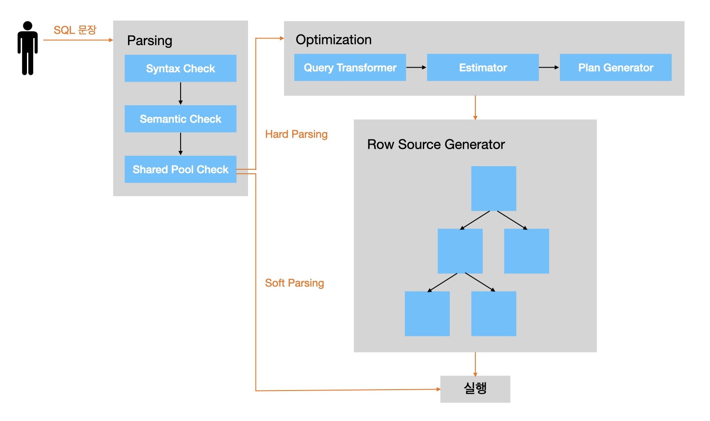
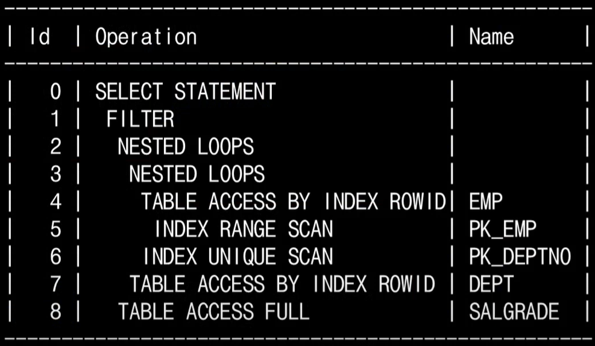
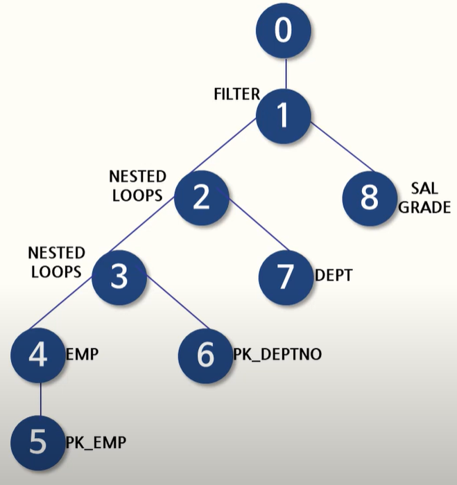
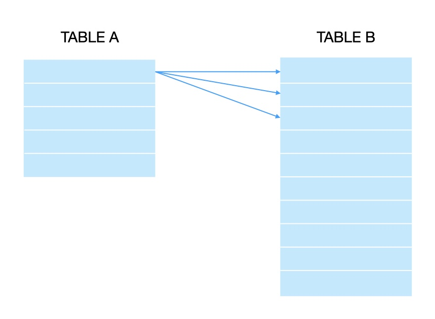
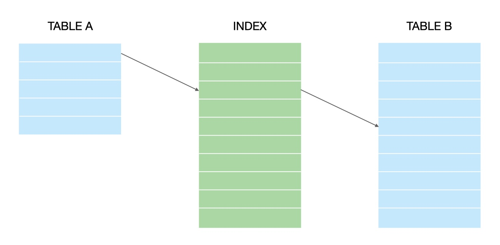
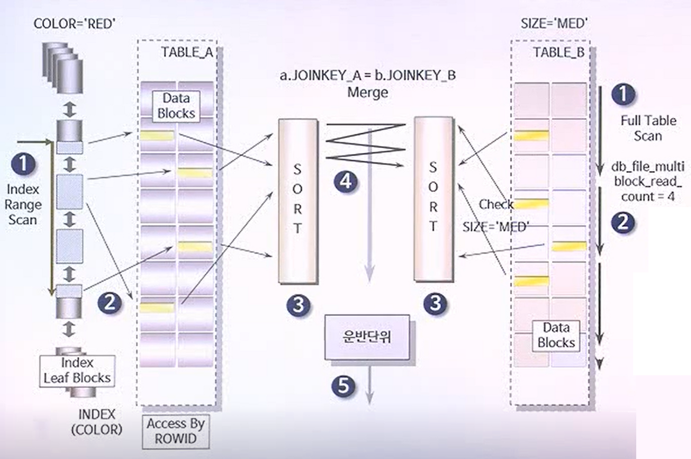

## 데이터베이스 튜닝과 성능 최적화

### 실행계획
실행계획이란 사용자가 SQL을 실행하여 데이터를 추출하려고 할 때 옵티마이저가 수립하는 작업 절차이다.

※ Optimizer<br>
Optimizer는 가장 효율적인 방법으로 SQL을 수행할 최적의 처리 경로를 생성해주는 DBMS의 핵심 엔진이다.

※ SQL 수행 절차<br>
<br>
<br>

1. 사용자가 쿼리문을 실행하면 쿼리를 실행하기 위해 Parsing이라는 과정을 진행한다.
- Syntax Check : 문법 체크
- Semantic Check : 오브젝트 및 권한 유무 체크
- Shared Pool Check : Library Cache에 쿼리가 저장되어 있는지 체크<br>
→ Soft Parsing : Library Cache에 쿼리가 저장되어 있는 경우에 저장된 쿼리의 실행계획 사용<br>
→ Hard Parsing : Library Cache에 쿼리가 저장되어 있지 않은 경우에 새로운 실행계획과 소스코드 생성

2. Hard Parsing일 경우 먼저 Optimization 과정이 진행된다.
- Query Transformer : 쿼리 블록 단위로 여러 종류의 변형된 쿼리 생성<br>
ex&rpar; Sub Query → Join, View의 해체, Inline View의 해체, From절의 Table 등
- Estimator : SQL 문장의 모든 Cost를 측정하여 최소의 비용을 갖는 SQL 문장을 Plan Generator에 전달
- Plan Generator : 선택된 SQL문의 실행계획을 생성하여 Row Source Generator에 전달. 생성된 실행계획을 Library Cache에 저장

3. Row Source Generator으로 전달된 실행계획의 각 단계별로 Row Source Tree를 생성하고 SQL 엔진이 실행할 수 있도록 실행가능한 바이너리 코드로 생성한다.

4. SQL 실행 엔진이 Row Source Tree에 의해 생성된 트리의 각 Row Source를 실행한다. 이미 한번 이상 SQL 구문이 실행되었다면 Database Buffer Cache에 데이터가 있으므로 메모리 I/O를 통해 데이터를 추출하고, 그렇지 않으면 하드디스크의 Datafile에서 블록 단위로 데이터를 읽어 Database Buffer Cache에 적재 후 클라이언트에게 보낸다.

5. Soft Parsing일 경우에는 2, 3번의 과정을 거치지 않고 바로 4번 실행 단계가 진행된다.

※ 실행계획 확인<br>
<br>
<br>

1. 위에서 아래로 읽어 내려가면서 제일 먼저 읽을 스탭을 찾는다.
2. 내려가는 과정에서 같은 들여쓰기가 존재한다면 무조건 위 → 아래 순으로 읽는다.
3. 읽고자 하는 스택보다 들여쓰기가 된 하위 스탭이 존재한다면, 가장 안쪽으로 들여쓰기가 된 스탭을 시작으로 하여 한 단계씩 상위 스탭으로 읽는다.

<br>
※ 실행계획 확인<br>
<br>
<br>
<br>
-&nbsp; 자식들의 좌측부터 차례대로 읽어주고 그 다음 상위 부모로 올로가는 식으로 반복하면 된다.<br>
→ 5 > 4 > 6 > 3 > 7 > 2 > 8 > 1 > 0 순으로 진행된다.<br>
<br>
※ SCAN의 종류<br>
SCAN이란 데이터를 읽는 작업을 말하며, SCAN을 수행하는 방식을 일컬어 접근 경로라고 한다.<br>

- FULL TABLE SCAN : 테이블의 전체 데이터를 읽어 조건에 맞는 데이터를 추출하는 방식이다.
- ROWID SCAN : ROWID를 기준으로 데이터를 추출하며 단일 행에 접근하는 방식 중에서 가장 빠르다.
- INDEX SCAN : 말 그대로 인덱스를 활용하여 원하는 데이터를 추출하는 방식이다.

1. FULL TABLE SCAN
- 조건절에서 비교한 컬럼에 인덱스가 없는 경우
- 조건절에서 비교한 컬럼에 최적화된 인덱스는 있지만 조건에 만족하는 데이터가 테이블의 많은 양을 차지하여 FULL TABLE SCAN이 낫다고 옵티마이저가 판단하는 경우
- 인덱스는 있으나, 테이블의 데이터 자체가 적어 FULL TABLE SCAN이 낫다고 옵티마이저가 판단하는 경우
- 테이블 생성 시 DEGREE 속성 값이 크게 설정되어 있는 경우

2. ROWID SCAN
- 조건절에 ROWID를 직접 명시한 경우
- INDEX SCAN을 통해 ROWID를 추출한 후 테이블에 접근할 경우

3. INDEX SCAN

|인덱스 종류|상황|
|---|---|
|INDEX UNIQUE SCAN|UNIQUE INDEX를 구성하는 모든 컬럼이 조건에 "="로 명시된 경우|
|INDEX RANGE SCAN|1. UNIQUE 성격의 결합 인덱스의 선두 컬럼이 WHERE절에 사용되는 경우<br>2. 일반 인덱스의 컬럼이 WHERE절에 존재하는 경우|
|INDEX RANGE SCAN DESCENDING|INDEX RANGE SCAN을 수행함과 동시에 ORDER BY DESC절을 만족하는 경우|
|INDEX SKIP SCAN|1. 결합 인덱스의 선행 컬럼이 WHERE절는 경우<br>2. 옵티마이저가 INDEX SKIP SCAN이 FULL TABLE SCAN보다 낫다고 판단하는 경우 |
|INDEX FULL SCAN|1. ORDER BY / GROUP BY의 모든 컬럼이 인덱스의 전체 또는 일부로 정의된 경우<br>2. 정렬이 필요한 명령에서 INDEX ENTRY를 순차적으로 읽는 방식으로 처리된 경우|
|INDEX FULL SCAN DESCENDING|INDEX FULL SCAN을 수행함과 동시에 ORDER BY DESC절을 만족하는 경우|
|INDEX FAST FULL SCAN|FULL TABLE SCAN을 하지 않고도 INDEX FAST FULL SCAN으로 원하는 데이터를 추출할 수 있고 추출된 데이터의 정렬이 필요 없으며 결합 인덱스를 구성하는 컬럼 중에 최소 한개 이상은 NOT NULL인 경우|
|INDEX JOIN|추출하고자 하는 데이터가 조인하는 인덱스에 모두 포함되어 있고 추출하는 데이터의 정렬이 필요없는 경우|

※ 힌트(Hint)<br>
SQL 튜닝의 핵심부분으로 일종의 지시 구문이며 SQL에 포함되어 옵티마이저의 실행계획을 원하는대로 바꿀 수 있다.<br>
옵티마이저가 항상 최적의 실행계획을 세울 수 없기 때문에 개발자가 직접 실행계획을 바꿔야하는 경우가 발생할 수 있다.

### 쿼리 최적화
※ 쿼리 최적화 할 수 있는 6가지 방법<br>

1. SELECT 시에는 필요한 컬럼만 조회하는 것이 좋다.
```sql
SELECT EMP_NO, DEPT_NO FROM EMP;
```
2. 조건 부여 시, 가급적이면 기존 DB값에 별도의 연산을 걸지 않는 것이 좋다.<br>
→ Full Table Scan을 하면서 모든 값을 탐색하고 수식을 건 뒤, 조건 충족 여부를 판단한다.
```sql
SELECT EMP_NO, SALARY
FROM EMP
--WHERE FLOOR(SALARY * 0.01) < 500
WHERE SALARY < 5000000;
```
3. LIKE 사용 시 와일드카드(%)를 앞부분에 배치하지 않는 것이 좋다.<br>
→ LIKE '%...'는 Full Table Scan을 활용한다.
```sql
SELECT DEPT_NO, DEPT_NAME
FROM DEPT
WHERE DEPT_NAME LIKE 'A%';
```
4. 서브 쿼리 내에서는 ORDER BY를 사용하지 않는 것이 좋다.<br>

5. IN vs EXISTS<br>
→ IN과 EXISTS는 검색결과에 따라 어느 것을 사용할지 결정해야 한다. EXISTS는 일치하는 항목이 발견되면 프로세스가 종료되지만 IN은 Full Table Scan을 하기 때문에 서브 쿼리의 결과가 많으면 EXISTS가 더 나은 성능을 제공하고 그렇지 않으면 IN을 사용하는 것이 좋다.<br>

6. SELECT DISTINCT, UNION DISTINCT문은 사용하지 않는 것이 좋다.<br>
→ 중복 값을 제거하는 연산은 많은 시간이 걸리므로 GROUP BY나 EXISTS로 대체할 수 있다.
```sql
SELECT A.DEPT_NAME
FROM DEPT A
WHERE EXISTS (SELECT 1 FROM EMP B WHERE A.DEPT_NO = B.DEPT_NO);

SELECT DEPT_NAME
FROM EMP
GROUP BY DEPT_NAME;
```
7. 같은 내용의 조건이라면, GROUP BY 연산 시에는 가급적 HAVING 보다는 WHERE절을 사용하는 것이 좋다.<br>
→ 쿼리 실행 순서에서 WHERE절이 HAVING절보다 먼저 실행된다. 따라서 WHERE절로 미리 데이터 크기를 작게 만들면 GROUP BY에서 다뤄야 할 데이터 크기가 작아지기 때문에 효율적인 연산이 가능하다.
```sql
SELECT DEPT_NAME
FROM EMP
WHERE SALARY < 5000000
GROUP BY DEPT_NAME
```
6. 3개 이상의 테이블을 INNER JOIN 할 때는, 크기가 가장 큰 테이블을 FROM절에 배치하고, INNER JOIN 절에는 남은 테이블을 작은 순서대로 배치하는 것이 좋다.<br>
→ Driving Table과 Driven Table에 모두 Index가 없을 경우

<br>
※ JOIN 작동 원리<br>
<br>

알고리즘 종류
1. Nested Loops Join
2. Hash Join
3. Sort Merge Join

→ 알고리즘 중 어떤 알고리즘을 선택할지는 데이터의 크기, 결합키(Key), 인덱스(Index)와 같은 요인에 따라 옵티마이저가 결정한다.
<br>
<br>
Nested Loops Join
<br>
<br>

<br>
1. TABLE A와 TABLE B가 어떤 key를 기준으로 결합을 진행한다.
2. TABLE A(Driving Table)의 첫 번째 행에서 출발해 TABLE B(Driven Table)의 모든 행을 스캔한다. 이때, 결합 조건이 맞으면 값을 리턴한다.
3. TABLE A의 첫 번째 행의 스캔이 끝나면 두 번째 행이 TABLE B의 모든 행을 스캔한다.
4. 2-3번 과정을 반복하여 TABLE A의 마지막 행이 TABLE B의 모든 행을 스캔하면 결합이 완료된다.

→ A(5) &ast; B(10) = 50개의 row에 접근하게 되므로 실행시간도 그에 비례하게 된다. 성능을 높이기 위해서는 이 값을 낮춰야 한다.

> Driving Table의 크기가 작아야 하고, Driven Table의 결합키에 인덱스가 존재해야 한다.

<br>

<br>
<br>
→ Drvien Table의 결합키에 인덱스가 존재하면 모든 행에 대해 스캔을 할 필요가 없어 성능을 높일 수 있다.
<br>
<br>
※ Index에 따른 Join의 순서<br>

- 인덱스 탐색(Index Seek) : 인덱스에서 조건을 만족하는 값이 지정된 위치를 찾는다.
- 인덱스 스캔(Index Scan) : 탐색된 위치부터 필요한 만큼 인덱스를 읽는다.

Join 시 Driving Table에서는 인덱스 탐색 작업을 한번만 수행하고 그 이후부터는 인덱스 스캔만 실행한다. 하지만 Driven Table에서는 Driving Table에서 읽은 레코드 수만큼 인덱스 탐색과 인덱스 스캔 작업을 반복하여 수행한다.<br>
→ 옵티마이저는 항상 Driven Table을 최적으로 읽을 수 있게 실행 계획을 수립힌다.<br>
<br>

```sql
SELECT *
FROM EMPLOYEES E, DEPT_EMP D
WHERE E.EMP_NO = D.EMP_NO;
```

1. EMPLOYEES.EMP_NO와 DEPT_EMP.EMP_NO 컬럼에 각각 인덱스가 있는 경우<br>
어느 테이블을 Driving Table로 선택하든 인덱스를 이용해 빠르게 처리할 수 있다.

2. EMPLOYEES.EMP_NO에만 인덱스가 있는 경우<br>
EMPLOYEES.EMP_NO에만 인덱스가 있을 경우 DEPT_EMP TABLE이 Driven Table로 선택된다면 EMPLOYEES TABLE의 레코드 수만큼 DEPT_EMP TABLE을 Full Scan해야 하므로 옵티마이저는 항상 DEPT_EMP TABLE을 Driving Table로 선택하게 된다.

3. DEPT_EMP.EMP_NO에만 인덱스가 있는 경우<br>
2번과 반대로 항상 EMPLOYEES TABLE이 Driving Table로 선택된다.

4. EMPLOYEES.EMP_NO와 DEPT_EMP.EMP_NO 컬럼 모두 Index가 없는 경우<br>
어느 테이블을 Driving Table로 선택하더라도 Driven Table의 Full Scan이 발생하기 때문에 옵티마이저가 적절하게 선택한다. 단, 레코드 수가 적은 테이블을 Driven Table로 선택하는 것이 효율적이다.

<br>
Hash Join<br>
Hash Join은 두 테이블 중 작은 집합(Build Input)을 스캔하여 해시 테이블을 생성하고, 큰 집합(Probe Input)을 스캔하여 해시 함수로 비교하여 결과값을 얻는 방식이다. 
<br>
<br>

특징
- 대량의 데이터를 조인해야 하는 경우에 주로 사용된다.
- 조인 조건이 반드시 equijoin(‘=‘) 방식이어야 한다.
- 메모리 관리에 신경써야 한다.

동작 방식<br>
<br>
<br>

1. 작은 집합(Build Input)을 읽어 Hash Area에 해시 테이블을 생성한다.
2. 큰 집합(Probe Input)을 읽어 해시 테이블을 탐색하면서 JOIN 한다.
3. 해시 함수에서 리턴 받은 버킷 주소로 찾아가 해시 체인을 스캔하면서 데이터를 찾는다.

메모리 관리
1. 해시 테이블 생성 과정 효율화<br>
Build Input이 Hash Area에 담길 정도로 작아야 하며, Build Input 해시 키 컬럼에 중복 값이 거의 없어야 효율적인 동작을 기대할 수 있다.

2. CPU 성능 향상<br>
Hash Bucket이 조인 집합에 구성되어 해시 함수 결과를 저장해야 하는데 기본적으로 HASH_AREA_SIZE에 지정된 크기 만큼의 메모리가 할당된다. 

3. PGA 메모리 확보<br>
Hash Area는 PGA 메모리에 할당되는데 Build Input이 HASH_AREA_SIZE를 초과하게 되면 가장 큰 순서대로 Hash Bucket이 Temporary Table Space로 내려가게 된다. 디스크 I/O가 발생하게 되어 성능이 저하된다.

※ HASH_AREA_SIZE<br>
Hash Join에 사용되는 최대 메모리 SIZE를 지정하는 설정값이다.

<br>
Sort Merge Join<br>
두 테이블에 각각 Access 하여 그 결과를 정렬하고 그 정렬한 결과를 차례로 스캔하여 조인 키를 조건으로 Merge 하는 방식이다.
<br>
<br>

특징
- 대량의 데이터를 조인해야 하는 경우에 주로 사용된다.
- 주로 조인 조건 컬럼에 인덱스가 없거나 출력해야 할 결과값이 많을 때 사용된다.
- 조인 조건으로 <, >, <=, >= 와 같은 범위 비교 연산자를 사용한다.

동작 방식<br>
<br>
<br>

1. 각 테이블에 대해 동시에 독립적으로 데이터를 먼저 읽어 들인다.
2. 읽혀진 각 테이블의 데이터를 조인을 위한 연결고리에 대하여 정렬을 수행한다.
3. 정렬이 모두 끝난 후에 조인 작업이 수행한다.

속도 관리
1. ACCESS 속도 향상<br>
Sort Merge Join은 가장 먼저 양쪽 테이블을 Access 하는 과정을 거치기 때문에 스캔 방식에 따로 Join의 속도도 최적화할 수 있다.

2. 정렬 속도 향상<br>
Sort Merge Join은 양쪽 테이블에서 조회한 데이터들을 정렬시켜야 하기 때문에, 조인 조건 컬럼이 이미 정렬되어 있다면 검색 속도 향상에 도움이 된다.

3. 두 정렬 속도 맞춤<br>
양쪽 테이블을 Access 하고 조회한 데이터들을 정렬할 때 어느 한쪽이라도 정렬 작업이 종료되지 않으면 한쪽이 대기 상태가 되고 다른 한쪽의 정렬이 완전히 끝날 때까지 조인할 수 없다.

4. SORT_AREA_SIZE 최적화<br>
두 테이블 간의 비교가 이루어지기 전에 수행하는 정렬 작업을 위해 별도의 정렬 공간이 필요하며, 이 공간은 SORT_AREA_SIZE 크기 만큼 메모리를 할당받아 사용하게 된다. 메모리가 부족할 경우 Temporary Table Space를 이용하여 정렬을 수행하게 된다.

<br>
<br>
출처 : <br>
https://medium.com/watcha/쿼리-최적화-첫걸음-보다-빠른-쿼리를-위한-7가지-체크-리스트-bafec9d2c073 <br>
https://developer-talk.tistory.com/420 <br>
https://schatz37.tistory.com/2 <br>
https://idea-sketch.tistory.com/53 <br>
https://www.youtube.com/watch?v=e9lZ0oZNZDo&t=138s <br>
https://coding-factory.tistory.com/744 <br>
https://seokrae.gitbook.io/sr/book/tune/_9 <br>