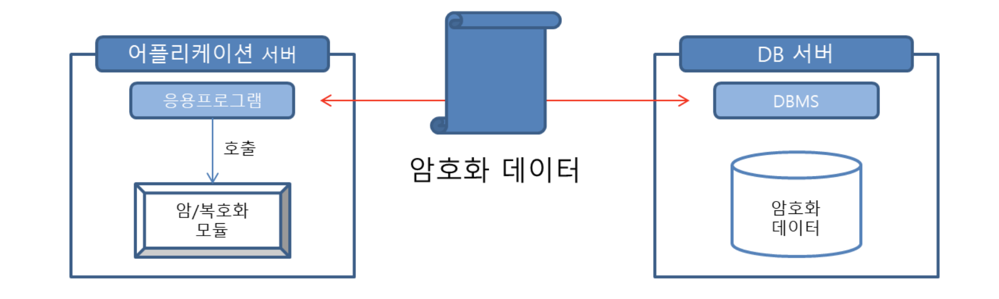
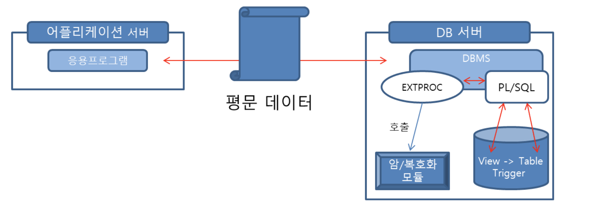

## 분류


### DBMS

- 접근 통제 및 계정 관리

- 기타 보안 설정

### 데이터 암호화

- 데이터 암/복호화 방식


### 어플리케이션

- SQL Injection


# 1. DBMS - 접근에 관한 관리

<br>
<br>

## 1-1. 불필요하게 관리자 권한 부여된 계정 정리 및 관리 하기

업무 상 불필요하게 관리자 권한이 부여된 계정이 있는지 확인하고 관리 해야합니다.

### 확인
```
SELECT host, user,select_priv,insert_priv,Delete_priv FROM mysql.user WHERE (select_priv='Y' or insert_priv='Y' or delete_priv='Y') AND user<>'root';
```

### 관리

1. mysql.user 테이블에 적용된 권한은 모든 데이터베이스에 적용되므로 host, user, password를 제외한 나머지 권한은 허용하지 않도록 'N' 으로 설정 하여야 합니다.


사용자 등록 예시
```
mysql> insert into mysql.user (host, name, password) values(‘%’, ’user name’, password(‘password’)
```


권한 변경 예시
```
mysql> update mysql.user set <권한>=’N’ where user=’user name’
```

2. 각 사용자는 접근하고자 하는 DB를 mysql.db에 등록 후 접근 권한을 부여하여 사용하여야 합니다.

DB 등록 시 권한 부여 예시
```
mysql> insert into mysql.db values(‘%’,’DB name’, ‘username’, ‘Y’, ’Y’, ’Y’, ’Y’, ’Y’, ’Y’, ’Y’, ’Y’, ’Y’, ’Y’, ’Y’, ’Y’, ’Y’, ’Y’, ’Y’, ’Y’, ’Y’)
mysql> flush privileges
```
DB 권한 업데이트 예시
```
mysql> update mysql.db set <권한>=’Y’ where db=<DB name> and user=’user name’
mysql> flush privileges
```
<br>
<br>

 ## 1-2. 시스템 테이블 접근 권한 관리하기 
  

업무상 불필하게 시스템 테이블에 접근 권한이 있는 계정이 존재 하는지 확인하고 관리해야 합니다.
  
### 확인

```
select host, user, select_priv from mysql.user where select_priv='Y' and user<>'root';
select DB, host, user, select_priv from mysql.db where (db='mysql' and select_priv='Y') and user<>'root';
select DB,USER,TABLE_NAME, TABLE_PRIV from mysql.tables_priv where (db='mysql' and table_name='user') and table_priv='select';
```

  
### 관리

1. 일반 사용자의 mysql.user 테이블 모든 접근 권한 제거
```
mysql> revoke all on mysql.user from ‘[user name]’@’[hosts]’;
mysql> flush privileges
```
2. 일반 사용자로부터 mysql.user 테이블 접근 권한 제거
```
mysql> revoke [권한] on mysql.user from [user name];
mysql> flush privileges
```
<br>
<br>


## 1-3. WITH GRANT OPTION 설정 하기

불필요하게 WITH GRANT OPTION 설정된 권한이 있는 경우 해당 권한을 가진 사용자가 다른 사용자에게 권한을 부여 할 수 있으므로 철저하게 관리해야 합니다.
  
 <https://pathas.tistory.com/92>
    
### 확인

``` 
불필요한 IS_GRANTABLE 설정된 권한 확인
select user, grant_priv FROM mysql.user;
select grantee, privilege_type, is_grantable from information_schema.user.privileges;
```

  
### 관리

```
불필요한 WITH GRANT OPTION이 설정된 권한 제거
REVOKE [select, insert…] ON [table_name] FROM [user명];
```

<br>
<br>
  
 


## 1-4. 원격 접속 제어 및 관리하기

불필요한 원격 접속을 제어하고 지속적으로 관리해야 합니다.
허용된 IP 및 포트에 대한 접근 통제가 되어있어야 합니다.
(원격 인증 방식을 사용하지 않는 경우, 방화벽 등의 보안 솔루션을 통해 접근 통제가 이루어져야 합니다.)

### 확인
```
select host, user from mysql.user;
select host, user from mysql.db;
```

### 관리

1. mysql.user 테이블과 mysql.db 테이블을 조회하여 host가 “%”인 필드 삭제하고 접속 IP를 지정하여 등록 하도록 합니다.

```
mysql> delete from user where host=’%’;
mysql> delete from db where host=’%’; 
```

## 1-5. 취약한 비밀번호로 설정되지 않도록 하기

  ### 확인
  
```
select host, user, authentication_string from mysql.user where user='root';
select host, user, password from mysql.user where user='root'; 또는
```
  
  ### 관리
  
root 계정 패스워드 변경
``` 
mysql> use mysql
mysql> update user set password=password(‘new password’) where user=’root’;
mysql> flush privileges; 또는,
mysql> set password for root=password(‘new password’)
```

<br>
<br>

  
 ## 1-6. 불필요한 계정 삭제 하기
  
  
  ### 조치 
  
  불필요한 계정 삭제 하기
 
```
mysql> Delete from user where user=’삭제할 계정’
```
<br>
<br>
  
  
 ## 1-7. 로그인 횟수 제한 하기
  
  ### 확인

  
  ```
  select user, host, User_attributes from mysql.user;
  ```


* (v8.0.19 이상) 데이터베이스 자체 기능(failed_login_attempts, password_lock_time_days)을 통한 로그인 실패 횟수에 따른 계정 잠금 여부를 확인하여야 합니다.
  1. mysql.user 테이블에서 User_attributes 필드의 failed_login_attempts 값 확인
  2. mysql.user 테이블에서 User_attributes 필드의 password_lock_time_days 값 확인

  
### 관리
  
  (v8.0.19 이상 설정)
```
로그 인 시도 실패횟수제한 값 설정
alter user 유저명 failed_login_attempts 5;

로그인 실패시 일정시간 잠금 설정
alter user 유저명 password_lock_time N;

```

<br>
<br>

  
 ## 1-8. 비밀번호 복잡도 정책 마련하기
 
 비밀번호 복잡도 검증 함수가 적용되어 있거나 솔루션을 도입하여 비밀번호 복잡도를 높여 계정 탈취 가능성을 낮추어야 합니다.
 
  ### 확인
  
 ``` 
  패스워드 검증 관련 파라미터 확인;
show global variables like '%vali%'
Vlidate_password Plugin 활성화 여부
  select PLUGIN_NAME, PLUGIN_STATUS FROM INFORMATION_SCHEMA.PLUGINS
WHERE PLUGIN_NAME LIKE 'validate%%';
패스워드 복잡도 관련 파라미터 확인
show global variables like 'simple%';
```

### 관리
  
  특정 버전 미만 버전은 설정 미지원
  ```
1.  플러그인 모듈 설치
  MySQL>INSTALL PLUGIN VALIDATE_PASSWORD SONAME=’validate_password.so’;
2.  validate_password 설정
- my.cnf 또는 my.ini 파일설정

[MySQLd]
plugin-load=validate_password.so
validate-password=ON			#default = ON
validate_password_length=8			#default = 8
validate_password_policy=1			#default = 1(MEDIUN)
validate_password_mixed_case_count=1	#default = 1
validate_password_number_count=1		#default = 1
validate_password_special_char_count=1	#default = 1

Policy	Tests Performed
0 or LOW	Length
1 or MEDIUM	Length; numeric, lowercase/uppercase, special characters
2 or STRONG	Length; numeric, lowercase/uppercase, and special characters; dictionary file
```

<br>
<br>  

# 2. DBMS - 기타

## 2-1. 감사 로그 수집 및 백업하기
  
### 확인
	  
```
mysql> show variables like "general_log%";
※ general_log'가 활성화되어 있는 경우 (general_log = ON), general_log'가 비활성화되어 있는 경우 (general_log = OFF)
```

### 관리
```
mysql> set GLOBAL general_log=ON;
mysql> set GLOBAL general_log_file='감사 기록 되는 파일 경로';
```

<br>
<br>

## 2-2. DB 이중화 구성 시 비밀번호가 평문으로 노출되지 않도록 하기

파일 또는 테이블에 Master 데이터베이스 접속 비밀번호 평문으로 저장하는 확인하고 관리하여야 합니다.
DBMS 이중화 시 Slave 서버 연결 비밀번호를 동적으로 입력하도록 관리 합니다.

  
### 관리

1. Replication slave 계정 생성
```
Mysql> grant replication slave on *.* to ‘계정명’@’%’ identified by ‘패스워드’
```

2. MySQL 설정
```
Vi /etc/my.cnf
[mysqld]
Log-bin = mysql-bin #slave 설정
Replicate-do-db = ‘repl_db’ #master 설정
```

3. slave 서버로 연결하기 위한 설정
```
mysql > change master to master_host=’Slave 서버 IP’, master_user=’Replication 계정명’, master_password=’Replication 패스워드’. Master_log_file=’slave STATUS 로그파일명’, master_log_pos=slave STATUS에서 position 값;
```
4. MySQL 재시작
```
Service mysqld restart
```

5. Slave 서버 정보 확인
```
Show master status;
```

 <br>
 <br>
 
## 2-3. 설정파일 및 중요정보가 포함된 파일의 접근 권한 관리하기

데이터베이스 주요 설정 파일 및 중요정보(데이터베이스 비밀번호, 로그 등)가 포함된 파일의 접근 권한을 관리하여야 합니다.


### 관리
 
• Unix OS
1. 주요 설정 파일 및 중요정보 파일(퍼미션 640)
```
#ls -al /etc/mysql/my.cnf
```

2. 주요 설정 파일 및 중요정보 파일의 접근권한 640 이하로 변경
```
#chmod 640 /etc/mysql/my.cnf
```

• Windows OS
1. 주요 설정 파일 및 중요정보 파일 접근 권한 확인
```
$ProgramData/MySQL/MySQL_Server version/my.ini
```
. 설정 파일(my.ini) 에 대한 접근 권한 적절하게 설정
  
  
<br>
<br>

  

## 2-4. 세션 종료 관리하기
세션이 관리되지 않으면 도용된 세션을 통해 비인가 접근이 가능하며, 다수의 세션 생성으로 인한 서비스 장애가 발생 할 수 있습니다.

### 확인

```
$SQL_query -e "show variables like '%timeout%';"
```

### 관리
  
설정 파일(my.cnf 및 my.ini) 수정
```
[mysqld]
interactive_timeout=[시간(초)]
wait_timeout=[시간(초)]
```
<br>
<br>

# 2. 데이터 암/복호화

## 2-1. API 이용

 <br>


### 특징

암/복호화 모듈이 API 라이브러리 형태로 각 어플리케이션 서버에 설치되어 호출하여 사용합니다.

### 장점

- 암/복호화 속도가 빨라 대용량 트랜잭션 처리에 적합합니다.


- 암/복호화가 서버에서 수행되어 DBMS 부하가 적습니다.


- 암호화 구간이 길어 데이터가 평문으로 통신 되는 구간이 짧습니다.

### 단점

- 어플리케이션 변경에 따른 개발 비용이 추가적으로 발생 합니다.


* 적용된 어플리케이션(미들웨어)의 패치에 영향을 받습니다.


## 2-2. Plug-In 방식

 <br>

### 특징

- 암/복호화 모듈이 DB 서버에 설치되어, 플러그인으로 연결된 암/복호화 모듈 호출하여 사용합니다.


- View가 암호화된 테이블에 저장된 데이터를 복호화하여 보여주는 통로 역할을 수행, DML로 데이터 변경 발생 시, 트리거를 통해 암호화하여 처리합니다.


- 기존 테이블/컬럼이 암호화되면 기존 테이블 이름과 동일한 View 생성 및 변경된 이름의 암호화 테이블이 생성되며, 기존 원본들은 삭제됩니다.


### 장점

- 어플리케이션(응용프로그램)의 변경을 최소화 할 수 있습니다.

### 단점

- 대용량 처리 시, 암/복호화 처리에 따른 DB서버 부하가 큽니다.


-  DBMS 패치에 영향을 받습니다.


- 암호화 구간이 짧습니다.

## 2-3. Hybrid 방식

 <br>


### 특징

API와 Plug-IN 방식을 혼합하여 사용합니다.


# 3. 어플리케이션 - Sql Injection

## 3-1. Sql Injection 

### Sql Injection 이란?

어플리케이션에서 사용자의 입력을 신뢰하여 사용자의 입력이 Sql 구문의 일부에 포함됨으로써 악의적인 SQl 구문을 작성해 데이터베이스의 데이터 혹은 데이터베이스 전체를 탈취 할 수 있는 취약점 입니다.

### Sql Injection 공격 방법

1. Error Based Sql Injection

2. Union Based Sql Injection

3. Blind Sql Injection

## 3-2. Error Based Sql Injection

사용자의 입력이 Sql 구문에 삽입되어 Sql 구문이 실행 되었고,잘못된 구문에 대한 메세지가 어플리케이션에 표현 되는 것을 통해 Sql Injection이 가능한 포인트임을 알 수 있는 공격 기법입니다.


## 3-3. Union Based Sql Injection

Union 구문을 활용하여 현재 입력 구문이 삽입되는 Sql 실행 결과의 컬럼 수를 확인하고, 나아가 DB 정보를 탈취 할 수 있는 기법 입니다.


## 3-4. Blind Sql Injection

현업에서 발생하는 99% 이상의 Sql Injection 취약점은 Blind 기법을 통해 찾게 됩니다.
쿼리의 결과가 눈에 보이지 않는다면 응답 속도를 이용한 Time Based Sql Injection을 활용 합니다.

  
  # 패치
  
  ## 최신 보안패치 벤더 권고사항 적용하기
  
  최신 보안패치 및 벤더 권고사항을 적용하지 않은 경우, 알려진 취약점에 노출될 수 있는 위협이 존재하므로 최신 보안 패치 및 권고사항을 최대한 적용시키야 합니다.
  

### 확인
  ```
  select version();
  ```
  
 

데이터 암/복호화

<https://isc9511.tistory.com/142>


추론방지

<https://icmp-ycdi.tistory.com/139>

  
sql injection 워게임 사이트

<https://los.rubiya.kr>
