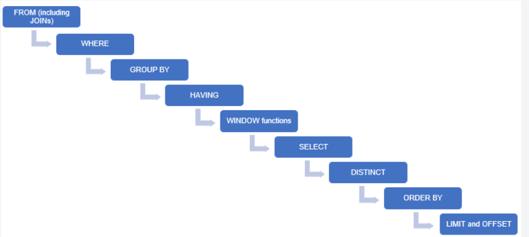

# 인덱싱와 검색 최적화

[[document/study/Database/database_overview|database_overview]]

인덱스와 검색 최적화  


인덱스의 유형, 생성 및 관리, 쿼리 성능 향상 방법.  
데이터베이스 검색 최적화를 위한 기술과 알고리즘.  
  
## 인덱스의 유형  
  
인덱스라는 용어는 매우 자주 접한다.
  
애플리케이션 레벨에서 인덱스도 있고, 데이터베이스 레벨에서 인덱스도 있다.  
  
이 글에서는 데이터베이스 레벨에서 인덱스에 대해서 다루고자 한다.  

 
 >
>
 >이미지에서 말하듯이 색인은 **일정한 순서에 따라 별도로 배열하여 놓은 목록이다.**  
  >
  >DB,애플리케이션 구조에서도 별도로 배열하여 놓은 목록이다. 

다만 각각의 환경에 따라 알고리즘이 다르다.

애플리케이션에서 인덱스는 메모리 주소 관점에서 접근하는 인덱스이다.

하지만 DB는 물리적으로 저장되어 있는 행에 빠르게 접근하는 인덱스이다.
  
데이터베이스 인덱스는 더 정적이고 구조화된 방식으로 데이터에 접근한다. 

.# 예시 이미지.


DB의 경우 데이터 구조를 배열 , 혹은 리스트와 같이 정렬하지 않는다 
순차적으로 모아두지 않는다 보통 B-Tree 형태의 구조를 활용한다.


우리가 보기에 트리 구조는 안정적으로 정해졌다해도 실제 하드 디스크에 어디에 저장되어 있을지 
어떻게 아나?

검색알고리즘에 덜 말하더라도 B-Tree는 무조건 집고 넘어야겟다. 

### B-Tree  
- 가장 베이직 하다 
- 하나의 노드에 다수의 정보를 가질수 있다
- 두개 이상의 자식을 가질 수 있다.
- 여러 자식을 가지면서 **차수** 걔념이 들어간다.


### B*Tree
- B-Tree의 단점은 균형을 유지해야하기 떄문에 구조를 유지해야한다. 
- 노드의 추가적인 생성과 연산을 최소화 하기 위한 규칙이 추가된다.

### B+Tree
- B-Tree는 특정 노드를 찾기 위해 순차적으로 순회해야하는 문제가 있다.
- 이런 문제를 해결하기 위한 솔루션이 들어갔다.
- left node애 모든 자료들이 들어가고 중단 노드들은 리프 목표를 찾기 위한 인덱스 역할만 한다.


## InnoDB에서 채용


----------


## 인덱스를 사용하는 예

1. 대용량의 데이터를 검색 
2. 정렬된 결과를 검색 ( 인덱스를 통한 정렬 시 )
3. 조인 쿼리 연산 수행
4. 유니크한 값을 가져오는 경우


평균적으로 거의 모든 RDBMS에서 B+Tree를 활용한 구성으로 존재한다.

별도의 공간으로 구성된 인덱스 영역은 사용자가 직접 쿼리 할 수 없는 영역이다.

이 공간을 파악 하는 건 실행 계획, 인덱스 메타 데이터 ,정보 스키마 들은 확인해 분석 가능하다.


-------------

## 쿼리 실행 순서




```sql
SELECT e.name, d.name
FROM employees e
WHERE e.dept_id IN (SELECT dept_id 
                       FROM departments 
                       WHERE name = 'Engineering');
```


```sql
SELECT e.name, d.name
FROM employees e
JOIN departments d ON e.dept_id = d.dept_id
WHERE d.name = 'Engineering';
```


#### 검증 링크

https://www.cs.usfca.edu/~galles/visualization/BTree.html

https://jane096.github.io/project/refactoring-sql/

-------

#study #cs #database #cs-study
