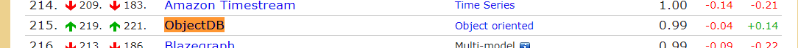
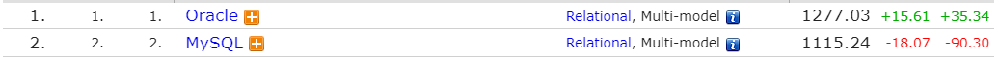
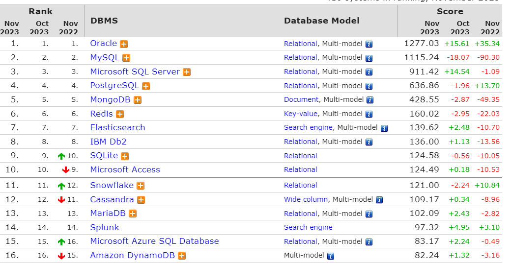

# 데이터베이스의 종류와 유형

> 데이터베이스는 조직화된 데이터의 집합으로, 다양한 방식으로 분류된다.. 
> 주요 데이터베이스의 종류와 유형은 다음과 같습니다.

## 1. 관계형 데이터베이스 (Relational Database)

- **정의**: 테이블 형태로 데이터를 저장하며, 테이블 간의 관계를 통해 데이터를 조직화.
- **예시**: MySQL, PostgreSQL, Oracle, Microsoft SQL Server

## 2. 비관계형 데이터베이스 (NoSQL Database , not  only SQL)

- **정의**: 비정형 데이터를 저장하고 관리하기 위해 설계된 데이터베이스로, 유연한 스키마를 제공.
- **유형**:
    - **문서 지향 데이터베이스**: MongoDB, CouchDB
    - **키-값 저장소**: Redis, DynamoDB
    - **와이드 컬럼 스토어**: Cassandra, HBase
    - **그래프 데이터베이스**: Neo4j, Amazon Neptune
- **활용 예**
    - **문서 지향 데이터베이스**: 웹 사이트, 블로그, 쇼핑몰
    - **키-값 저장소**: 세션 관리, 캐싱
    - **와이드 컬럼 스토어**: 대규모 데이터 세트
    - **그래프 데이터베이스**: 소셜 네트워크, 추천 시스템

## 3. 객체 지향 데이터베이스 (Object-Oriented Database)

- **정의**: 객체 지향 프로그래밍 언어의 개념을 활용하여 데이터를 객체로 저장.
- **예시**: ZODB, ObjectDB
    - ZODB: Python 언어를 위한 객체 지향 데이터베이스
    - ObjectDB: Java 언어를 위한 객체 지향 데이터베이스
        - Java Persistence API(JPA)를 지원한다.
        - JPA를 구현하는 객체 관계형 매핑(Object-Relational Mapping, ORM) 프레임워크인 Hibernate와 연동할 수 있다.

> 
> 잘 사용되진 않는다.

- 4 분산 데이터베이스 (Distributed Database)
    - **정의**: 여러 컴퓨터 네트워크 상에 분산되어 있는 데이터베이스 시스템입니다.
    - **예시**: Cassandra, Couchbase
- 5 데이터 웨어하우스 (Data Warehouse)
    - **정의**: 대량의 데이터를 분석 및 보고 목적으로 저장하는 시스템입니다.
    - **예시**: Amazon Redshift, Google BigQuery, Snowflake
- 6 클라우드 기반 데이터베이스 (Cloud-Based Database)
    - **정의**: 클라우드 컴퓨팅 환경에서 운영되는 데이터베이스 서비스입니다.
    - **예시**: Amazon RDS, Google Cloud SQL, Microsoft Azure SQL Database

----------

# 데이터베이스 엔진

데이터베이스 관리 시스템(DBMS)의 핵심 구성 요소,
데이터의 저장, 검색, 업데이트 및 관리를 담당. 다양한 유형의 데이터베이스 엔진이 있으며,
각각 특정한 요구 사항과 환경에 적합합니다.

## 1. InnoDB

- 특징: MySQL의 기본 스토리지 엔진으로, 트랜잭션 안전성과 외래 키 제약 조건을 지원.
    - 적합한 사용 사례: 데이터 무결성이 중요한 온라인 트랜잭션 처리(OLTP) 시스템.
- 장점: 트랜잭션 처리를 지원하면서, 데이터 무결성을 보장한다.
- 단점: 풀 텍스트 인덱싱을 지원하지 않는다.

> 참고: MySQL 5.5 버전부터 InnoDB가 기본 스토리지 엔진으로 사용되었다.
 commit,rollback, row level lock을 지원한다.

## 2. MyISAM

- 특징:
    - MySQL에서 널리 사용되는 또 다른 스토리지 엔진으로, 풀 텍스트 인덱싱과 빠른 읽기를 지원.
    - row count를 항상 가지고 있기 때문에 select count(*) from table; 의 경우에 매우 빠르게 처리할 수 있다.
- 적합한 사용 사례: 읽기 위주의 작업이나 데이터 웨어하우스.
- 장점 : 풀 텍스트 인덱싱과 빠른 읽기를 지원한다.
- 단점 :
    - 트랜잭션 처리를 지원하지 않는다. ,
    - row level lock을 지원하지 않는다.(select insert update delete시 해당 Table 전체에 Locking이 걸린다.

> 풀 텍스트 인덱싱?
> 검색엔진과 유사한 방법으로 자연어(한글,영어등)를 검색할 수 있게 해주는 인덱싱 기능
> ReadOnly 특화인 MyISAM은 풀 텍스트 인덱싱을 지원한다.

-----

## 3. MongoDB WiredTiger

- 특징: MongoDB의 기본 스토리지 엔진으로, 높은 압축률과 동시성을 제공합니다.
- 장점 : 높은 압축률과 동시성을 제공한다. 내부적인 Lock 경합 최소화를 위해서 Hazard-Pointer나 Skip-List와 같은 많은 신기술을 채택하고 있다

## 4. Microsoft SQL Server Engine

- 특징: 트랜잭션 처리, 데이터 분석, 비즈니스 인텔리전스 등을 지원하는 포괄적인 엔진.
- 적합한 사용 사례: 엔터프라이즈급 데이터베이스 관리.
- 장점 : 트랜잭션 처리, 데이터 분석, 비즈니스 인텔리전스 등을 지원한다.
- 단점 : 비용이 많이 든다. (라이센스 비용) , 운영체제 제약이 있다. (윈도우 서버) , 리소스 소모량이 많다.

## 5. Oracle Database Engine

- 특징: 다양한 데이터 모델과 트랜잭션 처리, 고가용성을 지원하는 강력한 엔진.
- 적합한 사용 사례: 대규모 엔터프라이즈 시스템과 복잡한 트랜잭션.
- 장점 : 다양한 데이터 모델과 트랜잭션 처리, 고가용성을 지원한다.
- 단점 : 비용이 많이 든다,높은 수준의 하드웨어 사양이 필요

> MySQL과의 차이
> - MySQL은 오픈소스이고, Oracle은 상용이다.
> - MySQL은 DB서버마다 스토리지를 할당한다. Oracle은 하나의 스토리지를 공유한다.
    >   **스토리지 : 데이터를 저장하는 공간**
> - MySQL은 1MB 환경에서도 설치되지만 Oracle은 최소 수백MD 이상 환경에서 설치된다.

## 6. PostgreSQL

- 특징: 객체 관계형 데이터베이스로, 확장성과 SQL 표준 준수를 강조.
- 적합한 사용 사례: 복잡한 쿼리와 대규모 데이터베이스.

## 9. Redis

- 특징: 인메모리 데이터 구조 저장소로, 빠른 읽기/쓰기와 데이터 구조 지원.
- 적합한 사용 사례: 캐싱, 메시징 큐, 실시간 애플리케이션.

## 10. Elasticsearch

- 특징: 검색과 데이터 분석에 최적화된 오픈 소스 엔진.
- 적합한 사용 사례: 풀 텍스트 검색, 로그 분석, 실시간 데이터 분석.

이러한 데이터베이스 엔진들은 각기 다른 특성과 성능을 가지고 있어, 애플리케이션의 요구 사항에 따라 적절한 선택이 필요.

---------------

### 2023-11-21 기준 순위

-----------

링크

[DB Lank](https://db-engines.com/en/ranking)
[기억하기 프로젝트:티스토리](https://rebeccajo.tistory.com/14)
[MYSQL- 📚 풀텍스트 인덱스(Full-Text Index) 사용법](https://inpa.tistory.com/entry/MYSQL-%F0%9F%93%9A-%ED%92%80%ED%85%8D%EC%8A%A4%ED%8A%B8-%EC%9D%B8%EB%8D%B1%EC%8A%A4Full-Text-Index-%EC%82%AC%EC%9A%A9%EB%B2%95)
[MongoDB의 wiredTiger 스토리지 엔진](https://rastalion.me/mongodb%EC%9D%98-wiredtiger-%EC%8A%A4%ED%86%A0%EB%A6%AC%EC%A7%80-%EC%97%94%EC%A7%84/)
[MSSQL이란? MSSQL 장단점 정리](https://prmblogs.tistory.com/37)

