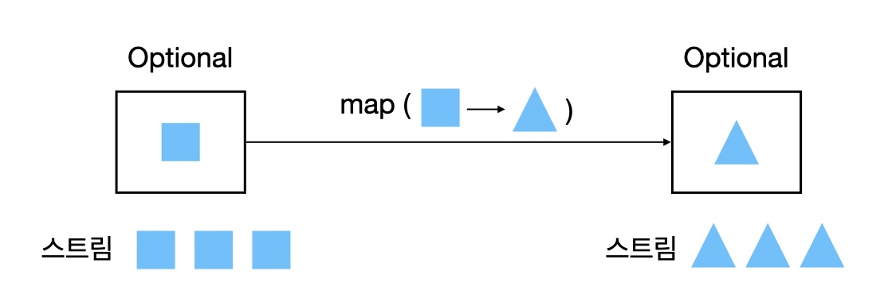
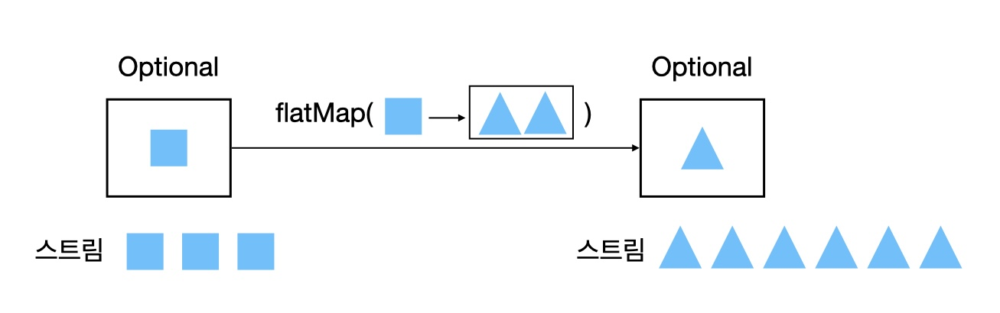
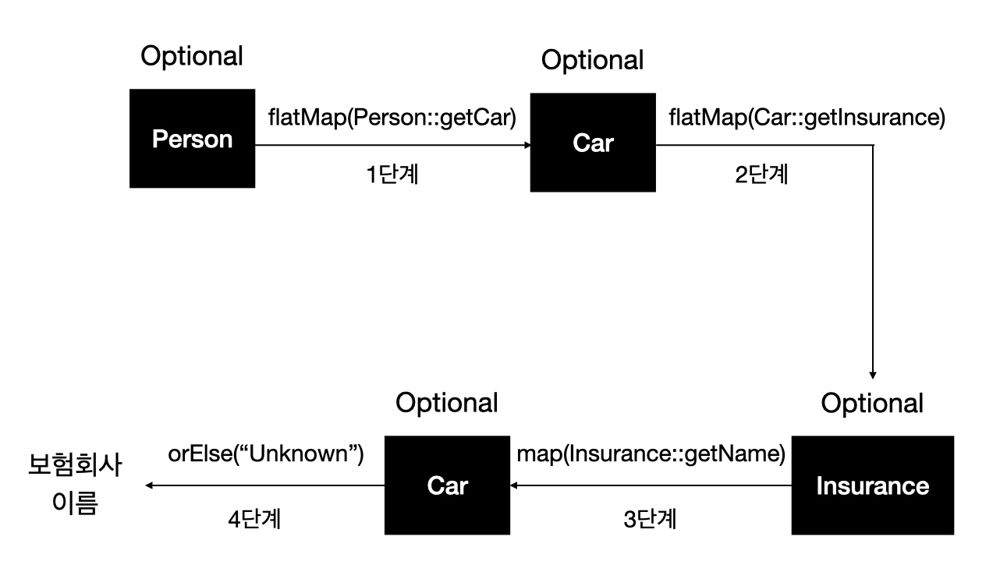

## null 대신 Optional 클래스

- null 참조의 문제점과 null을 멀리해야 하는 이유
- null 대신 Optional : null로부터 안전한 도메인 모델 재구현하기
- Optional 활용 : null 확인 코드 제거하기
- Optional에 저장된 값을 확인하는 방법
- 값이 없을 수도 있는 상황을 고려하는 프로그래밍

### null 참조의 문제점과 null을 멀리해야 하는 이유

```java
public class Person {
    private Car car;
    public Car getCar() { return car; }
}

public class Car {
    private Insurance insurance;
    public Insurance getInsurance() { return insurance; }
}

public class Insurance {
    private String name;
    public String getName() { return name; }
}

public String getCarInsuranceName(Person person) {
    return person.getCar().getInsurance().getName();
}
```

NullPointerException 줄이기

```java
public String getCarInsuranceName(Person person) {
    if (person != null) {
        Car car = person.getCar();
        if (car != null) {
            Insurance insurance = car.getInsurance();
            if (insurance != null) {
                return insurance.getName();
            }
        }
    }

    return "Unknown";
}
```

null 때문에 발생하는 문제

- 에러의 근원이다.
- 코드를 어지럽힌다. (코드 가독성이 떨어짐)
- 아무 의미가 없다.
- 자바 철학에 위배된다. <br>
→ 자바는 개발자로부터 모든 포인터를 숨겼으나 null은 예외다.
- 형식 시스템에 구멍을 만든다.<br>
→ 모든 참조 형식에 null을 할당할 수 있어서 애초에 null이 어떤 의미로 사용되었는지 알 수 없다.

### null 대신 Optional : null로부터 안전한 도메인 모델 재구현하기

> Optional<br>
→ 값을 포함하거나 포함하지 않을 수 있는 객체

값이 있으면 Optional 클래스는 값을 감싸고, 값이 없으면 Optional.empty 메서드로 Optional instance를 반환한다.

```java
// 사람이 차를 소유했을 수도, 소유하지 않았을 수도 있다.
public class Person {
    private Optional<Car> car;
    public Optional<Car> getCar() {
        return car;
    }
}

// 자동차가 보험에 가입되어 있을 수도, 가입되어 있지 않았을 수도 있다.
public class Car {
    private Optional<Insurance> insurance;
    public Optional<Insurance> getInsurance() {
        return insurance;
    }
}

// 보험회사 이름은 반드시 존재한다.
public class Insurance {
    private String name;
    public String getName() {
        return name;
    }
}
```

※ Optional 클래스를 사용하면 모델의 의미(semantic)가 더 명확해진다.

&check; 보험회사 이름은 왜 Optional&lt;String&gt;으로 선언하지 않았을까?<br>
→ 보험회사는 반드시 이름을 가져야 하며 이름이 없는 보험회사를 발견했다면 보험회사의 이름이 없는 문제를 해결해야 한다.<br>
→ Optional을 이용하면 값이 없는 상황이 우리 데이터에 문제가 있는 것인지 아니면 알고리즘의 버그인지 구분할 수 있다.

※ 모든 null 참조를 Optional로 대치하는 것은 바람직하지 않다. Optional의 역할은 더 이해하기 쉬운 API를 설계하도록 돕는 것이다.

### Optional 활용 : null 확인 코드 제거하기

1. Optional.empty()<br>
빈 Optional 객체를 반환한다.

2. Optional.of(T value)<br>
null이 아닌 값을 반환한다. null이라면 NullPointerException이 발생한다.

3. Optional.ofNullable(T value)<br>
null이 아니면 값을 반환하고, null이면 빈 Optional 객체를 반환한다.

4. Optional.get()<br>
Optional 객체에 값이 존재하면 값을 반환하고, 값이 없으면 NoSuchElementException이 발생한다.

5. Optional.map(Function<? super T,? extends U> mapper)<br>
Optional 객체에 값이 있으면 인수로 제공된 함수가 실행되고 변경된 값을 반환한다. (값이 없으면 아무 일도 일어나지 않는다.)

6. Optional.flatMap(Function&lt;? super T,Optional&lt;U&gt;&gt; mapper)<br>
Optional 객체에 값이 있으면 인수로 제공된 함수가 실행, 변경된 값을 반환하고 값이 없으면 빈 Optional 객체를 반환한다. 함수를 적용해서 생성된 모든 스트림이 하나의 스트림으로 병합되어 평준화된다.

7. Optional.orElse(T other)<br>
Optional 객체가 비어 있으면 기본값을 반환한다.

8. Optional.filter(Predicate&lt;? super T&gt; predicate)<br>
Predicate와 일치하는 값이 존재하면 값을 반환하고, 값이 존재하지 않으면 빈 Optional 객체를 반환한다.

9. Optional.isPresent()<br>
값이 있으면 true, 없으면 false를 반환한다.

10. Optional.orElseGet(Supplier<? extends T> other)<br>
orElse 메서드에 대응하는 게으른 버전의 메서드다. Optinal에 값이 없을 때만 Supplier가 실행된다.

11. Optional.orElseThrow(Supplier<? extends X> exceptionSupplier)<br>
Optional이 비어있을 때 예외를 발생시키는데, 발생시킬 예외의 종류를 선택할 수 있다.

12. Optional.ifPresent(Consumer<? super T> consumer)<br>
값이 존재할 때 인수로 넘겨준 동작을 실행할 수 있다. 값이 없으면 아무 일도 일어나지 않는다.

13. ifPresentOrElse(Consumer<? super T> action, Runnable emptyAction)<br>
Optional이 비었을 때 실행할 수 있는 Runnable을 인수로 받는다는 점만 제외하면 ifPresent와 같다.

### Optional에 저장된 값을 확인하는 방법

map vs flatmap

1. Map으로 Optional의 값을 추출하고 변환하기

보통 객체의 정보를 추출할 때 Optional을 사용할 때가 많다.

```java
Optional<Insurance> optInsurance = Optional.ofNullable(insurance);
Optional<String> name = Optional.map(Insurance::getName);
```
Optional이 값을 포함하면 map의 인수로 제공된 함수가 값을 바꾼다.<br>
Optional이 비어 있으면 아무 일도 일어나지 않는다.



2. flatMap으로 Optional 객체 연결

```java
Optional<Person> optPerson = Optional.of(person);
Optional<String> name = optPerson.map(Person::getCar)
                                .map(Car::getInsurance)
                                .map(Insurance::getName);
// getCar → Optional<Car> 형식의 객체 반환 → Optional<Optional<Car>> 형식의 객체
```

※ flatMap은 이차원 Optional을 일차원 Optional로 평준화한다.



```java
public String getCarInsuranceName(Optional<Person> person) {
    return person.flatMap(Person::getCar)
                .flatMap(Car::getInsurance)
                .map(Insurance::getName)
                .orElse("Unknown"); // 결과 Optional이 비어있으면 기본값 사용
}
```



1단계 - Person을 Optional로 감싼 다음 flatMap(Person::getCar)를 호출

1. Optional 내부의 Person에 Function을 적용한다.<br>
(Person의 getCar 메서드가 Function)<br>
→ getCar 메서드는 Optional&lt;Car&gt;를 반환하므로 Optional 내부의 Person이 Optional&lt;Car&gt;로 변환되면서 중첩 Optional이 생성된다.

2. flatMap 연산으로 Optional을 평준화한다.<br>
→ Optional이 Person을 감싸고 있다면 flatMap에 전달된 Function이 Person에 적용된다. Function을 적용한 결과가 이미 Optional이므로 flatMap 메서드는 결과를 그대로 반환할 수 있다.

※ 평준화 과정이란 이론적으로 두 Optional을 합치는 기능을 수행하면서 둘 중 하나라도 null이면 빈 Optional을 생성하는 연산이다.

Optional 스트림 조작

```java
public Set<String> getCarInsuracneNames(List<Person> person) {
    return persons.stream()
                // 각 사람이 보유한 자동차의 Optional<Car> 스트링으로 변환
                .map(Person::getCar)
                // Optional<Car> → Optional<Insurance>
                .map(optCar -> optCar.flatMap(Car::getInsurance))
                // Optional<Insurance> → Optiona<String>
                .map(optIns -> optIns.map(Insurance::getName))
                // Stream<Optional<String>> → Stream<String>으로 변환
                .flatMap(Optional::stream)
                // 결과를 중복되지 않은 값을 갖도록 집합으로 수집
                .collect(toSet());
}

Set<String> result = stream.filter(Optional::isPresent)
                            .map(Optional::get)
                            .collect(toSet());
```

Optional 객체를 이용하여 null 처리를 했으나 마지막 결과를 얻으려면 빈 Optional을 제거하고 값을 언랩해야 한다.

두 Optional 합치기

```java
public Optional<Insurance> nullSafeFindCheapestInsurance(Optional<Person> person, Optional<Car> car) {
    if(person.isPresent() && car.isPresent()) {
        return Optional.of(findCheapestInsurance(person.get(), car.get()));
    }
    else {
        return Optional.empty();
    }
}

// Optional 언랩하지 않고 두 Optional 합치기
public Optional<Insurance> nullSafeFindCheapestInsurance(Optional<Person> person, Optional<Car> car) {
    return person.flatMap(p -> car.map(c -> findCheapestInsurance(p, c)));
}
```

- 첫 번째 Optional에 flatMap을 호출했으므로 첫 번째 Optional이 비어있다면 인수로 전달한 람다 표현식이 실행되지 않고 그래도 빈 Optional을 반환한다. 

- 두 번째 Optional에 map을 호출하므로 Optional이 car값을 포함하지 않으면 Function은 빈 Optional을 반환하므로 nullSafeFindCheapestInsurance는 빈 Optional을 반환한다.

필터로 특정값 거르기

```java
public String getCarInsuranceName(Optional<Person> person, int minAge) {
    return person.filter(p -> p.getAge() >= minAge)
                .flatMap(Person::getCar)
                .flatMap(Car::getInsurance)
                .map(Insurance::getName)
                .orElse("Unknown");
}
```

### 값이 없을 수도 있는 상황을 고려하는 프로그래밍

Optional을 사용한 실용 예제

1. 잠재적으로 null이 될 수 있는 대상을 Optional로 감싸기<br>
null을 반환하는 것보다 Optional을 반환하는 것이 더 바람직하다.<br>
Map의 get 메서드의 시그니처는 우리가 고칠 수 없지만 get 메서드의 반환값은 Optional로 감쌀 수 있다.

```java
Optional<Object> value = Optional.ofNullable(map.get("key"));
```

2. 예외와 Optional 클래스

```java
// 문자열을 정수 Optional로 변환
public static Optional<Integer> stringToInt(String s) {
    try {
        return Optional.of(Integer.parseInt(s));
    }
    catch(NumberFormatException e) {
        return Optional.empty();
    }
}
```
3. 기본형 Optional을 사용하지 말아야 하는 이유

- 스트림과 달리 Optional의 최대 요소 수는 한 개이므로 Optional에서는 기본형 특화 클래스로 성능을 개선할 수 없다.
- 기본형 특화 Optional은 map, flatMap, filter 등을 지원하지 않는다.
- 기본형 특화 Optional로 생성한 결과는 다른 일반 Optional과 혼용할 수 없다.

응용

```java
// 프로퍼티에서 지속 시간을 읽는 명령형 코드
public int readDuration(Properties props, String name) {
    String value = props.getProperty(name);
    // 요청한 이름에 해당하는 프로퍼티가 존재하는지 확인한다.
    if(value != null) {
        try {
            // 문자열 프로퍼티를 숫자로 변환하기 위해 시도한다.
            int i = Integer.parseInt(value);
            // 결과가 양수인지 확인한다.
            if(i > 0) {
                return i;
            }
        }
        catch(NumberFormatException nfe) {}
    }
    // 하나의 조건이라도 실패하면 0을 반환한다.
    return 0;
}

// Optional을 이용해서 구현한 코드
public int readDuration(Properties props, String name) {
    return Optional.ofNullable(props.getProperty(name))
                    .flatMap(OptionalUtility::stringToInt) // Optional<String>을 Optional<Integer>로 변환한다.
                    .filter(i -> i > 0) // 음수를 제거한다.
                    .orElse(0); // Optional이 비어 있으면 0을 반환한다.
}
```