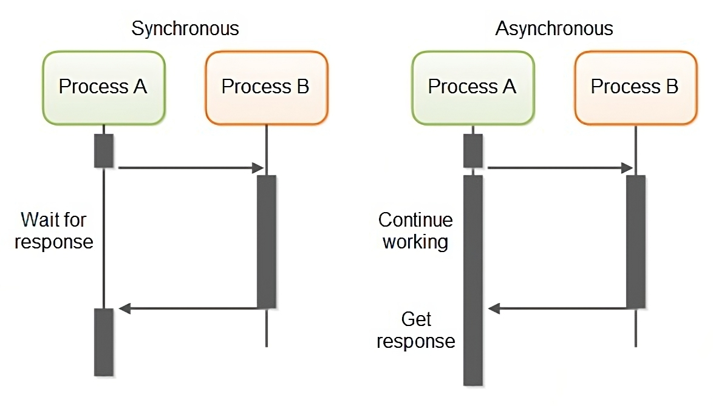
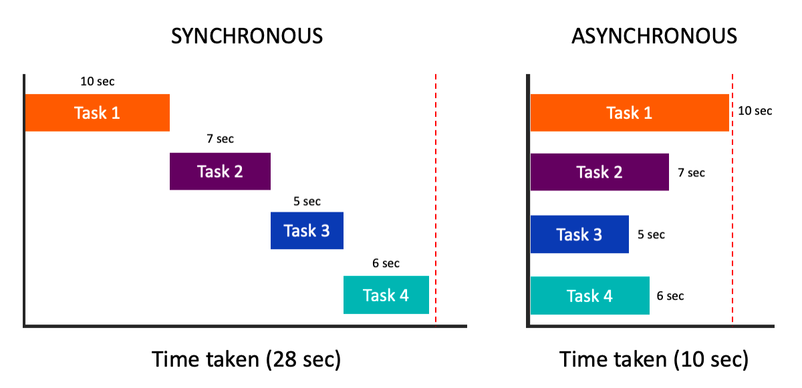
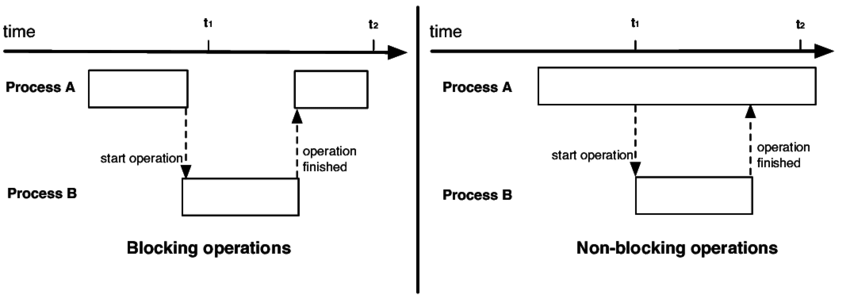
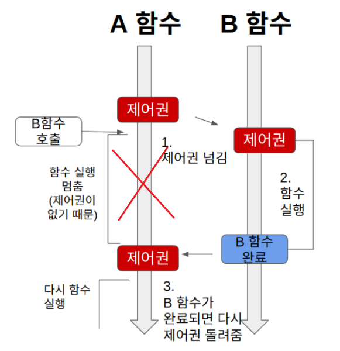
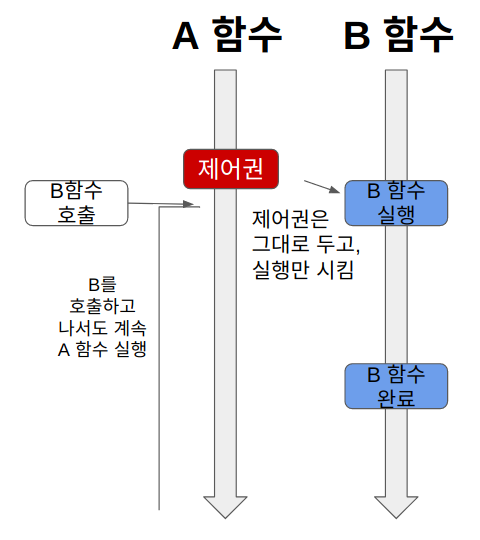
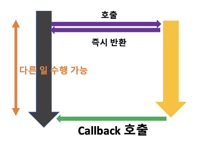
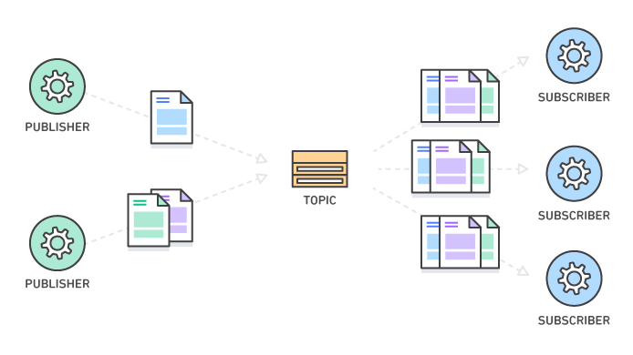

## CompletableFuture와 리액티브 프로그래밍 컨셉의 기초

- Reactive Programming의 개념
- Reactive Programming의 등장배경
- Reactive Programming의 핵심원칙
- Synchronous vs Asynchronous
- Blocking vs Non-Blocking
- Reactive Streams
- Message Queue
- Reactive Programming 사례

### 리액티브 프로그래밍

#### 정의

> In computing, reactive programming is a declarative programming paradigm concerned with data streams and the propagation of change. With this paradigm, it's possible to express static (e.g., arrays) or dynamic (e.g., event emitters) data streams with ease, and also communicate that an inferred dependency within the associated execution model exists, which facilitates the automatic propagation of the changed data flow.

→ 데이터 스트림과 변화에 반응하는 시스템을 구축하기 위한 프로그래밍 패러다임

#### 등장배경

1. 빅데이터의 증가
2. 다양한 환경에서의 애플리케이션 배포(모바일 ~ 클라우드 서비스)
3. ms 단위의 응답 시간 기대
4. 마이크로서비스 아키텍처 증가

→ 많은 기능을 포함한 하나의 독립적인 서비스가 아닌 작은 단위의 서비스로 나누어 서비스 간 네트워크 통신을 통하여 클라이언트의 요청을 처리할 수 있도록 데이터의 흐름에 반응하는 프로그래밍 기법의 필요성이 증가하게 됨

#### 핵심원칙

1. 비동기성(Asynchrony)<br>
리액티브 시스템은 이벤트 또는 데이터 스트림을 비동기적으로 처리한다.<br>
이를 통해 다른 작업을 동시에 수행하거나 블로킹을 피할 수 있다.

2. 반응성(Responsiveness)<br>
리액티브 시스템은 실시간으로 데이터의 변화에 반응한다.<br>
사용자 요청이나 외부 이벤트에 빠르게 응답할 수 있다.

3. 탄력성(Elasticity)<br>
리액티브 시스템은 부하나 실패에 유연하게 대응할 수 있다.<br>
시스템의 자원을 동적으로 조절하여 확장성과 견고성을 제공한다.

4. 메시지 기반(Messaging)<br>
리액티브 시스템은 메시지 기반 아키텍처를 기반으로 동작한다.<br>
컴포넌트 간에 비동기적으로 메시지를 교환하여 상호작용한다.

#### 장점

1. 성능과 확장성<br>
리액티브 시스템은 비동기적으로 동작하고, 병렬성을 통해 성능과 확장성을 향상시킨다.<br>
다수의 이벤트를 동시에 처리할 수 있으며, 필요에 따라 시스템을 확장할 수 있다.

2. 반응성과 사용자 경험<br>
리액티브 시스템은 실시간으로 데이터의 변화에 반응하여 빠른 응답 시간을 제공한다.<br>
이는 사용자 경험을 향상시키는 데 도움이 된다.

3. 장애 처리와 회복력<br>
리액티브 시스템은 장애가 발생하더라도 탄력적으로 대응할 수 있다.<br>
오류를 격리시키고, 다른 컴포넌트에 영향을 주지 않으면서 정상 동작을 유지할 수 있다.

#### Synchronous vs Asynchronous

- Synchronous<br>
요청한 작업에 대해 완료 여부를 따져 순차대로 처리하는 것을 말한다.<br>
→ 요청과 응답의 순서가 보장된다.

- Asynchronous<br>
요청한 작업에 대해 완료 여부를 따지지 않기 때문에 자신의 다음 작업을 그대로 수행하게 된다.<br>
→ 요청과 응답의 순서가 보장되지 않는다.



<br>

※ 비동기의 성능 이점<br>
요청한 작업이 처리되는 동안 응답을 기다리지 않고 다른 작업을 수행할 수 있기 때문에 전반적인 시스템 성능 향상에 도움을 줄 수 있다.



#### Blocking vs Non-Blocking

- Blocking<br>
A 작업을 처리하던 중 B 작업을 요청하면 A 작업을 Block(차단, 대기)하고 B 작업을 완료한 후에 다시 A 작업을 처리한다.

- Non-Blocking<br>
A 작업을 처리하던 중 B 작업을 요청하더라도 A 작업을 Block(차단, 대기) 하지 않고 A 작업과 B 작업을 동시에 처리한다.



<br>

※ Asynchronous vs Non-Blocking<br>
→ setTimeout 함수

```javascript
console.log("시작");

setTimeout(() => {
  console.log("1초 후에 실행됩니다!");
}, 1000);

console.log("끝");

/*
    결과
    시작
    끝
    1초 후에 실행됩니다!
*/
```

- 작업 완료 관점 (Asynchronous)<br>
setTimeout 함수의 타이머(1초) 작업 완료 여부와 상관없이 그 다음 라인인 console.log("끝")이 실행되었으므로 setTimeout은 비동기이다.

- 작업 차단 관점 (Non-Blocking)<br>
setTimeout 함수의 타이머(1초) 작업을 수행하기 위해 main 함수를 Block하지 않고 setTimeout의 타이머 작업과 console.log("끝")이 동시에 처리되므로 setTimeout은 Non-Blocking이다.

→ Asynchronous와 Non-Blocking은 관점의 차이만 있을 뿐 결과론적으로는 같다고 볼 수 있다.

※ 제어권

- Blocking<br>


- Non-Blocking<br>


※ Asynchronous + Non-Blocking 조합



→ Async Non Blocking 조합은 2개 이상의 작업을 동시에 처리하고(Non-Blocking), 요청한 순서대로 처리되지 않는다(Asynchronous). 이는 전체 작업 처리 시간을 줄일 수 있어 애플리케이션 성능을 향상시킬 수 있다.

#### Reactive Streams

Reactive Stream이란 Non-Blocking BackPressure를 이용하여 비동기 서비스를 할 때 기본이 되는 스펙이다.

→ Reactive Stream의 주된 목적은 비동기의 경계를 명확히 하여 스트림 데이터의 교환을 효과적으로 관리하는 것에 있다. 즉, 비동기로 데이터를 처리하는 시스템에 어느 정도의 data가 들어올지 예측 가능하도록 하는 것이다.

※ BackPressure(배압)
> 한 컴포넌트가 부하를 이겨내기 힘들 때, 시스템 전체가 합리적인 방법으로 대응해야 한다. 과부하 상태의 컴포넌트에서 치명적인 장애가 발생하거나 제어 없이 메시지를 유실해서는 안 된다. 컴포넌트가 대처할 수 없고 장애가 발생해선 안 되기 때문에 컴포넌트는 상류 컴포넌트들에 자신이 과부하 상태라는 것을 알려 부하를 줄이도록 해야 한다. 이러한 배압은 시스템이 부하로 인해 무너지지 않고 정상적으로 응답할 수 있게 하는 중요한 피드백 방법이다. 배압은 사용자에게까지 전달되어 응답성이 떨어질 수 있지만, 이 메커니즘은 부하에 대한 시스템의 복원력을 보장하고 시스템 자체가 부하를 분산할 다른 자원을 제공할 수 있는지 정보를 제공할 것이다.

※ API Components

1. Publisher : 데이터를 생성하고 통지한다.

```java
public interface Publisher<T> {
    public void subscribe(Subscriber<? super T> s);
}
```

2. Subscriber : 통지된 데이터를 전달받아서 처리한다.

```java
public interface Subscriber<T> {
    public void onSubscribe(Subscription s); // 데이터를 최초 통지할 대 호출되는 함수(Subscription 객체로 데이터 구독 요청 및 해지 요청)
    public void onNext(T t); // 데이터를 통지할 때마다 호출되는 함수
    public void onError(Throwable t); // 데이터를 통지할 때 에러가 발생하면 호출되는 함수
    public void onComplete(); // 데이터 통지가 끝났음을 알리는 함수
}
```

3. Subscription : 전달 받을 데이터의 개수를 요청하고 구독을 해지한다.

```java
public interface Subscription {
    public void request(long n); // 데이터 구독 요청
    public void cancel(); // 데이터 구독 취소
}
```

4. Processor : Publisher와 Subscriber의 역할을 동시에 할 수 있는 인터페이스

```java
public interface Processor<T, R> extends Subscriber<T>, Publisher<R> { }
```

→ Publisher는 무한한 data를 제공하며, 이 data는 Subscriber가 구독하는 형식으로 처리된다. Publisher.subscribe(Subscriber)의 형식으로 data 제공자와 구독자가 연결된다.

```java
onSubscribe onNext* (onError | onComplete)?

/*
  onSubscribe는 Publisher가 생산하는 data를 Subscriber가 항상 신호를 받을 준비가 되어있다는 의미이며, onNext로 데이터를 수신한다. 실패할 경우에는 onError 신호, 더 이상 사용할 수 있는 신호가 없을 경우에는 onComplete 신호를 호출한다. 이는 Subscription(구독)이 취소될 때까지 지속된다.
*/
```

※ Publisher-Subscriber 간 프로세스


1. Publisher에서 본인이 소유할 Subscription을 구현하고 publishing할 data를 만든다.
2. Publisher는 subscribe() 메서드를 통해 Subscriber를 등록한다.
3. Subscriber는 onSubscribe() 메서드를 통해 Subscription을 등록하고 Publisher를 구독하기 시작한다. 이는 Publisher에 구현된 Subscription을 통해 이루어진다. 이렇게 하면 Publisher와 Subscriber는 Subscription을 통해 연결된 상태가 된다. onSubscribe() 내부에 Subscription의 request()를 요청하면 그때부터 data 구독이 시작된다.
4. Suscriber는 Subscription 메서드의 request() 또는 cancel()을 호출을 통해 data의 흐름을 제어할 수 있다.
5. Subscription의 request()에는 조건에 따라 Subscriber의 onNext(), onComplete() 또는 onError()를 호출한다. 그러면 Subscriber의 해당 메서드의 로직에 따라 request() 또는 cancle()로 제어하게 된다.

#### Message Queue와 Pub/Sub Model

1. Message Queue<br>
프로세스 또는 프로그램 인스턴스가 데이터를 서로 교환할 때 사용하는 통신 방법으로, 메시지 지향 미들웨어(Message Oriented Middleware; MOM)를 구현한 시스템을 의미한다.<br>
＊ 메시지 지향 미들웨어 : 메시지 API를 통해 분산되어 있는 애플리케이션 간의 데이터를 교환할 수 있도록 하는 시스템

※ 장점
- 비동기(Asynchronous) : 데이터를 Queue에 넣어 관리하기 때문에 나중에 처리할 수 있다.
- 낮은 결합도(Decoupling) : 애플리케이션과 분리되어 확장이 용이하다.
- 탄력성(Resilience) : 서버에 문제가 생겨도 Queue에 메시지가 그대로 존재하므로 전체적으로 영향을 주지 않는다.
- 보증(Guarantees) : 모든 메시지가 Subscriber에게 전달되는 것을 보장하며, 작업 처리 여부를 확인할 수 있다.
- 확장성(Scalable) : N:1:M 구조로 다수의 프로세스들이 Queue에 메시지를 전송할 수 있다.

※ Message Queue를 사용하는 이유
- 대용량 데이터 처리 시 Task를 MQ에 넣어두고 하나의 Task가 끝나면 다음에 처리할 Task를 MQ에서 가져와 처리한다.(부하 분산)
- 일정 시간동안 Task의 처리 여부를 MQ에 전달하지 않으면 MQ는 이 Task를 다시 Queue에 넣어 처리한다.(데이터 손실 방지)

※ 오픈소스 Message Queue
- RabbitMQ
- ActiveMQ
- ZeroMQ
- Kafka
- Redis

2. Pub/Sub(Messaging Pattern)<br>
Pub(Publisher)가 Topic에 메시지를 보내면 해당 Topic을 구독해놓은 전체 Sub(Subscriber)에게 메시지가 전송되면서 데이터 교환이 이루어지는 방법이다.



- Publisher(게시자) : Message를 생성한 뒤에 Topic에 전달하는 서버
- Message(메시지) : 서로 다른 API끼리 통신할 데이터
- Topic, Channel : task(업무)
- Subscriber(구독자) : Message를 수신하는 서버

→ 비동기 메시징 패턴으로 Publisher가 발행한 Topic을 Subscriber가 받아서 처리하는 동안 Publisher는 다른 작업을 수행할 수 있다는 장점이 있다.

※ Observer Pattern vs Pub/Sub Messaging Pattern
- Observer Pattern은 Observer와 Subject가 서로를 인지하지만 Pub-Sub Pattern의 경우 서로를 전혀 몰라도 상관없다.<br>
→ Observer Pattern의 경우 Subject에 Observer를 등록하고 통지를 해야하지만, Pub-Sub Pattern은 Queue에 메시지를 전달하기만 하면 된다.
- Observer Pattern에 비해 Pub-Sub Pattern이 결합도가 더 낮다.(Loose Coupling)
- Observer Pattern은 동기(synchronous) 방식으로 동작하나 Pub-Sub Pattern은 비동기(asynchronous) 방식으로 동작한다.
- Observer Pattern은 단일 도메인에서 구현되어야 하나 Pub-Sub Pattern은 크로스 도메인 상황에서도 구현 가능하다.

출처

- https://en.wikipedia.org/wiki/Reactive_programming
- https://devocean.sk.com/blog/techBoardDetail.do?ID=165099&boardType=techBlog
- https://inpa.tistory.com/entry/👩%E2%80%8D💻-동기비동기-블로킹논블로킹-개념-정리#
- https://sabarada.tistory.com/98
- https://reactivemanifesto.org/ko
- https://github.com/reactive-streams/reactive-streams-jvm/blob/v1.0.3/README.md#specification
- https://jade314.tistory.com/entry/리엑티브Reactive-프로그래밍-기본-구성-요소
- https://souljit2.tistory.com/78
- https://devfunny.tistory.com/928
- https://joojae.com/what-is-message-queue/
- https://velog.io/@spamdong/메세지-지향-미들웨어MOM
- https://jistol.github.io/software%20engineering/2018/04/11/observer-pubsub-pattern/