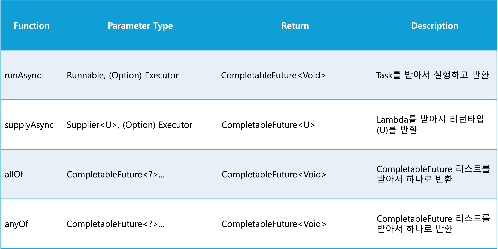

## CompletableFuture-안정적 비동기 프로그래밍

### 병렬성과 동시성
  

#### 동시성 
- 단일 코어 머신에서 발생할 수 있는 프로그래밍 속성으로 실행이 서로 겹칠 수 있는 것
- 하나의 코어에서 여러개의 작업이 번갈아가며 실행되는 것

#### 병렬성
- 여러 코어를 통해 작업들이 실행되는 것을 의미
- 하나의 코어가 아닌 멀티코어 환경을 의미

### 자바(1.5)에서의 비동기 처리
#### Future
- JDK 1.5
- 비동기적인 연산에 대한 결과를 가지고있는 것
- 다른 쓰레드에서 사용한 결과를 가져오는 가장 기본이 되는 인터페이스
  
#### Future의 문제점
- 여러 Future 간 의존성은 표현하기 어려움
- 너무 복잡한 try - catch

### 자바(1.8)에서의 비동기 처리
#### CompletableFuture란?
- JDK 1.8
- 기능
  - 두 개의 비동기 계산 결과를 합침
  - 두 결과는 서로 독립적 또는 한쪽에 의존적일 수 있음
  - Future 집합이 실행하는 모든 태스크의 완료를 기다림
  - Future 집합에서 가장 빨리 완료되는 태스크를 기다렸다가 결과를 얻음
  - 프로그램적으로 Future를 완료 (비동기 동작에서 수동으로 결과 제공) 
  - Future 완료 동작에 반응(결과를 기다리면서 블록되지 않음)

#### CompletableFuture 메서드 종류
  

#### RunAsync
~~~
CompletableFuture.runAsync(() -> {
    try {
         Thread.sleep(10L);
        } catch (InterruptedException e) {
            e.printStackTrace();
        }
    System.out.println(Thread.currentThread().getName() + ": hi");
});
~~~
- Runnable은 익명 클래스로 Lambda로 던질 수 있음
- 리턴 타입은 따로 없고, 그냥 Task를 받아서 소비하는 역할
- 하지만 해당 방법은 위험한 방식
- 시스템이 거대하고 쓰레드를 직접 컨트롤하고 싶은 경우?
  - Executor를 파라미터로 보냄
  ~~~
  Executor executor = Executors.newFixedThreadPool(30);

    CompletableFuture.runAsync(() -> {
        try {
            Thread.sleep(10L);
            } catch (InterruptedException e) {
                e.printStackTrace();
            }
        System.out.println(Thread.currentThread().getName() + ": hi");
    }, executor);
  ~~~ 
  - 지정한 쓰레드 풀 내에서 작업을 실행

#### SupplyAsync
~~~
CompletableFuture.supplyAsync(() -> {
    try {
        Thread.sleep(time);
        } catch (InterruptedException e) {
            e.printStackTrace();
        }
        return Thread.currentThread().getName() + ": hi";
});
~~~
- runAsync와는 단순히 리턴값이 있냐 없냐 차이

#### AllOf, AnyOf
- AllOf
  - 모든 CompletableFuture들이 Task들을 완료한다는 조건으로 사용
- AnyOf 
  - 하나라도 Task들을 성공한다는 조건으로 사용

#### Exceptionally
- 예외가 발생하면 Exceptionally를 통해 핸들링
~~~
  @Test
    @DisplayName("supplyAsync 테스트")
    void supplyAsync_test() {
        Executor executor = Executors.newFixedThreadPool(30); // Thread Pool 만들고
        final List<CompletableFuture<String>> futures = IntStream.range(0, 100)
                .limit(10) // 10개의 랜덤한 0 ~ 100 숫자
                .boxed()
                .map(time -> CompletableFuture.supplyAsync(() -> { // 해당 숫자만큼 쓰레드 정지
                            try {
                                Thread.sleep(time);
                            } catch (InterruptedException e) {
                                e.printStackTrace();
                            }
                            return Thread.currentThread().getName() + ": hi";
                        }, executor)
                        .orTimeout(2L, TimeUnit.MILLISECONDS) // 대신 타임아웃은 2ms
                        .exceptionally(e -> Thread.currentThread().getName() + ": Failed") // 예외 발생시 실행할 태스크
                )
                .collect(Collectors.toList());

        futures.stream()
                .map(CompletableFuture::join)
                .forEach(System.out::println);
    }
~~~

### 스트림 병렬화와 CompletableFuture 병렬화
#### 스트림 병렬화 
- 비블록 코드 만들기
~~~
// 상점 리스트
List<Shop> shops = Arrays.asList(new Shop("BestPrice"),
                                 new Shop("LetsSaveBig"),
                                 new Shop("MyFavoriteShop"),
                                 new Shop("BuyItAll"));

// 품명을 입력하면 상점 이름과 제품 가격 문자열을 반환하는 List 스트림으로 구현
public List<String> findPrices(String product) {
  return shops.stream()
    .map(shop -> String.format("%s price is %.2f", shop.getName(), shop.getPrice(product)))
    .collect(toList());
}
~~~

- 병렬 스트림으로 요청 병렬화
~~~
public List<String> findPrices(String product) {
  return shops.parallelStream()
    .map(shop -> String.format("%s price is %.2f", shop.getName(), shop.getPrice(product)))
    .collect(toList());
}
~~~

- 네 개의 상점에서 병렬로 검색이 진행되므로 시간은 하나의 상점에서 가격을 검색하는 정도만 소요

- 병렬 스트림의 문제점
  - 4개의 작업을 병렬로 수행하여 검색 시간을 최소화 하지만 5개의 작업이 진행되는 경우 4개의 작업 중 하나라도 끝나야 5번째 작업이 시작될 수 있음

#### 스트림 병렬화와 CompletableFuture 병렬화 차이
 - I/O가 포함되는 않은 계산 중심의 동작을 실행할 때는 스트림 인터페이스가 가장 구현하기 간단하며 효율적일 수 있음
- I/O를 기다리는 작업을 병렬로 실행할 때는 CompletableFuture가 더 많은 유연성을 제공하며, 대기/계산의 비율에 적합한 스레드 수를 설정할 수 있음
- 스트림의 게으른 특성 때문에 스트림에서 I/O를 실제로 언제 처리할지 예측하기 어려움

### 출처 
- https://highlighter9.tistory.com/72
- https://huisam.tistory.com/entry/completableFuture#Exceptionally-1
- https://robin00q.tistory.com/70
- https://eno1993.tistory.com/m/252