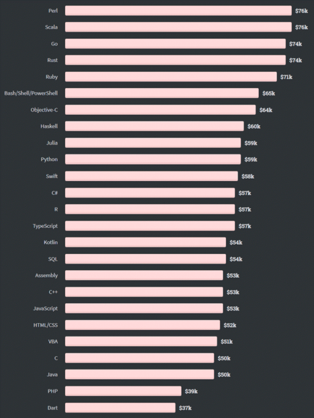

## OOP 와 FP의 조화

### 스칼라

스칼라라는 언어가 있다. 매우 생소할탠대 스칼라는 객체지향과 함수형 프로그래밍을 모두 지원하는 언어이다.

JVM 환경 위에서 동작하는 언어로 주로 Apache Spark나 복잡한 수학적 계산이나 알고리즘을 개발하는데 사용된다.

예전에는 연봉의 최상위권에 속하는 언어였지만 요즘은 더 많은 언어가 생겨나면서 그 위상이 조금씩 떨어지고 있다.

책에서는 스칼라와 자바의 코드를 비교해보면서 스칼라가 어떻게 객체지향과 함수형 프로그래밍을 모두 지원하는지 알려준다.

다만 의미가 있는지는 매우 의문이다. 스칼라를 배우는 것이 좋은지 또한 의문이다.

자바의 함수형은 계속 성장하고 있고 주 목적인 데이터 처리또한 파이썬이 더 강력하다.

그렇기 때문에 이번 챕터에서는 스칼라에 대해 소개만 하고 넘어가도록 하겠다.

