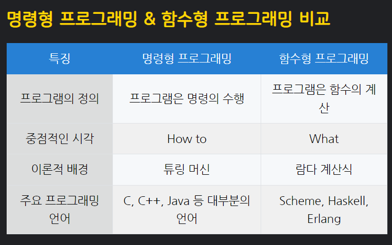
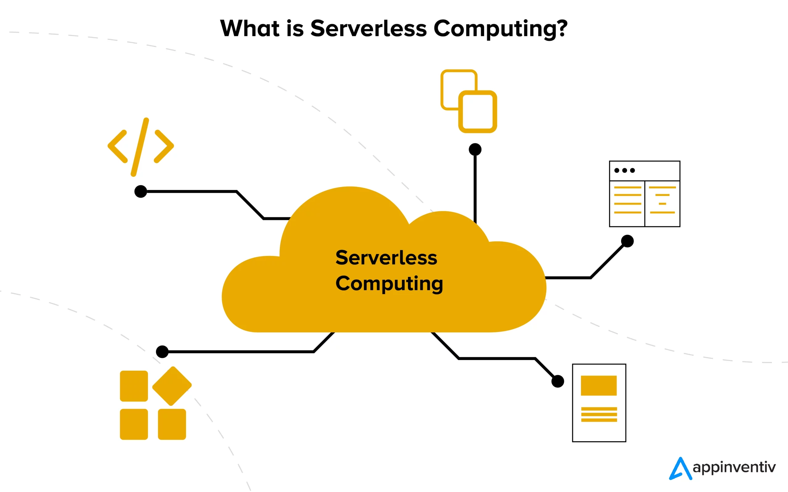
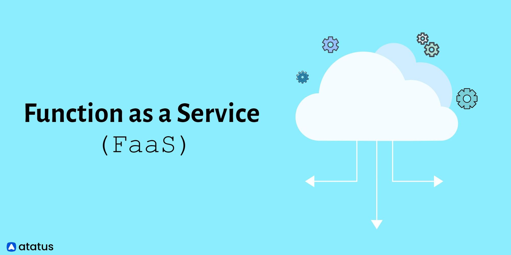
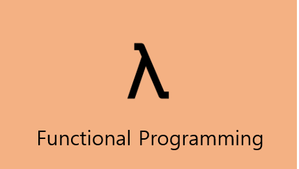

## OOP 와 FP의 조화

### 스칼라

스칼라라는 언어가 있다. 매우 생소할탠대 스칼라는 객체지향과 함수형 프로그래밍을 모두 지원하는 언어이다.

JVM 환경 위에서 동작하는 언어로 주로 Apache Spark나 복잡한 수학적 계산이나 알고리즘을 개발하는데 사용된다.

예전에는 연봉의 최상위권에 속하는 언어였지만 요즘은 더 많은 언어가 생겨나면서 그 위상이 조금씩 떨어지고 있다.

책에서는 스칼라와 자바의 코드를 비교해보면서 스칼라가 어떻게 객체지향과 함수형 프로그래밍을 모두 지원하는지 알려준다.

다만 의미가 있는지는 매우 의문이다. 스칼라를 배우는 것이 좋은지 또한 의문이다.

자바의 함수형은 계속 성장하고 있고 주 목적인 데이터 처리또한 파이썬이 더 강력하다.

최근 몇 년간 Kotlin 같은 다른 JVM 언어의 등장으로 스칼라의 독보적인 위치는 조금씩 변화하고 있다.

Kotlin은 안드로이드 개발을 중심으로 빠르게 성장하고 있으며, 간결하고 현대적인 문법 덕분에 개발자 사이에서 선호도가 높아지고 있다.

이는 스칼라가 처음 등장했을 때와 비슷한 상황이며, 이런 새로운 언어들의 부상이 스칼라의 상대적인 중요도에 영향을 주고 있다.

또한 자바에서의 함수형도 스트림 API와 람다식을 활용해 함수형 프로그래밍의 장점을 살릴 수 있게 되었다.

그렇기 때문에 이번 챕터에서는 스칼라에 대해 이 정도 소개만 하고 넘어가도록 하겠다.

-----

## 객체지향과 함수형 프로그래밍의 조화

명령형 프로그래밍과 함수형 프로그래밍은 서로 다른 패러다임이다.

명령형 프로그래밍

- 절차적 프로그래밍(C , C++ 등)
    - 수행되어야 할 순차적인 처리 과정을 포함하는 방식
- 객체지향 프로그래밍(Java, C# 등)
    - 객체를 중심으로 프로그래밍하는 방식

선언형 프로그래밍

- 함수형 프로그래밍
    - 순수함수를 조합해 프로그래밍하는 방식
    - 어떻게 할지(How) 보다 무엇을 할지(What)에 집중하는 방식
    - ex) 스트림에서 데이터를 필터링하고 정렬하는 방법을 정의하는 것이 아니라, 데이터를 필터링하고 정렬한다는 것에 집중

-----

## 서버리스 (Serverless)

앞선 두 챕터에서 객체지향과 함수형 프로그래밍을 비교해보았다.

서버리스 아키텍처를 소개하자면

서버리스는 서버가 없는 것이 아닌 서버를 관리하는 것을 클라우드 제공업체에 맡기는 것이다.

서버리스 아키텍처의 대표적인 두가지는 FaaS(Function as a Service)와 BaaS(Backend as a Service)이다.l

Fass는 AWS Lambda, Azure Functions, Google Cloud Functions 등이 있으며 BaaS는 Firebase, AWS Amplify, Azure Mobile Apps 등이 있다.

### FaaS(Function as a Service)

> 함수 자체를 서비스로 제공하는 방식

사용자가 작성한 코드를 업로드하면 서버는 함수단위로 실행할 수 있게 해주는 서비스이다.

대기상태의 함수가 실행되면 비용이 발생하며 실행이 끝나면 다시 대기상태로 돌아간다.

비용은 함수의 호출 횟수만큼 발생하며 함수가 실행되는 시간에 따라 비용이 달라진다.

#### 특징

- Statless: 함수는 상태를 가지지 않는다. 함수가 실행될 때마다 새로운 인스턴스가 생성되며 실행이 끝나면 인스턴스는 사라진다.
- Event-driven: 함수는 이벤트에 의해 실행된다. 이벤트가 발생하면 함수가 실행되며 이벤트에 따라 다양한 서비스와 연동할 수 있다.

### BaaS(Backend as a Service)

> 백엔드 서비스를 제공하는 방식

가장 유명한게 Firebase이다. Firebase는 실시간 데이터베이스, 인증, 클라우드 메시징, 스토리지, 호스팅 등을 제공한다.

API연동이나 DB등 서비스의 비지니스 로직이 복잡하지 않은 경우에 적합하다.

주로 앱 개발이나 프론트 엔드 개발에 사용된다.

----

### 정리

위 두개의 아키텍처는 굳이 함수형 프로그래밍이 아니여도 사용할 수 있는 아키텍처이다.

함수형 프로그래밍은 순수 함수와 불변성, 사이드 이펙트의 최소화를 중심으로 하는 패러다임다.

이러한 특성은 특히 FaaS(Function as a Service)와 같은 서버리스 아키텍처에서 큰 이점을 제공한다.

예를 들어, AWS Lambda에서 함수형 프로그래밍 기법을 사용하여 데이터 흐름과 이벤트 처리 로직을 명확하게 구현할 수 있다.

각 함수는 독립적으로 실행되며, 입력 데이터에 대해 예측 가능한 결과를 출력하므로, 복잡한 시스템에서도 오류를 최소화하고 테스트 및 유지보수를 용이하게 만다.

한 가지 실제 사례로는 로그 데이터 처리가 있다.

로그 데이터를 수집하고, 필터링 및 변환 과정을 거쳐 분석 가능한 형태로 저장하는 일련의 함수를 개발할 수 있다.

각 함수는 특정 작업을 순수하게 처리하며, 데이터의 변환과정에서 불변성을 유지함으로써 사이드 이펙트 없이 데이터의 일관성을 보장한다.

또한, 이러한 방식은 다수의 로그 데이터를 병렬적으로 빠르게 처리하는 데 효율적이며, 시스템의 확장성과 유연성을 높이는 데 기여한다.

이런 서비스는 어떻게(How) 처리하는지보다 무엇을(What) 처리하는지에 집중할 수 있게 해준다.

-----

> 함수형 프로그래밍의 이러한 특성은 특히 데이터 중심의 애플리케이션, 비동기 작업 처리, 이벤트 기반 시스템 설계에 이점을 제공하며,
> 클라우드 기반 아키텍처와 통합될 때 더욱 큰 장점을 발휘할 수 있다

 https://www.inflearn.com/pages/infcon-2023-tech-oopfp

 https://www.tiobe.com/tiobe-index/