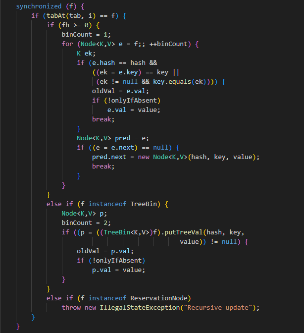

## 컬렉션 API 개선

### 컬렉션 팩토리

```java
List<String> friends1 = new ArrayList<>();
friends1.add("장예진");
friends1.add("김현기");
friends1.add("전다빈");
// friends1 = [장예진, 김현기, 전다빈]

List<String> friends2 = Arrays.asList("장예진", "김현기", "전다빈");
// friends2 = [장예진, 김현기, 전다빈]

friends2.set(0, "이은영1");
// friends2 set = [이은영1, 김현기, 전다빈]
friends2.add("이은영2");
// UnsupportedOperationException 발생
```
Arrays.asList()를 통해 리스트를 생성할 경우 리스트에 새 요소를 추가하거나 삭제가 불가능하다.<br>
(set() 동작은 가능하나, add()는 불가능하다.)

1. 리스트 팩토리

```java
List<String> friends = List.of("장예진", "김현기", "전다빈");
// friends = [장예진, 김현기, 전다빈]

friends.set(0, "이은영1");
friends.add("이은영2");
// UnsupportedOperationException 발생
```

2. 집합 팩토리

```java
Set<String> friends = Set.of("장예진", "김현기", "전다빈");

Set<String> friends = Set.of("장예진", "장예진", "전다빈");
// IllegalArgumentException 발생
```
집합은 오직 고유의 요소만 포함할 수 있다.

3. 맵 팩토리

```java
// 10개 이하의 키와 값 쌍을 가진 맵
Map<String, Integer> ageOfFriends = Map.of("장예진", 20, "김현기", 21, "전다빈", 22);
// ageOfFriends = {전다빈=22, 장예진=20, 김현기=21}

// 10개 이상의 키와 값 쌍을 가진 맵
Map<String, Integer> ageOfFriends = Map.ofEntries(entry("장예진", 20), entry("김현기", 21), entry("전다빈", 22));
// ageOfFriends = {전다빈=22, 장예진=20, 김현기=21}
```

### 리스트와 집합 처리

Java 8에서 List, Set 인터페이스에 추가한 메서드
- removeif : 프레디케이트를 만족하는 요소를 제거한다.
- replaceAll : 리스트에서 이용할 수 있는 기능으로 UnaryOperator 함수를 이용해 요소를 바꾼다.
- sort : List 인터페이스에서 제공하는 기능으로 리스트를 정렬한다.

→ 새로운 결과를 만드는 스트림 동작과 달리 이들 메서드는 기존 컬렉션을 바꾼다.

1. removeIf 메서드

```java
for(Transaction transaction : transactions) {
    if(Character.isDigit(transaction.getReferenceCode().charAt(0))){
        transactions.remove(transaction);
    }
}
// ConcurrentModificationException 발생
// 하나 이상의 Thread가 동시에 컬렉션을 수정하려고 할 때 발생하는 Exception

for(Iterator<Transaction> iterator = transactions.iterator();
     iterator.hasNext(); ) {
    Transaction transaction = iterator.next();
    if(Character.isDigit(transaction.getReferenceCode().charAt(0))){
        // 반복하면서 별도의 두 객체를 통해 컬렉션을 바꾸고 있는 문제
        transactions.remove(transaction);
    }
}
```

- Iterator 객체 : next(), hasNext()를 이용해 소스를 질의
- Collection 객체 : remove()를 호출해 요소 삭제

→ 결과적으로 반복자의 상태는 컬렉션의 상태와 서로 동기화 되지 않는다.

※ 향상된 for문은 내부적으로 iterator 객체를 생성하여 컬렉션을 순회하며, 그 과정에서 modCount를 비교하여 리스트의 구조적 변화를 금지한다.
modCount : 리스트의 구조적 상태를 변화시킨 횟수(add나 remove)

```java
transactions.removeIf(transaction -> Character.isDigit(transaction.getReferenceCode().charAt(0)));
```

2. replaceAll 메서드

* 스트림 API 사용

```java
// 새 문자열 컬렉션 생성
referenceCodes.stream()
                .map(code -> Character.toUpperCase(code.charAt(0) + code.substring(1))
                .collect(Collectors.toList())
                .forEach(System.out::println);
```

* ListIterator 객체 사용

```java
// 기존 컬렉션 변경
for( ListIterator<String> iterator = referenceCodes.listIterator();
    iterator.hasNext(); ) {
        String code = iterator.next();
        iterator.set(Character.toUpperCase(code.charAt(0)) + code.substring(1));
    }
```

```java
referenceCodes.replaceAll(code -> Character.toUpperCase(code.charAt(0)) + code.substring(1));
```

### 맵 처리

1. forEach 메서드

```java
// Map.entry<K, V> : key-value pair
for(Map.Entry<String, Integer> entry : ageOfFriends.entrySet()) {
    String friend = entry.getKey();
    Integer age = entry.getValue();
}

// Map 인터페이스는 BiConsumer(키와 값을 인수로 받음)를 인수로 받는 forEach 메서드
ageOfFriends.forEach((friend, age) -> System.out.println(friend + " is " + age + " years old"));
```

2. 정렬 메서드

- Entry.comparingByValue
- Entry.comparingByKey

→ Map의 항목을 value 또는 key를 기준으로 정렬할 수 있다.

```java
Map<String, String> favouriteMovies = Map.ofEntries(
                                        entry("Raphael", "Star Wars")
                                        , entry("Cristina", "Matrix")
                                        , entry("Olivia", "James Bond"));
favouriteMovies.entrySet()
                .stream()
                .sorted(Entry.comparingByKey())
                .forEachOrdered(System.out.::println);

/*
    Cristina=Matrix
    Olivia=James Bond
    Raphael=Star Wars
*/
)
```

3. getOrDefault 메서드

Map에 key가 존재하지 않으면 NullPointerException이 발생하므로 이를 방지하기 위해 getOrDefault 메서드에서는 첫번째 인수로 Key, 두번째 인수로 기본값을 받아서 반환한다.<br>
(key가 존재하더라도 값이 null이면 getOrDefault도 null을 반환한다.)

```java
Map<String, String> favouriteMovies = Map.ofEntries(
                                            entry("Raphael", "Star Wars"),
                                            entry("Olivia", "James Bond"));

System.out.println(favouriteMovies.getOrDefault("Olivia", "Matrix"));
// James Bond
System.out.println(favouriteMovies.getOrDefault("Thibaut", "Matrix"));
// Matrix
```

4. 계산 패턴

Map에 key가 존재하는지 여부에 따라 어떤 동작을 실행하고 결과를 저장해야 하는 상황에서의 연산

- computeIfAbsent : 제공된 key에 해당하는 value이 없으면(값이 없거나 null), key를 이용해 새 value을 계산하고 Map에 추가한다.
- computeIfPresent : 제공된 key가 존재하면 새 value을 계산하고 Map에 추가한다.
- compute : 제공된 key로 새 value을 계산하고 Map에 저장한다.

```java
Map<String, byte[]> dataToHash = new HashMap<>();
MessageDigest messageDigest = MessageDigest.getInstance("SHA-256");

lines.forEach(line -> 
                dataToHash.computeIfAbsent(line, this::calculateDigest));

// 헬퍼가 제공된 key의 해시를 계산할 것
private byte[] calculateDigest(String key) {
    return messageDigest.digest(key.getBytes(StandardCharsets.UTF_8));
}
```

여러 값을 저장하는 Map<br>
→ Map<K, List&lt;V&gt;> 에 요소를 추가하려면 항목이 초기화되어 있는지 확인해야 한다.

```java
String friend = "Raphael";
List<String> movies = friendsToMovies.get(friend);
// 리스트가 초기화되었는지 확인
if(movies == null) {
    movies = new ArrayList<>();
    friendsToMovies.put(friend, movies);
}

movies.add("Star Wars");

System.out.println(friendsToMovies);

friendsToMovies.computeIfAbsent("Raphael", name -> new ArrayList<>())
                .add("Star Wars");
```

5. 삭제 패턴

```java
String key = "Raphael";
String value = "Jack Reacher 2";
if(favouriteMovies.containsKey(key) && Objects.equals(favouriteMovies.get(key), value)) {
    favouriteMovies.remove(key);
    return true;
}
else {
    return false;
}

favouriteMovies.remove(key, value);
```

6. 교체 패턴

- replaceAll : BiFunction을 적용한 결과로 각 항목의 값을 교체한다.
- Replace : key가 존재하면 Map의 값을 바꾼다.

```java
// replaceAll을 적용할 것이므로 바꿀수 있는 맵을 사용해야 한다.
Map<String, String> favouriteMovies = new HashMap<>();
favouriteMovies.put("Raphael", "Star Wars");
favouriteMovies.put("Olivia", "James bond");
favouriteMovies.replaceAll((friend, movie) -> movie.toUpperCase());
System.out.println(favouriteMovies);
```

7. 합침

- putAll : 두 개의 Map을 합침

```java
Map<String, String> family = Map.ofEntries(
                                    entry("Teo", "Star Wars"),
                                    entry("Cristina", "James Bond"));
Map<String, String> friends = Map.ofEntries(
                                    entry("Rapahael", "Star Wars"));
Map<String, String> everyone = new HashMap<>(family);
// friends의 모든 항목을 evenyone으로 복사
everyone.putAll(friends);
System.out.println(everyone);
)
```

중복된 key가 없을 경우에 해당한다.

```java
Map<String, String> family = Map.ofEntries(
                                    entry("Teo", "Star Wars"),
                                    entry("Cristina", "James Bond"));
Map<String, String> friends = Map.ofEntries(
                                    entry("Rapahael", "Star Wars"),
                                    entry("Cristina", "Matrix"));
Map<String, String> everyone = new HashMap<>(family);
// 중복된 key가 있으면 두 값을 연결
friends.forEach((k, v) -> everyone.merge(k, v, (movie1, movie2) -> movie1 + " & " + movie2));
System.out.println(everyone);
)
```

merge 메서드는 중복된 key를 어떻게 합칠지 결정하는 BiFunction을 인수로 받는다.

> 지정된 key와 연관된 값이 없거나 값이 null이면 merge 메서드는 key를 null이 아닌 값과 연결한다. 아니면 merge 메서드는 연결된 값을 주어진 매핑 함수의 결과 값으로 대치하거나 결과가 null이면 항목을 제거한다.

merge 메서드를 이용한 초기화 검사 구현

```java
Map<String, Long> moviesToCount = new HashMap<>();
String movieName = "JamesBond";
long count = moviesToCount.get(movieName);
if(count == null) {
    moviesToCount.put(movieName, 1);
}
else {
    moviesToCount.put(movieName, count + 1);
}

moviesToCount.merge(movieName, 1L, (key, count) -> count + 1L);
```

merge 메서드의 두번째 인수는 key와 연관된 기존 값에 합쳐질 null이 아닌 값 또는 값이 없거나 key에 null 값이 연관되어 있다면 이 값을 key와 연결한다.<br>
→ key의 반환값이 null이므로 1이 사용된다.

### 개선된 ConcurrentHashMap

※ HashMap vs HashTable vs ConcurrentHashMap

1. HashMap
- key와 value에 null 허용
- Single Thread 환경에서 사용<br>
→ get(), put()에서 synchronized 키워드 사용하지 않음
- 데이터 탐색 속도는 빠르나 신뢰성과 안정성이 떨어짐

```java
public class HashMap<K, V> extends AbstractMap<K, V>
    implements Map<K,V>, Cloneable, Serializable {
 
    public V get(Object key) { ... };
    public V put(K key, V value) { ... };
    public V remove(Object key) { ... };
    
    ...
}
```

2. HashTable
- key와 value에 null을 허용하지 않음
- Multi-Thread 환경에서 Thread-safe함<br>
→ get(), put(), remove()에 synchronzied 키워드 사용<br>
→ synchronized Lock 문제로 데이터 처리가 매우 느리다(병목 현상 발생 등)

```java
public class Hashtable<K,V> 
    extends Dictionary<K,V> 
    implements Map<K,V>, Cloneable, java.io.Serializable {

    public synchronized V get(Object key) { ... };
    public synchronized V put(K key, V value) { ... };
    public synchronized V remove(Object key) { ... };
    
    ...
}
```

3. ConcurrentHashMap
- key와 value에 null을 허용하지 않음
- Multi-Thread 환경에서 Thread-safe함
- 읽기는 여러 스레드가 동시에 읽을 수 있지만, 쓰기는 특정 세그먼트 or Bucket에 대한 Lock을 사용한다.
- Bucket에 단위로 Lock을 사용하기 때문에 같은 Bucket이 아니라면 Lock을 기다릴 필요가 없다는 특징이 있다.
- Entry 아이템별로 락을 걸어 성능이 HashTable보다 빠르다.

get()


put()<br>
→ put() 호출 시 putVal() 메서드 실행



※ Compare and Swap(cas) 방식
Multi-Thread 환경에서 동시성 처리를 위한 방법 중 하나로, 특정 메모리 위치 값이 주어진 값과 동일할 경우 해당 메모리 주소를 새로운 값으로 교체한다.

→ putVal() 메서드 동작 시 Bucket에 Node가 존재하는 경우 synchronized 키워드를 이용해 하나의 Thread만 해당 Bucket에 접근할 수 있도록 제어한다.

→ HashTable은 전체 Map에 대하여 Lock을 사용하고, ConcurrentHashMap은 Bucket에 대해서만 Lock을 사용하여 HashTable보다 성능이 높다.

Thread-safety<br>
Multi-Thread 환경에서 여러 스레드가 동시에 같은 객체에 접근해도 연산 결과를 보장할 수 있는 것을 말한다.

ConcurrentHashMap에서 지원하는 연산

- forEach : 각 (키, 값) 쌍에 주어진 액션을 실행
- reduce : 모든 (키, 값) 쌍을 제공된 리듀스 함수를 이용해 결과로 합침
- search : 널이 아닌 값을 반환할 때까지 각 (키, 값) 쌍에 함수를 적용

ConcurrentHashMap의 상태를 잠그지 않고 연산을 수행한다. <br>
→ 계산이 진행되는 동안 바뀔 수 있는 개체, 값, 순서 등에 의존하지 않아야 한다.

병렬성 기준값을 지정해야 한다. <br>
→ 맵의 크기가 주어진 기준값보다 작으면 순차적으로 연산을 실행한다. 기준값을 1로 지정하면 공통 스레드 풀을 이용해 병렬성을 극대화한다.

```java
ConcurrentHashMap<String, Integer> map = new ConcurrentHashMap<>();
map.put("first", 100);
map.put("second", 220);
map.put("third", 333);

// 병렬성 기준값
// 연산이 병렬적으로 실행되어져야 할 때 collection의 최소 size
long parallelismThreshold = 1;

// ofNullable : null값 허용
Optional<Integer> maxValue = Optional.ofNullable(map.reduceValues(parallelismThreshold, Integer::max));
System.out.println("maxValue = " + maxValue);
// maxValue = Optional[333]
```

2. 계수

ConcurrentHashMap 클래스는 맵의 매핑 개수를 반환하는 mappingCount 메서드를 제공한다.

3. 집합뷰

ConcurrentHashMap 클래스는 ConcurrentHashMap을 집합 뷰로 반환하는 keySet이라는 메서드를 제공한다.


출처 
- iterator 분석 : https://javanitto.tistory.com/10
- ConcurrentHashMap : https://parkmuhyeun.github.io/woowacourse/2023-09-09-Concurrent-Hashmap/
- ConcurrentHashMap 개념 및 동기화 동작 원리 : https://wildeveloperetrain.tistory.com/271
- ConcurrrentHashMap java : https://github.com/openjdk/jdk/blob/master/src/java.base/share/classes/java/util/concurrent/ConcurrentHashMap.java
- HashMap vs HashTable vs ConcurrentHashMap : https://tecoble.techcourse.co.kr/post/2021-11-26-hashmap-hashtable-concurrenthashmap/
- Thread Safety : https://developer-ellen.tistory.com/205