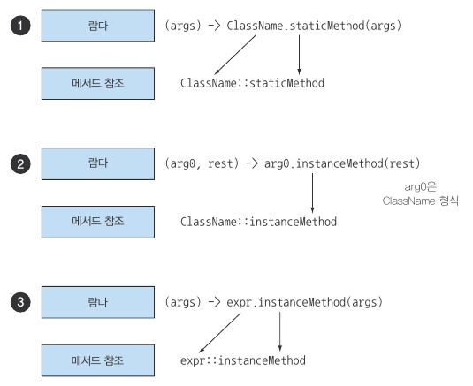
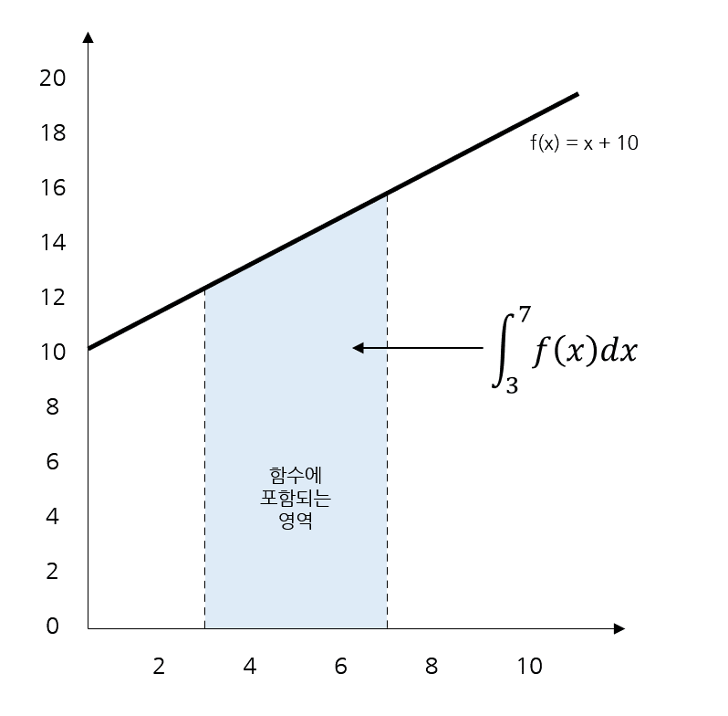

## Chapter3 람다 표현식 (part 6~9)

### 메서드 참조
메서드 참조를 이용하면 기존의 메서드 정의를 재활용해서 람다처럼 전달할 수 있다.

```java
inventory.sort(Apple::getWeight());
```

메서드 참조는 특정 메서드만을 호출하는 람다 표현식의 축약형이라고 할 수 있다.<br>
메서드명을 직접 참조하는 것이 편리하며, 명시적으로 메서드명을 참조함으로써 가독성을 높일 수 있다.<br>

※ 람다와 메서드 참조 단축 표현 예제
|람다|메서드 참조 단축 표현|
|---|---|
|(Apple apple) -> apple.getWeight()|Apple::getWeight|
|() -> Thread.currentThread().dumpStack()|Thead.currentThread()::dumpStack|
|(str, i) -> str.substring(i)|String::substring|
|(String s) -> System.out.println(s)<br>(String s) -> this.isValidName(s)|System.out::println<br>this::isValidName|
<br>

* 메서드 참조를 만드는 방법
1. 정적 메서드 참조<br>
→ Integer::parseInt

2. 다양한 형식의 인스턴스 메서드 참조<br>
→ String::length

3. 기존 객체의 인스턴스 메서드 참조<br>
→ expensiveTransaction::getValue (Transaction 객체를 할당받은 expensiveTransaction 지역변수)
<br>

```java
// 헬퍼 메서드
private boolean isValidName(String string) {
    return Character.isUpperCase(string.charAt(0));
}

filter(words, this::isValidName);
```

※ Helper Class<br>
애플리케이션의 핵심 목적이 아닌 반복적인 작업을 수행하기 위해 다른 클래스에서 사용할 수 있는 기능을 제공하는 메서드를 포함하고 있는 클래스이다.<br>
인스턴스를 생성하여 사용하며, 인스턴스 변수 및 정적 메서드를 포함할 수 있다.

* List에 포함된 문자열을 대소문자를 구분하지 않고 정렬하는 프로그램을 구현

<br>

→ 컴파일러는 메서드 참조가 주어진 함수형 인터페이스와 호환하는지 확인한다. 즉, 메서드 참조는 콘텍스트의 형식과 일치해야 한다.

※ 퀴즈(메서드 참조)

1. ToIntFunction&lt;String&gt; stringToInt = (String s) -> Integer.parseInt(s);<br>
→ Function<String, Integer> stringToInt = Integer::parseInt;

2. BiPredicate&lt;List&lt;String&gt;, String&gt; contains = (list, element) -> list.contains(element);<br>
→ BiPredicate&lt;List&lt;String&gt;, String&gt; contains = List::contains;

3. Predicate&lt;String&gt; startsWithNumber = (String string) -> this.startsWithNumber(string);<br>
→ Predicate&lt;String&gt; startsWithNumber = this::startsWithNumber;
<br>

#### 생성자 참조
ClassName::new처럼 클래스명과 new 키워드를 이용해서 기존 생성자의 참조를 만들 수 있다. 

```java
// 람다 표현식은 디폴트 생성자를 가진 Apple을 만든다.
Supplier<Apple> c1 = Apple::new;
// Supplier의 get 메서드를 호출하여 새로운 Apple 객체를 만들 수 있다.
Apple a1 = c1.get();

// 람다 표현식은 디폴트 생성자를 가진 Apple을 만든다.
Supplier<Apple> c1 = () -> new Apple();
Apple a1 = c1.get();
```

```java
// Apple(Integer weight)의 생성자 참조
Function<Integer, Apple> c2 = Apple::new;
// Function의 apply 메서드에 무게를 인수로 호출해서 새로운 Apple 객체를 만들 수 있다.
Apple a2 = c2.apply(110);

// 특정 무게의 사과를 만드는 람다 표현식
Function<Integer, Apple> c2 = (weight) -> new Apple(weight);
Apple a2 = c2.apply(110);
```

※ 퀴즈(생성자 참조)

1. Color(int, int, int)처럼 인수가 세 개인 생성자의 생성자 참조를 사용하려면 어떻게 해야 할까?
```java
public interface TriFunction<T, U, V, R> {
    R apply(T t, U u, V v);
}

TriFunction<Integer, Integer, Integer, Color> colorFactory = Color::new;
```

→ 생성자 참조 문법은 ClassName::new이므로 Color 생성자의 참조는 Color::new가 된다. 하지만 이를 사용하려면 생성자 참조와 일치하는 시그니처를 갖는 함수형 인터페이스가 필요하다. 현재 이런 시그니처를 갖는 함수형 인터페이스는 제공되지 않으므로 우리가 직접 다음과 같은 함수형 인터페이스를 만들어야 한다.

### 람다, 메서드 참조 활용하기
1. 코드 전달<br>
객체 안에 동작을 포함시키는 방식으로 다양한 전략을 전달할 수 있다.(동작 파라미터화)

```java
public class AppleComparator implements Comparator<Apple> {
    public int compare(Apple a1, Apple a2) {
		return a1.getWeight() - a2.getWeight();
	}
}
inventory.sort(new AppleComparator());
```

2. 익명 클래스 사용<br>
한 번만 사용할 코드는 익명 클래스를 이용하는 것이 좋다.

```java
inventory.sort(new Comparator<Apple>() {
    public int compare(Apple o1, Apple o2) {
		return o1.getWeight() - o2.getWeight();
	}
});
```

3. 람다 표현식 사용<br>
함수형 인터페이스를 기대하는 곳 어디에서나 람다 표현식을 사용할 수 있다.

※ 함수형 인터페이스<br>
오직 하나의 추상 메서드를 정의하는 인터페이스이다.

```java
inventory.sort((Apple a1, Apple a2) -> a1.getWeight().compareTo(a2.getWeight()));

// 자바 컴파일러는 람다의 파라미터 형식을 추론한다.
inventory.sort((a1, a2) -> a1.getWeight().compareTo(a2.getWeight()));

// Comparator는 Function 함수를 인수로 받는 정적 메서드 comparing을 포함한다.
Comparator<Apple> c = Comparator.comparing((Apple a) -> a.getWeight());

// 코드 가독성 향상
inventory.sort(comparing(apple -> apple.getWeight()));
```

4. 메서드 참조 사용

```java
// 코드 자체로 Apple을 weight별로 비교해서 inventory를 sort 하라
inventory.sort(comparing(Apple::getWeight));
```

### 람다 표현식을 조합할 수 있는 유용한 메서드
Java 8 API의 몇몇 함수형 인터페이스는 다양한 유틸리티 메서드를 포함한다.<br>
→ 유틸리티 메서드를 이용하여 간단한 여러 개의 람다 표현식을 조합해서 복잡한 람다 표현식을 만들 수 있다.<br>
→ 디폴트 메서드(default method)<br>

※ 유틸리티 클래스, 유틸리티 메서드<br>
유틸리스 클래스란 정적 메서드와 변수만 제공하는 클래스이고, 유틸리티 메서드란 객체 생성 없이 사용 가능한 메서드이다.

※ 디폴트 메서드<br>
인터페이스에 구현되어 있는 메서드로 인터페이스를 상속받는 구현체에서 구현하지 않아도 된다.

&nbsp;-&nbsp;디폴트 메서드의 등장 배경<br>
기존 인터페이스에서는 추상 메서드만 사용할 수 있어서 인터페이스를 상속 받는 모든 클래스에서 해당 메소드를 사용하지 않더라도 모두 구현해야 한다. 이는 개방-폐쇄 원칙(OCP)를 위반한다.
<br>

* Comparator 조합

```java
Comparator<Apple> c = Comparator.comparing(Apple::getWeight);
```

* 역정렬<br>
사과의 무게를 내림차순으로 정렬하고 싶다면?
→ Comparator 인터페이스의 reversed (default method) 사용

```java
// 무게를 내림차순으로 정렬
invertory.sort(comparing(Apple::getWeight).reversed());
```

* Comparator 연결<br>
무게가 같은 두 사과가 존재한다면?<br>
→ Comparator 인터페이스의 thenComparing (default method) 사용<br>
→ 함수를 인수로 받아 첫 번째 비교자를 이용해서 두 객체가 같다고 판단되면 두 번째 비교자에 객체를 전달한다.

```java
// 두 사과의 무게가 같으면 국가별로 정렬
inventory.sort(comparing(Apple::getWeight)
         .reversed()
         .thenComparing(Apple::getCountry));
```

* Predicate 조합<br>

```java
// 기존 Predicate 객체 redApple의 결과를 반전시킨 객체를 만든다.
Predicate<Apple> notRedApple = redApple.negate();

// 두 Predicate를 연결해서 새로운 Predicate 객체를 만든다.
Predicate<Apple> redAndHeavyApple = redApple.and(apple -> apple.getWeight() > 150);

// Predicate 메서드를 연결해서 더 복잡한 Predicate 객체를 만든다.
Predicate<Apple> redAndHeavyAppleOrGreen = redApple.and(apple -> apple.getWeight() > 150)
                                                   .or(apple -> GREEN.equals(a.getColor()));
```

→ 단순한 람다 표현식을 조합해서 더 복잡한 람다 표현식을 만들 수 있다.
→ 람다 표현식을 조합해도 코드 자체가 문제를 잘 설명한다.

* Function 조합<br>

&nbsp;-&nbsp;andThen method<br>
주어진 함수를 먼저 적용한 결과를 다른 함수의 입력으로 전달하는 함수를 반환한다.

```java
Function<Integer, Integer> f = x -> x + 1;
Function<Integer, Integer> g = x -> x * 2;
// g(f(x))
Function<Integer, Integer> h = f.andThen(g);
int result = h.apply(1); // 4를 반환
```

&nbsp;-&nbsp;Compose method<br>
인수로 주어진 함수를 먼저 실행한 다음에 그 결과를 외부 함수의 인수로 제공한다.

```java
Function<Integer, Integer> f = x -> x + 1;
Function<Integer, Integer> g = x -> x * 2;
// f(g(x))
Function<Integer, Integer> h = f.compose(g);
int result = h.apply(1); // 3을 반환
```

### 비슷한 수학적 개념<br>
* 적분<br>

<br>

→ Java 메서드로 표현<br>
&nbsp;-&nbsp;integrate(f, 3, 7) (O)<br>
&nbsp;-&nbsp;integrate(x + 10, 3, 7) (X)<br>

* Java 8 Lambda로 연결<br>
1. 함수 f를 람다 표현식으로 구현할 수 있다.<br>
&nbsp;-&nbsp;integrate((double x) -> x + 10, 3, 7)<br>
&nbsp;-&nbsp;integrate((double x) -> f(x), 3, 7)<br>

2. C가 정적 메서드 f를 포함하는 클래스라 가정하면 메서드 참조를 사용해서 코드를 더 간단하게 만들 수 있다.<br>
&nbsp;-&nbsp;integrate(C::f, 3, 7)

integrate 메서드 구현

```java
public double integrate(Doublefunction<Double> f, double a, double b) {
	return (f.apply(a) + f.apply(b)) * (b-a) / 2.0;
}

public double integrate(DoubleUnaryOperator f, double a, double b) {
	return (f.applyAsDouble(a) + f.applyAsDouble(b)) * (b - a) / 2.0;
}
```

→ 수학처럼 f(a)라고 표현할 수 없고, f.apply(a)라고 구현했는데, 이는 자바가 진정으로 함수를 허용하지 않고 모든 것을 객체로 여기는 것을 포기할 수 없기 때문이다.<br>
<br>

출처
- 모던 자바 인 액션
- 적분 : https://dev-kani.tistory.com/38
- 유틸리티 클래스 : https://spongeb0b.tistory.com/100
- 디폴트 메서드 : https://velog.io/@heoseungyeon/%EB%94%94%ED%8F%B4%ED%8A%B8-%EB%A9%94%EC%84%9C%EB%93%9CDefault-Method
- Helper Class vs Utility Class : https://www.baeldung.com/java-helper-vs-utility-classes
- 메서드 참조 이미지 : https://velog.io/@bw1611/Modern-Java-in-action-3장-람다표현식
