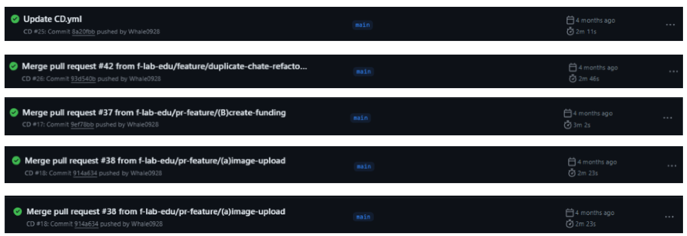
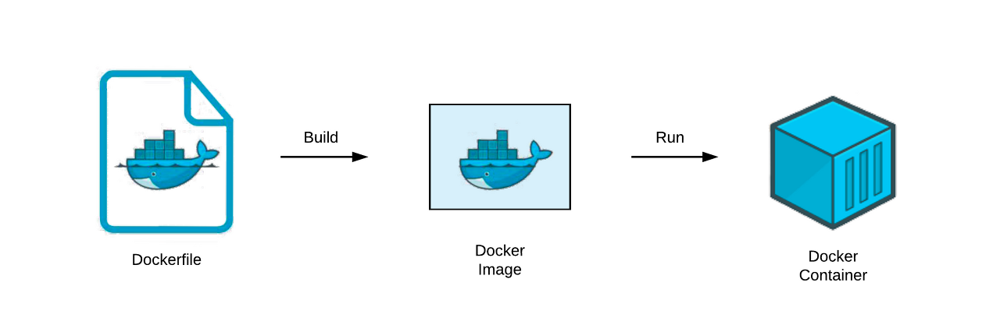
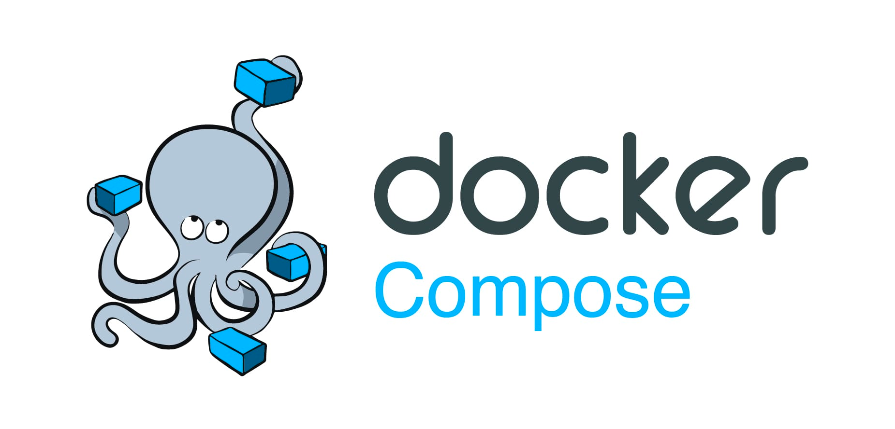

# 리눅스 서버에서 수동 jar 배포에서 도커 배포로 개선

- 참고자료
    - 이미지
        - 기존 CI 속도
        - 기존 CD 속도



리눅스 서버에서 수동 jar 배포에서 도커 배포로 개선

**개선 이유**

- 배포 속도 개선
- 환경 변수의 통합 관리
  > 점점 추가되는 환경 변수들은 최소한의 노력으로 관리 가능

- 배포 환경의 일관성 유지와 격리 수준
  > 도커 컨테이너는 애플리케이션과 그 의존성을 함께 묶어, 다른 환경에서도 동일하게 실행될 수 있도록 합니다. 이는 개발, 테스트, 프로덕션 환경 간의 일관성을 보장하고, 서로 다른 애플리케이션 간의 충돌을
  방지합니다.

- 확장성 및 관리 용이성
  > 도커를 사용하면 애플리케이션을 더 쉽게 확장하고 관리할 수 있습니다. 컨테이너를 사용하면 마이크로서비스 아키텍처로의 전환도 용이해져, 각 서비스를 독립적으로 배포하고 관리할 수 있습니다.

**기술적 고려사항**

- **도커 파일 관리**:
  > 도커화를 진행할 때, `Dockerfile`을 작성하며 애플리케이션의 실행 환경을 정의해야 합니다. 이 과정에서 베이스 이미지 선택, 필요한 의존성 설치, 실행 명령어 정의 등을 고려해야 합니다.
- **이미지 저장 및 버전 관리**:.
  > 도커 이미지를 효율적으로 관리하기 위해 Docker Hub나 다른 컨테이너 레지스트리를 사용할 수 있습니다. 이미지의 버전 관리도 중요한데, 이를 통해 롤백, 업데이트 등을 용이하게 할 수 있습니다
- **네트워킹 및 스토리지**:
  > 컨테이너의 네트워킹과 스토리지 설정은 중요한 고려사항입니다. 컨테이너 간의 통신, 외부 네트워크와의 연결, 데이터의 영속성 관리 등을 고려해야 합니다.
- **자동화 및 CI/CD 통합**:
  > 도커를 사용하면 배포 프로세스를 자동화하고, 지속적 통합 및 배포(CI/CD) 파이프라인과 통합하는 것이 가능합니다. 이를 통해 개발 및 배포 과정의 효율성을 높일 수 있습니다.
- **모니터링 및 로깅**: .
  > 컨테이너화된 애플리케이션의 성능 모니터링과 로깅도 중요합니다. 도커와 통합할 수 있는 다양한 모니터링 및 로깅 도구를 고려해야 합니다

---

## Why

프로젝트의 현재 배포 방식은 github action 통한 CI 와 CD가 별도로 동작하는 방식으로

CI 과정 중에서는 실행에 필요한 환경 변수들을 주입 후 `./gradlew build` 를 통해 정합성을 검증하고

CD 과정을 통해 jar 파일을 만들어 SSH로 리눅스 서버에 접근해 직접 jar를 복제해 실행 시키는 방식으로 구현했습니다.

이 방식의 문제점은 프로세스가 수동적이고 번거롭다는 것입니다.

매번 jar 파일을 수동으로 배포하고 실행하기 위해 SSH 접속을 해야 하며, 배포 과정 중 발생하는 문제에 대한 접근도 어렵고 , 로그 모니터링을 구축하기 위한 확장도 불편한 점이 많이 느껴졌습니다.

이런 문제들을 해결하고 편의성을 하기 위해. 여러 방법을 모색했지만 결국 도커로 귀결되게 되었습니다.

도커를 활용함으로서 일관성과 격리 수준의 유지가 쉬워지고 또한

위에서 언급한 기능의 확장성 면에서 여러 장점을 가져올 수 있기 때문에.

도커를 학습하고 적용하는 과정에서 느끼고 배운 점들을 정리하는 과정입니다.

---

### 가상화  or 컨테이너화

도커에 대해 학습하면서 헷갈리는 포인트인대

가장 먼저 집고 넘어가야 하는 부분인 것 같습니다.

**가상화**는 컴퓨터 내부에서 별도의 독립적인 작은 컴퓨터들을 만드는 것과 같습니다.

독립적으로 만들어진 이 컴퓨터들은 자신들의 운영체제를 가지고 있어 다방면에서 사용이 가능하지만 리소스의 소모량이 많은 것이 단점입니다.

**컨테이너화**는 한 컴퓨터 내부에서 여러 개의 애플리케이션을 분리해서 실행하는 방식 인대

이 컴퓨터들은 하나의 운영체제를 공유하지만 서로 간 논리적으로 구분하여 독립성을 확보합니다.

둘 다 장점이 비슷하지만 가상화의 경우 완전한 독립성을 가지고 있어 특정 환경에서 장점이 될 수 있습니다.

반대로 **컨테이너화**는 경량화되어 빠른 환경을 제공하기 때문에 서로 간의 차이점을 비교해

활용을 할 수 있습니다.

### 활용예시

| 가상화                             | 컨테이너화                             |
|---------------------------------|-----------------------------------|
| 하나의 서버에 여러 개의 <br>운영체제를 설치하여 사용 | 하나의 서버에 여러 개의 <br>애플리케이션을 분리하여 사용 |
| 리소스의 소모량이 많음                    | 리소스의 소모량이 적음                      |
| 완전한 독립성을 가짐                     | 논리적으로 구분되어 독립성을 확보                |
| VM ware                         | 도커                                |

> 만약 둘의 차이를 묻는 질문이 온다면 이렇게 대답하면 될 것 같습니다.<br>
>
> 가상화는 각각 독립된 운영 체제를 가진 여러 가상 머신을 하나의 물리적 서버에서 실행하는 기술입니다.<br>
>
> 이는 강력한 격리와 보안을 제공하지만, 각 가상 머신에 전체 운영 체제를 설치해야 하므로 자원 소모가 큰 편입니다.<br>
>
> 반면, 컨테이너화는 도커와 같은 도구를 사용해, 단일 운영 체제 인스턴스 위에서 여러 격리된 애플리케이션 환경을 실행합니다.<br>
>
> 이 방식은 운영 체제를 공유하기 때문에 가볍고 빠르며, 자원 활용도가 높습니다.<br>
>
> 따라서, 가상화는 완전한 격리와 호환성이 중요한 시나리오에 적합하고, 컨테이너화는 빠른 배포와 효율적인 자원 사용이 필요한 경우에 유리합니다.

---

### Docker

💡 도커는 많은 개발자들이 사랑하는 기술로

리눅스 컨테이너 기반의 가상화 기술을 제공하는 플랫폼입니다.

애플리케이션과 그 종속성을 독립적인 컨테이너로 패키징할 수 있습니다.

이렇게 패키징된 컨테이너는 호스트 시스템에서 실행되며,

필요한 라이브러리 및 환경 설정을 모두 포함하고 있어 이식성이 뛰어납니다.

또한, 컨테이너는 논리적으로 격리된 환경에서 실행되므로 애플리케이션 간의 충돌을 방지하고 확장성을 높일 수 있습니다.

---

### Dockerfile



Dockerfile은 도커 이미지를 빌드하기 위한 지침을 포함한 텍스트 파일입니다.

Dockerfile을 사용하여 도커 이미지를 생성할 때 필요한 소프트웨어 패키지, 설정 및 실행 명령을 정의할 수 있습니다.

이를 통해 이미지 빌드 과정을 자동화하고, 일관성 있는 환경을 구성할 수 있습니다.

Dockerfile을 작성하고 이미지를 빌드하면 도커 이미지가 생성되며, 이를 사용하여 컨테이너를 생성하고 실행할 수 있습니다.

```yml
  # 베이스 이미지    FROM <이미지 이름>:<태그> 
  # 이 컨테이너의 기반으로 사용된 환경 
  # Springboot 환경을 사용하기 위해 java runtime 환경을 사용
  FROM openjdk:17

  # 애플리케이션 파일 복사   COPY <로컬 파일 경로> <컨테이너 내부 파일 경로>
  # 컨테이너가 시작될 때 사용할 변수 선언 jar 파일의 위치를 지정
  ARG JAR_FILE=build/libs/*.jar

  # 바로 위에서 선언한 ARG 변수를 사용하여 jar 파일을 복사
  # COPY <로컬 파일 경로> <컨테이너 내부 파일 경로>
  COPY ${JAR_FILE} app.jar

  # 포트 설정
  # 이 컨테이너를 실행할 때 외부에 노출할 포트 번호
  EXPOSE 8080


  # 컨테이너가 시작되었을 때 실행할 명령어 (Exec 형식 , shell 형식)
  # 어플리케이션의 실행 명령어를 지정
  # Exec 형식으로 수행  : ENTRYPOINT ["java","-jar","/app.jar"]
  # shell 형식으로 수행 : ENTRYPOINT java -jar /app.jarl
  # Exec 형식은 쉘을 거치지 않고 바로 명령어를 수행 Shell 형식은 쉘을 거쳐서 명령어를 수행
  # Exec 형식을 사용하는 것이 더 좋다고 함 (쉘을 거치지 않기 때문에)
  ENTRYPOINT ["java","-jar","/app.jar"]
```

---

### docker - compose



docker-compose는 여러 도커 컨테이너를 정의하고 관리하기 위한 도구입니다.

하나 이상의 컨테이너를 정의하는 YAML 파일을 사용하여 다양한 서비스를 정의하고,

이를 한 번에 시작 및 정지시키는 등의 작업을 수행할 수 있습니다.

docker-compose를 사용하면 복잡한 다중 컨테이너 애플리케이션을 쉽게 관리하고 확장할 수 있으며,

각 컨테이너 간의 네트워크 및 데이터 볼륨 설정도 관리할 수 있습니다.

이를 통해 애플리케이션의 구성 및 배포가 간단해집니다.

```yml
version: '3.8' # docker-compose 파일 버전 지정

services:
  app: # 'app' 서비스 정의
    build: . # 현재 디렉토리의 Dockerfile을 사용하여 이미지 빌드
    ports:
      - "8080:8080" # 호스트의 8080 포트를 컨테이너의 8080 포트에 매핑
    env_file:
      - .env # 환경 변수를 포함하는 .env 파일 사용
    depends_on:
      - redis # 'app' 서비스가 시작되기 전에 'redis' 서비스가 시작되어야 함을 명시 (컨테이너 간의 의존성 설정)

  redis: # 'redis' 서비스 정의
    image: redis:alpine # alpine 버전의 redis 이미지 사용
    ports:
      - "6379:6379" # 호스트의 6379 포트를 컨테이너의 6379 포트에 매핑
```

-----

## CI (Continuous Integration)

```yml
name: CI

on:
  push:
    branches:
      - main
      - feature/cicd
  pull_request:
    types: [ opened, reopened, synchronize ]

permissions:
  contents: read

jobs:
  build:
    runs-on: ubuntu-latest

    steps:
      - uses: actions/checkout@v3

      - name: Set up JDK 17
        uses: actions/setup-java@v3
        with:
          java-version: '17'
          distribution: 'temurin'

      - name: Cache Gradle dependencies
        uses: actions/cache@v3
        with:
          path: |
            ~/.gradle/caches
            ~/.gradle/wrapper
            ~/.gradle/caches/modules-2/files-2.1
          key: ${{ runner.os }}-gradle-${{ hashFiles('**/*.gradle*', '**/gradle-wrapper.properties') }}
          restore-keys: |
            ${{ runner.os }}-gradle-

      - name: Grant execute permission for gradlew
        run: chmod +x gradlew

      - name: Set up environment variables
        run: |
          echo "DB_URL=${{ secrets.DB_URL }}" >> $GITHUB_ENV
          echo "DB_ID=${{ secrets.DB_ID }}" >> $GITHUB_ENV
          echo "DB_PASSWORD=${{ secrets.DB_PASSWORD }}" >> $GITHUB_ENV
          echo "ACCESS_KEY=${{ secrets.ACCESS_KEY }}" >> $GITHUB_ENV
          echo "SECRET_KEY=${{ secrets.SECRET_KEY }}" >> $GITHUB_ENV

      - name: Build and test with Gradle
        run: |
          ./gradlew build
```

> 기존 CI 과정은 위와 같이 구성되어 있습니다.<br>
> github - action 을 통해 CI를 진행하고 있으며 <br>
> gradle을 통해 빌드를 진행하고 있습니다. <br>
> 이 과정에서 필요한 환경 변수들을 주입하고 빌드를 진행합니다. <br>