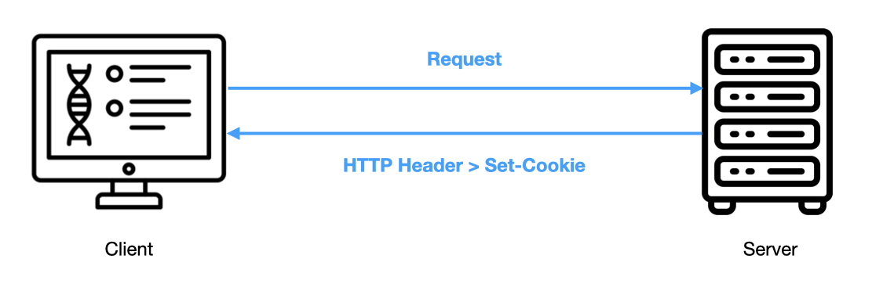
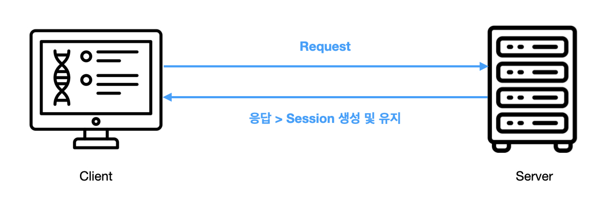
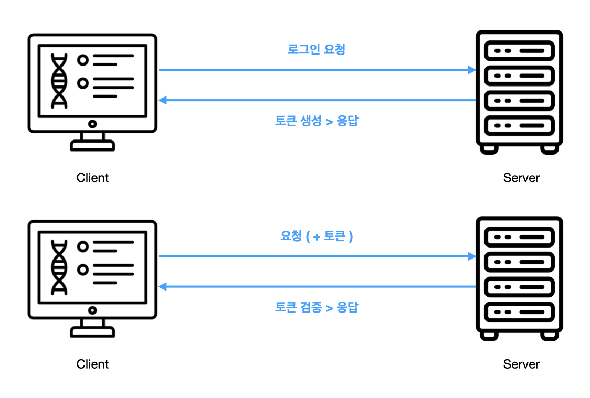
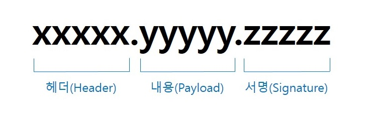
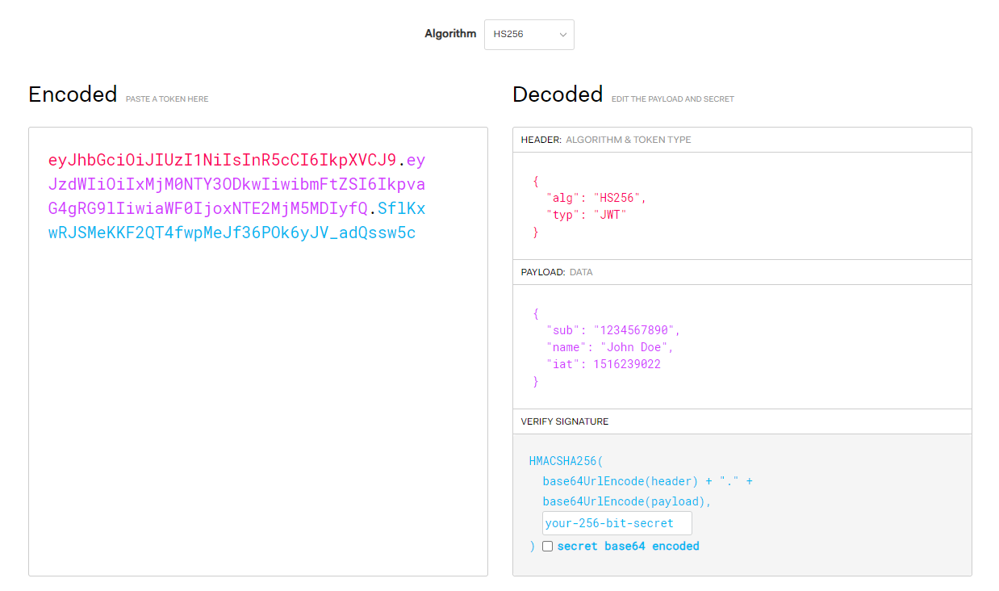
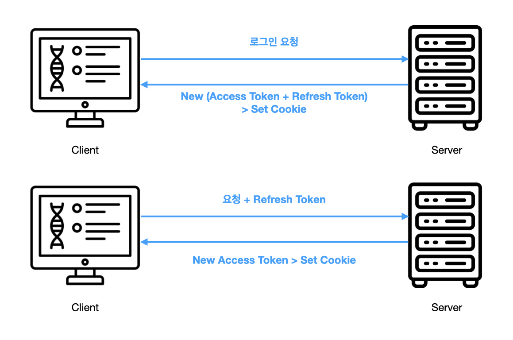

# 서버-클라이언트 인증 방식

## 쿠키 vs 세션 vs 토큰

### 쿠키란
쿠키란 하이퍼 텍스트의 기록서(HTTP)의 일종으로서 인터넷 사용자가 어떠한 웹사이트를 방문할 경우 사용자의 웹 브라우저를 통해 인터넷 사용자의 컴퓨터나 다른 기기에 설치되는 작은 기록 정보 파일을 일컫는다.

#### 쿠키 형태
Key - Value Pair

#### 쿠키 저장소
클라이언트 PC (브라우저 설치 폴더 등) 

#### 쿠키 동작 원리

 

1. 클라이언트가 서버에 요청을 보낸다.
2. 서버는 클라이언트 측에 저장하고 싶은 정보를 응답 헤더의 Set-Cookie에 담는다.
3. 클라이언트는 요청을 보낼 때마다, 매번 저장된 쿠키를 요청 헤더의 Cookie에 담아 보낸다. 
서버는 Cookie에 담긴 정보를 바탕으로 해당 요청의 클라이언트가 누군지 식별한다.

### 세션이란
세션(session)은 반영구적이고 상호작용적인 정보 교환을 전제하는 둘 이상의 통신 장치나 컴퓨터와 사용자 간의 대화나 송수신 연결상태를 의미하는 보안적인 다이얼로그(dialogue) 및 시간대를 가리킨다. 
따라서 세션은 연결상태를 유지하는 것보다 연결상태의 안정성을 더 중요시 하게 된다.

#### 세션 형태
Key - Value Pair

#### 세션 저장소
- 톰캣의 세션 저장소(톰캣 메모리 공간 내부에 있음) 
-> 2대 이상의 WAS의 구동되는 환경에서는 톰캣 간 세션 공유를 위한 설정이 필요함
- 하드디스크
- 데이터베이스 
- Redis, Memcached 같은 메모리 DB
- Spring Session JDBC

#### 세션 동작 원리

 

1. 클라이언트가 서버에 요청을 하면 Session이 서버 메모리(혹은 데이터베이스) 상에 저장된다. 
2. 세션을 식별하기 위한 Session ID를 기준으로 정보를 저장하고 Session ID를 브라우저 Cookie에 저장한다.
3. Cookie에 Session 정보가 담겨있기 때문에 브라우저는 해당 사이트에 대한 모든 Request에 Session ID를 담아서 전송한다.
4. 서버는 클라이언트가 보낸 Session ID와 세션 저장소에서 관리하고 있는 Session ID를 비교하여 클라이언트를 식별한다.

### 토큰이란
사전적 의미로는 개인정보와 같은 데이터를 다른 데이터로 대체하여 표현하는데 사용되는 데이터라고 되어 있다. 
토큰 기반 인증 시스템에서 인증 받은 사용자에게 토큰을 발급하고 이를 이용하여 사용자 인증을 하는 방법에 사용된다.

#### 토큰 저장소
클라이언트 (쿠키, 세션 스토리지, 로컬 스토리지)

#### 토큰 동작 원리

 

1. 클라이언트가 서버에 요청을 하면 서버 측에서는 클라이언트에게 유일한 Token을 발급한다.
2. 클라이언트는 서버 측에서 전달받은 Token을 쿠키나 스토리지에 저장해 두고, 서버에 요청을 할 때마다 해당 Token을 HTTP 요청 헤더에 포함시켜 전달한다.
3. 서버는 전달받은 Token을 검증하고 요청에 응답한다. 
Token은 클라이언트에서 관리하기 때문에 서버 메모리나 DB를 조회할 필요가 없다.

### 쿠키 vs 세션 vs 토큰 비교

| 구분 | 쿠키 | 세션 | 토큰 |
| --- | --- | --- | --- |
| 형태 | KEY - VALUE PAIR | KEY - VALUE PAIR | DATA |
| 관리주체 | CLIENT | SERVER | CLIENT |
| 한계 | 보안 취약  용량 제한  브라우저 간 공유 불가능  네트워크 부하 발생| 세션 ID 자체 탈취 가능성  서버 부하 | 네트워크 부하  중요 정보 사용 X  토큰 탈취 시 대처 어려움 |

## JWT (JSON Web Token)

### JWT이란
JWT(JSON Web Token)이란 인증에 필요한 정보들을 암호화시킨 JSON Token을 의미한다. 
JWT 기반 인증은 JWT Token(Access Token)을 HTTP Header에 담아 클라이언트를 식별하는 방식이다.

#### JWT 구조
 

#### 헤더(Header)
<pre><code>{
    "alg": "HS256", // 서명 알고리즘 (HMAC SHA256 or RSA)
    "typ": "JWT" // 타입
}</code></pre>

위의 JSON을 Base64Url Encoding 한다.

#### 내용(Payload)
Payload에는 claims이 포함되어 있는데, claims이란 유저의 정보를 가지고 있는 data를 말한다.

#### Claims
1. Registered claims: 사전에 정의된 클레임 
&nbsp;-&nbsp; iss (issuer; 발행자) 
&nbsp;-&nbsp; exp (expiration time; 만료 시간) 
&nbsp;-&nbsp; sub (subject; 제목) 
&nbsp;-&nbsp; aud (audience; 수신자 식별 문자열) 등.
2. Public claims: 사용자가 정의할 수 있으나 충돌을 방지하기 위해 IANA JSON Web Token Registry에서 정의한 대로 사용하거나 URI 형식으로 정의해야 한다.
3. Private claims: 사용을 동의한 당사자들 간에 정보를 공유하기 위해 생성한 사용자 정의 클레임으로 공개용 클레임이 아니다.

 
<pre><code>{
    "sub": "1234567890",
    "name": "John Doe",
    "admin": true
}</code></pre>

위의 JSON을 Base64Url Encoding 한다.

#### 서명(Signature)
서명은 인코딩 된 Header와 Payload, 서버의 Secrect Key를 결합하여 Header에서 사용한 알고리즘으로 생성한다.

Header와 Payload는 복호화가 가능하여 조작할 수 있지만 서버의 Secrect Key로 인해 토큰이 변조되지 않았음을 확인하는데 사용된다. 
-> Signature 안에 수정 전의 Header와 Payload 값이 있기 때문에 서버의 Secrect Key를 모르면 똑같은 값으로 변조할 수 없다.

 
<pre><code>HMACSHA256(
  base64UrlEncode(header) + "." +
  base64UrlEncode(payload),
  secret)</code></pre>

 
  

#### 인증 과정

 

1. 사용자가 ID, PW를 입력하여 서버에 로그인 인증을 요청한다.
2. 로그인에 성공하면 서버는 클라이언트에게 Access Token과 Refresh Token을 생성하여 쿠키에 담아 전달한다.
3. 클라이언트는 서버로부터 받은 JWT를 로컬 스토리지에 저장한다. (쿠키나 다른 곳에 저장할 수도 있음)
4. 클라이언트는 서버에 요청할 때마다 요청 헤더에 Access Token을 담아 전송한다.
5. 만일 Access Token의 유효 기간이 만료되면 클라이언트는 요청 헤더에 Refresh Token을 담아 전송한다.
6. 서버는 Refresh Token의 유효성을 검증하고 새로운 Access Token을 발급하여 클라이언트에 전달한다.

#### Access Token과 Refresh Token
* Access Token 
&nbsp;-&nbsp;&nbsp;사용자의 인증과 자원에 대한 접근을 위한 토큰이다.

* Refresh Token 
&nbsp;-&nbsp;&nbsp;Access Token의 갱신과 세션 관리를 위해 사용되는 토큰이다.

#### Bearer Schema

일반적으로 토큰은 요청 헤더의 Authorization 필드에 담아져 보내집니다.

> Authorization: Bearer &lt;credentials&gt;

토큰에는 많은 종류가 있고 서버는 다양한 종류의 토큰을 처리하기 위해 전송받은 type에 따라 토큰을 다르게 처리합니다.

#### 인증 타입
1. Basic 
사용자 아이디와 암호를 Base64로 인코딩한 값을 토큰으로 사용한다. (RFC 7617)

2. Bearer 
JWT 혹은 OAuth에 대한 토큰을 사용한다. (RFC 6750)

3. Digest 
서버에서 난수 데이터 문자열을 클라이언트에 보낸다. 클라이언트는 사용자 정보와 nonce를 포함하는 해시값을 사용하여 응답한다 (RFC 7616)

4. HOBA 
전자 서명 기반 인증 (RFC 7486)

5. Mutual 
암호를 이용한 클라이언트-서버 상호 인증 (draft-ietf-httpauth-mutual)

6. AWS4-HMAC-SHA256 
AWS 전자 서명 기반 인증 (링크)

#### 출처
- https://inpa.tistory.com/entry/WEB-📚-JWTjson-web-token-란-💯-정리
- https://jwt.io/introduction
- https://velog.io/@cada/%ED%86%A0%EA%B7%BC-%EA%B8%B0%EB%B0%98-%EC%9D%B8%EC%A6%9D%EC%97%90%EC%84%9C-bearer%EB%8A%94-%EB%AC%B4%EC%97%87%EC%9D%BC%EA%B9%8C
- https://parkjh7764.tistory.com/211
- https://ko.wikipedia.org/wiki/HTTP_쿠키 
- https://oxylabs.io/blog/what-are-http-cookies
- https://ko.wikipedia.org/wiki/세션_(컴퓨터_과학)
- <a href="https://www.flaticon.com/kr/free-icons/" title="컴퓨터 아이콘">컴퓨터 아이콘  제작자: Vectoricons - Flaticon</a>
- <a href="https://www.flaticon.com/kr/free-icons/" title="서버 아이콘">서버 아이콘  제작자: juicy_fish - Flaticon</a>
